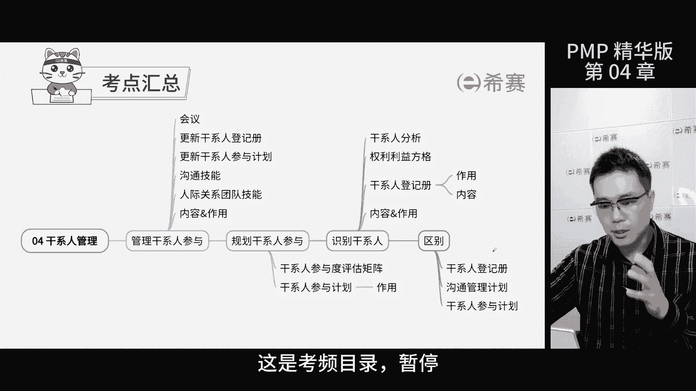
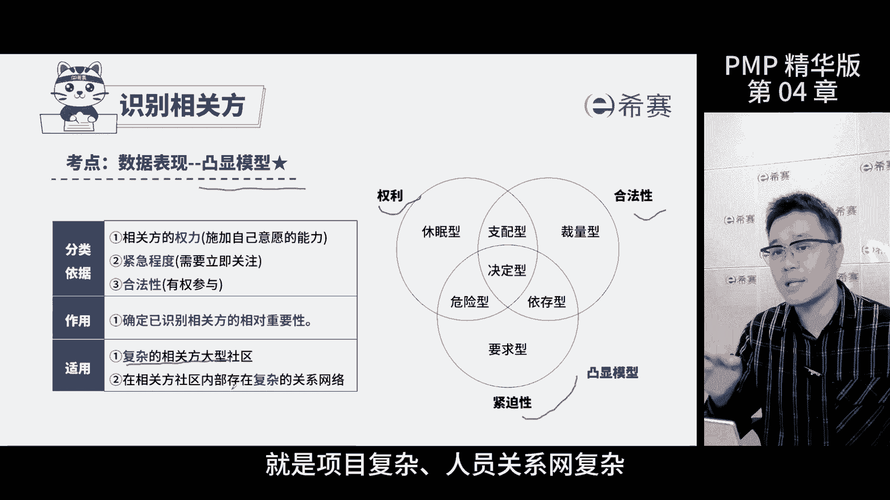

# 【2024年PMP】PMP项目管理考试第七版精华讲解免费观看，含预测+敏捷！ - P4：第04-1章 项目干系人管理-精华版 - 冬x溪 - BV1bD421A7em

我是佩奇，今天讲解项目干系人管理精华版，这是考评目录啊。

暂停回顾再继续，通俗点讲，管理干型参与，这过程就是真刀真枪的和干线打交道，我们要按照计划，让他们合理的参与到项目中来，那这样做是为了得到他们的支持，减少他们的反对，最终目的就是为了实现项目标。

那至于TT嘛，重点在工具和技术上面，会议是五星级考点，主要的目的是让干系人达成共识，或者当出现冲突的时候大致谅解，在做题的时候，如果出现了沟通问题，意见不合这种情况，作为项目经理。

就需要通过面对面的沟通协商来解决，考试中选项不一定有开会或者会议字样，但是会表达沟通协商这样的意思啊，都是对的啊，沟通技能，根据肝弦的沟通需要选择不同的沟通方法，比如说题干中描述出现了项目的状况。

需要调查了，或者给谁发送的报告出现了问题，那就需要与干系人沟通来解决问题，人际关系团队技能在解决问题的过程中，需要有文化意识，政治意识，通过观察和交流谈判来解决冲突，这个工作包包括五个内容。

需要理解记忆一下，一般会在体验中有所表示，他们都属于人际关系团队技能的内容规划，干前参与是做人员分析和规划方法的过程，重点是工具和输出文件，肝弦参与评估矩阵，是将肝弦进行分类的一种工具。

其目的是便于后期的干线管理，从这张图的左到右，显示了干系人参与的由弱到强的过程，分成五类，通过分析，将干系人当前的餐饮水平和期望的餐饮水平，进行标识，知道现在它处于什么水平，我们希望它处于什么水平。

那我们知道了差距，通过开展对应的互动活动，引导该行人参与到项目中来，干事人参与计划，简单说就是咱们怎么让项目里的各方，都积极参与进来的计划和安排，这个计划里面除了会评估谁参与的多，谁参与的少。

还会记录干系人变动的相关信息，那考试的时候。

如果看到题干说干系人参与的不够，比如说有人反对项目啊，或者对象的结果不满意啊，那咱们就得赶紧看感谢人参与计划了，想想怎么让他们更加积极地参与进来，把问题解决掉，所以这种时候咱们选择干性参与计划。

这个选项就行，在启动过程组中，识别干线是一个重要的环节，我们要定期开会。

把干型的信息都记下来，好好分析，分析完了就把这些信息写到干型登记册里。

分析干性的时候，我们要从好几个方面来看，这样才能更加全面地了解他们的情况。

为后面的管理打好基础，说到这三个工具，其实最值得关注的就是权利利益方格，这个方格考的最多，就是根据权利和利益这两个点，把干系人分成不同的管理类别。

那这样我们就知道该怎么管理它们，那这个方格里面呢，那些权利大，利益大的人，就是咱们重点管理的对象，那些权利大利益小人，我们就要想办法让他们满意，权力小但是力大的人，我们要随时告诉他们进展。

最后权力小力小的人，我们监督一下就好了，那这个方格特别适合小型项目，或者人际关系比较简单的项目，那么考试的时候，如果遇到题干问你一个干事权力大力大，你该怎么管，就是考察你具体管理的策略。

那再比如题目里说是一个小型项目关系，就那么几个人，人员比较简单，让你选什么工具和技术来分析干写啊，那你就选择权利利益方格了，干型内测是识别干弦这个子过程的输出文件，那文件包括三类信息，基本信息。

评估信息分类信息，重点是评估信息里面的需求和期望，因为要管理好干系，就是满足对方的期望。

他就不会给你项目添乱了，这个知识点怎么考呢，题干中干型对于项目不满意，挑刺儿哎，那就是没有满足这个干型的需求，问项目应该怎么办，查阅干系人登记册里面对方的需求和期望，再比如题干中说。

识别出了新的干系人或者干系人换人了，下一步怎么办，那就把这个干系人记录下来，选择更新肝性登记册，这里要记一下啊，在登记册里面有干型的沟通策略。

凸显模型是根据三个维度，权利合法性和紧迫性，将干型划分成七个类型，这个工具适用于大型项目，项目复杂，人员关系复杂啊。

都属于大型项目，那今天的课到此结束啊。

