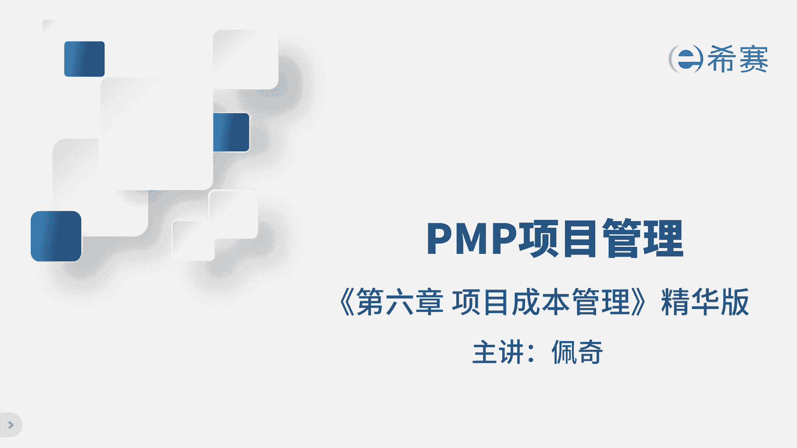
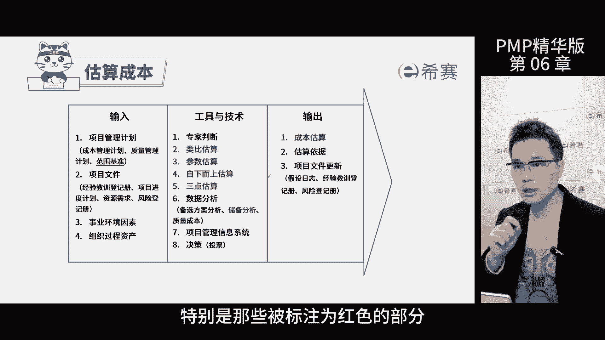
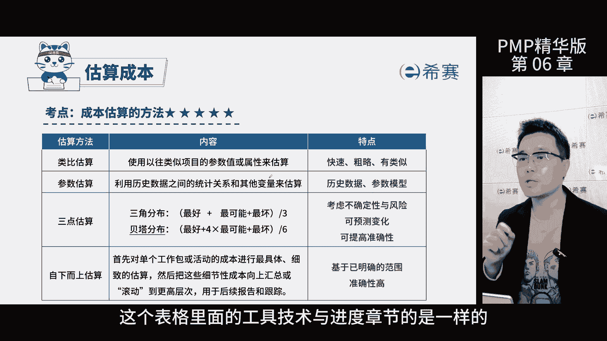
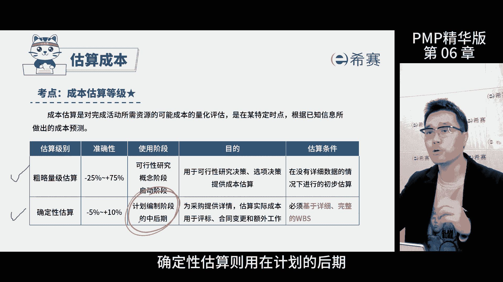

# 【2024年PMP】PMP项目管理考试第七版精华讲解免费观看，含预测+敏捷！ - P8：第06-2章 项目成本管理 精华版 - 冬x溪 - BV1bD421A7em

我是佩奇，今天讲解项目成本管理的进化版，那回忆一下项目的三大基准啊，成本基准是三大基准的最后一个了，这是考题目录，大家可以暂停回忆再继续，控制成本是项目过程中很重要的一个环节。

主要负责保持项目的成本基准的稳定，防止随意的变动，如果确实需要调整的，那就按照规定走变更控制流程，关键是要掌握控制的工具，增值分析，这是非常关键的一个知识点，首先我们要明白这个工具是用来做比较的。

通过找出实际和计划的差别，并对后续的工作估算，让项目在可控的范围内，简单来说呢就是了解项目花了多少时间，本应该做多少工作，实际花了多少钱，完成了多少工作，他综合的考虑了范围，进度，成本三个指标。

来帮助我们全面地了解了项目状态，指导后续的工作，其次呢我们要熟悉三个英文单词的含义，PV代表计划价值，EV是已完成的价值，AC是实际发生的总成本，那举个例子啊，一个生产项目需要生产1000只小黄鸭。

每天生产100只，每只是一块钱，项目进行到了第四天下班的时候，咱们要查一下，那么计划价值PV就是400元，实际完成了500只，实际的成本AC是500元，但检查后只有300只合格。

这就意味着计划要求做400只，最终只完成了300只，那进度落后了，那同时工人实际生产了500只，你还得支付500只的钱，本来完成300只，只要支付300支的钱就可以了，那现在多花了200块钱亏了。

所以项目的状态是进度延期，成本超支，那通过前面简单的例子啊，我们知道了项目的状态，接下来我们通过公式看看怎么判断项目的状态，我们先算一下进度偏差和成本偏差，进度偏差是增值减去计划价值，300-400。

结果是负的100，那说明进度偏差是负值，成本偏差是增值，减去实际成本，300-500，结果是负的200，那成本偏差也是负值，两个偏差都是负值，意味着偏差小于零，那之前我们知道项目的进度和成本。

状态都是不好的，那可以得出一个结论，计划结果是负数，代表项目的状态不好，那相反的，如果结果大于零，就说明项目状态好，除了算减法，我们还可以用除法来判断项目的绩效，我们先算一下进度，绩效300÷400。

结果是0。75，再算一下成本，绩效300÷500，结果是0。6，那这两个绩效都小于一，同样也可以得出一个结论，小于一都是状态不好的，那总结一下，我们通过偏差和绩效来判断项目的状态。

偏差结果和零比较绩效结果和一比较大于零，或一是管理的好的项目等于零，或者一是达标的项目小于零，或一是项目没做好，那考试的时候，只要判断出与零或者一的大小关系，就能知道项目的好坏了。

然后选择对应的解决方案，比如如果判断出偏差小于零，说明进度慢了，就可以选择赶工，如果成本超了，就可以选择节约成本的选项，唉这就是增值分析的考法，那接下来呢我们了解一下估算成本的过程。

这个过程主要是为了确定项目需要的资金，在这过程中，工具技术是重点，特别是那些被标注为红色的部分。

那这个表格里面的工具技术与进度章节。

是一模一样的，如果忘记了，可以回去看一下进度章节的讲解，储备分析进度章节也详细讲过了，搞懂这张黄蛋图考试基本上就没有问题，成本估算呢有两个级别，一个是粗略的，一个是详细的，粗略估算，主要在前期。

比如说项目启动阶段就用这种方法，那确定性估算则是在计划的后期。

公司也不是一下把钱就投到项目里啊，也不是天天给，而是按阶段分批给啊，一开始给启动资金，让你先干起来，然后根据成果再给进度款，所以钱是慢慢增加的，那这个需求图是呈现阶梯状展现给项目发行人。

让他来负责钱的事，成本管理计划是指南性，文件里面肯定写了各种方法要求，比如说计量单位的精准度，规格格式等等啊，了解一下就行了，咱们接下来聊一聊这几个概念啊，直接成本是项目专属资源产生的费用。

比如说团队工资，材料费，间接成本呢则是多个项目共享资源产生的费用，比如说公司大楼的租金和高管的工资，再说一下沉没成本，就是已经花出去没法回收的钱啊，比如说你买两张票，结果朋友放你鸽子，没去看好电影。

开场了也不能退了，再做下一步决策的时候，别考虑沉没成本，因为决策是面向未来的，别让过去影响到咱们，最后说说机会成本，就是你选择一个项目，而失去其他赚钱机会的最大值，前提是一次只做一个项目。

比如说你有两个项目A和B你选择了B，那么你的机会成本就是A项目的最大收益，50万，如果又有了第三个项目C你还是选了B，你的机会成本是AC项目中最大的，那个收益是150万，记住这是最大的那个值。

不是所有机会加起来的总和好，今天的课到此结束。

