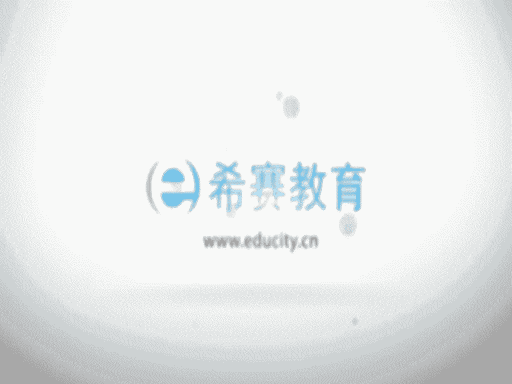

# 【2024年PMP】pmp项目管理认证全套系统教程全套免费观看，零基础可看！ - P12：0105、项目生命周期与项目阶段 - 渡河的蝉 - BV1Zh4y1D7pa

然后接下来我们看到的是PO指南第六版中，它关于整个PO指南的一个组成部分，会有这样几个讯息，一个是关于项目的生命周期嗯，他说是从开始到结束的时候，所历经的一系列阶段，然后呢是关于项目的阶段的概念。

这一系列的阶段到底阶段是什么，阶段，是一组具有逻辑关系的项目的活动的集合，然后是项目的关口，说我们要去进到下一个阶段的话呢，我们要进行整合，或是结束到项目级或是项目决定的时候呢。

诶这个时候我们要在这个阶段末进行一个检查，那么这个呢是我们一个光头或者类类，类似于理解为一个阶段和下一个阶段之间，我们可能需要去做一些处理，看上一个阶段该做的事情是否有完成。

以及我们下一个阶段是否还值得继续做下去，这是我们的阶段关口，然后是项目管理过程，他说是啊，会希望说有一个或多个的输入进行加工，处理以后会生成一个或多个的输出，唉这是我们在项目管理中所理解的一个过程。

我们一会儿都会详细的去讲，而至于过程组的话，当然就是若干的过程组合在一起，得到一个叫过程组，然后还有一个呢是项目管理知识领域，我们整个项目管理会分到了五大过程组，也许我们会有五个过程组。

然后呢会有十大知识领域，这呢我们会后面的章节中会详细的去，在第三章中，我们会详细的去讲这样的五大过程组，和时代知识领域的一个关系，并且从第四章开始，一直到这本书的第13章结束。

全部就是在讲一个一个的知识领域，我们心里面有这样的一个清晰嗯，我们先看第一个叫生命周期，生命周期，它指的是说项目从开始启动到完成，所历经的一系列阶段，那事实上我们人也有自己的生命周期，对不对。

也就是你作为一个小baby，然后长成一个小朋友，当一个小青年，后面有可能会成为一个小老头和小老太，最后到一张小照片，诶这个人就是你的这样一个生命周期，在这样一个生命周期中，你可能会做很多事情。

会历经很多的事情，而作为一个项目，它也是一样，从最开始决定启动项目，到后续来去投入做一些计划，然后去执行，中间有监控，到最后收尾，然后结束掉，然后得到了这样一个产品成果或服务。

唉这就是我们的一个项目的生命周期，然而他是为我们的项目管理，来提供了一个基本框架，因为不管是哪一种项目的生命周期，那么我们通常管理起来都是有，很类似的一些部分，也就是我们都会把它分到五大过程组。

每个过程组来做相对应的管理，然后项目生命周期它会分经历一系列阶段，而这些阶段呢它可以是顺序的关系，也就是说一个阶段结束，下一个阶段在开始，它也可以是迭代的关系，也就是说一个阶段还没有结束。

下一个阶段又开始进行，还有一个是交叠的关系，也就是说它们之间可以是这种关系，一个是旋转着轮回着来的这样一个一些关系，那么对应的呢，项目的生命周期可以是叫预测型的生命周期，预测型生命周期是什么概念呢。

就是呃我可以去预知将来，我们在什么时候能够比较好的预知将来，就是在我们对未来是比较清晰的时候，比较懂的时候，对不对，那么这样一个预测型生命周期，它也指的是说对于未来的这样一些信息。

比如说需求的信息是很明确的，然后后面的这样一些阶段都很明确的内容，的时候，我们可以用预测性的生命周期，还有一个呢是叫适应性的生命周期，什么叫适应型生命周期呢，就是后面有大量的变更，大量的变动的时候。

那么这样一些变动呢，有可能会呃有很多需求的一些变更的请求产生，那么对应对于这样一些变更的这样一些需求，我们可能会是需要去不断的，对我们当下的这样一些内容做调整，这是一个适应性的生命周期。

项目的生命周期内，通常可能会有一个或多个阶段，与产品成果或服务的这样一些相关，然后嗯那这个呢就叫开发的生命周期啊，或者你可以理解为开发生命周期，它是项目生命周期内的一部分，它比它更小，当然了。

开发生命周期他说可以是预测型，就跟这个预测行李一样，对不对，就是我们当然很多信息都是很清晰的时候，它可以是迭代型，比如说是我们可以一轮做完又再一轮，然后再一轮，对不对，可以是增量型，增量型的话。

我们每一次，比如说我们已经做好了一个东西以后，我们下一次呢，我们会制作某一个新的东西的增加，然后不会是全盘的去重新来一遍，我们会是增加了一部分的功能，还包括说适应性，这也是我们当下最为啊火的一种方式。

叫做敏捷管理，对不对，敏捷管理的方式，就是不断的会有很多的新的变化，我们要不断的去拥抱这样一些变化，这是关于一种敏捷型，而同时呢我们事实上在生活中，没有哪一种方式是可以去概括我们生活的全部。

所以在这边加了一个内容，叫做混合型，也是它可能会把多种内容，多种这种开发的形式结合到一起来，混合型项目生命周期它本身是非常灵活的，它里面可能会涉及到的内容也是有很多嗯，但是我们一般情况都是开始。

然后呢做一些准备，做一些组织和准备，然后呢去执行，那最后去结束掉，可通常情况下都不外乎是这样的一个过程，那项目的开发生命周期刚刚已经有说过，我们再简单详细看一下啊，一个叫预测型生命周期。

他说在早期就能够去确定项目的这样一些范围，时间成本以及对任何范围的变更，都要进行一个仔细的管理，因为它是对未来是比较清晰的，而迭代型呢他说的是通常在范围能够确定，但是呢那些估算啊。

那些信息啊都是不定期会去不断的做一些修改，不断的会有一些调整，通过去重复这样一些方式来去不断的调整以后，能够得到很多新的信息，而增量型呢，他说的是在某个区间内，逐渐的去增加它的功能和性能的。

这种迭代的方式，事实上增量和迭代它们有没有关系，他们是有很很紧密的一个关系，只是说我们会把它的侧重点不相同，会单独列一个名称，增量型重点指的是说我在某一个时间区之内，去增加某一部分的产品的性能或是功能。

而迭代型的它指的是整个在这一过程中，可能会不断有一些新的新的挑战和增加进来，他只是没那么明确，而通常来讲的话，适应性的这样一个生命周期，他是说属于敏捷型迭代型或正量刑，并且呢它都是一个持续有变化的。

也就是说我们在项目的进行过程中，不断地有新的需求变更过来，然后我们不断的要去做一个调整，来迎接这样一个变化，而真实的情况是很多时候是混合型，混合型，就是会把这样一些什么预测型啊，适应型啊。

都结合到一起来去做这样一个项目，而关于阶段的话呢，我们知道通常一个项目它如果比较大的话，假如说一个项目它跨度了5年六年十年八年，你可能会怎么做，我们通常的情况下，我们可能就会把它分到阶段，对不对。

我们就会把它切成一段一段的，那么这一段呢就是我们所谓的阶段，通常项目阶段，它是一种具有逻辑关系的项目的这样一个集合，并且呢通常是以一个或多个可交付成果的完成，来作为结束，可交付成果是什么。

就是说我有东西可以拿出去的，对不对，这样也可以交付的这样一个东西啊，我们每一个阶段呢，我们都可能会是比如说在这一部分，在这一个项目的这个阶段，可能会产生的一部分的这样一些成果，或是服务。

那有可能到这个阶段的时结束的时候，有可能会产生一些新的这样一些成果或者服务，对不对，但每一个阶段都可能会产生一些成果或者服务，OK所以这是关于我们会把它做一个区分，并且为什么要区分阶段呢。

其实是为了方便我们管理，是不是就方便我们来做项目的话，我们可以更好的去管理它，项目的生命周期，他说可以有不同的属性来描述，因为什么名称啊，数量啊，持续时间嗯，项目阶段可以基于各种因素来建立。

就是根据你的需求来做一个不同的建立啊，通常分类阶段以后呢，是能够更好的来掌控项目管理，其实说来说去就是能够方便我们管理项目，项目阶段的其中一个关键组成部分呢，就是阶段审查，阶段审查是什么概念。

阶段审查其实就是涉及到我们刚刚说的，看到一个叫关口的这样一个概念，就是我们在一个阶段结束的时候，在下一个阶段开始之前，我们可能会有一个审查，我们会去审查看当下这样一个阶段，它的进度，它的时间。

它的成果是不是有满足我们的需求，以及可能会对未来的信息做一个审评判和审查，看是否还有必要进行下去，因为有可能一个项目它持续时间很长，那么因为当下的这样一个社会，又是一个瞬息万变的这样一个社会。

有可能最开始在3年以前所立的这样一些计划，或者说是5年以前立的计划，早就已经不适应当下的现状，所以在这边我们会去审查，看前面这样一个阶段的结果怎么样，后面这样一个阶段是不要进去，所以通过审核。

他说是一方面是方便是否要去进入下一个阶段，或是要去整改后才进入了下一个阶段，或者还是说直接close掉，或者说是停留在现在这样一个阶段，或者要去重复某一个阶段，你看他关注的是我们对于这个阶段。

我们是否已经可以close掉，可以进到下一个阶段，或者说整个把这个项目就给直接给close掉，不同的组织行业或是工作类型中项目的关口，它可能会成为阶段审查啊，还叫什么啊，关键策略，关键决策点的阶段入口。

阶段，出口，其实指的都是阶段和阶段结束的时候的，这样一个关卡，这个点对不对，那么这个点的话，就是说要对下一个阶段来做一个审查，然后对下一个阶段呢也要做一个评估，然后确保说前面该做的事情完成了。

后面要做的事情已经是可以开始了，或者还是不值不值得开始，虽然说关口这样一个词是很陌生，但是我们要清楚的知道是，他其实指的是阶段和阶段之间的这样一个时候，一个时点的时候，我们所要需要去做的这样一些事情。

而通常情况通过这样一种检查呀，可以去知道像当前的项目。