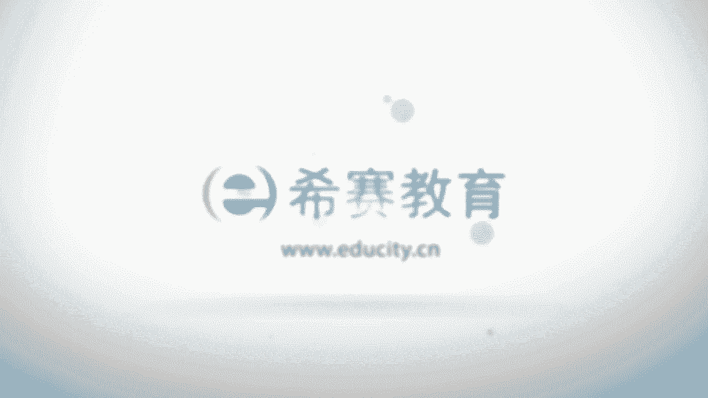

# 【2024年PMP】pmp项目管理认证全套系统教程全套免费观看，零基础可看！ - P45：0505收集需求 - 渡河的蝉 - BV1Zh4y1D7pa

好接下来我们看到的一个过程叫收集需求，那么收集需求呢，它是为了实现项目的目标来去确定记录，并且去管理相关方的一些需要和需求，而它的输入很多，它的工具和技术也很多，重点呢在它的工具和技术啊。

我们看一下输入，首先一个呢叫项目章程，我们知道在项目章程中呢，会有一些大方向的高层级的这样一些需求信息，对吧，它能够去对于我们的这样一个啊收集需求，作为一些参考，然后是项目管理计划。

这边有关于范围管理计划和需求管理计划，这个毫无疑问会指导我们如何做，收集需求的这样一个工作，以及还有相关方参与计划，因为所有的需求来自于哪里，来自于人和做他人做事情，对不对。

所以相关方是他一个重要的来源，其他的一些文件，这里有个相关方登记册，也就是说我们会从相关方登记册中来，去获取到这些相关的需求信息，除此以外呢还有假设日志经验教训对，另外呢还有一个是商业论证。

也是咱们一个需求的来源，因为我们做项目的话，就是这个项目，你的这样一些需求，就框定了整个项目的一个调调对吧，那么这项这样一些需求，它跟我们的这样一个商业目标，跟这样一个战略目标是否有相一致相符合。

也是一个很重要的讯息，如果说这样一个项目，它涉及到甲方和乙方的这样一个概念的话，那么就还会有一个合同的存在对吧，协议的存在，但如果说不涉及到甲方和乙方，那么是没有这样一个输入的啊。

然后是事业环境因素和组织管理资产啊，接下来我们看到他的工具和技术有很多，我们简单看两个，后面的呢我们会详细去讲，首先一个专家判断已经讲过很多遍，对不对，就是一些有知识有技能或是有经验的人。

接受过培训的人，他来去参与做一些事情，能够去帮助这样一个事情做得更好一些啊，一个呢叫数据分析，它里面重点用到的文本分析，也是我们拿着这样一些文本，已有的这些东西从里面去抠一些东西出来。

去分析出一些东西出来诶，这是一种，然后还有一个呢叫系统交互图，它会用一种可视化的方式来去展现，比如说我们用这种啊，什么像类似于这种思维导图也好呀，或者什么亲河图也好呀。

把这东西用视觉冲击的方式来展现出来的话，对于我们去做这样一件事情会比较有帮助，他用一种图示的方式来去做，人和信息的一个交互，后面还有一个叫圆形法原型法，我们在如果做软件开发的话会比较清楚。

很多时候我们可能客户不是很清晰，他们要什么，我们就会根据他大致的描述来做出一个demo，就是一个原型啊，然后呢把元清给到他以后，他会说哦这个东西里面这一部分是我要的，这一部分不是我要的，那是这样的诶。

就能够去帮助我们更好的去收集这样一些需求，包括说可能会对原型不断做一些调整，有一些原型甚至有可能会是作为后续的这样，一个整个东西的一个基础，但有些原型是会被舍弃掉啊，那么这种都是一种收集需求的方式。

除此外还有其他的这些其他这些过程呢，工具呢我们会去一会儿有PPT专门来讲到他们，他最后的输出，一个叫需求文件，一个叫需求跟踪矩阵，我们后面也会单独去讲，需求跟踪矩阵和需求文件啊，我们简单来看一下。

首先关于需求它是指什么呢，需求他是说客户，客户或是发起人或是其他一些相关班，他们的这些需要或者是期望，当然需要被记录下来，而整个需求收集其实就是要去获取到这些需求，对吧，他的目的呢或者他的那个意图呢。

就是能够去更好的定义和管理客户的，这样一个期望，通常是在一开始的时候，就要去做这个需求收集的工作，而本身需求它是WS一个基础，也是工作分解结构的一个基础，它也是后续的做成本啊，进度啊，质量。

它的一个规划呀，预算啊等等的一个重要的一个基础，所以需求很重要，对不对，所有东西，整整个可以说整个这个项目的所有东西，都是从需求这里开始，而需求从哪里开始呢，需求从相关方这里开始加完，下面来看项目开发。

始于对项目章程和项目相关判登基册里面，信息的一个分析，因为项目章程中有一个关于需求的，那个概述的信息，对不对，而相关方的预测中，通常也是会有那些相关方的信息，以及他们的一些需求的信息。

所以我们先去分析它能够得到一些需求呃，有的时候可能会把需求分到叫项目的需求和，产品的需求，我们后面会去看到这样一个信息的分解啊，呃包括了项目需求呢，包括商业的需求。

怎么整个项目管理的需求以及啊交付的需求，而产品需求就是具体技术的需求，性能的需求，还有相应的安全需求，我们一起来先看到他的工具和技术啊，刚刚已经看过的，我们就不再说，我们就直接看那个还没说的部分呃。

首先是数据收集技术中会有一个叫头脑风暴，这个呢我们之前也见过好几次，对不对，它是用来去产生和收集需求信息的，一种那种多种创意的一种技术，怎么说呢，简单来讲就是一堆人诶，就某一个事情去不断地贡献出自己的。

这样一些想法，而在这一过程中呢，大家是不做评判，只去做记录呃，后续会有过程来去专门做一个投票啊，分析啊之类的啊，那这样的话能够去让大家就不断的去，展现很多的火花，包括说大家可以在别人已经提过的基础上面。

在稍微有一点点新的东西，这种都算啊，包括还有一些天马行空的东西都没关系，都接受，只有接受了不同的信息，才会引发更多的信息出来，这是关于头脑风暴，还有一个呢叫反弹，那么反弹呢通常指的是说啊。

你跟别人去正式的聊一些事情，或非正式的去聊一些事情，通过聊的过程中去了解相关的讯息是吧，不管说是鲁豫有约二阳啊，阳阳难反弹啊之类的都OK对吧，通常是一对一的方式比较多。

但是呢也可以是一对多的方式来去反弹，还有一个呢叫焦点小组，那么焦点小组呢它重点就是有一个小组了，对不对，一对一的话不够激烈，那我们就以就多对多的方式来，就是焦点小组在一起就这么一个话题来讨论。

它会比一对一呢要更加的热烈一些，通常呢要主持人去对大家做一些引导，引导大家去聊一些东西呃，然后这边还有一个叫问卷调查，那么问卷调查呢，它指的是说我们会涉及一系列的这种，书面的问题。

然后像一些受众来分发这样一个问题去调查，了解一些相关的信息，它有它的很多好处嗯，首先呢他可能是说受众多样化，需要快速去完成调查的话，那么它可能位置也很分散，人也很多，然后呢这样的情况下。

我们可以用问卷调查的方式，比如说在私下教育的话呢，我们每一次每一个月，每一个科目都会做一个问卷调查，会邀请呃咱们的学员朋友来去做一个打分给啊，这一次上直播课的老师打一个分之类的啊。

那么这种方式其实也是能够去，不仅仅只是督促老师，更多的是说能够让我们的这样一个服务，变得更好一些，所以呢也是在这里邀请所有的学员朋友们，积极的去配合林姐姐发出来这样一个要求。

邀请大家打分的这样一个讯息啊，一起来参与进来好，还有一个呢叫标杆对照啊，那么标杆对照呢他说是将实际的这些东西，将实际或者计划的这些产品过程实践，与其他的组织的一些东西，来。

做些与其他可比的组织的这样一些实践，来进行比较，来识别出最佳的实践呃，其实也就是说我们有参考了以后呢，我们就知道前进的方向，或者说是改变了这样一个win方向，是不是。

然后在这里呢我还加了一个东西叫DAI技术，因为后续啊，它其实并不是一种数据收集的这种方式，但是它是做一个决策的一种方式啊，我们可以来了解一下决策，他这种DEFI技术的决策是什么呢。

有一堆专家来回答这样一些问题，然后呢第一轮大家去给出一些结果，给出去结果是背靠背的方式来给出的，给完以后呢，我们再捅捅到音起来以后，下次再再给一轮，你后面给的第二轮，通常可能会参考所有人给的这样一个。

结果的一个信息，对不对，所以可能会对自己的信息有所调整，然后第二轮每个人都给出了，然后在第三轮这样一轮一轮下来，大家给的信息的结果一定是会越来越靠近的啊，所以这个代表技术它有几个，一个叫做专家。

一个呢叫做多轮，因为有几轮，一轮又一轮，然后是匿名，就是每一次我们去提交信息，都是一个匿名的状态，就是匿名的去投票，就是背靠背的形式啊，还有一个呢它其实还有一个词叫趋向一致，也就是我们通过多次以后。

最后会结果会趋向一致，所以你记得专家利民多轮趋向一致，这样一个几个词，这叫DAVID技术呃，比如说呃在题干中有啊，第一第一轮的时候呢，大家投的数字是可能比较乱的，第二轮投的数字呢都是20上下的。

第三轮图的数字，他问你是多少，那毫无疑问你可能知道可能就是20了，因为是越来越靠近的这一规则啊，好我们再往上面下面看，还有一些那个呃一个叫群体决策技术，那么群体决策技术呢一种是投票。

通过投票去了解大家的这样一些信息，那投票的话呢他也有多种选择对吧，一个叫一致同意，就说所有人都同意，我才上市，OK啊，这个其实也很难对吧，一个一票否决权了，第二个叫大多数的原则。

也说超过一半以上的人同意，那么我们我们就算这种方案是可行可取，还有第三种呢叫相对多数原则，也就是说呃假如说有多种方案，其中某一种方案，它虽然没有达到50%以上，但是呢他比所有其他的方案都要多。

那么这种呢也是咱们可取的呃，你就很懂，对不对，就是老子说了算，一个人说了算，还有一个呢叫多标准决策分析，就是通过很多不同的这样一些维度，来去做决策啊，可能从哼从很多。

反正各个方面来去来去考量这样一个事情啊，给出不同的讯息，给出不同的结论对吧，这是关于这样一个决策技术啊，然后再往下面来看，我们看到这里还有一些，什么叫数据表现技术和人际关系，这两个呢是数据表现技术。

一个叫清河图，一个叫思维导图，那么其实它也是一种图示的方式，清河图呢，它指的是，我们可能会头脑风暴出很多很多信息对吧，然后我们会把它做一个归类，那么这种归类的方式就是谁，谁跟什么东西是在一类的。

就跟他连到一起来，这是一种亲和的表现，然后另外一些东西堆到一起来，这是一种亲和，而思维导图呢也也有人把它叫老图，对不对啊，它是由那个呃英国的一个叫博藏的，这样一个人发明的，他是把头脑风暴创意。

用一种简单的图给联系起来，它的表现形式通常就是从一个什么东西开始，然后呢这里会有一些什么东西啊，然后呢这里会有一些什么，好然后有可能还会是在这里，它又有一些分支对吧，通过这种方式的话。

其实我们就像前面有说过一个词，叫做记忆的分类的一个原则，但我们很多很多东西的时候，我们把它归到几个类别以后呢，呃这样的话你再去记它会比较容易，所以思维导图最开始并不是说拿来做记录的。

而是他最开始拿来去帮助他自己记忆的结果，后来大家可能用的更多的是帮助我们来做记录，就是去整理信息，去记录信息，事实上现在也还是有很多人，是用思维导图来帮助记忆啊，好然后再往下面走呢。

这些呢是啊人际关系和技能，一个叫名义小组技术，名义小组技术是什么呢，就是我们在头脑风暴的时候，可能会头脑风暴出很多很多的信息对吧，有一些是很重要的信息，也有可能是天马行空的信息，那么对于这样一些信息呢。

我们最后是要去做一次排列，通过投票来排列最有创意的这样一些东西，通常它是跟头脑风暴一起，就说头脑风暴结束以后呢，我们会做这样一个民营小组的会议，来去排列出哪些是我们这一次票选的，觉得比较重要的东西。

就是对于我们这一次主题来讲，比较重要的东西啊，第二个呢是观察和交谈，这个就不说了，对不对，就是有的时候有很多那种客户，他可能没有办法很好的去表达他的需求，但他没有办法表达需求的时候，我们怎么办呢。

哎我们就去看看他怎么做事的，因为很多时候做一些项目，其实就是把大家日常的工作，用一个计算机的方式，或者用自动化的方式来去表达出来，来去替换这样一部分的工作量对吧，那么这种情形我们去看他怎么做。

我们就知道是什么一回事，当然还包括说我们可能可以去直接参与，去做一些事情，这是观察和交谈，还有一个呢叫引导，引导呢，通常会跟主题研讨会放到一起来啊，我们以前呢他以前用的一个词叫引导式研讨会。

现在直接是把它叫引导这两个字，跟主题研讨会放到一起来，结合使用，他说召集相关伴一起来去定义产品的一些需求，研讨会可以用于这个快速的定义，这里记住一个词叫跨职人O跨职能团队啊，跨职能需求。

并且去协调相关方的这样一个需求的差异，也就是说这样一个引导也好，通常是多个职能团队一起来参与进来，然后呢有人去做这样一个引导啊，他在不同的行业里面呢，会有一些不同的一个叫法。

比如说有一个叫联合应用设计或开发，叫JAD，它适用于在软件开发的行业，其实上我在做软件行业的时候，我从来没有用过这个名词，我也不知道，搞笑一下啊，然后这种研讨会呢，他是注重把业务的主题。

专家和开发团队聚集到一起来，然后来去收集这样一些呃需要信息，还有另外一个呢叫做质量功能展开，质量功能展开，他说是在制造行业里面呃，用的比较多，同志们，制造行业同志们是不是啊。

来帮助确定新产品的关键的特征，还有一个呢叫用户故事，User story，他说是用功能的一个简短文字来叙述，经常产生于需求研讨会啊，这种的话其实倒会比较好一点，就是很多时候啊，比如说用一种讲故事的方式。

去描述一个事情的话呢，会比较清晰，大家也比较愿意去接受，那以上呢都是咱们收集数据的，这样一些工具和技术啊，自己回头还是可以在书上面去翻一翻。

