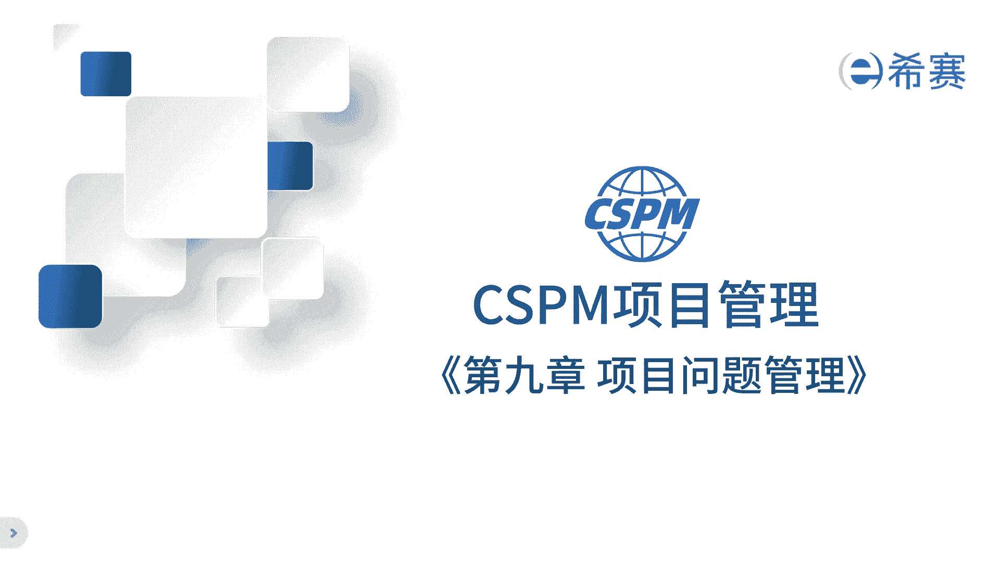
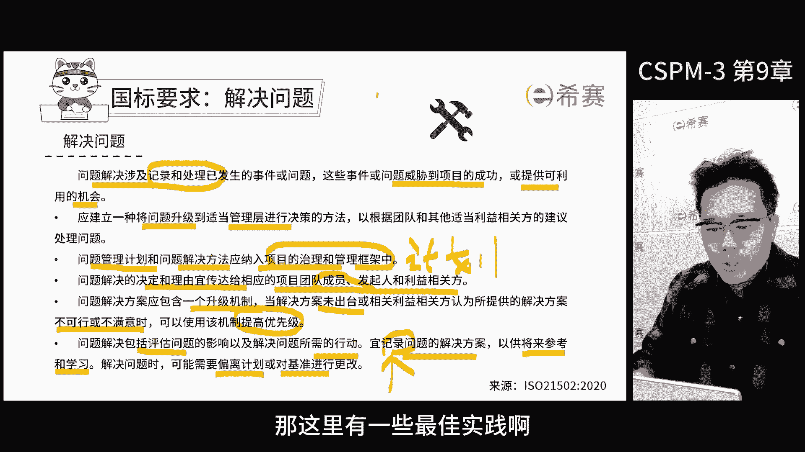
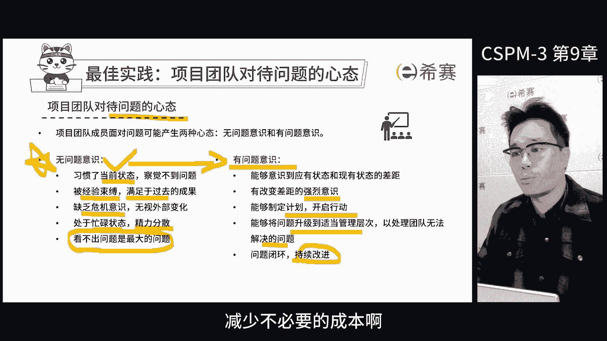
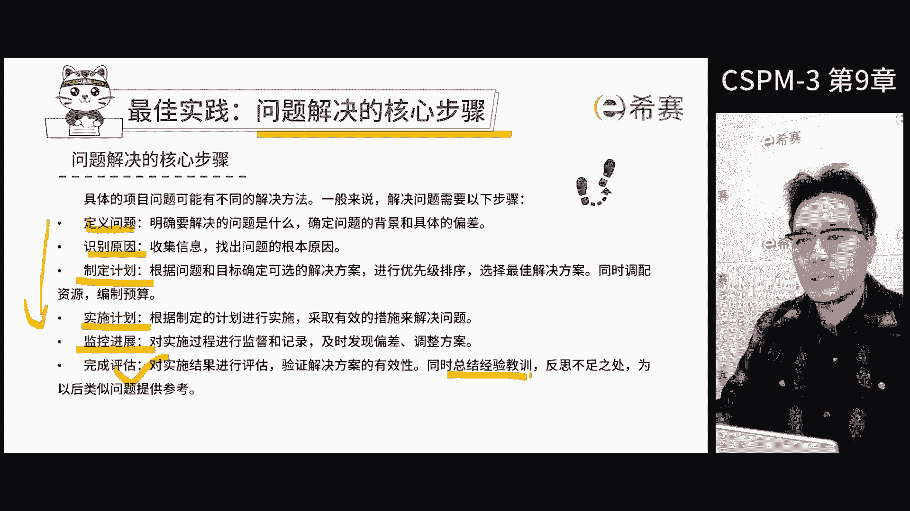
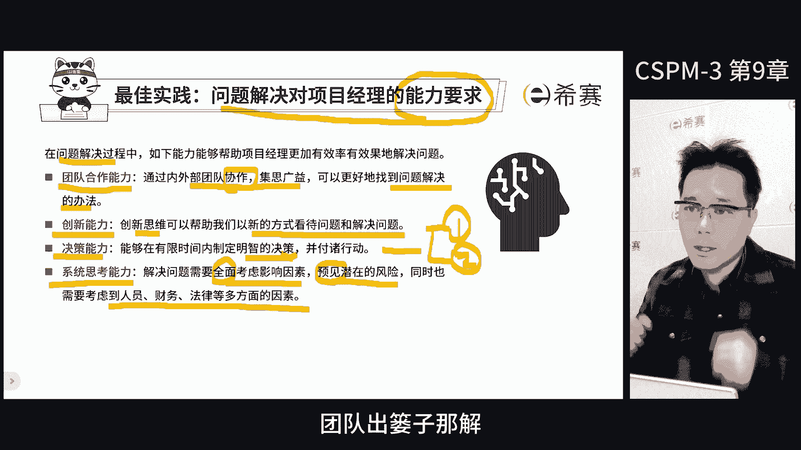
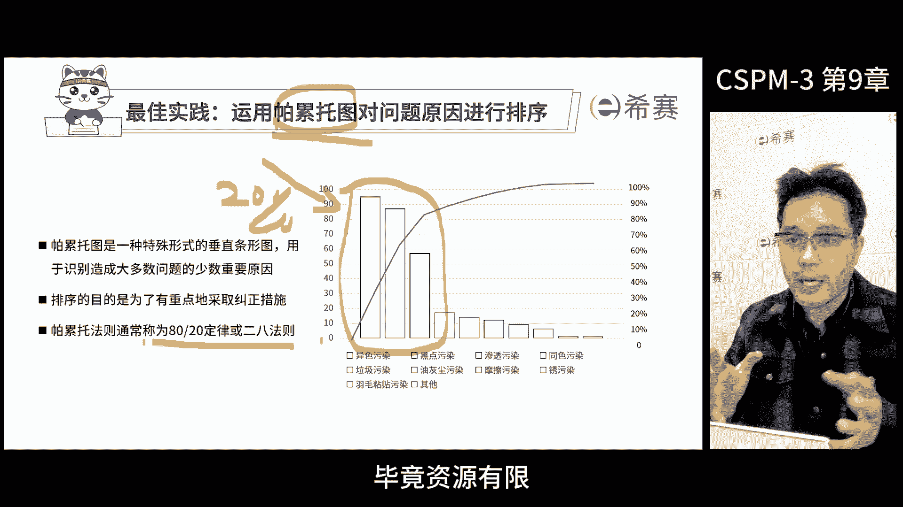
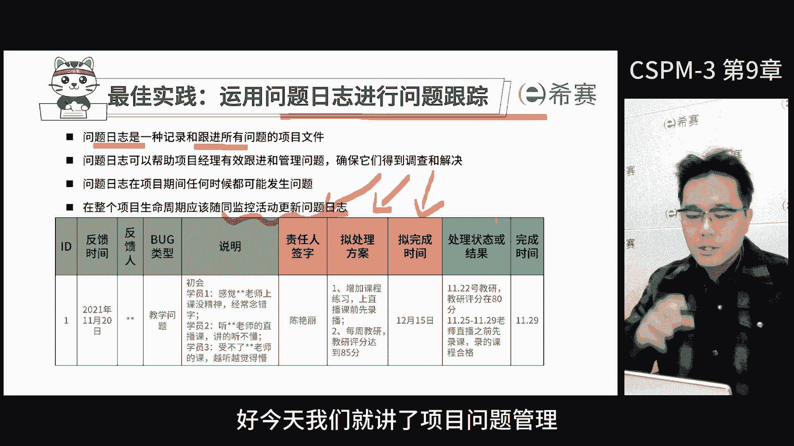
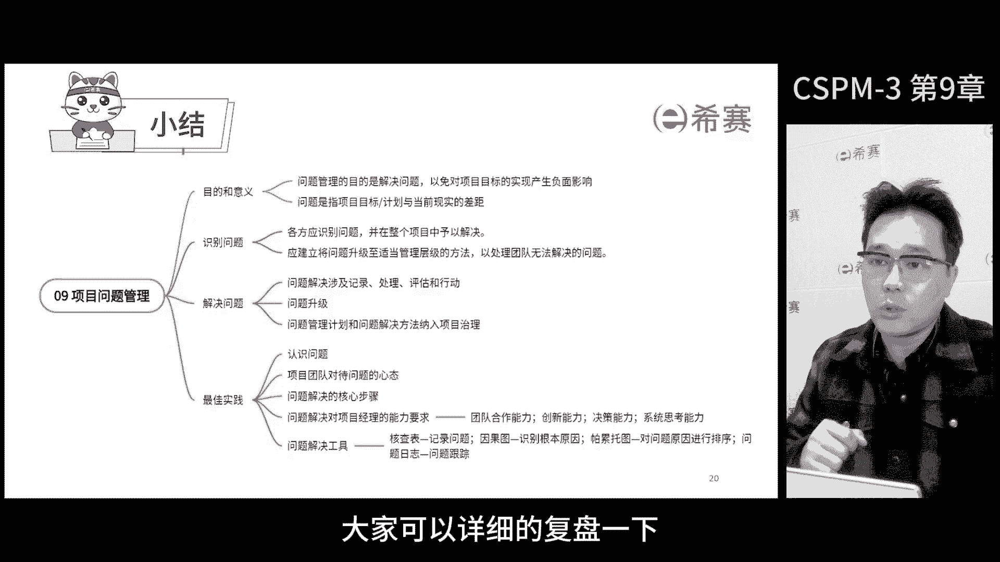

# 【2024年】CSPM-3项目管理认证精讲视频免费观看！比PMP更高级别的国标项目管理证书 - P11：cspm-3 第9章 项目问题管理 - 冬x溪 - BV1Y1421975P

好同学们，我们先来讲解第九章项目问题管理，问题管理呢，咱们之前其实讲过它和风险是息息相关的事情，没有发生的时候叫风险，发生了之后叫问题，问题管理就是管理已经发生的事情。

那我们来看一下标准里面是怎么说的啊，因为后面的考试啊，我们还是要强化一下标准语的具体内容，我们现在主要依据的是ISO21502，和GBT37507这两个标准，那问题管理的目的是。

为了解决对项目目标产生负面影响的问题，需要识别问题，并在整个项目过程中解决，对于无法解决的问题，需要升级到更高层级来处理，问题也是需要升级处理的，那就像风险一样，对于影响大的风险需要升级到更高的层级。

那对于不同的问题也需要考虑分级处理，顺便给大家说一下，在我们国家的标准里面，问题定义是在项目期间发生的事情，这里要界定清楚，那需要对于该项目提供解决方案，我们有时候会碰到一些麻烦。

那这些问题不一定是真实存在的啊，就像之前提到的一些problem，实际上问题这个词在英文里面叫ESO，不是problem问题，在项目进行中发生的一些事情，需要我们关注并找到解决方案。

在之前讲英国的prince项目管理的时候，会把问题分成三类，变更请求不合格项，关注点，那这里的不合格项就是前面提到的problem啊，所以ESO是包括了problem啊，这点我们要分清楚哈。

因为我们的解决方案所针对的问题的类型，不同而不同，我们需要对问题有一个基本的了解，那这样才能更好的去解决它们，那问题管理其实是一个完整的流程，那包括发现问题和解决问题两大部分，那首先来说说发现问题。

标准里面说了，一旦有问题要及时地识别出来，对于大部分的问题，我们要尽量减少他们带来的负面影响，或者利用他们对于项目的积极影响，在确定每个问题的时候，项目团队要收集跟这个问题相关的信息。

为了保证项目的各方的利益，要建立一个完全可靠的方法，来定义和发现问题啊，说白了就是定期的按照咱们的流程去发现问题，解决问题，而且呢，问题的识别应该贯穿整个项目的各个层级啊，从空间上是各个层级。

在实际上是项目的整个实施过程中，由项目团队统一进行管理，与此同时呢，利益相关方应该明确界定和理解问题，一旦发现任何问题，我们应该立即进行初步的技术和分析，这样才能确定它的重要性和优先级。

那首先是我们要注意，这些对于项目目标影响最大的问题，记录问题的过程中，不仅有助于我们了解每个问题的细节，还能让团队清晰地看到问题的状态，以及哪些成员负责解决这些问题，在处理问题的时候。

我们需要有条不紊的去安排优先级顺序啊，因为可能会收集很多很多的问题，那这些有很多是值得关注的啊，有些可能是小问题，我们可以放一放，所以我们需要把这些问题都记录下来，组织大家进行评判。

评判之后就要了解哪些问题的优先级高，哪些优先级低，因为我们主要是先处理优先级高的问题，那另外技术问题本身呢，也有助于我们更好去理解问题，那如果一个问题描述不够清楚，那我们就很难找到有效的解决方案。

所以在记录问题的过程中，我们需要努力把问题描述的尽可能的清晰明确，这样不仅有助于我们更好的去理解问题，还能帮助我们更好的去找到解决方案，对于每一个问题啊，我们都需要有一个明确的记录和登记。

这样不仅有助于我们去跟踪问题的状态啊，也还能帮助我们更好的去理解消化问题本身，因为环境随时都在变化，当我们发现一个问题的时候，仅仅是识别它是不够的啊，更重要的是要找到解决方法。

按照国家标准解决问题的过程中，需要记录处理已经发生的事情和问题，这些问题可能对于项目的成功啊造成威胁，也可能给我们带来机会，我们应该建立一个将问题升级到合适，管理层级的决策方法。

那这就是我们所说的升级路径了，在解决问题的时候，我们需要根据团队和其他相关方建议，来处理问题，那问题管理计划和问题解决方案，都应该纳入到项目的治理和管理框架过程中，也就是说，问题管理计划和问题解决方案。

都是项目管理计划的一个重要组成部分，那项目的治理和管理框架，都是通过项目管理计划来呈现的啊，所以这里之间的关系，弄清楚，解决问题的决定和理由，需要传递给相应的项目团队成员，发起人和相关方。

确保每个人都了解问题的情况，那问题解决方案呢应该包括了升级的机制，但问题解决还没有确定，或者关键相关方提供解决方案，不可行或者不满意的时候，也可以通过这种机制来提高优先级，那接着在解决问题中。

要包括评估问题的影响，以及解决问题所需要的行动，解决问题的方案应该记录下来，以供将来参考和学习，在解决问题时需要制定偏离计划或更改基准，那刚才这里提到的问题解决方案的记录。

就是说作为经验教训的识别和累积，那我之前有个习惯会把几个表放在一起用，那第一个呢是项目工作分解结构和进度计划，就相当于项目计划啊，这张表第二呢是项目的风险登记单，第三是项目的问题的记单。

第四是经验教训的记单，这四个表之间是有联系的啊，首先要有计划，然后才能识别风险，这些风险应该在计划交付的时候考虑到，那如果风险发生了就变成问题了，把它写到问题登记单里去，如果问题解决了。

应该把它变成经验教训，提到经验教训登记单里去，把这几个表放一起呢，也方便我同时查看相对应的内容，那这里有一些最佳实践哈。

大家可以看看，虽然这不是标准本身的要求，但是考试的时候会考到，那这里，顺便也提一下，考试的时候他不一定只考标准上面的内容，因为标准上内容就比较经典啊，正文就那么几个字，没多少内容。

那为了保证它能把标准的内容应用到实践中，让知识理解得更透彻，考试的时候会有一些最佳实践和相对应的，技术和工具啊，这样的题，而不仅仅只是考了几个字，好咱们继续认知项目的问题啊。

简单来说呢就是目标计划和当前现实的差距，这个差距可能表现在几个方面，应有计划和实际情况的差距，希望状态和当前状态的差距，以及期待的结果和未料到结果的差距，从风险角度来看，已经发生的风险就是问题。

没发生的叫风险，所以解决项目问题的第一步，就是精确的定义问题本身，把问题描述清楚，项目团队对待问题的心态，项目团队成员对于问题会产生两种形态，一种是无问题意识，一种是有问题意识。

我们最怕的就是员工看不到问题，很多公司高管都跟我聊过这个问题，他们发现团队成员和公司员工看不到问题啊，他们就非常担心，因为这个问题跟风险就需要他们去发现和考虑，那如果自己没有想到，那肯定容易出岔子。

为什么会出现看不到问题的状态呢，可能是因为大家习惯了当前的状态，觉察不到问题或者被过去的经验束缚了，满足于过去的成绩，缺乏危机意识啊，无视外部的变化或者处于忙碌状态，精力分散啊。

没有办法把精力放在该问地方去啊，看不出问题是最大的问题，那无问题意识是需要解决的，所以我们需要培养员工的观察力和敏锐度，来让他们能够更好地发现问题和分析，同时也需要让他们明白，只有发现问题和风险了。

才能更好的去解决和应对风险，从无问题意识需要调整为具备问题意识，要能觉察到问题的存在，并想着去解决它啊，这就需要我们改变现状的强烈意愿，能够制定计划并付诸于行动，将问题提升到适当的层级来处理啊。

这样我们才能解决团队无法解决的问题，并持续的改进，有了问题时，我们就能积极的主动发现问题并解决它，少走弯路，减少不必要的成本。

这是我们希望达成的状态啊，那问题解决的步骤呢，就是把标准里面认识问题，跟解决问题进行一下拓展啊，可以把它分成几个更细的步骤，定义问题，找到问题的原因，然后制定计划，找到解决问题的方案，然后实施计划。

那接着监督进展，最后完成评估并总结经验教训，那问题解决基本上就是六个步骤，需要反复使用。

那当项目经理在解决问题的时候，需要具备一定的个人能力，那这种解决问题的能力是非常重要的，很多公司都努力的培养员工解决问题的能力，对于项目经理来说，解决问题的能力是必须具备的。

那项目经理主要工作是解决项目中出现的，各种各样的疑难杂症，那这些问题是其他人没有办法解决的啊，要想提升项目经理解决问题的能力，要明确一点，就是项目经理啥事都自己干，肯定不行，需要张罗大家一起解决好。

首先我们需要加强团队合作能力，项目经理是负责组织大家共同解决问题的，虽然自己不是专家，但是要懂得管理和协调，项目中遇到了专业的问题，一定要找到专业的人去解决，项目经理要做的就是组织协作，集思广益啊。

这样解决问题会更快，那团队合作能力在项目中是非常重要的啊，那第二我们需要具备创新能力，那项目是组织创新和变更的载体，我们应该用创新的方式去解决问题，那项目是目标和结果导向的。

那通过创新的方式可以更快地解决问题，降低成本，第三要有决策能力，在解决问题的时候，总得有人做出一些决定吧，啊光讨论而不做决定是没有用的啊，就一而不决，那项目经理要在授权范围内自己做决定啊。

但也需要在推动团队形成决策和共识方面，发挥重要的作用，那这可能涉及到了推动领导，形成项目管理委员会的具体决策，或者与几个团队的成员协商达成共识，共同决定如何解决问题。

因此啊项目经理不仅要具备自己的决策能力，还要推动团队形成决策能力，最后一点要系统思考，这是项目经理必备的能力之一，比如说我们前面讲到的大局观，在解决问题的时候，要全局考虑，把所有相关的方面都考虑到。

再采取行动来解决问题啊，这样效果会更好，并且能同时照顾到各方的利益啊，这样就不会有中间有相关方掉链子啊，团队出篓子啊。

那解决问题我们需要一些常用的解决工具，这些工具大部分都和质量管理相关，因为质量管理的工作，就是不断的在处理各种问题啊，比如说控制图，我们在学PMP的时候是学的这个吧，控制和作用就是定义上限和下限。

在项目管理过程中，进度成本质量都要出控制负担，那学项目管理还要学三点估算，那这个方法用来估算时间成本啊，和其他的，比如说我们估算的时间得出了三个值，最乐观，最悲观和最可能设定目标值的时候。

把最乐观和最悲观估算加起来，再加上四个最可能的估算，然后除以六，那这个值就是咱们的目标值了啊，同时啊，我们也常常会把最乐观和最悲观的，估算射程上限和下限，那这样我们就能画出控制图了。

那只要项目在上下限之间，项目就是受控的，在管控范围之内，那如果超过了上下线，就得赶紧找原因了，这个控股在项目管理中特别有用，特别是在增值管理，收益管理和问题管理方面，那第二记录问题啊。

需要记录问题出现的次数，作为后续分析的基础啊，还有检查表，好技术表，那这些都是我们经常要用的，在日常过程中都要进行数据的储备，这也是为了后续分析打好一个好的基础，那如果你都没记下来，那后续你怎么分析。

你怎么发现问题，学PMP或者质量管理的时候，一定会讲到根本原因分析啊，大家会想到鱼骨图啊，其实鱼骨图呢是一种对于问题进行，结构化分解的方式，那所有复杂和困难的问题啊，要解决它都需要遵循一个基本的逻辑。

就是不断地分解分解再分解啊，很多问题之所以解决不了，就是因为各种原因因素交杂缠绕在一起，但通过结构化的分解，就可以帮助我们，理清各种因素之间的脉络和关系，当我们把问题分解得越清楚。

解决问题就变得越容易啊，那分解是一个非常强大的工具，虽然结构化分解的方式有很多种啊，也有很多不同的最佳实践，但对我们来说啊，人机料法环啊，通常是我们质量管里面最常用的分解结构了，帕累托图是一种工具。

可以帮助我们找到问题的重点，因为问题太多了，我们需要把它排个序啊，找出发生频次高的那些问题，对我们来说要优先解决那些影响大，发生频次高的那核心20%的问题，因为它能造成80%的影响啊。

这就是我们的二八定律原则，所以我们要把这些影响大的，频次高的排在最前面，优先解决掉，毕竟资源有限，时间有限。

我们还要做好日志的跟踪记录问题，他的信息建立问题登记单，对于可能出现的风险，也要用风险登记单来进行记录，那同时对于经验教训呢，我们也要记录下来，建立经验教训登记单，所有的问题从发现到解决。

都要通过表单进行跟踪和管理，那谁提出来的，什么时间提出来的问题的优先级责任人是谁啊，以及期望的解决日期等等，这些信息都要记下来，这样我们才能更好的管理问题，及时的发现并且解决问题。

好今天我们就讲了项目问题管理它的核心点。

那这是一张思维导图，大家可以详细的复盘一下。

