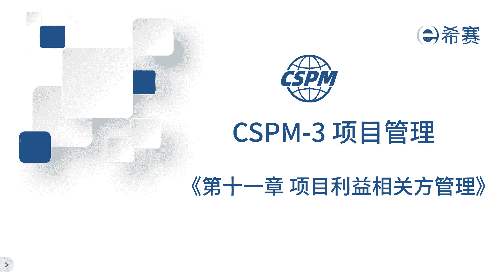
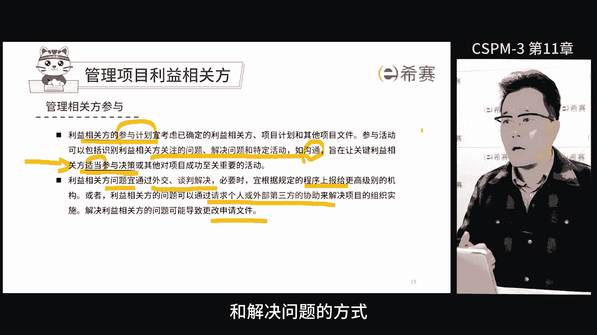
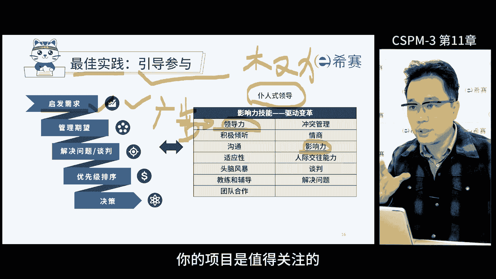
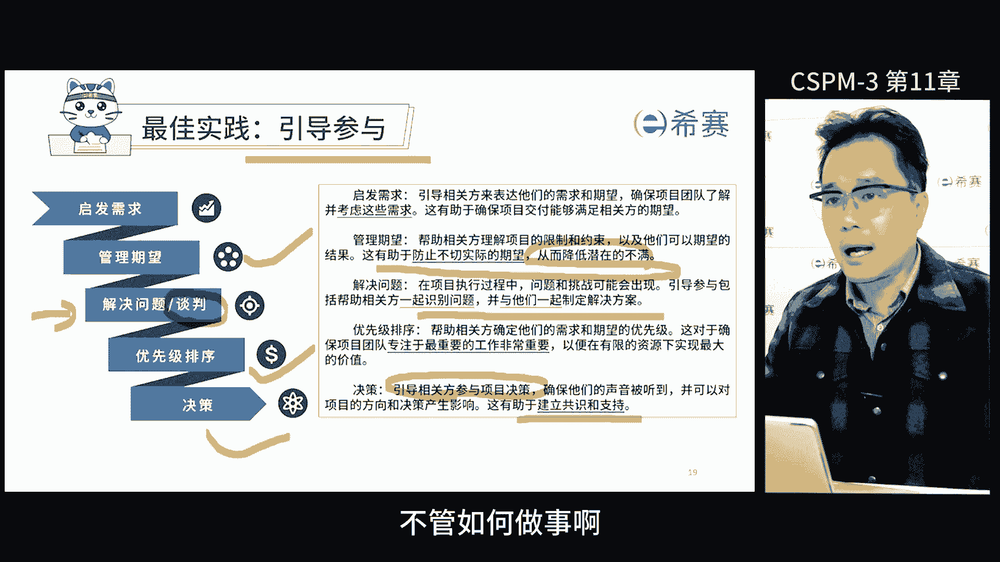
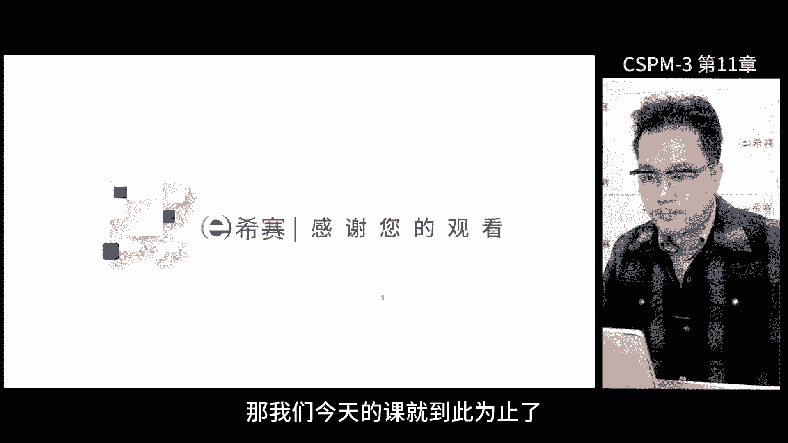

# 【2024年】CSPM-3项目管理认证精讲视频免费观看！比PMP更高级别的国标项目管理证书 - P13：cspm-3 第11章 项目相关方管理 - 冬x溪 - BV1Y1421975P

今天来说说利益相关方管理哈，一共四个部分，相关方管理的目的和意义，如何做好相关方管理的两个步骤，一个是识别，一个是管理，最后一期讲一下相关的案例，咱们把一帮人凑到一块儿，干一个一锤子的买卖。

这里核心就俩词儿，他们之间能不能协同起来，能不能形成合力，别一见面了，打得不可开交，这事儿干不下去，那利益相关方管理，说白了就是如何去把一帮人召集起来，借他们的力啊，让他们一起干事的过程，而不是法治。

项目管理呢锻炼的是借力的能力，能借助的人越多，对我们来说，事情成功的概率就越大，完成的速度就更快，效果就更好，项目管理在锻炼的就如何借力，借各方的力，包括人的力量，比如说资源资金，也包括环境量。

比如公司的规则和秩序，国家的政策等等，我觉得干项目管理啊，人一定会变得智慧啊，我特别喜欢项目管理这条路，也一直在这条路上一直走下去了啊，我也非常鼓励大家在这条路上坚持下去，因为站在这条路的过程中。

人会活得越来越明白啊，尤其是对人性的理解会越来越深刻，所以在这过程中，我们如何去借助更多人的力量，那首先你得理解它，你不理解他，他就不理解你，你不理解他，就没有办法影响他，你就更没有办法去借助他的力量。

去干我们认为正确的事情，但是他原来认为不是女的事情，就没办法转变他的观念，没有办法和他建立信任，也没有办法对目标实现达成共识，项目管理呢不仅仅是圈一帮人啊，那还要保证这帮人参与到一起呢。

有项目的干活的积极性，也就是需要产生合力，规模越大，技术越复杂，挑战越大的项目，对于相关方管理的要求越高，因为这些项目的相关方关系比较复杂啊，特别难搞定这帮人，当然我们这里说的利益相关方。

是一个非常广泛的词啊，这里面一定包括一些非常难搞定的人，那项目管理呢其实到一定层次，它的核心就是把这帮人怎么搞定啊，让他们一起来干事，而且还把事干成，在干的过程中还很开心又激情啊。

这才是真正的项目管理端的核心思想，项目管理中，我们最怕的是项目经理自个儿用工具和技术，用完了，拿着结果去跟别人说说，你看我的东西出来了啊，你拍板吧，那人家心里会想啊，你都没让我参与。

你能证明这个结果好吗啊，这个时候这个问题就搞反了，像我们经理一定是先搞定人，才能让他们使用工具和技术形成合力，才能更快更好地把事搞定，所以啊，这才是利益相关方管理的两个最重要的核心词。

借力和合理标准里说了，立强方管理的目的是什么呢，就是为了让利益相关方的需求，收益关注得到充分的识别理解和解决，我们要知道利益相关方都有谁，他们的需求动机是什么，而且要表现得特别关心，特别认可。

错误做法是你给他讲道理，好，让为了项目的目标，你让他妥协让步，甚至忽略对方的需求，那相关方他自尊心强的很啊，最怕的就是什么呢，就是他们的诉求被忽视了，那这样面上肯定挂不住啊，非常挂不住。

特别是在咱们国家的文化之下啊，面子非常重要，那如果他的诉求被忽略了，一定会带来非常大的仇恨，就会造成人家在整个过程中，想办法要证明它的存在，那这种时候对我们项目的团队。

对我们的执行就会产生很多不利的影响，正确的做法是项目的利益，双方管理的第一步，就是注意到哪些人对我们的项目有影响嗯，要去关注他的动机诉求啊，只要充分的识别并且理解认可他们，再去跟他们共同解决好。

最终咱们的目标就是把他们的诉求，跟我们想干的事结合在一起，形成大家的呃共识，群策群力去实现对大家都有好处，也都有利的事儿，从而实现我们的目标，我们再往下看啊，利益相关方管理要干啥呢啊。

接着就是要识别描述相关方的活动，应该展开的计划项目，利益相关方的管理的活动，以确定和解决相关方他们之间的问题，并利用相关方的知识沟通，在整个项目中确定分析记录，让相关方好好地参与进来啊。

这是整个在标准里面的一些要求，我们通常认为一级的项目经理，主要掌握项目管理工具和技术，准确的说，他们并不是简单地使用这些工具和技术啊，而是要去理解，学会运用它们，那一级项目经理通常不考虑人的因素啊。

只要自个儿会用就行了，二级项目经理啊，就注重的是如何组织大家运用，项目管理的专业和技术，他们要根据公司现有的这些规章制度，在受控的状态下实现项目标，很多外资公司的项目经理，基本上都是出来这个级别。

为什么，因为这些公司他们的规章制度，以及和项目相关的要求都非常的健全啊，项目很容易管，因为公司的环境就在那，那各种项目管理的制度要求啊都非常明确，相关方只要对这些要求都很清楚就可以了。

那接着就是项目经理，要确保自己掌握了咱们的工具和技术，然后带领大家一块把这项目干成就行，单级的项目经理面临的挑战就非常大了啊，它通常需要在没有形成项目管理，环境的组织里面推动项目管理。

这意味着在咱们的组织环境之下，没有一整套大家认可的制度规则做支撑，很多参与到项目中的人呢，根本就不了解项目管理的方法，也不认同项目管理的很多行为，在这种情况下，三级项目经理需要充分的去了解每个人的需求。

让大家觉得项目确实对自己有好处，而不是因为公司要求而配合，所以这么说，三级是一个分水岭，三级项目经理需要开始，识别相关方的诉求和动机，并让对方发自内心的认同项目的价值和好处。

组织大家啊在项目层面来进行行动啊，通过一些要求约束和管理大家，以确保我们的事情呢能完成啊，虽然这事儿很难啊，但这确实是三级项目经理的能力要求，甚至说这是必备的能力，如果我们走项目管理条路啊，想搞定人。

这是必修的能力，项目管理需要我们搞定各种各样的人，向上搞定领导啊，搞定有资源的投资人，搞定其他部门的人，那这个过程中对于人性的理解就越来越深刻了，事情就容易干成了好明确了我们的目的。

那我们接下来看一下利益相关方到底包括谁，在国标体系里面，以及我们的课件里面都用了利益相关方这个词，这个词好理解啊，不管学没学过一件，基本上都知道啥意思，他跟我们企业管理的很多词是通用的。

那干写呢这个词有点生僻，如果不是学PMP的，基本上不知道干洗这个词，记得以后遇到干系人，那知道他就是相关方就行了，一个意思，标准里面对于利益相关方有明确的要求啊，那些对于项目感兴趣的人。

团队和组织可能会被项目影响，或者认为自己受到项目某方面的影响，那这些利益相关方在可以是项目的内部，也可以是项目外部，也可以是组织内部或者组织的外部，那这里帮大家罗列了一些关键相关方啊。

肯定是需要重点管理的，比如说高层客户发起人啊，对于项目的啊，方案啊，执行啊都有很强的影响力，在管理这些人的过程中，需要深度理解一个词叫做engagement。

张方管理不是叫做stakeholder management，正确叫法叫stakeholder，Engagement，这个词挺难解释的啊，有几层意思啊，啊有参与，还有什么订婚等等啊。

那把它理解成维护关系更加的恰当一些，相关方管理不单单是管理项目，而是要管理一段关系，这个关系不仅仅是客户关系，还有团队关系，领导关系都需要时时刻刻去了解，把握和维护，就像咱们的婚姻一样。

所以在麦肯锡咨询里面没有project manager的叫法，而是叫engagement manager，麦肯锡绝大多数的客户都是长期客户，都是老客户，公司鼓励每一个顾问都能和客户长期的engage。

像不像婚姻啊，就是维持维护一段关系，这个词在西方用的比较多啊，我们经常说大家要in engage所有相关方啊，就有一次给军工的企业做咨询，解释了这个利益相关方管理半天听不懂啊，不明白啊，后面终于明白了。

他跟我说了一句话，他说我们这里叫建立统一战线，后来我就牢牢记住这个说法了，我发现这还挺有道理的，就建立统一战线的说法，其实就是建立项目，建立利益相关方更加广泛的共识，让大家求同存异，团结一起啊。

就是团结一切可以团结的人，张罗组织大家放下彼此的成见，科尔先干点对大家都有好处的事，建立统一战线的思想和方法中，真的有用有效啊，有团结各方的力量，非常有名的一个做法，项目经理啊需要做好相关方争取。

那在这张图里面，我们可以看到项目经理在中间，项目经理在这里需要锻炼资源整合的能力，那他在中间向上要整合一群比自己牛的人，权力比自己牛，资源比自己牛，专业能力比自己牛啊，比如说项目的发起人。

智囊团发起组织管理委员会这些人吧，大公司牌子，这帮人好发起组织呢看是哪一层级的领导发起，可以是集团的，也可以是这个业务单元的，还有委员会，项目的总监发起人啊，这些人都是非常重要的一个核心人。

那向下整合呢，除了工作包负责人啊，项目团队成员，项目管理办公室啊，除了这些呢，还有很多的跟项目有影响的参与者啊，集团公司，用户，客户和用户也要分开，好干活的供应商，业务伙伴，财务提供者啊，还有股东等等。

整合人最核心的就是整合人心了，只要把人心整合在一起，才能整合各自的能力和资源，所以整合人心的话，项目经理需要具备的能力，其中一项个人能力，个人能力里面有一项叫人际关系，这个能力其实挺难的啊。

因为除了要识别出各个的参与方，还得梳理他们之间的关系啊，这个非常重要，关系要梳理清楚啊，去施加影响，建立信任，整合大家，那很多技术出身的项目经理啊，他内心会有一定的抗拒，他觉得这个这事儿不是在干实事。

在项目管理的等级里面，我们设了五级，每次等级的上升都需要转变内心的，对于原有事物的认知观点和看法，这是质变的开始，我们先要有意识认识到，我们都要主动的跟各种各样的人打交道啊，建立信任，进入他们的力量。

一起干事，二级到三级的过程中，是内心需要变强大成熟的过程，当然在这个过程中，通过实践，通过反馈，不管是正反馈还是负反馈啊，慢慢要体会出来，如果大家想成为优秀的项目经理啊，既要把事情干好。

还得让相关方说你干得好啊，最怕是什么事儿干得挺好，大家还说你不好啊，这就特别尴尬，对于标准中的要求啊，考核的关键，主要是看大家对于利益相关方的理解的程度，工具和技术使用是其次的啊，从能力上来说。

项目管理的能力评级是以结果为导向的，换句话说你只要能搞定这个人，就说明你有能力，标准里面有两个关于利益相关方的流程啊，首先要看一下识别利益相关方以及他们的收益，参与的相关方的信息。

这些信息包括他们的兴趣水平，影响力，期望需求啊，以及他们的利益，那这些相关方可以是项目的内部的，也可以外部的，有不同层层级的啊，不同等级的，那对于我们来说，尤其是需要关注那些会获得收益的个人和组织。

以及对于我们有很强施加能力的组织，在识别的时候，我们需要把它们登记下来啊，这个时候就涉及到利益相关方登记册，这个管理产品，这个文件是我们在项目管理过程中，一定会用到的核心表达之一，在登记册中。

我们需要记住每个人的姓名，扮演的角色，联系信息，以及他们的需求期望，影响力的大小类型等等信息啊，但是需要注意的啊，记下来呢，并不是意味着所有的信息都是同等重要啊，主要是为了防止遗漏好。

接下来我们需要给这些利益相关方进行区分，以判断谁重要谁不重要，我们通常采用的区分方式是权利利益啊，这个方格来表示纵坐标是权力，横坐标是咱们的利益，这么一来就分成了四个象限，好权力大且本身利益也大的人。

他们的参与度自然而然就很高，要重点管理，那么如果权利大，利益小的人呢，说白了你别得罪他，令其满意就行，如果利益很大，权力很小，要保证让他知晓权力小，影响小，它本身参与度也不会太高啊，对我们来说。

保持监督就可以花最少的精力去做，对于不同的人，我们管理的侧重点和角度，视野是完全不一样的啊，要把我们的力气，资金，还有咱们的精力放在刀刃上，我们还有一种评估方式啊，就是看相关方的参与度啊。

主要是看他是不是积极的参与了，而不是影响力的大小和之前的不大一样，我们之前是把沟通资源和时间，重点放在那些权利大和呃力大的人身上去啊，因为他们对我们的影响很大，甚至可能左右的项目的成败了。

那现在我们更关心的是哪些人积极参与了，哪些人没有积极参与，同时我们还要思考一个问题，我们到底想让他积极参与，还是不想让他积极参与，我们的目标是转变他们的态度，好态度有几种，一种是抵制啊。

第二种呢是不知道，第三种是中立，第四种是支持啊，第五种是领导，换句话说，有些人呢不光是想参与或者说支持，还非得在这里面要主导一些事，就他自己要说了算好，我们把所有的这些相关方列一下啊。

看看这些人到底当前目前是什么样一个态度啊，对于那些抵制的人，我们要思考一下他为什么要抵制，我们能不能把抵制变成支持，对于那些不知道人，我们是不是需要让他知道，当然有些事有些人啊最好不要让他知道啊。

知道了反而反而添乱好，对于中立的墙头草，我们也要考虑一下，他们会不会随着项目的发展，时间的推移啊，转向支持了哪个方向，对于支持我们的人，我们就不必详细展开说了啊，其中最重要的一点就是支持我们的人呢。

是以我们为主的，我们来主导的，对于领导型的概念啊，有些人非要来领导啊，他得承担领导的角色啊，我们得听他的啊，他得把这里面的一块事自己做主啊，这属于领导型啊，我们也要引导。

让他们从当前的状态调整成我们希望的状态啊，这才是我们做相关方的engage的一个核心，从项目管理的角度来说，我们需要领导，但是需要的是一群领导在一起做集体决策，因为你单独跟一个领导沟通啊，一定要弱势啊。

他权力比你大啊，资源比你强啊，你得听他的，但是你把一群领导凑到一起做集体决策的时候，他们彼此会相互影响，那做项目管理就得靠大家一起来集体决策，那就得把各个领导放在一起讨论啊，相互平衡一下。

免得你们俩冲突啊，那我夹在中间就不好办事了，明白的领导呢，一般会左右不太明白的领导的想法，当一群领导放在一起来，他们相互影响，我们就更容易找这个平衡点啊，更容易做好项目管理啊。

当然这得先找到这帮人的态度啊，因为各自的态度决定了我们在沟通过程中，怎么和人家打交道啊，这个蛮核心的，我们想知道怎么去搞定利益相关方，说白了把他们管理好，要engage好，那我的意思呢。

把这帮人给安排得明明白白，清清楚楚，那标准里面也明确说了，首先我们要写清楚我们自己的要求，那把这个东西写到相关方参与计划里面去啊，这种类似的相关文件，而这个参与活动可是一个大事了啊，这里面要写清楚啊。

包括识别利益相关方，他们的关心的问题，还有待解决的那些问题啊，有哪些特殊的活动沟通啊，好沟通方面，在整个活动过程中，你要让关键利益相关方，能够适当地参与到决策中，或者对其他项目成功有关键作用的活儿。

这里有几个关键词，让关键利益相关方适当地参与到项目中来，换句话说哈，不是所有的利益相关方都能参与决策的，比如说很多非常重要的利益相关方好，你让他们都参与进来，这盘子就乱了，做决策多费劲啊。

好这里恰当的参与决策，听起来就是说你自己来主导，换句话说，我们需要他参与，他有参与进来，我们不需要他参与，他就一边凉快去，所以适当其实就是度的把握，那这个对于项目经理的能力考验，也是有一定的要求的啊。

这个能力的水平要求，那么这些利益相关方的问题是怎么解决呢，需要怎么解决啊，在处理利益相关方的问题的时候，应该采取合适的沟通和协商的方法，以寻求双方的共识和解决方案，如果必要，可以根据规则程序进行。

上报给更高级别来处理啊，也可以通过找一个第三方或者个人来协助解决，我们项目的实施啊，这可能就意味着我们需要找专业的人士或组织，来帮忙解决我们的问题，那解决利益相关方的问题啊。

可能会导致更改一些申请文件啊，因为可能会调整我们的计划，调整其他相关的一些文件来满足他们的需求啊，和他们阴晴不变的这个变化，其实最核心就是满足他们的期望啊，总之啊需要通过恰当的参与和解决问题的方式。

确保项目成功啊。

并且维护好我们之间的关系，这个蛮重要的，在实施过程中有一些最佳实践可以给大家参考，那相关方管理最重要的就是提高它的参与度，我们作为项目经理如何engage他啊，一个最佳实验叫引导参与，在管理中。

我们的核心目标是让利益相关方，按照我们的思路来，但是我们不能强迫它要靠领导去影响他，那很多项目经常觉得别人不听他们的啊，是因为他们没权利啊，其实这种想法其实蛮幼稚的，因为原来我也有在项目管理当中啊。

其实是跨职能的组专家搞一些创新变革，主要靠的是什么领导能力，而不是权利，那这里的能力跟权力是相反的，靠能力解决的问题，一般情况下不不需要靠权力，如果没有权利也能解决问题的话，那就叫能力了。

如果你拿着大把权力去解决问题啊，那不叫能力，那谁都能干，那需要你干啥，所以权利适用于陈述业务常态化的工作，大家认同既有的规矩规则，而且这个规则还比较科学合理，那这么一来就能靠权力去管大家了。

或者你也可以理解为当同一成员都是你招的啊，你培养的啊，你决定他们升职加薪，工资奖金啊，这个时候你就可以走这个叫家长制的权利管理，但是在大多数的这个项目中啊，都不具备这样的条件啊，只能发挥领导力。

领导力的概念不是靠权力去影响别人，按要求做事，而是让他们发自内心的认可和接受，你的想法和做法，所以项目管理啊，他锻炼的就是领导力，领导力的核心就是影响力，你需要去启发大家的需求。

并且适当去管理他们的期望，你不能只做这种官僚型的这个命令型的领导，这不是真正的领导力了，好在这过程中，我们要启发大家的需求，要引导他们发现自己的痛点并创造需求，商业的本质上就是找到客户的痛点。

并把它解决掉，那如果客户没有痛点，你就需要去启发他们的需求啊，一种最常用的手段就是广告和营销，天天给你洋洋洋洋洋洋啊，你听多了，你也想啊，好我也买一件吧，好所以项目管理也是一样的哈。

那如果有人对你做的事儿呢没有需求啊，或者中立态度，那说明他们对这个事没有痛点，作为项目经理，我们需要找到，至少让他们知道你的项目是值得关注的。

这个过程中需要一些销售套路哈，有一个非常好用的这销售法则啊，就是讲我们卖东西的时候，通过四步来把它搞定，首先是你得告诉人家你卖的东西是啥啊，有啥特点啊，其次用这东西能给你带来什么样的改变好。

再次呢这个改变能给你带来什么样的好处好，最后来举个例子证明一下这个事儿呢，不是我瞎编的，是真的啊，真实发生过的好，这个销售方法叫做FABE销售法啊，通过这种方式，我们可以向别人证明。

你想让他做的事情呢是有效的有利的啊，毕竟有成功案例好举个具体的例子吧，先说一个特点好，我这款沙发是真皮的好，再说优势，先生，您坐上去呢试试，它非常的柔软好，接着说好处，你坐上去是不是感觉特别舒服啊。

一天的压力一下就释放掉了，好最后来证明一下，今天上午有位先生啊，因为喜欢这个点买了这款沙发，你看这是我们的销售档案，通过这样的销售套路啊，去挖掘对方的痛点，启发对方的需求，在启发需求之后。

如果客户的需求期望太高了，那这个时候需要用合理的方式，把不同的相关方的需求或者期望降下来啊，适当的进行管理他们的期望，避免在过高的期望之下做事情啊，期望的高低，对于项目的难度和结果来说有很大的影响。

客户期望越高，实现起来就越困难，一旦没实现，客户就会不满意，结果无法达成，对方都觉得你把他忽悠了，相反的，如果客户的期望较低，时间起来就容易一些，甚至可能会超预期，但客户特别满意。

特别是要降到我们的能力范围之内，这点非常重要，为了管理客户的期望啊，我们通常通过事实逻辑来引导客户，把他们的期望降到我们能力范围之内去做事情，这个过程中如果遇到了冲突啊，遇到了矛盾，我们需要解决问题啊。

虽然谈判不是我鼓励的这种方式，但如果真的出现这种情况了，那该谈还得谈，因为我们一定是以解决问题，以结果为导向的，解决问题的核心就是找到共同利益，我们提出各种方法啊，都是为了找到共同的收益点啊。

这样才能让大家一起协同起来，形成合力，共同干事啊，需求多了，我们需要做优先级排序，尤其是在敏捷项目中，以价值为导向，价值越高的预先处理啊，基于这个信息，我们才能更好的做决策，当然在决策的时候。

项目管理讲究的是集体决策啊，不能由一个人来单独的进行下定论，下决策，更不能由项目经理替大家来做决策，集体决策可以让大家更好的参与啊，内心更容易接受，执行更有效啊，这样更容易调动他的积极性啊。

这也是激活个体和激活组织的，一种重要的一种方式，不过在引导参与的这个过程中啊，不管如何做事啊。

沟通一定是不能缺少的，那么问题来了，那如何沟通呢，用什么样的方法方式啊，这就需要提前策划，所以沟通策划要把这个利益相关方的意愿，需求期望都弄清楚啊，包括反馈的机制有效性，这些都得做好，有的时候呢。

我们需要针对特定的受众，进行一些特定的活动啊，用合适的媒体来传达明确的目的和信息，好公共重点呢应该是支持项目目标的实现啊，可以通过增进立项方之间的理解合作，提供准确的信息，公正的信息。

然后降低沟通过程中的这些障碍，将风险沟通风险最小化来实现啊，通过有效的沟通，可以促进团队之间的协作合作，确保我们按计划执行啊，如果地理位置比较分散啊，一个在东半球，一个在西半球啊。

那这么一来我们要关心文化语言问题，组织从属问题啊，直接都要考虑进去，这些因素哈，也都会影响到我们的沟通，所以制定沟通策略的时候，项目经理需要考虑这些所有的因素，你要选择一个合适的媒体或者方式。

来提高我们沟通有效性，那通过合理的沟通策略啊，我们可以确保满足对方的需求啊，尤其是对方在沟通方面的需求，相关方的沟通手段中，除了沟通策略，还有一个非常重要的公共手段啊，叫做汇报。

我们会在下一章来详细讲解，做项目啊，大家都都希望满意啊，这是我们最重要的目标之一了，要实现这个目标，我们得注意每个人的需求，确保每一步工作都符合大家的期望，怎么做呢。

啊这就需要我们定期的进行满意度的调查，那以前在项目上我都会在项目过程中，尤其是阶段结束，还有最后结束的时候，给客户，给关键的成员领导发一些问卷，让他们给项目经理打个分啊，啊这个打分的结果啊。

对于项目经理年终绩效啊，我那时候公司叫做总经理嘉奖啊，影响还是蛮大的，这是一个非常典型的一个调研方式，再比如啊，之前供应商他们会定期的给我发问卷啊，每个阶段都会去做调研打分，包括工作态度啊。

专业性啊啊交付的质量啊等等，这样做的目的也是为了确保重要的关键相关方，对于整个项目的过程保持满意啊，避免最后验收的时候卡住了，你就不给你签字，整个项目管理过程中，我们还要注意的是阶段评审的重要性。

每个项目的阶段里程碑啊，或者产品交付的时候，我们都需要组织评审会议，在会议上要确保所有的利益相关方，对于当前的咱们这个结果以及对未来的预测啊，非常清楚啊，这样大家才能达成共识，形成合力。

对于项目的状态理解才能保持一致，所以啊满意度评估是非常重要的，那通过这种方式，我们不仅可以了解项目的效果如何，还能及时的发现不满意的地方啊，及时的改进，让大家都满意，来一起拿到一个好的结果好，最后哈。

让我们一起了解一下，相关方管理的最佳实验的流程，整体流程是识别利益相关方，并分析他们的利益，接着我们要管理利益相关方啊，并评估它们的满意度，在识别阶段我们要考虑环境的因素，历史信息，还有咱们范围的要求。

范围的大小，同时我们还要去回顾一下过去的经验教训啊，别踩坑了，最后还要考虑咱们项目的成功标准中，对于资源的要求，识别之后，我们要写到相关方登记册上去，在分析阶段，我们要对所有的已经识别的相关方展开分析。

要分析他的权利，他的影响啊，并根据这些信息呢制定对应的沟通策略，沟通手段，包括利益相关方本身的基带的几种沟通方式啊，通过观察呀，争取啊，或者其他方式来engage它，在执行阶段呢。

我们要确保按计划落实收集项目的绩效，以及对项目的影响，并根据这些影响判断我们的管理是否偶像啊，从而调整我们对应的计划，这些信息好，最后在项目收尾的时候，我们需要解决剩余的问题，并评估的相关方的满意度。

同时我们还要根据项目管理计划，进行最终的更新，项目管理还是非常科学的，它既需要结果导向，在过程中也需要开展过程的持续优化和改进，这是我们的最佳实践，唉大家可以好好的去梳理一下啊。

那最后我们一起来回顾一下啊，这个章节讲的什么，一相关方管理，这是项目管理中重中之重，特别是对于高级项目经理，比如说我们考一级二级的啊，认证啊，对这个知识点可能考的比较少，但是到了第三级。

这可是一个重要的考点，核心考点，第三级是培养的是我们对人性把握非常重要的，项目经理，好项目利益相关方管理呢主要是管人，我们要识别出各路相关方，不单单是识别他们是谁，还要了解他们的动机需求。

从各个角度去识别，登记的时候还要明确他们的角色影响力等等啊，防止遗漏，接着我们还要去分析他们的权利和利益的大小，权力越大，关注度越高，他对我们项目越感兴趣啊，也就是说我们要重点管理。

那我们要积极的推动他们，更好地参与到项目中来，在这过程中，我们需要识别他们的需求，管理他们的期望啊，以结果为导向来解决问题，如果出现了冲突，我们要通过谈判，通过有效沟通来达到我们的目的。

那最后呢我们要定期的调研一下，相关方对于我们事情的满意度，那整个过程中对于我们来说，利益相关方的管理，这个核心的流程是非常重要的，也是需要不断的去优化迭代完善的过程好。

