# 【2024年】CSPM-3项目管理认证精讲视频免费观看！比PMP更高级别的国标项目管理证书 - P15：cspm-3 第13章 项目标准化知识和实务 - 冬x溪 - BV1Y1421975P

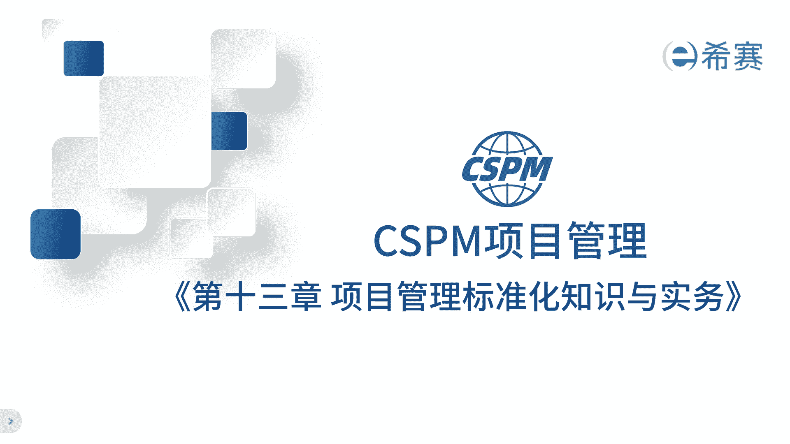

最后一章也就是第13章，讲的是关于项目管理标准化内容，这张之所以要放进来，是因为到这个层级就是第三级，这个阶段对于项目管理，专业人员的要求就更高了，所以这个层级的项目经理，他们不仅仅要参与到项目中的。

制度和流程的建设，还要引入外部的最佳实践工具，技术和标准方法，那目的是帮助公司提升组织级的项目管理能力，他甚至还要带一些资质，前一些的项目经理，从国家和行业的角度来说。

也希望第三季的项目经理能够积极地参与到，国家的项目管理，行业标准的制定中，那这样不仅仅可以普及相关知识，还能让大家了解已经发布的项目管理国家标准，因为从长期的发展方向来看。

我们肯定需要建立自己的项目管理标准，体系的，前提是掌握已经发布的项目管理的知，识和相关的东西，那这项工作呢就变得非常的重要，所以学习项目管理标准化是非常有用的，考试的占比也比较多。

那么为什么我们要建立这些标准呢，啊其实项目管理的标准啊，就像是我们行业的规则，了解了这些规则，对于我们了解整个行业非常有帮助，在我看来，项目管理啊已经成为一个行业了，那既然是行业，就需要有规则。

我们现在就是在制定这些规则，所以大家最好能熟悉这些规则，越早熟悉在这个行业里面就越有竞争优势，我相信学习这些标准，对于大家未来的职业发展一定会有帮助，好来讲讲标准化那些事啊，以前我做项目管理时候。

你都不爱学这个标准化，觉得这些跟项目关系两码事，我刚当项目经理那会儿也不懂标准化，但是在工作中我们都会参与到审核评审，在这个过程中呢，我们就需要了解不同的企业的管理模式，就更需要理解标准了。

那么什么是标准呢，那标准其实就是大家达成共识的东西，那最低的标准就是企业标准了，在这个范围内，大家都能对于事情有一个彻底的认知，企业标准之上是行业标准，再往上地方标准，国家标准甚至国际标准。

这些标准就像是统一了大家的认识一样，把大家的共识写下来，就形成了标准，所以在审核过程中，评审过程中发现标准是非常重要的，大家常说哈一流的企业定标准，但是实际上一流企业定标准是，因为如果我们定了行业标准。

就意味着把我们对事情的认知，变成了大家的共识，那这样就可以用我们对事情的认知来要求别人，按照我们的认知来做事儿，那这样是不是很厉害嘛，那因为我们要变成行业规则的制定者，如果标准对于我们不利。

我们就可以把它改呀，改成对我们自己有利的呀，那这样别人就会觉得你按照我们的要求去做事，是应该的，那么我们认知代表了整个行业的认知，如果我们的认知是定在了国家标准，那就意味着把我们对事情的理解变成了国家。

所有人的理解，那是不是更厉害了，在国际标准组织中有三个ISO，还有一个IEC国际电工委员会，还有一个ITU国际电信联盟，那ISO是其中最权威的一个，国内不论是国资委啊，还是地方政府，都鼓励国内的企业。

去制定国家标准和国际标准啊，特别是能去牵头做一些国际标准，因为这不仅仅代表的是国家的优势，还可以用来约束其他人啊，所以说说白了谁来牵头制定这个标准，谁就能制定游戏规则的，还可以约束别人。

那这个身份非常重要，所以说一流的企业定标准，什么是标准呢，这个标准啊就像一把尺子，用来衡量各种活动或者其结果是否符合要求，这个标准的英文是standard，它的定义是通过标准化活动，按照规定的程序。

经过商定一致定出来的一个文件，这个文件为各种活动啊，以及结果提供了这个共同的规则和特质啊，可以重复利用，那这个定义在我们国家的标准中被称之为GBT，2万。1杠2014的第5。3条款啊，说得很清楚。

那另外一个问题，那什么是标准化呢，标准化其实就是像把原来没有统一标准的事情，经过商定制定，实现统一的标准啊，这样在一定的范围之内，大家就可以按照这个标准来衡量了啊，获得最佳的一个秩序，对于企业来说。

推行标准化，可以让我们在工作中避免重复的工作，提高效率，例如在项目管理中，如果每一个项目都需要重新制定一次规则啊，那就浪费了很多的时间和精力，那如果有了标准化，我们就可以重复使用这些标准了啊。

避免重复的工作，那大家都知道哈，市场上有许多不同的项目管理的方法和工具，他们来自不同的国家协会，每个都有自己的一套啊，想象一下，如果我们把这些不同的方法全部扔给企业，唉。

他们之间会产生很多的矛盾和冲突啊，就像咱们吃药，每一种药针对的症状是不一样的，如果同时吃很多种药，那药物之间会相克，那反而达到不了一个好的治疗效果，那现在很多企业就这样啊，看到别人用这个方法取得了成功。

就盲目的跟随，也不管这个方法到底适不适合自己啊，结果用了一段时间发现不好用，就换方法好，换来换去啊，一直也没找到合适自己的方法，所以我们要做的就是把所有的方法标准化，让大家用同样的方法。

这样就不会出现矛盾了，那我们推行标准化也是为了解决这个问题啊，在项目管理方法领域也是一样的，我们不能说看到别人用某种方法去跟着学，要找到适合自己的方法，在中国啊，别的那些方法遇到了很多的不适应的情况。

那每一个方法确实有自己的优点，那么我们国家应该如何用同样的项目管理方式，来老外给不了答案，只能我们自己来回答，因此呢要明确我们为什么要做这件事情，结合国情制定我们的标准，全国向标委主要的工作。

就是推动项目管理的标准化，在2017年，国家出台了标准画法，明确定义了标准，它指的是农业，工业，服务业以及社会事业等领域，需要统一的技术要求，当我们对一个事情的理解，达到一定专业程度的时候。

他又成为一种技术了，那标准化工作的任务就是制定标准，组织实施标准，以及对于标准的这个制定进行监督，那既然标准背后是一个技术要求，在标准化领域里，我们也可以把项目管理当做一门管理技术啊。

那既然是一门技术要求，那一定需要严谨，有明确的界定和边界，有足够的专业性，在制定的过程中，一群专家会讨论蛮久的啊，比如说这个画怎么画呀，这个话怎么说啊等等，那最终要达成共识。

那所以这里叫全国项目管理标准化技术委员会，你看强调标准化技术名称是这么来的啊，我们了解它背后的这个主体啊，为什么这么叫，那接着我们来看一下标准的分类，标准是有分类的，按照主体分类。

这些标准呢就像一个金字塔，从上到下依次是国际标准，区域标准，国家标准，行业标准，地方标准，团体标准和企业标准，企业标准是最低等级的标准，但也是最具体最实在的标准啊，完全指导落地啊。

它会根据企业的实际情况来制定，让企业内部达到高度的统一，那范围再大一点呢，就是团体标准了，像中国标准化协会制定的标准就是团体标准，那美国的PMI出的就是美国的团体标准。

那这些标准呢啊就相对来说也容易接地气啊，有一定的针对性啊，针对于这个团体，那再往上一层级是地方标准，比如说上海标准，北京标准，这些都是在特定的地方范围之内统一的标准，那接着往上是行业标准。

那就是相当于整个能源行业的标准了啊，指导整个行业，然后是国家标准，项目管理，国家标准就是其中之一，那这个国家标准呢比其他的标准级别更高一点，国家标准是用来指导各个行业和社会团体的，谁制定了国家标准。

谁就掌握了专业技术层面的话语权，当国家标准出台之后，那其他的标准依然可以用，但是你必须要按照国家标准进行调整啊，不能和国家标准矛盾的，那国家标准之上呢，还有区域标准，比如说东北亚标准。

那这个标准统一了东北亚国家，包括日本，韩国，他们的技术要求，这些标准要高于各个国家的国家标准，唉大家一旦定下来，在这些国家里面就一定要遵守区域标准，再往上是国际标准啊，就像刚刚说的，IOIEC和ITU。

这三大国际标准化组织来说，他们属于电力的啊，通讯的啊等等啊，那这项目管理呢是rs下面的一个标准，叫做ISO21500啊，这个标准是用来制定和发布，全球范围内跟项目管理有关的国际标准啊，这是按照主体划分。

那如果按照性质可以分成，强制性标准和推荐性标准，那现在项目管理标准就是推荐性标准，比如说咱们的GPT41813，和GBT37507，他们都是通用的管理类的标准，那其他大部分也都算是推荐性的标准啊。

比如说国际类的ISO9001，那哪些是强制性的标准呢，那涉及到安全的食品的标准都是强制性的，你必须要遵守，按照标准化的对象划分，又分成产品标准，过程标准和服务标准，那按照标准的编制目的。

还可以分成基础标准，技术标准，工艺标准，那工艺标准里面又包括了安全标准，卫生标准，环保标准和资源利用标准，接着往下划分，按照功能划分啊，它又分成七类术语的符号分类试验规范规程。

指南性的标准被我们视为不同的标准，这些啊大家需要记一下啊，考试会涉及这些问题，全国项目管理标准化，下面这个资格证书，我们就希望大家熟悉整个标准体系。

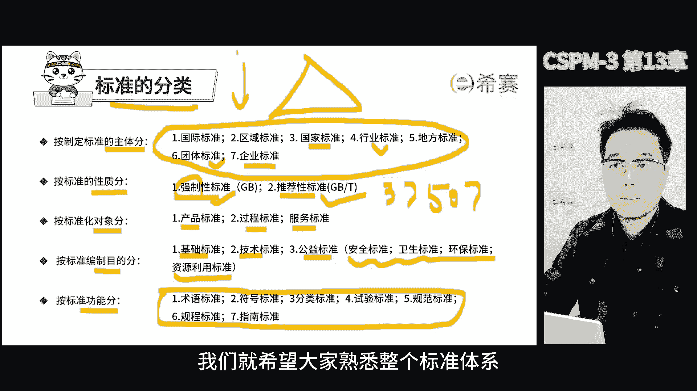

那里面有些事例主要是为了帮助大家理解，比如说界定某领域的各种术语条目，唉，它属于术语标准，我们在项目管理中也有一些术语啊，定义的标准啊，主要是去定义所有跟项目管理相关的词汇。

比如说关于项目群的还是项目级，大家还在讨论这个词怎么叫，目前我们国家的项目管理数据标准里面，把它叫做项目群组啊，以后可能还会调整，至于在我们国家，SKEHOLDER叫干系人相关方。

利益相关方还是项目利益相关方，这又有很多相关的要求，所以我们会通过术语标准，来统一大家对它的理解，那符号标准呢就是标志的说明书啊，分类的标准去，要是给东西贴个标签吧，编码啊，还有试验的标准啊。

比如说做实验的步骤啊，怎么做的啊，比如说的数据怎么处理啊。

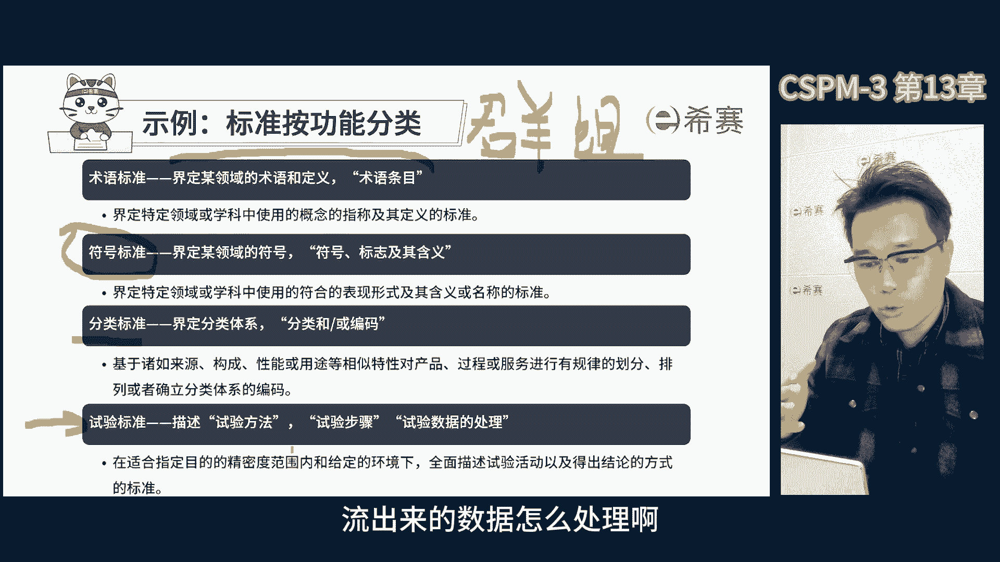

那规范的标准呢是需要满足的要求，比如说那个GBT41813诶，他叫项目管理专业人员能力评价要求啊，这个是用来判断是否符合要求的啊，另外还有规程的标准，它更多的是建立一套程序啊。

为活动的过程规定了明确的程序啊，并且描述了用于制定该程序的，这个追溯证实的方法，那指南的标准呢主要提供的是需要考虑的因素，更多的是偏向于建议啊，所以大家要注意到啊，在项目管理中。

有一些标准呢叫做项目管理指南啊，但有一些比如说项目管理专业人员能力评价，要求定位是不一样的，能力偏要求标准呢一定要按这个标准来指南呢，是推荐大家来参照啊，功能完全不一样。

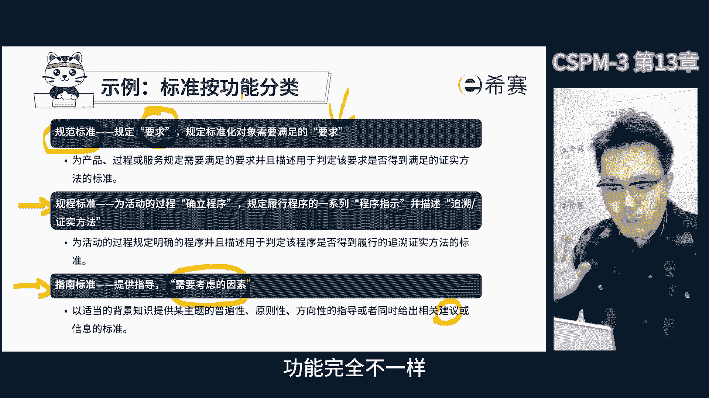

那明确这些之后，我们来讲一个非常重要的点啊，就是根据2017年的标准画法，它可以提升产品和服务的质量，促进科学的进步啊，保证咱们人员的健康和生命财产的安全，维护国家安全和生态环境安全。

还能提供高经济社会发展水平，那标准化法里明确写了标准的作用，就这些，那再看2021年初的国家标准化发展纲要，那这其实在标准化领域里面，是一个非常重要的事件了，因为他终于把标准化上升到国家整体的角度。

出了这个发展纲要之后呢，可以指导接下来这些年我们国家怎么去发展，那结合十四五发展纲要，而确定了，第一个100年，即到2021年，第二个100年呢记到2049年，新中国成立100年时，那所以在这里。

从2019年到2049年，这30年间，我们国家的主要任务是，实现从发展中国家迈向中等发达国家，那这个过程呢非常重要，因为要想从发展中国家变成高质量的发展国家，需要提升各个领域的规范性和标准化。

在2021年的时候，我国开始大力推广，各个领域范围内的一种标准化，这相当于国家给出了一个明确的方向，把标准化正式提升到了整个国家层面。

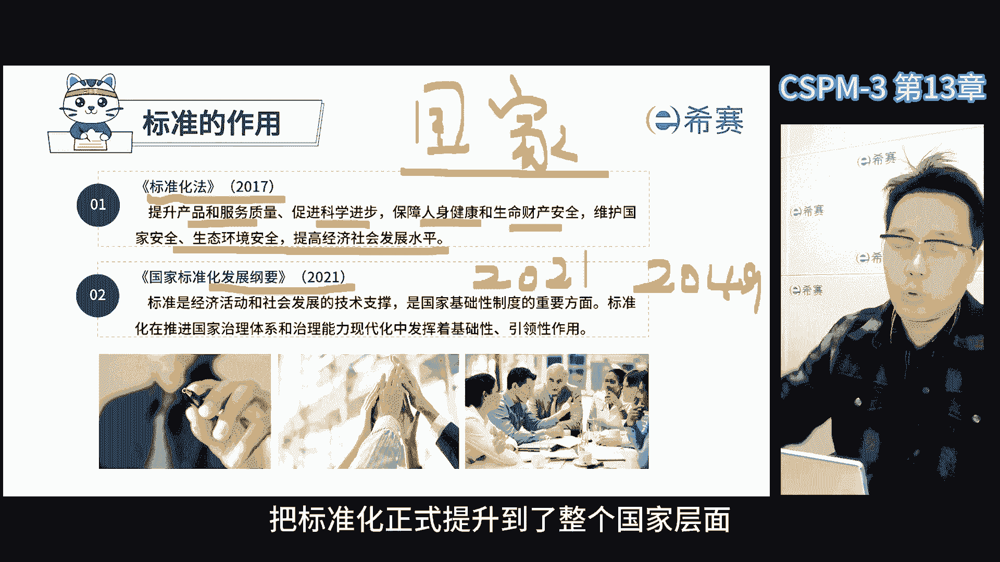

那这也标志着我们向发达国家转变的，必经的环节，那如果你在国外学习或生活过，你会发现西方发达国家，它的标准化规范化程度比我们国家要高很多啊，我们管早期为了发展经济，是先做起来再说，那随着经济的发展。

我们逐渐意识到需要统一标准，在2021年的标准化发展纲要中，标准被明确的定义为，经济活动和社会发展的技术支持，是国家基础性制定的重要方面，标准化在推进国家治理体系和治理能力现代化。

发挥着基础性的引领性的作用，那这里对于标准化的定位给出了明确的定义，这是这两个概念，我们一定要去啊理解，标准化这个行业有自己的法律法规和相关政策，2017年，标准的实施监督管理和法律法规等。

2021年的标准化发展纲要，明确了标准化的总体要求，七大任务和组织实施，在国家标准化发展纲要的，2022年的行动计划中，明确了2023年底之前的33项重点工作，以贯彻落实国家标准化法的发展纲要。

这里还有那不同的时期，不同的文件，目的是引导大家按照相同的目标和方向，去推动我们国家的标准化的发展。

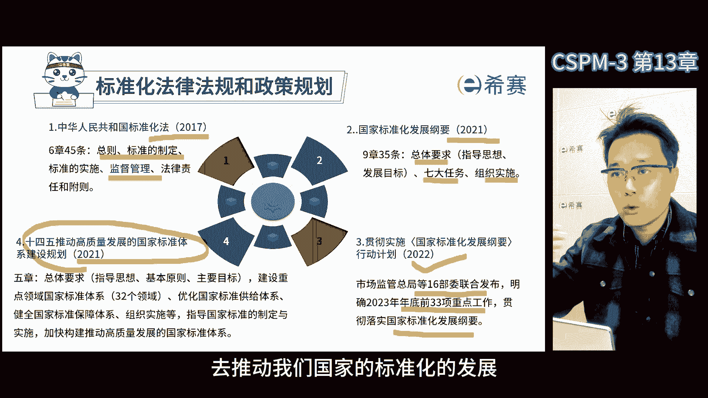

那接下来我们来看一下，标准化法里面有具体有哪些要求，是我们国家标准化工作的一部法律啊，他对标准的制定实施，监督管理等方面有了明确的规定，决定通过了新修订的标准化法。

那这个新法于2018年1月1日开始实施，新法对于提高产品的服务质量，而促进科技进步和提升经济受益发展水平，有了很大的意义，在新修订的标准画法中，有几个关键的内容啊，首先他扩大了标准的范围。

明确了标准奖励制度，建立了协调机制，并加强了强制性标准的统一管理，另外他鼓励积极参与国际标准化活动。

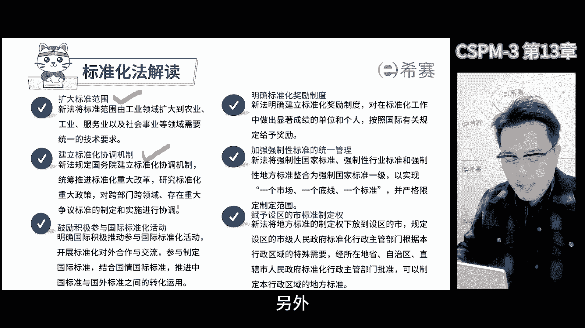

并赋予社区的是标准制定权啊，标准画法也在不断的改版和完善，起到不同的引导作用，从考试的角度来说，大家需要记住这些心法带来的一些变化啊，因为这些变化在标准化行业里面，是非常重要的事情，那新的标准化法呢。

也提出了对于标准制定环境的要求，建立企业标准自我声明公开和监督制度啊，明确强制性的标准应当免费向社会公开，2021年出台的国家标准化发展纲要，这是标准化发展史上的里程碑事件，放眼全球。

面向未来做出了重大的决策啊，是新时代标准发展的宏伟蓝图，在我国标准化发展的历史上，具有重大的里程碑的意义啊，这份文件呢是一个纲领性的文件，优化标准化治理结构，强化标准化治理的效能啊，提升标准化国际水平。

助力高技术创新，促进高水平开放，引领高质量的发展啊，我们会发现标准化越来越受到重视，无论是从政府到专家啊，再到各个企业，标准化体系，可以推动项目管理能力的啊，水平的提升啊。

其目的是与国家重大发展的方向保持一致，那国标统一了大家对于项目管理的理解，避免以前啊这个这个流派啊，项目管理之间相互pk不认可的情况，好西方国家这些东西呢确实有一些优点，但是不一定全适合中国啊。

就像我们不能盲目的照搬国外的标准，而是要结合国家的实际情况，去制定属于中国自己的国家标准，那这样大家才能接受，才能真正的符合我们的国情，于是呢就按照国家标准体系，依据市场监督总局等相关机构。

那组织大家一起编制了符合中国的标准啊，第一个方法，那组织大家一起写了一本，属于我们的国家标准啊，这就是我们现在在学习的这个直接点，在这过程中的各类人士加入进来啊。

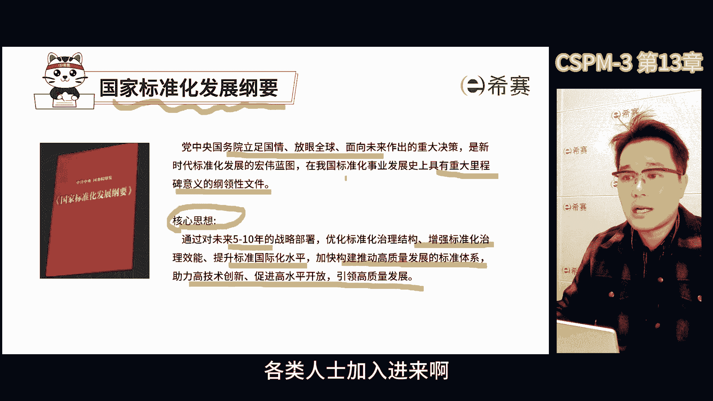

大家群策群力，把各自的优势都拿了出来啊，共同制定这个标准，那标准化工作也在不断的变化哈，来看一下发展纲要的四个转变和四个目标，那以前的标准呢供给主要是政府主导啊，现在变成了政府与市场并重。

以前的标准呢运用主要是产业贸易为主，现在变成了经济社会的全领域，同时标准化工作也从国内的驱动，变成了国内国际相互促进，那现在出个国际标准呢，那非常不容易，那专家评审越来越严格啊。

因为现在要做的是质量效益型的好的，而不是像以前那个凑数型的，除了国家标准，还有才能去核对，去审查啊，非常不容易好，但是除了国家标准，能够有效地推动国家综合竞争力的提升。

这也是整个中国迈向发达国家的一个过程，在推动标准化时设立了四个大的目标啊，第一呢是全域标准化深度发展，第二是标准化水平的大幅提升，第三标准化开放程度显著增强，第四标准化基础更加牢固。

那这些标准在国家标准化发展纲中都有所体现。

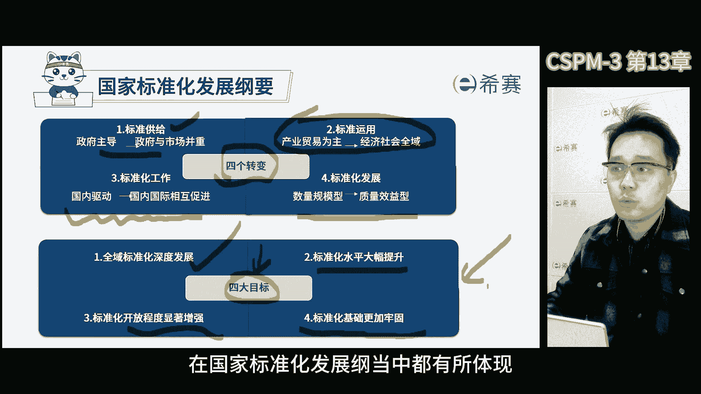

在标准化的推动过程中，必须要了解标准化的行政管理的体制，那谈到标准化行政管理体制呢，来看一下，在标准化领域里面，咱们国家有一个最高的管理组织，就是国家标准化管理委员会。

那这个委员会呢属于国家市场监督总局，但后来在机制改革的过程中，它的职责划入到了国家市场监督总局啊，现在他的任务就是统一管理全国的标准化工作，国家标准化管理总局下面有几个直属单位。

第一呢是标准化的技术管理司，他是总局下面的一个司了，这个词主要负责战略规划，政策制度，还有国家标准和标准化技术委员会，也说咱们简称TC的管理好，另一个词叫标准创新管理司，他负责行业标准，地方标准。

团体标准，企业标准跟国标标准化的工作，这两个司做项目管理，标准化的时候会经常打交道啊，尤其是S那边跟标准创新丝打的比较多一点，除了这些，还有一个国家标准技术审评中心，他主要负责所有的国标的立项。

立项之后，由国家标准技术审评中心的老师来负责，去找找这些事情啊，放了组织，在最后的最终答辩环节，由国家标准化管理委员会的专家，来对他进行评审和答辩，那这些专家的水平都非常高啊。

或者说从事业单位退休的一二把手啊，他们退休之后呢，虽然行政职位没有了，但是会去作为各个领域行业的代表，对国标进行评审，那负责组织专家进行评审的，就是国家标准技术审评中心，它的职责是国家标准的立项评估。

技术审查，技术委员会的评价，标准技术服务等等，除此之外，国家标准化管理委员会，再往下它还有各个地方的标准化行政管理部门，负责统一管理本行政区域的标准化工作，那最后呢总局下面还有一些其他的直属机构。

比如说中国标准化研究院，中国标准出版社等等啊，构成了整个国家的标准化行政管理体制，整个国家标准化管理委员会。

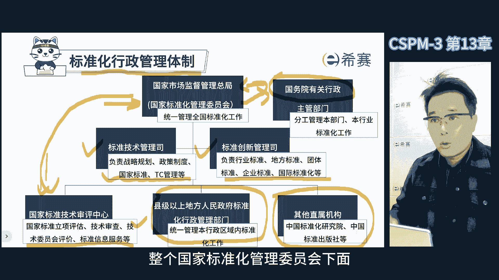

下面还有很多的标准化的专业技术委员会，这些专业技术委员会全部归国家标准化管理，委员会统一管理，他们负责在各个不同的领域去组织大家，立项和编制各种不同领域行业的国家标准。

目前已经组建了全国专业标准化技术委员会啊，有1319个，其中包括546个技术委员会啊，756个，分技术委员会和17个标准化工作组，在国内，全国项目管理标准化技术委员会，是546个技术委员会中的一个。

我们叫做TC343，第343个技术，在国际上的IO里面也有一大堆的技术委员会，书上也在不断的发生变化，那项目管理是其中第258个啊，叫做TC258啊，要分清楚一个是国内的，一个是国际的。

这些是咱们的行政体制，那接下来再给大家介绍一下。

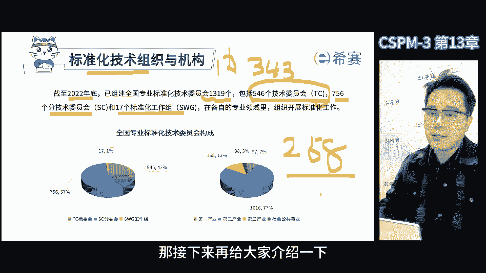

目前国内的项目管理标准化的整体发展情况，先看国际的那国际ISOTC258哎，他是2011年成立的，当时发起的组织呢是英国标准协会BSI，和美国项目管理协会PMI，他们联合在IO提交了申请啊。

希望成立项目管理的标准化技术委员会啊，因为项目管理已经涉及的领域呢足够大了啊，涉及内容也足够多，有广泛的市场的应用的现状啊，急需一套全球的标准，那当时就获得了批准，由美国国家标准协会ANSI来负责。

我们国家其实也是作为首批啊，只不过前10年没有特别多实质性的参与啊，从2019年的时候，我们才开始真正的实质性的参与进去，来看这张表，这张表是从成立以来已经发布的标准上面。

首先有ISO21500是当时的第一个标准，那后来做了更新，把项目项目群项目组合管理改成了环境和概念，那这个标准呢目前正在准备同等采用啊，会把它转换成国家标准，第二个是ISO21502杠。

2020是2020年发布的叫项目项目群，项目组合管理，项目管理指南，这个项目管理指南就要向项目管理知识体系哎，它大概相当于ISO全球的项目管理，知识体系的标准啊，咱们作为目前学习的项目管理认证啊。

知识体系就是参照他来的，它里面包括了干项目管理所划分的，八大工程组啊，17大知识领域啊，包括我们很多的概念，组织结构各种要求啊，其实我们都是以他为主的啊，因为它偏向于知识体系。

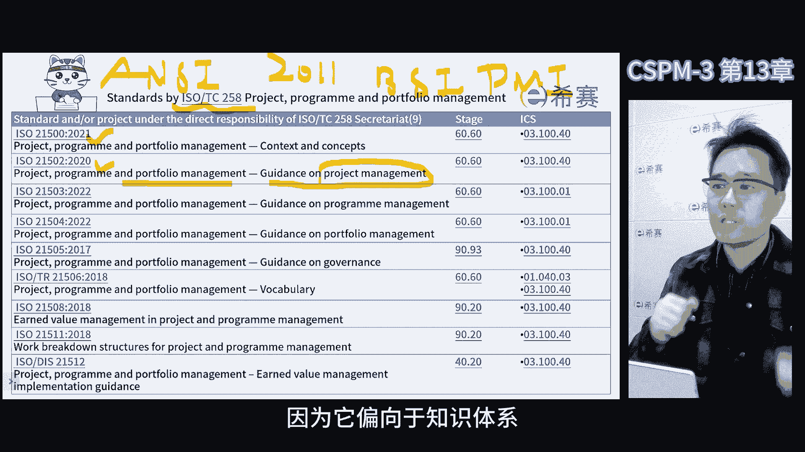

从名字上就能看出来，Guidance on project management，那ISO215032022年进行一次更新，更新完之后。

它叫guidance on programming manager啊，项目群管理指南啊，21504杠2022项目组合管理指南啊，这些标准都是经过一次更新了。

21505是治理guidance on garless项目，项目群项目组合的治理，大家可以看到，在21500后面缺了21501，原因是一直以来有一个习惯性的做法。

就所有的标准组的零一标准都是管理体系标准，我们熟悉的有ISO9001啊，就是质量管理体系的标准，ISO27001是信息安全管理体系标准，但是项目管理呢没有零幺标准。

这是因为在ISOTC258里面有一个争议啊，就以英国为首的欧洲体系，他们非常希望出零一的管理体系标准，以美国为首的坚定的认为，项目管理它是一个典型的目标方法，但是管理体系是过程方法。

那目标方法的项目管理呢，它是不应该形成管理体系的，那这事呢每年开会呢大家都吵啊，反正就是没达成共识，所以没有零幺标准，直接跳到零二，那零二是项目管理，零三是项目群管理，零四是项目组合管理，零五是治理。

这四个标准啊，其实都是我们在日常开展项目管理过程中，常用的啊，特别是零二是整个的知识体系啊，零二大致相当于类似于P不可一样的标准啊，只不过它比批复的范围会更大一点，好再往下呢叫做iso tr是术语标准。

ISO21508叫增值管理，项目和项目群的增值管理，这个标准跟我们现在正在编写的21512啊，它有很强的相关性啊，后面又立了个项出增值管理的实施指南啊，相当于实施指南是为了配套增值管理标准。

目前在推动修改21508的时候啊，是我们国家和澳大利亚联合立项啊，相当于成为一个联合立案的双召集人，那目前还在努力的推动这个项目中啊，如果立项成功啊，也会成为我们国家跟别人联合立项，牵头的一项目啊。

蛮重要的啊，蛮有分量的，21511杠，2018是项目和项目群管理的工作分解结构，标准好会看到在整个ISO体系里面，跟项目管理工具技术相关的标准其实只有三个，其中啊一个是增值管理。

还有一个就是工作分析结构，可以在这空中看到，增值管理和工作分解结构，在全球范围之内都非常重要，正是因为它们被广泛的应用，才会变成ISO的空间标准，在国际标准形成过程中，非常重要的因素是看标准的普适性。

就是全球各个组织单位有没有在用，如果没人再用，就不会把它定成标准，那说明政治管理和工作分解结构，在全球范围之内啊，是使用最广泛的两个工具和技术了，那为什么要强调这两个标准呢。

因为在国内很多企业都没用起来，政治管理，大家基本上都不知道这是个什么东西啊，这东西在60年前就已经发明了啊，现在西方发达国家被广泛应用，发挥了巨大的作用，那大家都学过项目管理啊，没有WBS。

我们就没有办法把目标分解成不同的组成部分，那项目管理不管在哪，不管工作包的估算还是工作的估算，基本上都是基于工作分解结构的，如果没有落实工作分解结构，整个后面的进度计划，成本估算和决策等等。

你就没有办法推进下去，在项目管理过程中，政治管理主要是进行过程控制的好，政治管理是项目的绩效管理啊，也可以叫做项目的能效管理，那全球最高水平的政治管理组织啊，在美国他又是研究如何进行政治管理的。

那政治管理的核心是监督单位时间内，单位成本内完成的工作的百分比，那如果这个百分比越来越多，说明项目的效能越来越好，反之越差啊，可以通过这个计划数字，和咱们的实际的数字来更精准的判断。

那这样就可以帮助我们去预测，完工时的时间偏差，成本偏差，以及过程中需要采取的措施，而从而提升我们的绩效和能效，从2011年到现在的12年来，一共发布了八个，我们这张表里可以看到有八个国际标准哈。

写国际标准的周期很长，基本上是3年吧，赶上疫情，那组织编写和评审都非常费劲啊，这4年越来越严了啊，标准还没写完呢，出国际标准啊真的挺难的，一般来说，每年也就是3~4个工作组能搞一下啊。

其中有一些还是研究别的，那真正在组织编写的一般是三个工作组，那反正就是制定国际标准不容易，那接下来我们看看我们国家的国家标准的现状，那现在在正在批准的和已经发布的国家标准，一共是11个。

全国项目管理标准化技术委员会，成立于2008年，到现在一共15周年了吧，总共也就出了11个标准，这些标准按时间顺序啊，应该从下往上看啊，好最开始呢说第一个是项目管理的术语标准。

2009年出的内测标准是GBT23691，我们现在的很多项目管理的词汇，其实都是遵循这个标准要求的，第二个标准呢，项目后评价实施指南，编号是GBT30339杠2013，这个标准虽然没有被大家广泛的知道。

但确实成为呃一向由我们国家牵头立项的标准，那这个标准在ISO立项通过了啊，现在正在组织大家编写标准，项目管理指南，Gb t375072019，它是一个彩标啊，前两个标准是我们自主研发的。

而这个标准是彩票啊，彩票就是说这个标准，基本上是把ISO的21502翻译成中文，转换成我们自己的标准，那这些标准可以在国家标准化管理委员会的网，站上查到啊，不过虽然网上有一些内容。

但是大部分的标准内容是不能免费下载的啊，就像买书一样，你不能提供免费的电子版啊，不管是国际标准还是国家标准啊，都需要购买纸质的，要查看已经发布的这些标准公路啊，可以去国家标准化管理委员会的网站。

上去搜一下，但是有些内容是有权限的，不是所有人都能看啊，如果想看标准的具体内容啊，你就得找到相关的标准化组织，比如说中国标准化协会，或者中国标准化研究院等等，这些地方研究院2019年出了另外的标准。

GBT37490项目项目群项目组合管理，项目组合管理指南，那GBT39903杠，2021是项目工作分解结构啊，39888项目和项目群管理中的增值管理，好41246项目项目群。

项目组合管理的项目群管理指南，这些标准都是彩标，有专家翻译成中文，就等同采用成为国家标准的一部分，另外还有自主研发的标准，如GBT41831杠2022，项目管理专业人员能力评价要求啊。

这个标准真的是很有创新性啊，在全国范围内，还没有哪个国家把项目管理专业人员的能力，评价要求上升到国家标准的高度，虽然我们暂时还没有把它上升到国际标准，但未来我们可能会考虑把它变成国际标准啊。

就像ISO一样好，另外最近还发布了项目管理敏捷化指南，好标号是GBT42892杠2023，这个标准啊也很有创新性，现在全球范围内，我们是第八个把敏捷变成国家标准的好，在这过程中我们抢占了先机。

那对我们非常有利，那未来在ISO质地敏捷化标准过程中，我们就有机会争取立项的地位了，最后一个管理咨询指南现在正在等待批准啊，应该很快了啊，这个指南啊，主要来约束所有的项目管理的培训机构啊，咨询机构啊。

软件公司啊，好准确来说呢就是项目管理行业中的组织，这个指南相当于站在国家的角度啊，对于从事项目管理相关工作的机构，来他们的资质，工作场所开展工作的方式，都提出了一个统一的管理要求啊，将来会形成标准。

用来评估这些机构，是否符合国家要求的主要依据，那这个标准是我们自主研发的，组织了全国的专家学者，各个行业相关政府，组织大家一块去定义各种标准好，因为我们要规范未来的项目管理，这个行业以及我们的从业人员。

企业事业的工作方法啊，其实主要是解决项目管理的一些问题，并且让管理咨询服务指南，也能尽快成为国际标准，让我们国家的项目管理的水平。

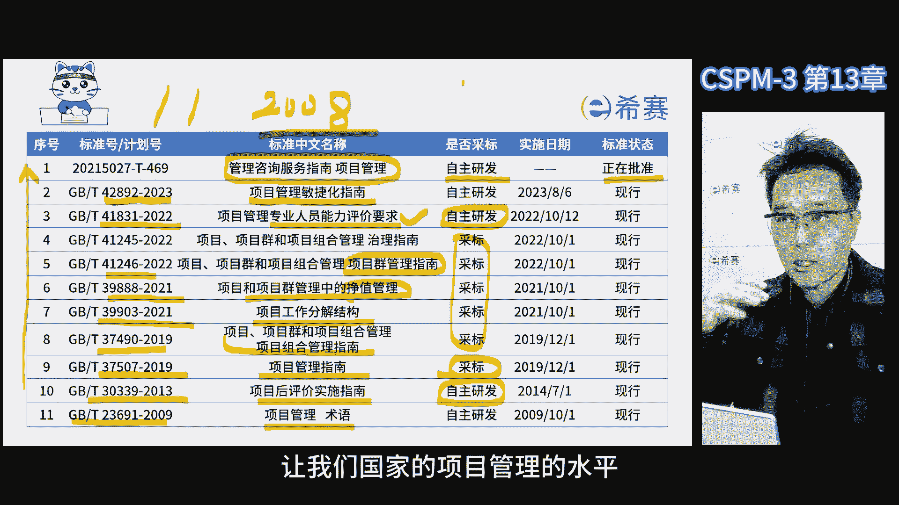

得到进一步的提升，好那截止到这里啊，整体咱们课程的内容就全部讲完了啊，在这里多说几句，记住项目管理的方式和方法是初级境界，能够听懂，并且能够做到才是高一级的境界，那如果能够讲明白，用的灵活诶。

那可是高手中的高手了，项目管理的学习之路上，我们要以知行合一为目标，不断去实践修炼，在这个过程中把知识和技能变成自己的本能啊，才能发挥最大的效能啊，只有达到不知道自己知道的境界，才是项目管理的最高目标。

所以我们一起努力吧，成为神一样的项目经理啊。

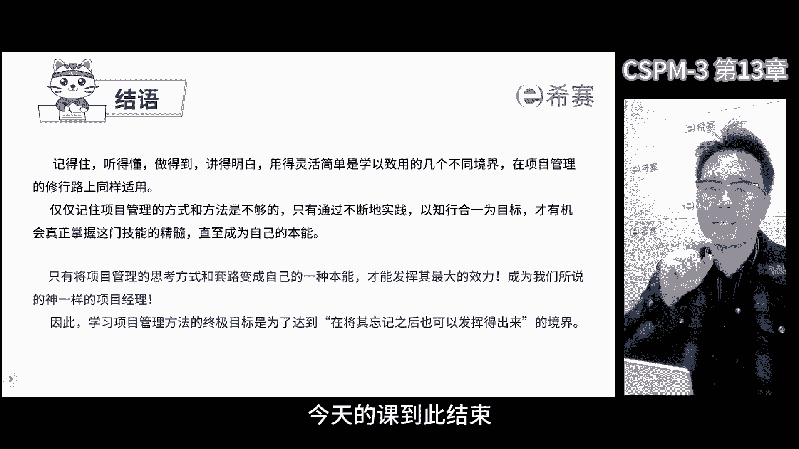