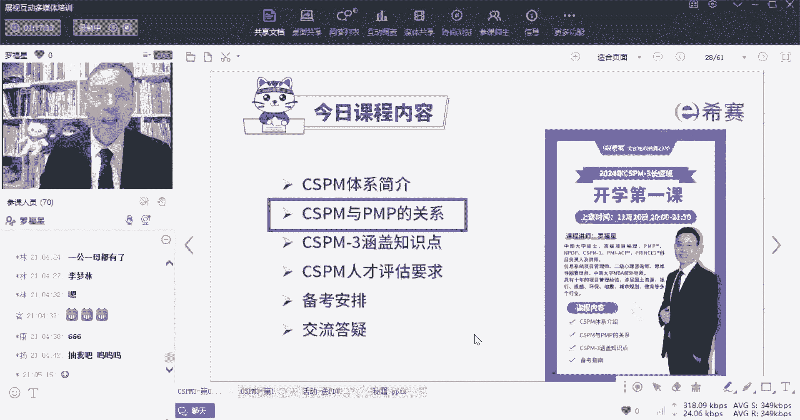
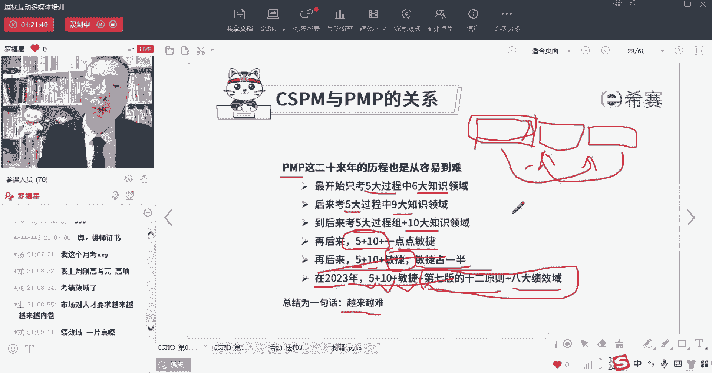
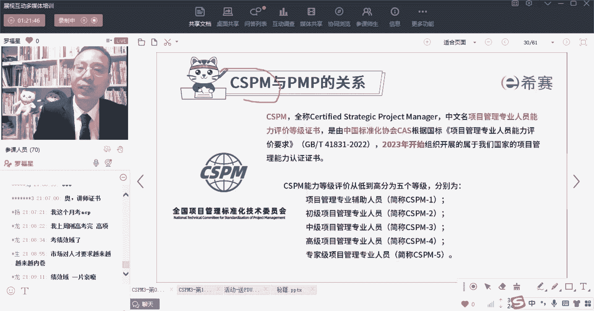

# 【2024年】CSPM-3项目管理认证精讲视频免费观看！比PMP更高级别的国标项目管理证书 - P1：0-1 CSPM和PMP的关系上 - 冬x溪 - BV1Y1421975P

大家晚上好，我们接下来看的一个内容呢是关于cs pm，它和偏僻的关系，首先偏僻最近考偏僻的同学，有没有发现其实内容还挺多，有这种感觉吗，我给你稍微简单的去介绍一下啊，偏僻课程的。

他其实从2000年的时候引入到中国大陆，然后开始慢慢的就有人考就能考对吧，而我自己是在什么时候考的呢，我是在2012年的时候，然后我当时考的上面其实相对是比较简单的，最最开始的时候好像是五大过程组。

六个知识领域，然后到后来慢慢考的就越来越难，我当时考的时候好像是五大关主九大知识领域，然后在又过了几年以后呢，就改了，改了一叫五大关主十大知识领域，然后后来好像还调过一版，有五大过程组，十大知识领域。

然后再加上一点点敏捷，敏捷占多少呢，敏捷大概是占3%到5%左右，也就是说是呃200道题目中，可能只有十来道题目是敏捷的东西，然后到了去年的时候就一下子就变天了，变什么呢，它变成了一个叫五大过程组。

十大知识领域，49个过程加上敏捷，并且敏捷占多少，领结占到了一半，什么意思，也就是你要去学原来的这些东西，然后再加上几乎CP的大部分内容，所以你学的东西是不是越来越多，越来越难，今年5月份的考试中。

它就是五大贵族，加上十大知识领域，再加上敏捷的内容，同时呢还加上第七版的教材，而第七版的教材它叫米项目管理的12原则，再加上八大绩效域，虽然这个12原则和霸道纪香玉，他算是新瓶装老酒。

但是它确确实还是加了一点东西，所以它又是在基于原来基础上面加了更多东西，所以你就会发现一个特点是什么，就是真的是越来越多，越来越难，包括我在教NPP课程，也会有这样一个很明显的发现。

刚开始的时候考试还是，比方说前面的40道题目，全部都是第一章的所有的试题好，然后接下来20道题目都是第二章的试题，然后在40个题目都是第三章试题，一共只有七张，NPP只有七张，所以你想这个难度它大不大。

它还是不大的，对不对，还是比较容易的，对不对，到后来慢慢的他就开始把这个东西就打乱顺序，就不是按照章节的顺序来去处理，那些混着来处混着出的话，比那种按粘贴出一定要难一点点吗。

因为你知道说这前四道题目都是考第一章的，那你就不会蹦出去吗，你就一定是往这里面来的吧，后来他就是混着考又变得更难了，然后像现在NPTP呢，它又难的稍微再难了一点点，就是也加了一点点这些个场景的试题。

所以你会发现这里所有东西都是越来越难。

在刚刚开局的时候其实是比较容易的，SCSPM它就属于刚刚开局。

