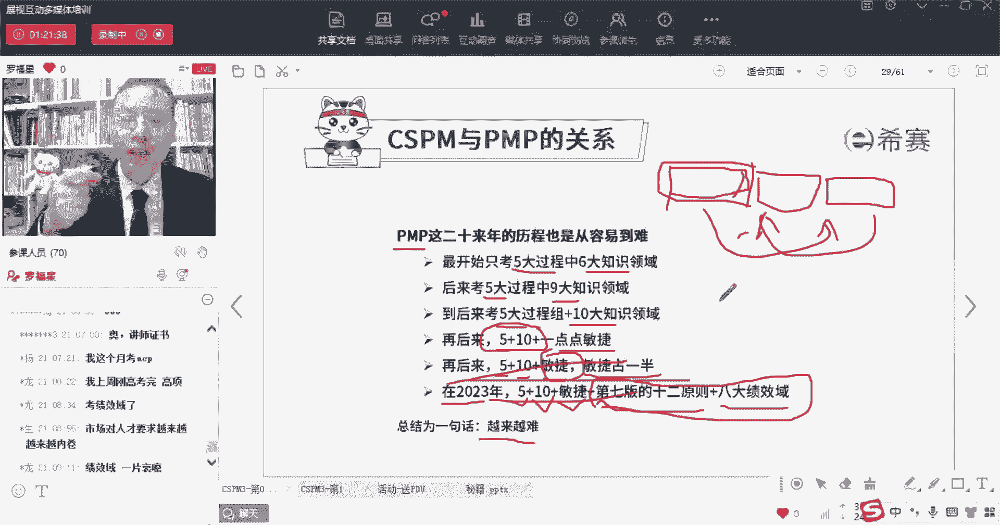
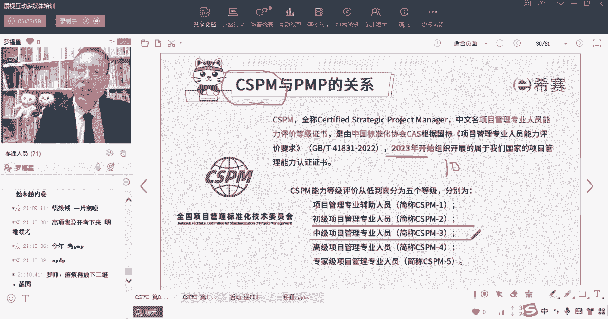
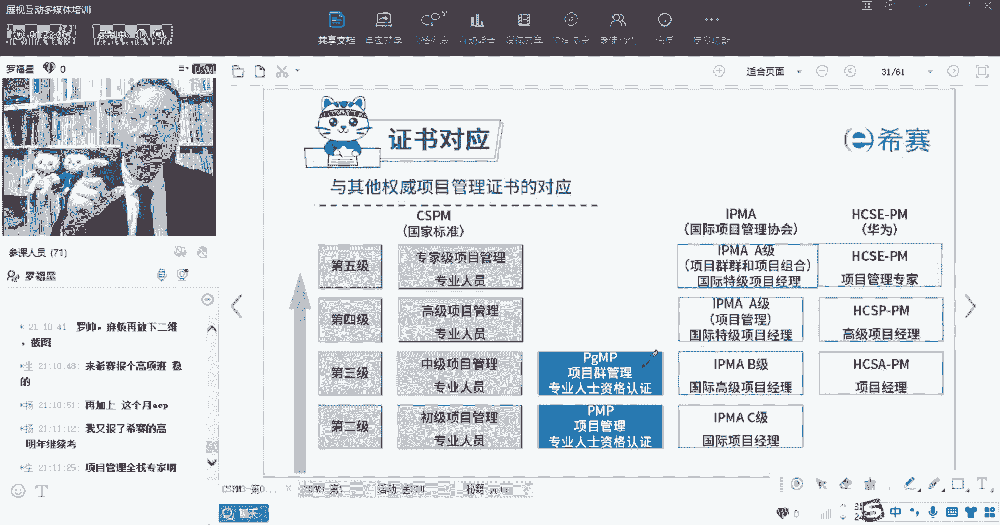
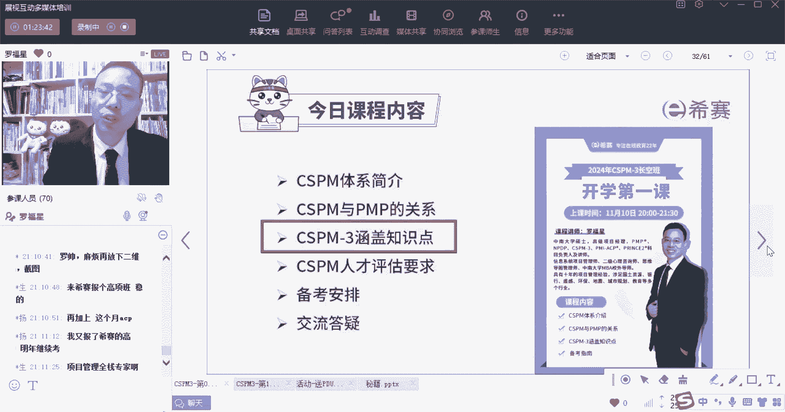

# 【2024年】CSPM-3项目管理认证精讲视频免费观看！比PMP更高级别的国标项目管理证书 - P2：0-2 CSPM和PMP的关系下 - 冬x溪 - BV1Y1421975P

所以你会发现这里所有东西都是越来越难，在刚刚开局的时候其实是比较容易的，SCSPM它就属于刚刚开局，他是在2023年才刚刚开局，他从6月份的时候开始去启动这个项目，跟那个偏僻互认。

然后拿到偏僻的这个认证证书以后呢，就可以去开展二级的认证，到今年10月份的时候才开始，第一一次的CSPM3级的这个认证，所以我们对一个新式的东西，你需要给他一点点时间，你要相信他的成长还是会很迅速的。

很迅捷的，并且现在呢越来越有这些个，各行各业的项目经理们，项目管理人员们，他会越来越重视，包括国家其实也会很重视，你会发现很多东西是什么情况呢，国外去封锁我们的什么东西，我们什么东西就会发展的特别好。

国外的那些东西和我们的东西，它们之间相互有那么大的一个敌意，所以我们也是极需要开展。

咱们自己的这一项目管理，所以这是他的关系，我是觉得他未来以理论上来讲，应该是会非常有机会，他们的关系，我是觉得他可能就相当于说是，15年以前的偏僻，或者20年以前的偏僻，他差不多是属于这样的一个情况。

所以其实你是有机会的啊，同志们，你们都是有机会。

你们都是最早的一波。