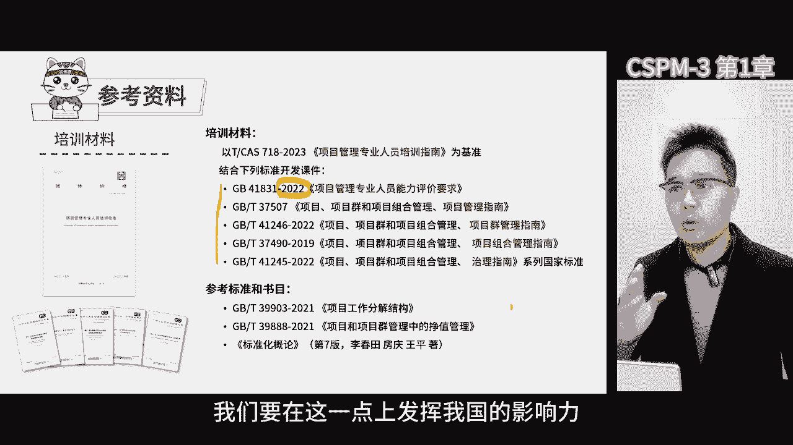
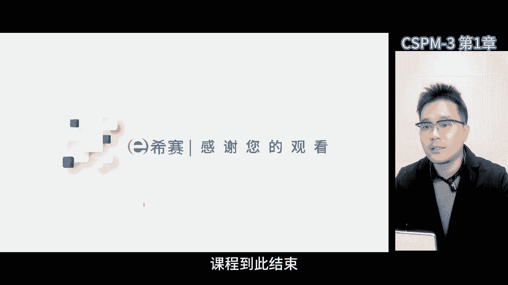

# 【2024年】CSPM-3项目管理认证精讲视频免费观看！比PMP更高级别的国标项目管理证书 - P3：cspm-3 第1章 专业人员能力评价介绍 - 冬x溪 - BV1Y1421975P

第一章项目管理专业人员培训，项目管理的魅力在于，虽然都要项目管理，但是不同的主题行业，国家项目类型和企业的成熟度，都会让项目管理变得千差万别，这需要我们具备一种以不变应万变的能力，来应对不同的场景。

项目是载体，承载的是任务，但项目本身是组织，项目经理需要锻炼的是，如何在不确定创新的环境下，基于非常宏大的目标，带领一群人形成合力去解决创新和突破的问题，这种能力的背后啊，其实是一种借力的能力。

整合大家的资源，共同实现目标，对于优秀的项目经理来说，综合素质能力要求很高，这包括实战能力，我们需要在学习的过程中边学习边实践，将知识转换成能力，无论是干项目经理还是干PO。

都需要锻炼这种实战的能力和提高综合素质，项目管理本质上是一种做人的能力，那学习项目管理，就是用西方的思维来解读如何做人的一种能力，这种能力放在个体身上就叫做个人能力，放在企业身上就是组织能力。

个人需要提升这种能力，以应对外部的环境变化，企业也需要借助各种力量整合大家的资源，来完成这点目标，咱们的课程里面，我试着把我对项目管理的理解跟大家分享一下，三级这个概念，我特别喜欢。

因为在中国的文化里面，三这个数字自古以来就被高度重视，不管是领导讲话还是咱们的三国演义，都体现了三，我们会把企业分成基层，中层和高层，也是三层结构，三这个数字啊非常好，它是五级中一个非常重要的阶段。

也就是从理论走向实践的关键一步，我希望在这个阶段大家能够有所突破，实现质的变化，从职业化的项目经理走向，能够勇敢面对各种挑战，解决问题的实战性，项目经理三级的内容很多，总共分这13章。

为了节约大家的时间，我会尽量把重点给大家讲明白，帮助大家形成整体的认识，每个章节的核心内容都会涉及到，但是课后大家还需要花很多时间去消化它，大家都考过PMP，对于项目管理的基本概念和工具技术。

应该有点了解了，我们这次呢不是重新学习基本的工具和技术，而是想办法把经验和所学的整合在一起，实现能力提升，这就是我们学习的目标，这是整个13章的目录，大体给大家简单说一下。

第一章主要是让大家了解标准化课程的背景，我们后面要学的课程和认证，都是从这个背景下来讲的，所以提前了解是很有必要的，第二章重点要给大家介绍人员能力的评价要求，因为我们培训和提升能力都是按照国标来做的。

所以这个评价的要求一定要给大家讲清楚，第三章，项目经理的角色定位是一个不断变化的过程，从一级到五级，每个晋升阶段都有质的变化，这种变化不只是量的积累，而是需要颠覆自己以前的认知，甚至推翻以前的成功经验。

这样做的目的是，让我们站在更高的视角和平台上，去处理更大的事务，第四章，第五章，第六章以及后续的章节，项目经理需要重点提升能力有所不同，虽然项目管理专业人员，需要掌握17个知识领域和29项能力指标。

但这每一个等级的侧重点是不同的，实际上等级越低，需要学习的内容越多，就像我们从初高中到本科硕士博士的学习过程，越来越专，研究的领域也越来越小，在第三级，项目经理需要关注商业论证。

项目的价值和目标计划等方面，其中项目管理计划和项目进度计划尤为重要，此外还涉及到了向目标的制定，收益导向，资源管理，风险管理，变更管理等方面，向上管理是项目经理晋升的核心逻辑，为了解决向下管理的问题。

需要借助领导的力量来管理团队，汇报是向上管理的重要途径，得到领导认可的人大多擅长汇报，因此汇报技能的专项训练非常重要，在第13章项目管理的标准化方面呢，也是非常核心的点，标准化是项目管理一个重要领域。

项目经理需要了解相关的知识，并参与和制定企业标准，标准化的概念和组大家一起制定规则的过程，与项目管理一样，制定标准能够统一大家对于事情的认知，有助于项目管理，总之项目经理的角色定位是一个不断变化的。

能力提升的过程，从不同的等级晋升中，我们需要颠覆自己的认知，掌握更多的知识和技能，在实际的工作中，我们要关注上论证啊，计划呀，汇报等方面，并不断地提升自己，做好向上管理，同时了解标准化的知识。

参与制定标准，以便更好地组织和管理团队，那今天咱们就从第一章开始讲。

第一章作为整个课程CPM认证部分，我觉得有必要给大家详细展开讲，首先咱们全国项目标委以及项目管理，专业人员能力评价工作，它的背景是什么，发证机构又是谁，这其实很重要，首先我们来说说这个标准化，实际上。

我们在国家标准化管理委员会的领导之下，进行工作，那国家标准化管理委员会，以前的全称是中国国家标准管理委员会，以及国家机构的改革之后呢，他的职责被纳入到了国家市场监督管理总局。

但是国家标准化管理委员会的牌子仍然保留，不过所有的国家标准，都是由国家标准管理委员会发布的，他们负责制定审议标准化政策，发布各项标准，开展强制性标准，对外的通报，协调指导监督行业和地方团体的标准制定。

并代表我国参加国际标准化组织，比如说国际电工委员会等等，国家标准化管理委员会，是我国标准化工作的最高组织，现在在国家层面也受到了很大的重视，需要注意的是，虽然现在他的职责被国家市场监督，管理总局监管。

但从名义上来说，下面有很多个标准化技术委员会，那其中一个就是全国项目管理，标准化技术委员会，它的编号是第343个技术委员会，还有其他的标准化技术委员会，每个委员会负责制定相应行业的国家标准，规范。

不同的技术领域，中国项目管理标准化技术委员会的编号是SCTC，343，那全称是国家标准化管理委员会，全国项目管理标准化技术委员会，这个委员会是在2008年，由国家标准化管理委员会批准成立的。

主要负责全国范围内项目管理领域标准化政策，规划制度的制定，研究标准化体系制定和实施，国家标准推广，国际交流和合作，人才培训和评价，科研课题的研究，项目推进等技术工作，全国项目管理标准化技术委员会。

包括人才的培养与评价，由国家标准化管理委员会直接管理，这个委员会是国家标准化管理委员会的一部分，里面还有一个组织啊，中国标准化协会负责全国项目管理。

中国标准化协会可是一个了不起的组织啊，它是一个一级社团，也是我国唯一的标准化专业协会，之前他隶属于国家标准总局，标准总局，也是政府部门，总局成立的同时也设立了标准化协会，从协会的角度去组织大家研究。

制定标准和推广标准，中国标准化协会成立于1978年，受到国家质量监督管理总局，和国家标准化管理委员会的指导，一级协会，对我国标准化进程有着巨大的推动作用，中字头的标准化协会有下设了很多，不同的分委会。

负责在各个领域推动标准化，我们有一些国家标准是根据国际ISO标准，转化而来的，所以要了解一下这部分内容，全球主要有三大国际组织，分别是ISO国际标准化组织，IEC电工协会和ITU电信联盟。

其中大家最熟悉的是ISO国际标准化组织，ISO是这三个里面成立最早的。

但其项目管理标准化技术委员会，也就是TC258成立于2011年1月，这个技术委员会是ISO，第258个技术委员会，当时由英国标准协会和美国项目管理协会，联合提议成立这个委员会。

其推出的国际标准都是以215开头的，如ISO21500标准足，我们标准里面也有ISO21502，还有21503，21504~21509等等，委员会运作采用的投票制，全球重要的国家，比如说美国，韩国。

德国，法国，中国，英国，日本等，都是P成员，制定标准时，各国投票表决，采纳或者不采纳，每个国家只有一票，无论国家的人数是多少。

全球一些知名的协会，比如说美国项目管理协会PMI，大家比较熟悉，还有国际项目管理协会IP ma等等，作为联络组织参与标准化技术委员会，他们提供方法论和知识派专家参与，在决策的时候也不会去参考他们的建议。

因为决策权在国家手中，每个国家只有一票，那这些组织呢发布一系列的国家标准，那这里面的部分国际标准也会被我们采纳，第十次开会是在韩国，那这次轮到在美国开会了，目前呢我们为什么要做这件事情。

是要打造我国自己的标准，提炼出独具特色的项目管理方法，因为这项管理技术啊，在我国已经发展快30年了，在这个过程中，有很多的企业专家学者已经在实验中，融入了我国的文化。

形成了适合我国的项目管理思想方法和工具，其目标是把大家的实践成果整合起来，形成我国自己的项目管理方法论和标准，然后推向国际，那相关工作其实已经努力了两年多了，那现在非常希望在S上立项。

起草我们的国际标准，在这过程中，可以把对我们国家有利的做法写到国际标准里，用它来约束其他国家，这就是我们的目标，在项目管理领域，我们现在已经到了关键时刻，我们可以做到这一点。

但是这个过程还需要所有人的支持，需要从业者贡献项目管理的经验，包括我们现在做的这个认证培训，其实背后啊依据的标准，就是22年10月份发布的项目管理，专业人员能力评价要求，这个要求是目前全球范围内。

把人员项目管理和能力评价，变成国家标准的标准，现在国内开始培训认证，因为我们需要在国内先把它变成国家标准，这样在国际舞台上立项的时候就更有优势了，代表团计划明年上半年去ISO立项，立项的时候。

ISO首先看的就是普适性，谁提出的提案是否经过了大人口数量的验证，我们国家的标准在国内推广的越好，就越能在国际舞台上立项，那立项成功率也就更高了，那一旦我们在ISO的舞台上立项成功。

我们将组织全球的专家去制定，项目管理人员能力评价标准，这就意味着全球对于项目管理人员能力的要求，规则是由我们组织制定，那很大程度上会引导标准，向有利于我们的方向去发展，那真正厉害的是。

我们要制定全球的国际标准，目的啊，不仅仅是发证，而他希望有一天，我们对项目管理的理解和人才定义的要求，能成为全球范围内的标准，项目管理是一项重要的能力，我们要在这一点上发挥我国的影响力。

首先就是做好人才培训和认证工作，咱们来看这张图，他解释了咱们在项目管理人员，能力评价的运作机构，这个运作机构就是全国项目管理，标准化技术委员会，它是国家标准化管理委员会的一部分，而国家标准化管理委员会。

现在他的职责已经转移到了，国家市场监督管理总局，换句话说，全国项目管理标准化技术委员会，也归国家市场监督管理总局，围绕这个委员会，我们开展了项目管理专业人员能力评价工作，运输处是中国标准化协会。

下面成立了项目管理专业人员评价专家委员会，还有项目管理的专家库，还下设了一个成熟度评估，设在上海标准化研究院，上海标准化研究院，是上海市质量监督局的直属事业单位，但他的首要任务还是为委员会服务。

隶属于国家标准化管理委员会，我们还成立了各种不同的工作组，这就是我们背后的运作组织机构，现在的项目管理专业人员能力评价。

主要由一个叫项目管理，专业人员能力评价工作办公室的机构来负责，那这个机构内部有一个简称叫向平办，向平办是全国项目管理，标准化技术委员会的执行部门，因为委员会是集体决策的机构，需要有人来实际操作。

校民办就是委员会的一个办公室，主要负责制定和维护各项制度文件，包括组织考试题目啊，人员的评审，注册信息管理等等啊，同时还负责国内和国际证书的互认等工作。

现在我们有一个向平办在它下面呢，还有一个专家评审委员会，这些专家是我们最早的委员了，也是第一批专家，他们可是经过精挑细选找出来的，靠着委员会，我们确定了所有人员能力评价认证的政策呀，标准啊。

比如说开展人员评价工作的具体细节，都是专家们一起商量制定出来的，那后续发展还会有很多人加入啊，这也是一个逐步扩大的过程，能力评价的事儿，首先是根据我国国家标准化发展纲要来的，大家都符合基本要求。

然后分五个等级，这五个等级也是按照国家标准来的，不同的等级有对应的关系，那这次主要讲中级，也就是三级的要求，主要是学历年限，专科需要6年项目管理工作经验，本科需要满5年，双学位需要满3年。

研究生需要满3年，那取证的阶段呢需要材料评审。

笔试和面试，一级和二级都是选择题，三级没有面试，全是笔试，那考试中10%是选择题，40%是论述题，这对大家在不同场景下的论述能力，有一定要求的，等到了四级，选择题占40%，论述题占60%。

那五级基本上都是面试了。

证书是中国标准化协会改的，但实际上就是全国项目管理标准化技术委员会。

那全国项目管理标准化委员会，这章呢是干在第五级专家级证书上的，我们的项目管理工作啊，相当于第一批创新实践，在这个过程中，我们需要分批学习掌握相关标准要求，因为这是未来人才培养的一个关键。

这些标准要求啊以国家统一规定为基准的，避免了不同的企业行业部门各自为政的现象，只要达到国家标准，无论你是政府，军队还是其他组织，都必须要遵循，作为项目管理专业人员，我们希望大家按照统一的国家标准来学习。

理解和执行，这样才能让国家像一盘棋一样统一有序，CSPM与软考相比啊，软考主要是信息化方面的内容，而我们的目标是将项目管理发展成一个行业，一个技术，一个专业领域。

国标首先约束是所有走项目管理专业序列的人，未来无论是谁发放项目管理相关证书，都必须要按照国家标准来，换句话说，没有人可以超出国家标准去做事情，只能在国家标准的统一要求下，结合各行业的特点进行细化和解读。

国标在我国是最高的要求，就像上级单位对下级单位提出要求，下级单位需要在上级单位的框架下进行调整，过去有些单位因为上级单位的要求没出来，自己制定了很多要求，当上级单位的要求出来了。

那下级单位就需要按照上级的要求进行调整，这个过程是有一个周期的，国标出来是很重要的事情，它意味着全国范围内，任何与项目管理相关的东西都必须符合国标，国外证书引进，你也得符合国标，否则你就不让引进。

那在我国一定是按照统一的要求，不能让你扰乱市场，那这个过程的背后，是一个需要大家逐步适应和调整的过程，这个过程也需要时间，无论是国家层面还是企业层面推动改变，都是需要花时间的。

国标正式发布是去年10月份，这个过程啊，需要周期，可能10年后回头看，我们现在遇到这个问题啊，其实是注定会发生的，比如认证将来可能会和职称人才引进，企业晋升和任职资格挂钩，这都需要时间。

那国家标准落地推广也是必然的，那公司发布要求新的规章制度，它不也需要时间落地吗，那在这个过程中，我们不能只靠一部分人，需要大家共同努力来开辟新的赛道，那符合国家的发展方向，那今天来培训的各位。

就像是第一批走上了新赛道的领先者，前面有很多的空白，我们需要不断的去学习，不断的去壮大，这个过程既符合国家的政策要求，也符合发展方向和改革方向啊，总之啊成为第一批走上新赛道的人。

对未来的职业发展有很大的帮助，在任何领域能成为第一波人啊，而且是成功的人，都是非常值得炫耀的资本，那这件事情啊非常有价值，这是今天的思维导图，大家可以暂停看一下。

