# 【2024年】CSPM-3项目管理认证精讲视频免费观看！比PMP更高级别的国标项目管理证书 - P7：cspm-3 第5章 项目目标与计划 - 冬x溪 - BV1Y1421975P

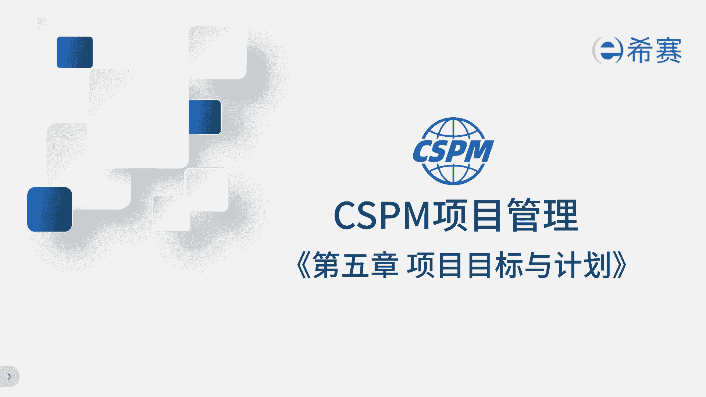

第五章项目标与计划，上一章讲的是项目的论证，它是解决为什么要做这个项目的问题，而本章项目标和计划，则是解决项目团队应该怎么做这个项目的问题，尤其是怎么实现项目的成果，项目认证。

关心的是做这个项目的价值和回报是什么，而项目目标和计划，则是从项目执行团队的角度去看待问题，关心到底要完成哪些工作和任务，才能实现预期的目标和成果，那通常领导们先要想明白，做这个项目的理由和价值。

然后再派给项目经理和团队，规定时间和成本要求，实现相同目标，这两章都非常非常重要，放到一起呢，逻辑更强，更容易理解，在项目标和计划这一章里，我们通常会明确目标计划的三个步骤。

首先在确定目标之前要进行需求分析，因为没有需求就不好确定目标，接着要基于目标进行分解，制定计划，最后在项目执行过程中进行管控，确保整个项目的目标和计划得以实现，需求分析目标制定计划，制定管控。

构成了咱们这整个章节的内容。

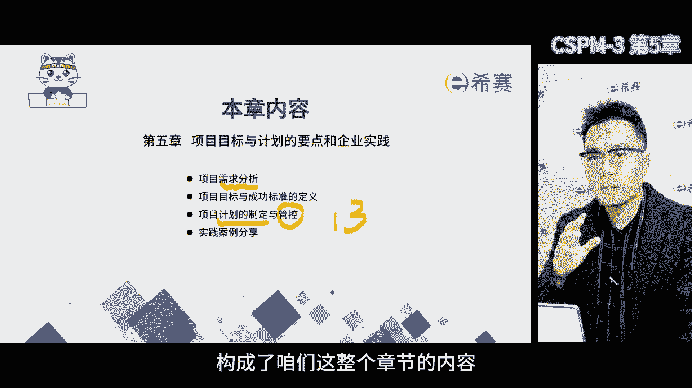

首先做需求分析这一步啊非常的重要，肯定要对客户进行需求的收集，收集需求呢不能光靠自己拍脑袋，得去找客户，用户去了解他们的想法，在项目管理过程中，项目经理要保证需求分析的结果准确无误。

这样才能确保项目标明确精准，那说到这里呢，要提醒大家，项目经理可是主要负责人，得确保我们准确地捕获到了每一个客户的需求，需求分析的方法有很多，比如说头脑风暴呀，焦点小组访谈啊等等。

那当我们去收集需求的时候，要同时考虑到优先级的评估，比如说优先级的排序，因为很多时候收集了一大堆需求啊，但实际上我们没有办法在有限的时间和资金内，完成这么多，这种时候就得对于需求进行优先级排序。

把最重要的最紧急的需求先纳入到项目范围内，不那么重要的，往后放一放，排一排，只要有需求收集，就得有评估和优先级排序，所以在做需求分析的时候，一定要考虑这个层面。

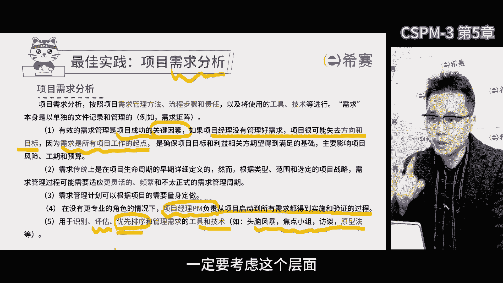

其次根据需求确定目标，我们会发现需求跟目标是两码事，那目标英文是objective，是项目结束时的事件，但目标不是只有项目，有企业日常的经营，总会有各种各样的目标，考核目标，战略目标，运营目标。

部门目标，各种目标，但是与企业目标相比，项目标有特别之处，项目的目标它典型的特点是通过产出，应用结果和收益的组合来实现项目标的，那项目的目标可能是交付物，也可能是交付落地后的结果。

还有可能是最后的预期收益，但实际上来说啊，按照之前讲的商业论证，它理论上这三点都要包括在内，那站在公司战略的角度，三者缺一不可，没有项目的产出将来就没有给用户用的东西，那客户没有用，那更不要说发挥效果。

也不要说能带来什么收益了，所以首先既要形成交付物，还要推动用户，使用使用完之后呢，再测量到底带来什么样的收益，最开始把项目的目标定义得越清晰，越精准，会越有利于实现预期的收益。

特别是项目投资方所需要的收益，再一点，因为项目具有独特性，有很多项目它的过程是类似的，但是项目的预期结果完全不一样，一般认为，项目管理是一种典型的目标管理的方法，换句话说。

我们一般认为项目的目标它是不一样的，比如说很多工程项目施工过程差不多吧，软件开发，项目开发过程也差不多吧，产品研发研发过程也差不多吧，但是他们会受到很多因素的影响，从而导致目标不同，在项目管理过程中。

一定要先去收集需求，再确定目标，我们是基于目标做分解工作，分解结构嘛，WBS好分解的目的是为了方便我们去打包，把工作派出去之后，我们定义不同的活动之间的依赖关系，行程最短的进度计划。

便于项目经理做日常管理，在这里面我们一定要充分的注意到一点，项目即使过程相同，但是项目的目标，也会因为客户的需求和基本条件不一样而不同，我们要充分的注意目标的这个特点，当我们描述项目目标的时候。

我们需要考虑各种因素，这些因素呢会对项目的目标产生差异，比如说背景啊，落地的效果呀，提供的输出好，相关方使用资源的多少，项目的复杂程度限制条件，包括实现目标的过程方法。

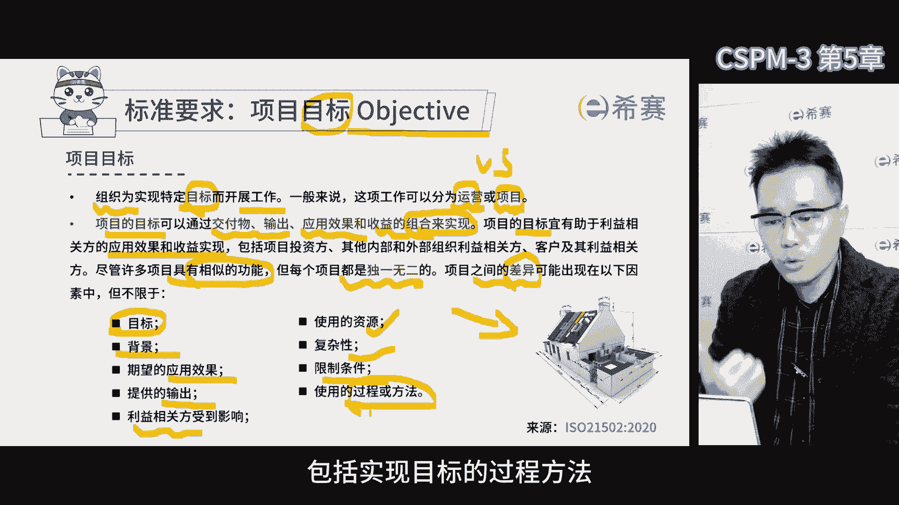

那作为项目经理要考虑周全，才能把目标定得更清楚，学pp的时候，我们都知道项目的目标必须能够测量，这样我们才能知道目标到底有没有达成成果，好不好，通常我们会用smart原则来定义项目的目标啊。

这样明确具体可测量，而目标还必须是可以实现的，不可衡量的目标呢是没有办法确认的，也就不知道达没达成啊，目标的绩效指标跟其他目标有一定的关联，要考虑好，对于时间一定要有截止日期，除了项目标。

我们还得定义项目的成功标准，要知道怎么做才算成功，不同的项目和不同的领导，对于成功的标准是不一样的，传统的项目成功标准是范围进度成本，俗称铁三角，但是现在我们发现，项目成功不仅仅依赖这三重约束了。

因为相关方越来越多，对于项目经理要求也越来越高，我们不仅仅要在规定的时间，规定的范围，规定的成本内实现目标，还得考虑资源风险，更重要的还得考虑项目的价值，让相关方满意，支撑组织的战略目标。

这时候我们对于项目的成功标准呢就提高了，那这些内容对于第三集的项目经理，要求越来越严，而且占比越来越大，以前做项目的时候，我常说啊，项目的成功标准有三层啊，第一层叫项目经理。

个人的成功就是项目过程符合公司规定，同时达到了多快好省的目标，多快好省的背后就是时间范围，成本质量唉，咱们再加上过程符合要求，这是项目最初级的目标，如果想要达到第二层级的项目成功。

那就是项目利益相关方都满意，团队也得到了成长，得多考虑人的因素，让相关方都满意才行，要是项目完成了，结果却得罪了一批人，而客户客户不满意，领导领导不满意，团队团队不满意，那以后谁还敢跟你一起做项目呀。

想要做到这一点啊，我们得在项目初期就想明白，各方关心的收益是什么，包括咱们团队成员的，对于团队如果不能给他带来更多的钱，至少能帮助他成长吧，能力提升，技能提升，那也行啊，能在项目中干点。

他原来在别的地方干不了的事啊，利用组织资源，项目的资源，让他发挥一下他自己的天赋啊，做一些想做的事情，能在项目中去提升一些，他认为很重要的能力，对他来说也是收益，那这样。

大家对于项目的关注度和支持度也会加强，当然最好能达到第三层级的成功，就是站在公司的角度，有力地去支撑组织的战略落地，这样的话项目既达到了多快好省的结果，又符合公司的各项要求。

没有违规项目各方又都特别满意，项目团队成员能力也成长了，最重要的是项目成果，有力地支撑了组织战略落地，也就是说对于个人是成功的，团队是成功的，集体来说也是成功的，那这就是我们所说的最完美的项目。

对于这个点，咱们技术储存项目经理啊，一定要注意，管理过程中人的因素非常重要，不能光是把事干完就算完了，关键是得干成令大家感觉是成功的结果才行。

这个很关键，那我们在做项目之前呢，得先把项目的目标成功标准弄清楚，然后再来制定项目的计划，大家现在对这个词呢应该不陌生了啊，计划，那不过项目计划其实它是分成两种啊。

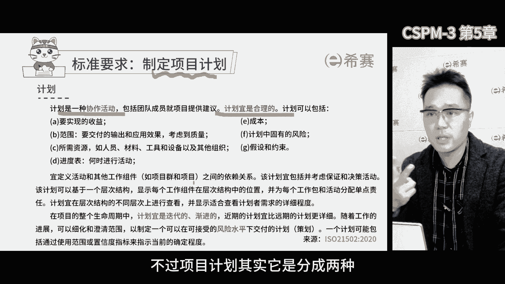

一个是项目管理计划，还有一个是项目计划，这两种计划都得考虑周全，项目管理计划说白了就是一份管理文件，这份文件告诉我们项目该怎么开展，怎么控制，这个计划可以整个项目都适用，也可以只用于项目的某个部分。

比如说风险管理计划，质量管理计划，这些都算子计划，项目管理计划会明确项目中的角色职责，组织结构以及可能遇到的风险问题的管理规则，还会规定进度费用沟通技术状态管理质量，健康环境等方面的管理要求。

所以项目管理计划，本质上就是一份规定了项目中，各项管理要求的文件，那项目管理计划为什么也叫计划呢，因为它有一个时效性，只适用于某个特定的项目，它不能作为一个制度，虽然看起来特别像一个制度。

那通常项目关计划，也是以word文档的形式展现出来的，那里面规定了项目中，大家要遵守的各种管理要求，项目计划呢一般指的是项目的进度计划，那这个计划更多的是关注大家如何协作，配合完成工作。

比如说我们要先把项目的工作，分解成一个一个最基本的工作包，然后识别出完成这些工作包所需要的各项活动，定好活动之间的依赖关系，再找到关键路径，这样我们才能制定出项目的进度计划，所以我们在做项目的时候。

这俩计划都要做，要制定管理计划呢，帮助我们建立整个团队的过程中，需要遵守的管理要求和秩序，如果没有项目管理计划，那团队有可能会各自为政，没办法齐心协力了，那除了他还要去制定项目计划。

项目计划则是用来指导项目中不同的相关方，特别是团队成员何时何地开展什么样的工作，这样我们才能更快更好地实现项目标，并节省资源啊，如果没有项目计划，那我们就不清楚了，按照什么样的活动顺序配合协作。

制定项目计划的时候，我们要倾向于基于产品规划技术来制定，那这个逻辑大家应该比较熟悉了，一般来说确定项目最终交付成果，然后将产品进行结构化的分解，这个分解主要是面向交付和可交付成果的分解。

分解出来主要是名词，以交付成果为主，不能是一堆活动，如果分析出是一堆活动，那就变成流程分解了，不需要工作分解结构，真正的项目分解应该是目标，分解目标应该是名词分解出来，交付物也是名词。

之后需要定义每个分解出来的子目标是什么，这就是产品描述，再之后呢，需要确定在实现项目产品的整个生命周期中，哪些分解出来的目标应该先做，哪些应该后做，这就是产品流程图，当这个定义被清晰之后。

项目经理就应该把项目的不同产品，以工作包的形式分配给工作包负责人，咱们俗称小组长，这些负责人呢通常也是项目中的核心团队成员，到这一步啊，就是基于活动的规划了，那核心团队成员领到工作包后。

应该去识别完成工作包所需要的活动，并定义这些活动之间的依赖关系，估算完成工作包所需要的时间资源之后，当工作包负责人把这些东西估算完，应该把工作包的结果，包括时间资源报给项目经理，项目经理再进行整合。

那通常它要形成整合之后的计划，整合之后的进度，计划往往会通过甘特图的形式进行呈现，之后经过一番讨价还价，项目经理跟工作包负责人达成共识啊，必须在规定的时间，规定的成本内完成工作。

最后把结果报给项目管理委员会评审，如果通过了，就形成项目的基线文件。

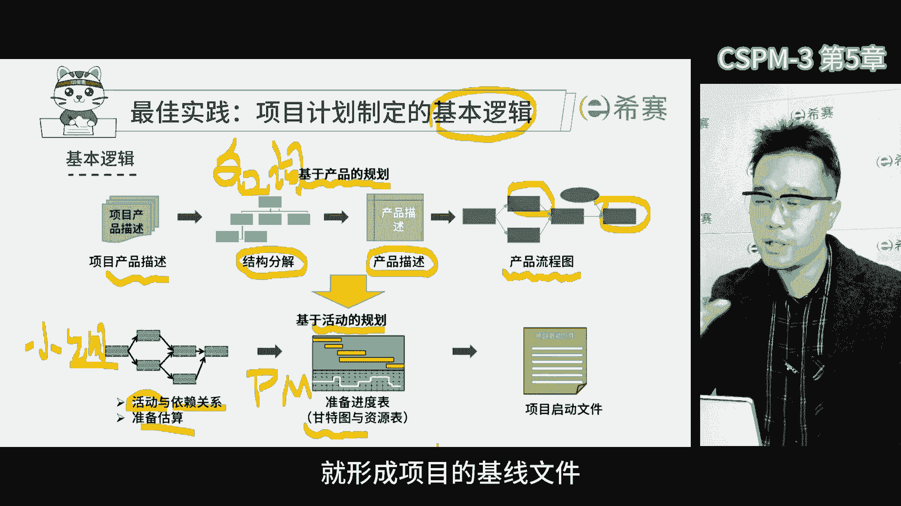

这个过程一定有一个非常重要的工作，在我们国际标准体系中，它也是非常重要的要求，在咱们国家自己的认证体系里面也非常重要，大家也非常熟悉啊，就是工作分解结构，就是将项目和项目群的工作范围。

一层层分解成更小的工作单元，形成一个分解结构，在这个结构里面有很多具体的要求。

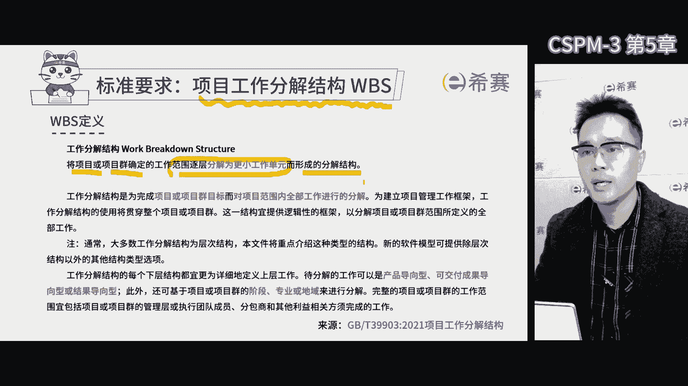

比如说要遵循百分之百原则，就是说工作分解结构中，所有的交付应该包括我们项目的所有交付，我们做的项目中，所有的活儿带来的结果，应该在工作分解结构中展现出来，如果活没在复建结构中。

那说明我们干的活儿在范围之外，那人家可能不会给你付钱，工作分解出来的所有交付的集合，就是我们说的项目的范围，工作分解的乐器范围边界越清晰，工作分解越粗，那边界一定会越模糊，就容易出现像刚才说的。

你干了不该干的事，那别人不给你付钱，咱们俗称范围蔓延或者叫镀金，工作分解有很多方法，比如说这个例子啊，汽车例子可以分成汽车系统工程，然后有系统测评数据等等，那除了这些。

我们通常还会把分解出来的子目标或产品，分成两类，一类是专业产品，一类是管理产品，项目管理属于管理产品，它不是最终交付的组成部分，但是它是我们在开展项目过程中需要做的，管理工作。

管理工作中需要产出的可交服务，比如说文档啊，都称之为管理产品，所以项目管理也需要一些交付成果，比如说项目计划，项目章程，项目管理计划，项目组织结构，还有风险登记单，质量登记单，问题登记单等等。

这些都是项目的管理产品，除了管理产品啊，我们还要考虑专业产品，比如在汽车项目中，我们需要考虑系统，工程和数据等等这些专业产品，如果没有这些专业产品，那最后我们的汽车项目就完成不了了。

那所以在分解工作的时候，我们需要考虑专业产品和管理产品这两大类，比如我们这个防务系统项目，它里面包括了主要的设备系统，工程系统测试，还有项目管理和综合后勤支持，在一层一层往下拆解到合适的颗粒度。

如果我们在做一个线上购物系统，那这个软件系统呢可以分为软件，平台管理和行为改变管理，可以分为流程和角色职责，行为改变，可以分为用户引导和员工培训，这一层一层的就是每个层次拉开，从粗到细。

这就是工作分解结构它的一个特点，这些其实也是一种分解方式，工作分解的形式有很多种，将来有机会给大家好好的详细展开讲吧，因为工作分解也是一门学问，而且发展了几十年了，实际上它形成了很多专业。

在我们制定计划的过程中，工作分解做得好和不好，很大程度上会影响到咱们项目计划的精确性，为什么要重视整个项目的分解结构。

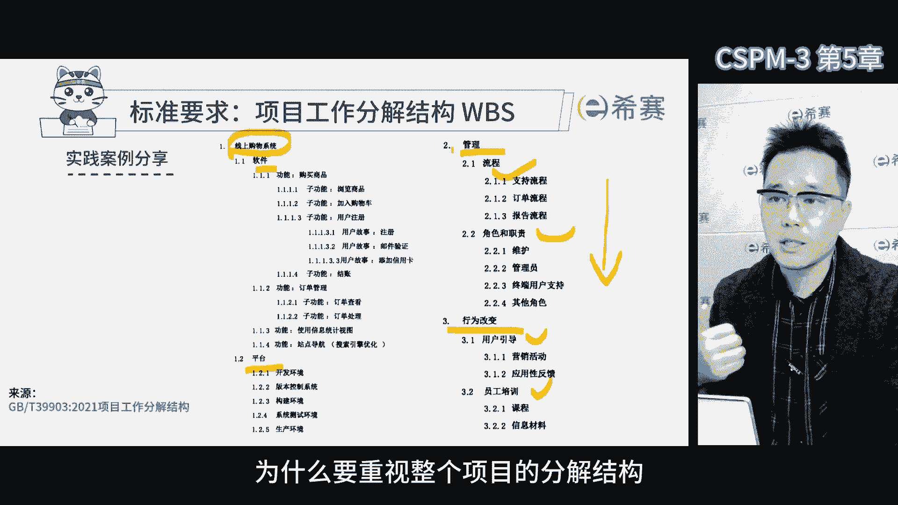

我们拿这张图再给大家做一下解释，就是工作分解，在整个项目的计划制定和进度控制中，非常非常的重要，在这里呢我们看到，通常当我们制定项目进度计划的时候，不管是管理计划还是进度计划。

最开始第一项工作应该是确定项目的整体目标，大家注意目标要结合上级单位分派的任务，形成整体目标，基于这个整体目标，我们要去设计和建立项目的组织结构，先把人搞定，同时根据我们最终要达成的目标的时间点。

倒排工期，确定过程中的重大里程碑节点和决策点，那前面这三部分都应该写在项目，早期的论证文件里面去，因为这三个内容比较核心，领导是非常关心的，有了这三个之后呢，我们就用到了规划工作，第一件事情工作分解。

我们把整个目标分解成此目标，分解成此目标，子目标往往代表了不同的子交付产品，基于这些不同的子交付产品，就从前面的组织结构里面找到工作，包负责人，相当于各自认领不同的子目标，形成咱们的责任分配矩阵。

再换句话说就是大家一块把这项目的活给分了，但是我们分的不是活，分的是项目中的不同的交付物，每个人各自认领几个交付，形成责任分配矩阵，每个人认领之后，他们就应该去估算各自工作包，所需要的时间和资源。

在这个过程中，他们应该去识别完成工作包所需要的活动，并且依据活动定义活动跟活动之间的依赖关系，就形成了网络图，接着我们应该采用关键路径法或者关键链技术，去找到最佳进度路径之后，再报给项目经理。

项目经理参照报过来的每一个工作报的工期，并且有了他们之间的关系，这个时候就形成了甘特图，横轴是时间轴，纵轴是不同的工作包，项目经理就知道每个工作包啥时候开始，啥时候结束，哪些串联，哪些变形。

有了干涉图之后呢，最大的好处就是项目经理能知道哪些活儿，大家能同时干，那同事干的时候就会在某一个节点，对人力资源的需求变得特别大，就会产生人力资源大配置，基甘特图的项目经理，他就能更加精确的判断。

人力资源的高峰时期是哪个阶段，如果我们发现现在人力资源没有办法支撑，那么多工作包的变形，那就考虑资源的平衡，把它拉成串行的，考虑了人力资源整体情况之后，接下来就要考虑费用，工作包负责人。

它是以各自的工作包为单位的，相当于在项目管理过程中，只估算了工作包所需要的资源啊，就是人财物，但是咱们做预算的时候啊，是财务部门，他并不关心每个工作包所需要的人财物，他更多的关心的是财务的科目。

这个时候他需要做一次费用的归集，需要把以工作包为单位估算的人财物，再按照财务的口径重新进行分类和归集，做预算审批，审批之后，我们就有了预算，预算一到位就立马进入到实施阶段，那实施过程中。

我们需要按照预先制定的计划去开展工作，并在执行过程中进行偏差分析，随着时间的推移，项目所花费的成本也在逐渐的增加，那这个时候需要进一步更深度的偏差分析，一定会用到过程控制中最常用的工具，增值管理。

增值管理其实是关注项目绩效的核心问题啊，简单来说呢，在实践中我们不仅仅要关注时间和成本，更要关心项目的绩效，我们真正关心的是在单位时间内，单位成本完成工作的百分比，这是我们要监控的东西啊。

那如果单位时间，单位成本内完成的百分比越来越大，那说明我们的绩效越来越好，能效越来越高，如果越来越少呢，说明项目绩效越差，增值管理要解决的问题是，根据偏差系数预测整个项目完工时的最终偏差。

包括时间偏差和成果偏差，如果偏差太大，我们就要及时进行变更和调整，实在无法纠偏时，我们需要启动变更程序了啊，大体上就这些过程，在我们国家标准中，对于项目计划和管控过程也有类似的要求。

前期我们需要花费大量的时间制定进度计划，包括我们进度计划应该与战略保持一致，机动计划会有各种不同的类型，对于我们来说，基于特定目标倒排工期，确定过程节点，是一种预测型的项目管理方式。

但实际上项目计划不仅仅有预测性的，还有迭代型的，增量型的，敏捷型的，混合型的等等多种形式，无论哪种形式都是可以的，不管是哪种计划，它都要进行管理过程中需要做批差分析，而前期则需要设定基准线。

敏捷型的计划也需要有基准线，预测型的更得有基准线，那对于我们来说，基准线是可以进行调整的，也可以进行迭代，但在整个过程中一定要做好评价分析，咱们预测型的项目管理过程中，控制主要担心的就是失控了。

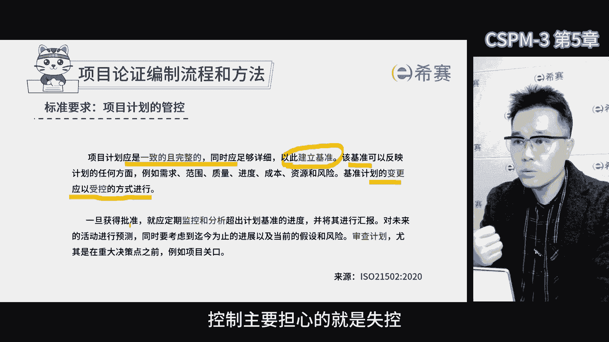

如果项目过程出现失控，我们就得进行变更评审，那变更评审就由变更管理控制委员会，CCB来负责，变更评审的核心在于，如果平差变得太大了，就需要启动变更评审的流程，这个流程第一要有具体的流程，有方法，有规则。

第二要召集决策成员啊，就是变更控制委员会，当然在制定项目计划的时候，我们也要考虑如何对变更进行控制，因为在项目过程中啊，遇到意外情况产生偏差是非常正常的现象，这是无法避免的。

我到现在为止都没见过哪个项目没有变更，所以大家要注意啊，项目过程中遇到的风险和变化以及偏差，几乎是可以确定的，如果项目过程中一点偏差都没有，那这个项目也太没挑战性了啊，就不应该当项目来管。

但凡让我们当项目来管的过程，肯定有很大的不确定的因素，那我们作为项目经理，从一开始就不要害怕风险和变化，从一开始就做好迎接风险和变化的准备，这样才能体现我们项目管理价值啊，咱们自己才有存在感。

所以对于项目经理来说，从一开始我们需要预测到，项目过程中会有偏差变化，甚至会超出预期，那我们从一开始就能准备好，万一超出预期了，我们找谁来评审，找谁来拍板，找谁来决策，这个变更控制委员会啊。

就起到了代表所有项目相关方的关键作用，他们来判断变更是否必要，是否对于项目产生积极的影响，我们需要集体决策的组织来做这个决定，项目是需要大家齐心协力一块儿开展的工作，那决策也需要大家齐心协力一块做。

变更决策也需要大家齐心协力一块做，这样做对了是大家的功劳，做错了也是大家的责任，我们避免让某个人单独做决策，说白了那单独背锅嘛，所以在过程中啊，便跟评审也需要大家一块来决定是变还是不变。

如果大家都认为需要变，那就变呗，那如果大家觉得达成不了共识，那就维持原样不变，完事了，项目经理更多的工作是要对各种变更的选项，提供利弊分析，帮助变更控制委员会，集体决策组织尽快做出决策。

所以计划的管控要跟变更关联起来。

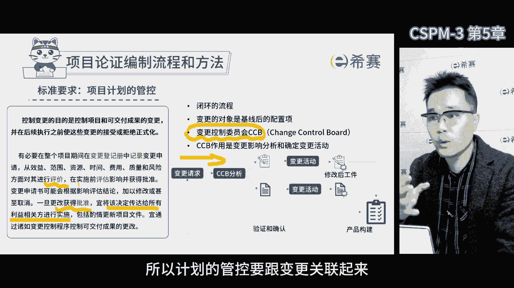

那本章内容就这些了，那现在我们简单的回顾一下，在探讨整个项目目标和计划过程中，我们提及了几个重要的信息，首先要制定项目标，我们必须要先进行需求分析，明确项目的需求以及优先级后。

我们才能更好的去开展后续工作，项目经理在这个阶段起到关键作用，他需要收集各种客户用户的需求，并组织团队确定最重要的项目标，在确定项目目标的时候，我们还要考虑smart原则，即项目的目标是可以测量的。

明确的，可实现的和相关的，接下来我们需要制定项目计划，项目计划分成两类，项目管理计划和项目进度计划，项目管理计划解决了项目过程中，所有人需要遵循的管理要求，而项目进度计划。

则决定了我们如何按顺序开展工作，以确保项目按时完成，在制定项目计划时，我们要考虑各种产品规划和技术的逻辑，此外工作分解结构呢在项目中非常重要，它需要遵循百分之百的原则。

可以用各种不同的形式展现在项目执行过程中，可能会出现变更，因此在制定项目计划时，我们应该建立变更控制的机制，以便在遇到变更时能迅速的应对啊，这样无论在进行偏差分析还是在应对变更时。

我们都能更加从容的去处理相关的流程，并尽快做出决策，总之呢整个项目的目标和计划的内容啊，就包括了项目的需求分析，确定项目标，制定项目计划以及管控变更，通过这些步骤，我们更好地规划和管理项目。

确保项目的顺利完成。

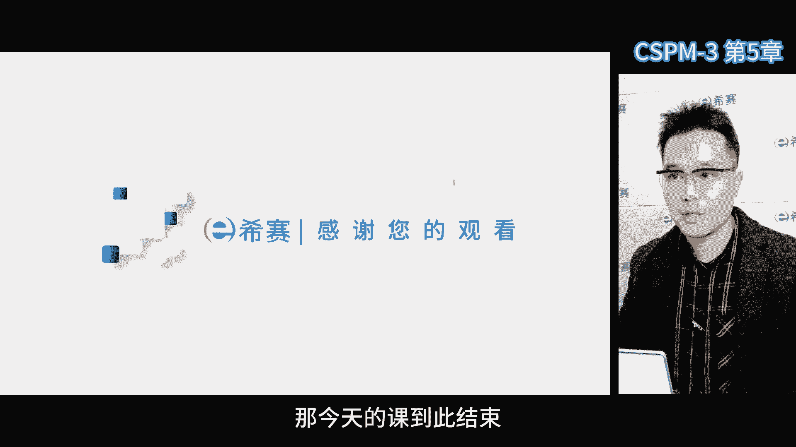