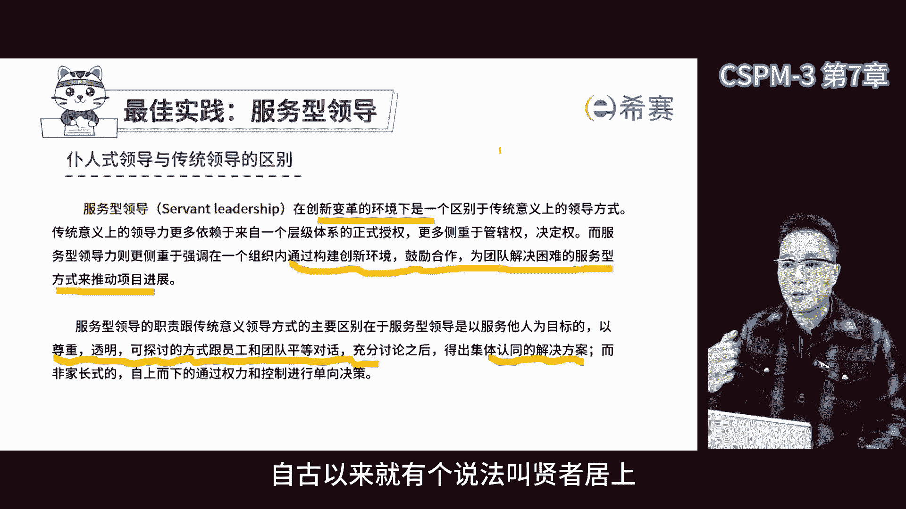

# 【2024年】CSPM-3项目管理认证精讲视频免费观看！比PMP更高级别的国标项目管理证书 - P9：cspm-3 第7章 项目资源管理 - 冬x溪 - BV1Y1421975P

第七章项目资源管理，项目资源管理其实是有一定难度的，因为在项目管理的工作中，一项重要的事情就是要省资源，用尽量少的资源，咱们上节课讲商业论证的时候，也提到过，项目的价值，就是在实现项目的产品成果和收益。

但咱们一般认为，项目管理的价值，是让项目团队用更少的时间和更少的资源，去实现更令客户满意的产出成果和收益，所以项目管理的价值在于缩短交期，降低资源的投入，那这么一来。

项目资源管理在项目中就显得非常重要了，因为资源管理管不好，很大程度上决定了能不能体现出，项目管理的价值，不过啊说到资源管理，首先要解决的是项目资源都有哪些问题，项目资源以前呢早年的时候啊。

在pp上资源更多的是偏向于人力资源，但后来随着pp的更新，以及包括ISO标准的更新，我们会发现资源管理的范围越来越广泛了，你看按照我们的标准，不管是ISO21502还是国标41831。

都把资源分为人力物力，财力时间技术物资设备，所以项目资源管理可不简，简单单的只是那么一点儿事儿，需要好好的去规划和管理啊，一起来看看标准的要求啊，资源管理的目的确定在质量和最佳使用方面。

交付项目范围所需要的资源，项目的资源管理应是项目计划的一个组成部分，资源包括人员设施设备材料，基础设施和工具，但管理应包括规划管理和控制资源，以确定实现项目标所需要的资源，数量，质量和必要的优化。

这是国标中的描述，那再来看看ISO里面怎么说的，了解人力资源管理中有关能力，经验，可用性，行为和文化的关键方面，必要时一定义记录和更新资源的要求和属性，如资源的来源，所需时间以及开始和结束时间。

由于不可避免的情况，可能会发生资源可用性冲突，这种情况可能需要重新安排活动，并可能导致当前或后续活动所需要的资源，发生变化，那规划资源呢，一确保在需要的时候可用，并且储备资源，用于及时干预。

适当的预防和纠正措施，好继续易建立流程，以识别重新分配现有的资源和收益，额外资源可能导致的风险和问题，那资源管理的目的啊，就是要想清楚在项目中要用人用物，用什么东西，还有怎么用，这都要想清楚。

就像做菜一样，你要想去拥有什么食材，怎么搭配，怎么做才能把味道做好，资源管理就是项目管理中的一环，得考虑象中用啥资源，用啥人才，用啥物资设施都要考虑进去，要规划好这些资源，让项目能够顺利的完成。

在这个过程中还得不断的优化，看看哪些资源用得好，哪些资源用得不好，然后调整，所以说资源管理就是一个不断规划，管理控制的过程，就像一个闭环一样，那当我们谈论项目资源管理的时候。

我们必须要关注人力资源的重要性，在规划阶段，我们需要优先处理组织问题，建立项目的组织去上搭一个房子，那必须首先要把基础打好，在规划项目组织时，我们需要考虑许多因素，那首先我们要考虑项目的环境和类型。

那不同的类型项目，不同的环境需要不同的组织结构，例如工程行业通常需要监理，这是政策法律规定要求的，此外我们还需要考虑利益相关方的需求和要求，不同的利益相关方会有不同的期望和需求。

这些都会影响到我们设计项目，组织结构时的方式，同时我们还要考虑公司的组织结构，因为公司的组织结构会影响到项目的组织设计，那除了规划项目组织结构之外，我们还需要考虑人力资源的规划选择。

我们需要决定是使用内部的人力资源，还是外部的人力资源，并且要考虑到他们的能力和专业性，同时呢我们还要考虑到法律法规的要求，聘用的期限和时间等这些细节问题，总的来说。

规划项目的组织和人力是一项非常复杂工作，需要考虑很多的因素，但只要我们做好充分的准备和规划，就能确保项目的顺利进行，好的，接下来我们通过具体的例子来聊一聊，关于项目组织结构中的一些问题，首先我们得明白。

只要是搞项目的那种偏矩阵型的组织结构，就是最常见的，那说白了项目不是那种独立的组织结构，但是在企业里面，项目又是不可或缺的，所以会形成这种矩阵型的结构，在这种结构里面，很多人都需要双线汇报或者多线汇报。

弄得不好了，就容易出现矛盾，比如说项目成员如果参与了项目，那他就要同时向多个项目的经理和，职能经理汇报，再比如有些成员既参与了项目，又参与了流程，又干了职能，那这些工作他要同时向流程经理，项目经理。

职能经理汇报，那这么一来的话，如果几个领导都希望他先干自己的事情，那时间不够用的时候，矛盾就来了，而且不同的领导之间的利益诉求，是完全不一样的，也会产生矛盾，这就需要项目成员自己来平衡，这就是难点。

那再一个就是关于项目中人员的问题，项目人员是临时的，可能今天在这个项目，明天就换了那个项目了，那不像大家都在一个职能部门上比较稳定啊，那这么就不容易积累经验，人员一走项目就不可能衔接上。

所以我们在规划项目的组织结构的时候，一定要考虑到备份问题，要随时考虑到人员有可能走的情况，当然我们的目标，那还是希望大家都能稳定下来，尽量不要走，账目中我们一般把每个成员称为角色。

而他们需要完成的任务叫职责，那这点大家要区分开，因为在公司里面，我们通常说岗位，另外项目中的决策是临时的，不像公司那部门啊，岗位啊这样长期存在，同时项目也是有个虚拟角色的。

并且会围绕这个虚拟角色制定相的职责。

给大家举个例子，首先想说的是，不同类型的项目会有不同的组织结构，比如说现在看到的组织结构是华为公司的，华为之前非常知名的组织结构，2013年，华为提出了以项目为中心的组织。

那以项目为中心的组织主要是交付类项目，华为有很多的交付类的项目管理，那么交付类项目管理的组织呢，当时提出了一个C8的组织结构，核心的目的就是把技术型的项目经理，变成了经营型的项目经理。

也就是项目的CEO，这个名头挺大的吧，所以项目经理要对整个项目的经营结果负责，确保客户满意，策划交付策略以及集中项目管理方案，团队安全合规，重大风险决策，那项目经理就变成了有权有责的项目经理。

后来项目CEO就改名为pd进项目总监，那既然叫做项目CEO了啊，那它底下有八员大将，来看一下，像我们的财务技术，交付质量负责人，集成计划管理负责人，供应存货负责人，采购业务负责人。

人力资源管理负责人和合同管理层级的负责人，那这些人相当于接受项目CEO的直接领导，那这么就构成了一个健全的，更有战斗力的项目组织团队了，那这就是华为著名的交付类的项目组织结构，我们再看一个典型的工程。

EPC项目的组织结构，大家可以发现，它和之前的华为那种合同交付的项目结构，有很大的不同，在一个EPC项目中，通常会有公司的领导，业务方的项目主管，还有项目经理，下面还有项目总工以及项目副经理。

再往下我们会分成很多不同的组，包括设计组，采购组啊，咱们的实施组，施工组好，EBC3个字呢分别就是设计采购和施工，那除此之外还有做质量管理的，做健康管理的，安全管理的，做财务控制的综合管理的组。

那这些组下面又会分成各个供应商和分包，这就是典型的工程etc类型的组织机构，跟前面的完全是不一样的啊，那不同的项目你需要用到不同的组织结构，我们之前提到过哈，设计团队结构的时候，得先考虑好项目的情况。

比如说接下来的项目是甲乙双方的合作项目，要上ERP系统，这个项目里面组织结构很规范，就像我们要求的那样，上面有项目管理委员会，因为这是甲乙方的项目，项目管理委员会得由双方共同构成，购方有哪些人。

乙方有哪些人，各自的项目总监，项目经理是谁，质量评审由双方共同的人员组成，有负责对接商务的，有负责对接质量的，底下分成不同的工作，包咨询组，领域组，做领域工作主要是不同的业务，那业务组呢。

因为系统中会有不同的业务模块嘛，有开发技术组呀，数据组，培训组呀，那这里面相当于每个组里面有甲方人，有人来负责，乙方的人，有人来负责，那这么一来，甲乙双方就共同构成了联合的项目组织结构，在规划组织之后。

除了组织结构还得有其他的东西，比如说组织结构图中，需要体现出项目不同的角色，每个角色还得围绕他们在项目中的角色，去定义他们的职责，那前面讲项目组织的时候也提到过啊，项目管理非常重要的工作。

就是定义项目中的组织结构，并且定义项目中的角色，围绕项目中的角色定义来确定他们的职责，因为项目是临时的组织嘛，他是创新变革的载体，我们要解决的问题就是，项目中来自于不同的公司，不同的部门。

他们各自都有原来岗位的职责，所以要避免他们老是惦记着原来的岗位的职责，工作部门的边界，而不去承担项目中给他的需要，他承担的，但是原来部门没有的工作，这个优先级我们需要调整的。

所以我们通常要特别重视设计项目的组织结构，定义项目中决策和他们的关系，目的是为了让从不同部门，不同公司来的人认同自己在项目中的角色定位，那换句话说，我不管你原来是在哪个部门，哪个岗位叫啥名字。

原来职务叫啥，那对我们来说都没啥用，项目中我指定了你是个项目的角色，你就围绕这个项目中的角色定义的岗位职责，去承担对应的工作要求，我们就是要对项目中的每一个人，帮他完成角色的转换。

我们希望每个人都能扮演好自己的角色，承担好自己的职责，那我们在开始的时候规划得越好，我们后面找团队成员的时候就越容易，要组建项目团队，我们需要考虑一些重要的点，根据ISO21502的标准要求。

首先我们需要考虑所需的资源，并为他们提供开展工作的指导，这包括了工作地点，承诺角色职责以及报告的要求，其次项目经理需要考虑项目团队成员需要如何，以及何时获得并分配到项目中。

以及他们需要如何以及何时从项目中释放，换句话说，项目经理需要知道每个人什么时候进来，什么时候出去，那这样他才能更好的去规划项目进展，和管理团队成员，有的时候呢，项目经理没有办法一个人决定团队成员的选择。

所以工作包负责人就应该参与进来，按照国家标准，项目经理下面应该是工作包负责人，再往下才是团队成员，那将来工作包负责人还要管理团队成员呢，所以选人这事儿啊，他应该要参与，前面也提到过。

项目经理跟工作包负责人在能力上是有差别的，项目经理更擅长组织协调，承上启下过程控制，而工作包负责人，在自己负责的工作包的专业性上，最好比项目经理要强，那工作包负责人应该更有经验。

判断工作包里的活儿干得好还是不好，那选哪些人，选什么人，什么时候选人，应该由工作包负责人来决定，因为他最有经验，如果项目经理选的人不合适，工作包负责人可以不同意，总之项目经理选择团队的时候。

应该听从工作包负责人的建议，再往下一条呢，通常在每一个项目阶段或阶段开始的时候，成立团队工作包，如果有必要重新评估和修改团队的组成，换句话说，这东西就好像很多企业里面，它都有一个总体组团队工作包。

它的概念就跟整个项目团队团队建设一样，它也是一项专项工作，他应该有一个边界，有一个目标，应该有负责人，但是通常负责人很有可能是项目经理兼任了，因为他负责整个项目团队的团队建设，我们也得把它当做一个工作。

包下一条，项目经理在组建团队时应该考虑很多因素，比如说技能，专业知识，文化成本，团队动态等等，如果公司里面没有合适的人，他们可以考虑雇佣或者承包资源，简单说，项目经理在挑选项目成绩的时候。

必须要考虑每个人的技能知识，文化水平，看看他们能不能胜任项目的角色，如果没有合适的人，那我们就要去外面找合适的，因为项目经理的逻辑和职能经理管理，有很大的区别，职能经理主要是培养自己的人。

或者把外面的人变成自己人，而项目经理则不同，他更注重在用人的时候能够抓到合适的人，那如果原来养的兵没有合适的，那我们就不再浪费时间去培养病了，我们得抓紧时间找到现成的人，在项目构建团队的时候。

我们把更多的关注点放在项目中，需要的角色上面，以及每个角色应该具备的能力水平，最好从公司内部找，因为这样呢可控成本低，如果公司没有为了完成项目标，我们需要从外面找，只要有合适的人，我们就会用。

这就是组建项目团队时需要考虑特点，跟职能管理不一样啊，我们选择核心团队的时候，除了技能，还要考虑他的态度和责任心，要相互信任，有团队精神，还要灵活变通，跨部门工作的能力要强。

还有会不会使用项目管理的工具，按进度完成工作，这些我们都是要考虑的，除了那些项目团队，现在很多团队啊他也都是有虚拟团队，特别是在疫情期间，虚拟团队越来越多了，我从开始当项目经理说就管过虚拟团队。

那个时候我们团队成员呢大部分都不在现场，分布在各个城市，而且现在虚拟团队也越来越多，但依然需要去关注每个人的状态，并让他们扮演好自己在项目中的角色，我们也需要紧盯每个人的表现啊，大家都知道。

那见过面和没见过面，他真不一样，那通过电话和面对面交流过他也不一样，如果我们希望项目团队成员能够和谐相处，就需要创造大家见面的机会，那最好在工作之外的时间一起娱乐，以前我们在项目上。

就会在开完项目的系统会之后，晚上咱们大家一起去吃个饭，喝个酒，唱个K啊，这样做的目的，就是让大家在娱乐的过程中建立一个情感链接，让大家彼此熟悉，那我们国家的普遍情况是，人们在工作之外建立信任。

然后再用这些信任来影响我们在工作中的团结，协同和执行力，所以团建非常非常的重要，敏捷里面特别强调自组织团队，那自组织团队呢，简单说就是团队成员自个儿特别有激情，有使命感不是靠公司的管理来驱动的。

不是靠命运来驱动的，而是大家自己努力想把这个事情做到最好，在自组织过程中，prince引导就变得非常重要，传统团队里面很多领导是要求评估考核命令，而在自主的团队里面，领导更多的是像一个教练。

挖掘大家的潜力，激活大家的动力，鼓励大家成长，辅导大家的成长，那这样大家在边学习边成长，自主找到一个最好的或者更好的，项目完成的方法，而不是基于考核，自组织团队是敏捷里面非常需要的一种方式吧。

我们项目里面的决策和职责都是很重要的，每一个成员在项目中都有自己的决策和职责，比如说谁牵头啊，谁参与啊，谁需要被通知到啊，那这些职责可以是细分，比如说有些成员是核心成员，有些是外围成员。

表单在项目管理中很关键，因为它可以帮助我们记录和组织管理信息，比如我们会有一个项目成员的名录，里面记录了每个人的姓名来自哪个部门，原来是什么岗位，以及他们的联系方式，那这个表可以帮助我们快速找到。

需要联系的成员，并了解他们的决策和职责，除此之外，我们还需要一个表，来明确每个成员在项目中的角色和职责，这张表会记录每个人的姓名，他们是核心成员还是外围成员，他们负责了哪些任务，他们在项目中的角色是谁。

他们的职责是什么，以及他们是否同时被分配到其他项目，那这个表可以帮助我们更好地了解每个成员，他的决策和职责，以确保项目的数据进行，第三个表，这个表用来建立项目的资源分配矩阵，你会看到我们在这张表里面。

进一步明确了每个人在项目中决策和职责，在项目的表格左侧，我们有工作分解结构，就是把项目分解成了不同的工作阶段，比如说启动规划执行，那每个阶段里面有多少个活动，多少个交付，在项目的右侧。

我们有不同的角色名称，这些角色就构成了矩阵，在这个矩阵里面，我们可以标注每个人在不同活动中承担的职责，这些职责还有分类不同的项目决策，在项目中可以承担的职责，包括创造交付。

接手交付或者为交付创造过程提供信息等等，这些其实都是项目中对于不同活动的职责细分，那这样这个表就应运而生了，第四张表是用来创建项目资源承诺的矩阵，这个矩阵可以帮助我们了解项目中，每个人投入的时间。

虽然我们知道项目中人是谁，他们角色他们能承担什么工作，但是我们还需要了解他投入的时间，我们需要知道他什么时候开始工作，什么时候结束工作，每个月投入多少小时，那这个表格帮助我们。

确定每个人在项目中的投入时间，这些信息其实是项目资源承诺的证据，这四张表在项目管理过程中非常重要，它们是用来管理项目人力资源的常用工具，如果能够有效地使用这些表格，我们就能更好地管理项目团队成员。

对项目人力资源的事物，这是我的个人经验，有了项目团队之后，我们得确定每个人的职责，但光定职责是不够的，还得基金建设团队，这也是项目管理中很重要的一部分，根据ISO21502标准里要求。

我们发现建设团队正在帮助团队成员，以团结协作的方式一起工作，这种发展应该取决于员工的能力，并且能够需要以持续的方式，改进团队成员的绩效和互动，以增强团队合作动机和绩效。

项目早期制定可以接受行为的基本规则，以尽量减少误解和冲突，换句话说就是规定项目团队的行为，在项目的启动和规划的时候，特别是规划阶段，我们要把规则跟大家明确，让他接受，这样大家才能遵守共同的规则。

那这样可以减少很多的误解和冲突，避免后续很多的麻烦事儿产生，那更好地确定能力的差距，并通过适当的培训指导和其他措施来弥补，对于一个大型项目来说，会有一个团的章程，这个章程里面明确规定了。

团队成员所要遵守的要求，包括团队价值观，沟通方式，决策标准，冲突解决的过程，团队会议的指南，团队的共识等等，这些信息，所以团队建设可以看到时刻都很重要，团建的时候我们一般会学点团建的相关理论。

其中比较常见的是塔克曼阶梯理论，这不是标准要求，但是可以帮助大家补充一些知识，当团队组建的时候，会经历不同的阶段，形成团队的阶段，团队的震荡期，规范阶段，陈述阶段，最后到解散。

那整个项目从建立开始有一个蜜月期，之后会进入震荡磨合期来，大家逐渐通过讨论达成共识，等成熟的时候，工作效率是最高的，最后项目结束了，团队也解散了，那通常团队都会经历这个过程啊。

当然咱们团队已经合作过好几次了，那有可能一上来就是个成熟阶段，这样效率会非常非常高，好过程中有人离开了，有人加入进来，可能新的人加入进来，又会进入到冲突阶段，所以这个过程是一个反复的跳跃的。

那我们都希望团队是一个成熟的稳定的，那这样效率更高吗，项目干起来更好，在不同的阶段，大家会发现项目经理有不同的工作风格，在形成阶段早期大家不太熟悉，偏向于指导类型的风格，主要是激发每个人的工作责任感。

偏向于掌握组织，在震荡阶段倾向于教练式的风格，领导行为以支持为主，角色为顾问，跟困难解决者，大家正在闹矛盾的时候，项目经理主要是劝架，别跟着大家一，咱俩一起干啊，一起打，在规范阶段，参与性的领导风格。

主要工作是建立创造性的工作模式，给团队更多的支持，加快工作，提高工作效率，领导行为以指导为主，尽量发挥团队成员工作能力，在成熟阶段是授权性的风格，主要工作是让团队有充分的权利，鼓励团队的主动性，积极性。

创造性的发挥领导风格，以委托为主，充分的授权，让团队自主地完成任务，你会发现在这个过程中，你把人培养起来了，你更信任他们了，你自己越来越放心了，在解散的时候，以团队凝聚为主，主要是稳定团队。

队伍中有一定的激励措施，收拢人心，调动凝聚力，怕的是大家准备散伙了，好多事情还没弄完呢，那散了就没人干了，项目中不同的时期，项目经理要尝试采用不同的方式，是为了解决不同时期面对的问题。

当我们开始组建团队的时候，要考虑一个重要的问题，就是绩效评估，毕竟团队是一个组织，每个组织都需要有绩效考核的评估和激励措施，没有这些评估和激励团队成员就不好管理。

要知道进行考核的前提是要对绩效进行评估的，没有评估就没有考核的依据，也就是没有激励的依据，所以评估是非常重要的，好的，我来举个例子来说明一下项目组中的考核方案，考核方案包括一个项目的评估表。

这个表分为对项目的评估和对项目出现的评估，其实对项目的评估啊，就是对项目经理评估，对于项目的评估，包括一些考核的指标，比如说进度偏离度，分为交付进度阶段和总体进度偏离度，还有工作量的偏离度。

过程的执行度等等，那同时客户满意度，也是考核项目的一个重要指标，它包括指标化的东西，还有符合合规性的东西，以及相关方满意度，全员评估分为几个方面，工作进度偏离度，工作质量占比呢各50分。

其中包括交付一次合格率，项目流程执行情况，合作满意度，还有改进参与度，比如项目团队成员主动提出改进意见，是可以加分的，那这样是为了让团队能够积极地参与，共同改善项目，说到业绩和绩效。

做项目的团队要有考核方案，评估指标和激励方案，这样项目经理才能更好的管理，但是要考核就要有明确的考核指标，很多项目考核没有功能性，没有大家认可的评估标准，如果有一个很好的评估机制啊。

即使项目他没有考核的权利，也能很好的起到一个影响的作用，说到管理团队，ISO21502标准里面讲到了管理团队的目标，那可不是为了考核大家，而是要激励大家啊，要让每个团队成员都感到被尊重。

打心底去做好工作，那这样团队才能发挥更好的更加的表现，特别是要把注意力集中在手上的工作，和项目目标上，项目经理也要时不时提出反馈，解决个人矛盾，鼓励大家合作，这样才能让团队更上一层楼。

管理团队呢就是要重视基地，少谈考核，要让大家从心里面愿意去做好项目，那这样团队士气才能高涨，组织才能更有灵活性，当冲突发生时，应根据情况进行适当的管理，一酌情采用适当的领导和管理风格，包括谈判自信。

同理心和循证决策，必要的时候一更新和修订资源需求，并提出和解决任何的问题，如果超出了项目经理的权限，可以升级D，收集信息作为人员绩效评估和经验教训的输入，团队和人员评估和绩效监督。

E在适当的情况下与工作包负责人，项目经理，项目投资方授权代表和个人直线经理协商进行，这想表达是项目的绩效评估，不是项目经理一个人说了算的，而是大家集体讨论出来的，因为即使是再科学再合理的决策。

如果只是一个人做主，总会有人不服气，咱们之前也提到过，项目经理工作应该是促成各方一起决策，而不是自个儿怎样关起门来做决定了，集体决策怎么做，大家都能接受，因为大家都参与了，所以项目经理在项目中要努力。

促成集体决策的形成，管理团队嘛也得看马，所有的需求层次理论大家都学过啊，都听过，越低层级越关注生理需求，比如说吃饭喝水什么的，所以在管理团队的时候，我们得根据各个层级的需求来进行管理。

如果人家关注生理需求，那我们就多请他吃几次饭，安全需求就多关心一下他的工作情况，这样可以让大家觉得在项目中，更有安全和归属感，社会需求，我们就在项目中建立跨部门的人际关系，让大家能够接触到更多不同的人。

拓展社交面，尊重需求嘛，项目经理在项目中一定要学会赞美别人，赞美是一种很强大的力量，可以让人感觉被认可啊，也会更愿意配合你，如果你搞不定谁，你就多赞美他，让对方感觉到你是发自内心的赞美。

这样的话不管是专家呀，领导呀，都会愿意配合你，最后是自我实现，是自驱型的，我们当然希望每一个参与的项目中，人员都能自我实现，也就是自己找到乐趣，找到激活点，干起来特别来劲儿，但这种情况都比较少见。

所以项目经理要尽量为他人，找到一个能够激活他个人兴趣和乐趣的事儿，这样就能让合适的人，在项目中干自己喜欢的事了，那走向自我价值实现的阶段，背后也是要求我们在项目过程中。

根据不同的成员，它的特点去调动他的积极性，管理团队的时候，我们会考虑一个叫做XY理论的东西，这个理论到底是什么啊，对我们有什么意义呢，其实这个理论就是说人性有好有坏，就像有善有恶一样，对于那些善良的人。

我们该怎么激发他们的责任感，对于那些不好的人，我们该怎么跟他打交道，这也是我们在项目中需要考虑的双因素。

理论是组织行为学里特别重要的一个理论，他说保健因素和激励因素，这两项保健因素，就是和工作环境和条件相关的因素，比如说待在一个安全的地方工作，或者得到了公平的薪资或者福利，那如果这些因素得到满足。

大家就会觉得不安，不满，情绪就会变差，而激励因素就是在满足了基本需求之后，能够激发我们更积极的工作的因素，比如说做一些挑战性的任务，或者有机会升职加薪，那这些因素如果得到了满足，会让我们更加满意。

对组织更有忠诚度，工作起来也更有劲儿，更有热情，那这样工作效率和生产力就会得到大幅的提升，作为管理者哈，得知员工的需求是什么，然后采取对应的策略去满足，这些保健因素和激励因素。

这样才能让组织更好地发展起来，咱们继续往下，项目经理，一定要营造一个有利于项目开展的团队环境，为了做到这一点，推动大家达成共识非常重要，包括对于项目最终目标的共识，对于组织文化的共识。

以及对于各种决策的共识，组织结构要清晰明确，每个人的角色和职责要清清楚楚，人际关系也要清晰明了，那同时整个过程越清楚越规范，越标准越好，这也是为什么我们在企业里面，不断地推动项目过程的标准化。

工具模板的标准化，这样做的目的，就是为了减少那些不必要的讨论和误解，在项目过程中，项目经理既要用到权力，也要用到非权力的影响力，他们得是那种综合能力非常强的人，智商又高，情商又高。

应对突发情况能力还比较强啊，这就是为什么培养一个项目经理非常不容易，那就像我前面说的，项目经理又分成好几个级别，所以大家要加油啊，咱们现在正在努力成为第三级的认证人员，第三级可是不低的级别了。

是资深项目经理，高级项目经理这种级别的，这些项目经理都是实战能力很强的人，智商情商双高啊，应对能力也高，那就算没有权利，他们也能靠自己的领导力把事情给办好了，那这就是咱们对于第三级项目经理的要求了。

第三期项目经理呢还得懂一些领导力，这玩意儿说重要吧，也不总是放第一位，说不重要吧，那缺了它肯定不行啊，领导大体呢分两类，一类是服务型领导，或者叫做仆人式领导，另外一类叫权力型领导。

传统的领导就是基于岗位的权力，领导团队的方式了，主要依赖于那种正式的授权，就比较侧重于管辖权决策权，服务型领导的职责跟传统的方式有点不同，它更侧重于在组织内创造创新的环境，鼓励合作服务团队目标为主的。

以尊重透明，可探讨的方式跟团队进行对话，一起讨论，得出大家都同意的解决方案，从而推动项目的仆人式领导，在中国的环境里合适吗，首先肯定适合中国环境，因为中国的传统文化里面不是靠权力来服人的，而是以德服人。

这个德不是靠嘴巴说的，是让别人从心里面认同你的做法，这叫德高，换句话说，德高体现在不管你做什么，别人都很认可，在企业管里面，自古以来就有个说法叫贤者居上。

能者居中，巧者居下，贤就是贤惠的贤，贤者能居高位，能就是有能力的人，能者在中层找就是熟练巧者做基层，如果从员工角度来看呢，想成为基层的管理者，那就首先专业能力要强，要成为一个强者，熟能生巧。

基层管理者干一件事情，那肯定比成员干的要好，如果我们想从基层管理走向中层管理，要变成能者能者，对于各种人际关系的问题比较拿手，到中层的时候，大家就发现了，事在人为，跟人打交道的能力要特别特别的重要。

这是从基层管理上升到中层管理必须要学会的，那从中层到高层呢，贤者居上，人缘要好，口碑要好，你会发现很多企业，尤其是中国传统的大企业，央企国企，大型民营企业，一定是人缘好，口碑好，没什么架子。

你跟他在一块呢很舒服，没什么压力，所以从基层到中层再到高层，都要不断的学习和积累经验，占卜经理这个岗位啊，实际上就是要走普通市领导的路线。

特别是当他向上管理的时候，一定要这样做，虽然这不是国家标准里面定义，但这是之前英国项目管理完整定义中所描述的，项目其实就是一个跨职能的临时性组织，它的目标是帮助组织进行创新和突破。

项目管理委员会是由项目各方代表组成的，集体决策的组织，负责指导项目的方向，分配资源，作出决策，项目经理在项目管理委员会的约束规定内，代表项目管理委员会开展项目日常管理的人，项目经理真正的核心身份。

是项目管理委员会的代表，首先他不应该做决策，因为所有的决策都是管理委员会作出的，这样做是为了保证决策，是所有利益相关方的集体决策，这样大家一起做的决策就会一起落地，保证公平，其次呢。

项目经理要辅助组建项目管理委员会，再让管理委员会任命自己做他的代表，进行日常管理，那这样项目经理身份就变了，不是仅仅代表自己，他变成了管理委员会的代表，如果项目经理要决策。

这个决策实际上是项目管理委员会作出的，那委员会要把自己的集体决策，在一定范围内授权给项目经理来做，那如果项目经理做错了决策呢，那这个责任要算到项目管理委员会投上去，那如果做对了。

功劳也是项目管理委员会的，接下来如果项目经理想干一个什么事儿啊，他得经过项目委员会的集体决策，和允许再代表委员会去落实执行监督进展，这也是为什么我们后面有一个专门的主题，叫做汇报。

项目经理非常重要的工作就是汇报，通过汇报去说服项目管理委员会，认同自己的观点，并且达成共识，再拿到授权去落实项目管理委员会的决策，虽然这个角色最开始是由项目经理提议的，一旦经过了委员会的审批之后。

就叫做管理委员会的决议，而不是项目经理的提议，通过这种方式啊，项目经理就能通过向上管理，来领导我们的项目管理委员会了，做项目管理呢花钱最多的就是沟通了，那就要考虑沟通技能，沟通技能有很多语言，非语言的。

还有包括听懂别人的暗示，手势姿势话术等等，这些都很重要啊，将来有时间咱们慢慢讲，因为像沟通技巧，领导力这些东西都是需要深入研究的，我们认真的课程里面，其实每一页都可以讲好多天的，真的能无限拓展。

那跟大家分享一个实用的经验，回报里面没有这个要求，但是我觉得挺有帮助的，想跟大家一起聊一聊，我们搞项目管理的时候，免不了要和上级打交道，不光是管理项目团队成员，还要管理他们的领导，我当项目经理的时候。

就通过向上管理，把项目成员的领导管得服服帖帖的，这样才能把团队成员管的井井有条，所以说啊如果你没办法管项目成员的领导，那就很难有效的去管理团队成员，项目管理背后就是什么，通过管好项目成员的领导。

来实现对项目成员的管理，在过程中有效地去影响项目成员的领导，大家共同决策，达成共识啊，就能得到他们的支持，唉这就特别特别重要，那跟领导沟通要抓两个关键点，首先要知道领导的目标和意图，从他关心的事讲起。

比如说领导可能关心的是业绩提升，或者是团队管理，我们就要弄清楚他的关注点，然后对症下药，其次我们还要认同领导的观点啊，但不能什么都答应哈，那认同他呢，他才会觉得我们跟他是一边的啊，才愿意听我们说话。

在宫中，我们要尝试用合理的方式降低领导的期望，比如说我们可以顺着领导的建议去解释啊，分析按照他的建议，后续会发生什么样的变化，我们也可以引用合适的管理理论，科学的依据来支撑自己的观点。

或者找到其他成功标杆企业的最佳实践，来证明自己的观点，那这样做呢可以让领导更加信任，我们，也更容易实现超预期的一个结果，还有啊，咱们汇报的时候，别光说问题，给带上解决方案和建议，不只是领导。

那咱们自个儿也喜欢做选择题，判断题，没人喜欢做问答题，要是你给领导出一道他蒙圈的问题，他真答不上来了，那得多尴尬呀，他觉得丢面子，为了避免这种尴尬的局面，领导只好尽量躲着你，那你不就没机会了吗。

所以啊我们汇报问题，代偿方案，带上建议，让领导能够以最容易的方式作出决策，显示他的英明神武，这样领导听了你的汇报，觉得你考虑周到，有水平以后，你找他汇报，大家都特别愿意听，另外我们汇报的时候。

一定要让领导觉得这事儿对他个人很重要，要想让人重视这件事，得让他觉得这事儿既对公司重要，又对他的部门重要，还对他的个人重要，当公司利益，部门利益，个人利益这三个重合在一起的时候。

这事儿他不管怎么着都会很重视，要是让他觉得公司很重要，对他个人没好处，他肯定不支持，对公司重要，对个人也重要，对部门不重要，他一想这部门领导将来不同意自己呢，还得受制于不稳定呢，这事儿也不行。

那如果只对个人重要呢，对公司不重要，他也接受不了啊，因为我们都是为公司干事的，所以个人重要很重要，再就是如果我们很幸运地得到了领导的支持，一定要保持这个信任，建立信任需要花很长时间打破，只需要一次。

为了避免出现人家已经限定了，但是又觉得你辜负了人家这样的误会出现，一定要定期汇报，经常汇报，任何领导都喜欢早请示，晚汇报啊，人跟人建立情感，他一定需要一个充足的沟通时间，汇报是非常重要的。

而且你汇报次数越多，领导觉得你很聪明，你越是汇报越能了解你，认识你，越放心，越敢用你啊，这样才敢授权，才敢让你代表他做事情，才敢把资源向你倾斜，没有人敢对自己不熟悉的人授权，那风险太大了。

跟大家分享一下，希望大家能通过咱们的认证课程，通过这个学习过程，真正的改变自己的一些现状，得到一些能力上的提升啊，其实这一点啊比学习这个知识本身会更重要，我们判断一个人有没有领导力。

首先要看他在笑中的表现，在项目过程中，领导力通常包含五项行为，这些行为对于激发团队成员的积极性，和提高工作效率非常重要，第一以身作则，作为领导，自己要树立榜样，让团成员看到你的工作态度和价值观。

第二共启愿景，我们要与团队成员共同创建整个项目，描绘最终的目标和愿景，这需要我们能够画饼充饥，让团队成员对未来的成果充满了期望，第三挑战现状，项目过程目的之一啊，就是让大家去尝试一些原来不敢尝试的事情。

作为领导，我们要鼓励团队成员突破自己，去尝试新的创新，做变革，第四使众人行，项目经理要锻炼负能的能力，帮助团队成员提高自己的能力，要注意不是替他干活，而是帮助他学会如何自己解决，最后激活个体。

我们让团队成员有意愿参与到项目中，让他们感到自己的价值被认可，这可以通过各种方式，比如说给予奖励，提供发展机会等等啊，那这是这五个非常核心的，那给大家举几个例子吧，第一以身作则，要成为榜样。

首先要自己优秀，作为领导，要求别人的事情，自己要先做到，做不好，那就别要求别人，这个道理大家都懂，因为大家都是成年人了，要树立榜样，首先要有清晰的价值观，然后再用行动来体现，那我们商学院有一个价值观。

就是你若发生，我必回应，那这个价值观贯穿整个学习的过程啊，只要有人寻求帮助，我们就先回应你，先别管你能不能帮上忙，你先给个回应，这种和人和人之间的链接啊，其实通过这一点点就建立起来了。

所以这只是其中一条，那这个价值观很简单，也很容易理解，但是需要我们在实践中不断的去确认和澄清，各位领导，我们要以身作则，自己先做到再要求别人，我们希望别人做到的事情呢，自己要先做到，这样才有说服力啊。

所以啊成为榜样并不难，先做好自己再去要求别人，第二我们得给企业描绘一个美好的未来啊，就像国家和企业都有自己愿景一样，我们的项目也是需要有一个让人心动的愿景，比如说我们这个项目要让大家感受到。

我们一定能名留青史，获得无数人的认可，那每次谈一个项目呢，我们都感到特别自豪，因为这不仅仅是一个帮忙的事情，更是一个给大家带来未来的机会，我们要把这个事描绘成一幅非常美好的画面，让参与的人感到。

他们在这个项目中能够发挥自己的价值，并且获得更多的认可和荣誉，所以我们需要找到一些特别牛的发起人，来证明这个项目的价值，同时让领导来站台，以增加这个项目的可信度和价值，那这样别人才能更加积极地参与进来。

一起为这个美好的愿景而努力嘛，第三就是要敢于挑战现状，在项目中我们要培养一种创新的文化，鼓励大家勇于创新，就算做错了，我们也要包容，不能因为怕犯错就没人敢尝试了，项目中出错是难免的，我们常说啊。

失败的成功之母，项目很多时候都是在失踪成长，越是挑战大的项目，越是需要在试错中寻找正确的方法，在项目中，我们需要明确组织战略的目标，让大家用灵活创新的方式去寻找，实现目标的最佳路径。

同时呢我们也要给予一定的自由度，项目管理是典型的目标，管理目标是确定的，实现目标的过程是可以创新和灵活的，那营造创新的环境，首先要给予自由鼓励创新的观点，其次要摆脱繁杂的事务性的工作。

避免大家在复杂的行政流程中浪费太多时间，那最后组织要扁平化，减少过多的汇报层级啊，只有包容失败，大家才敢去创新，第四点，我们要让众人行动起来，要做这一点啊，首先需要给团队赋能，在项目启动会议上。

仪式感要满要强，领导级别要高，团队成员在台上承诺的投入就越稳定，根据项目的特点，有些项目需要严格的管理，有些则需要宽松的管理，对于敏捷项目来说，要营造一个开放和谐的跨智能协作的气氛。

而对于一个大型的工程项目来说，那必须有各种条条框框的要求，否则各自为政又无法协同，在赋能的过程中，我们需要逐渐的从管理者转变为教练，克服一些不良的习惯，比如说只关注自己的贡献呀。

而是要去指导整个团队进行协同，不要把自己当作领域专家，而是作为团队的协调员，组织人员形成合力，不要把精力只放在追求特定的项目产出上，而是要关注提升团队的整体表现，不是自己知道所有问题的答案。

而是尽量让团队去寻找答案，不亲自解决问题，而是要把问题交给团队放手授权，作为项目经理，一方面要争取领导的授权，另一方面也要给予工作包，负责人或者团队成员授权，那这样才是我们重要的赋能表。

现，优点啊，就是激活个体，让每个人都活跃起来，要让别人觉得自己的努力得到认可，感觉自己有价值，在团队里面，我们要看到美英的优点和闪光点，而不是老盯着别人的缺点，只要有人做了好事了，我们就要当众表扬。

这样才能让人家更有动力，继续努力，要懂得鼓励，还可以搞点小奖励，我们以前就有个习惯，每次向某进展就组织一起吃饭，团建如果没有那么多钱吃饭呢，就搞点小仪式也行，花点小钱从哪里挤出，要经费。

那项目经理啊要懂得筹集经费，想办法做团建，那如果拿不到团建的预算怎么办啊，就想办法从别的科目里面划拨出来嘛，那关键得有钱，那要不然你搞激励啊，或者说你搞团建没钱，你咋行呢，前面也提过啊。

项目经理应该擅长玩，在玩的过程中去打造一个好的氛围，你不能光组织大家干活吧，因为组织大家娱乐啊，搞评估啊，搞奖励啊，让大家尽干得那么辛苦，那在娱乐中放松一下，这团队氛围不就活络起来了吗。

这是个非常好的一个方式。

这五项领导力的行为在项目外国中非常重要，他们是提高团队凝聚力和工作效率的关键，希望这些信息能对你有启发，帮助你在未来工作中能更好地发挥领导力，管理团队的时候，肯定有人会问关于谈判的问题，在谈判的时候。

我们要注意一些重要的点，谈判是为了达成协议而进行的讨论，不是为了把对方给谈崩了啊，重要的是要达成共识，注重共同的利益，而不是立场，另外在谈判之前要充分的做好准备，想象各种可能的情况。

尽量把焦点放在适应上，而不是针对某一个人，那一旦你针对人啦，就容易产生分歧和矛盾，那除了对人力资源的管理之外，还要考虑对于食物资源，还有设施的管理和控制，ISO21502明确规定了一计划管理和控制。

物理和物质资源的可用性和使用，为了达到这个目的，项目经理和团队一考虑和权衡最大的成本收益，解决方案，根据资源的可用性和项目的要求，资源如材料设备设施，实验室和工具，亦根据关键性成本。

可用性和交付周期等因素进行规划，那这些资源规划通常易于人力资源，规划和能力和预算相协调，设施和设备的管理，物料来源，原材料来源货物易于项目进度计划协调，并考虑潜在的冲突情况，如不可用或交付失败的风险。

以考虑替代资源和资源分配好，一检查资源的绩效和生产率，以及目标正在或可能实现的程度，必要时应采取预防和纠正措施，还有如果要计划管理跟控制，食物和物质资源的话，他觉得应该有一个管理流程啊。

通常需要制定一个流程，那实物资源就是指人员之外的任何资源，包括材料设施，软件测试环境许可证等等，那实物资源的规划涉及到了估算，还有供应链管理等方面，规划实务资源的时候，要考虑材料交付。

移动存储处置的提前期，还有办法跟踪，从材料抵达现场到交付集成产品的库存情况，项目团队要从战略角度思考和规划，从订单到交付再到使用的时间安排，这可能包括了评估批量订购，对比储存成本，全球物流可靠性。

以及将实物资源与项目的其余部分，进行整合管理，这么一来呢才能更好地去规划和管理实务资源，确保项目的顺利进行，那这个流程表呢，大家可以暂停的好好的去看一下啊，梳理一遍，因为我们把事儿办好啊。

最好的方式就照着流程来，一般都不会出错，好了，我们讲完了，第一项内容比较多，因为资源管理是个重点，我们来做一个小结，资源管理呢包括了对人的管理，比如说人力资源，还有对设备设施和其他相关方的管理。

在资源管理过程中会涉及到几个方面，我们需要考虑项目中的人，他们的双线多线汇报关系，同时不同类型的项目需要有不同的组织结构，有了组织结构之后，我们还需要明确项目中不同的角色和职责。

并让各类人去认同项目的决策和职责，组建项目团队之后，我们要选择合适的人，我们的目标是建立一个自组织的团队，有了团队后，我们还需要经常进行团建，以增强团队的合力和绩效，在这个过程中。

我们需要考虑一些关于团队形成的理论，不同的领导风格以及团队的考核，管理的目标是激励团队，因此需要考虑不同的人的需求，那我们重点讲了，在过程中领导力，特别是仆人式领导和传统领导的区别。

prince领导是通过服务的方式来组织大家，达成共识，那项目经理是个典型的仆人式领导，那必须要学会借项目管理委员会的领导能力，那最后我们讲了相关管理如何领导自己的领导，特别是在和领导沟通过程中。

我们讲了带领团队需要具备的五项技能，以身作则，共起愿景，挑战现状，使众人行，激活个体，那这些技能啊，可以在项目过程中不断的实践和提升。

