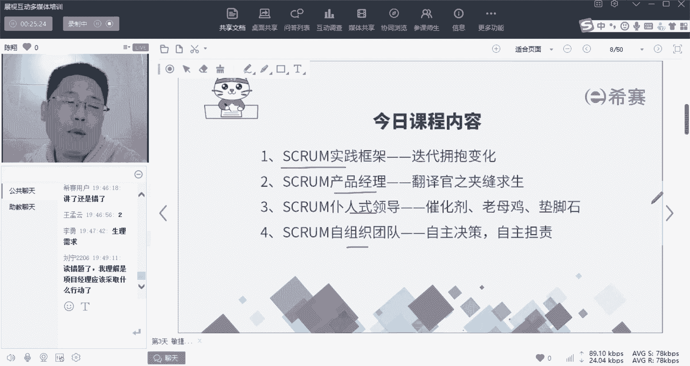
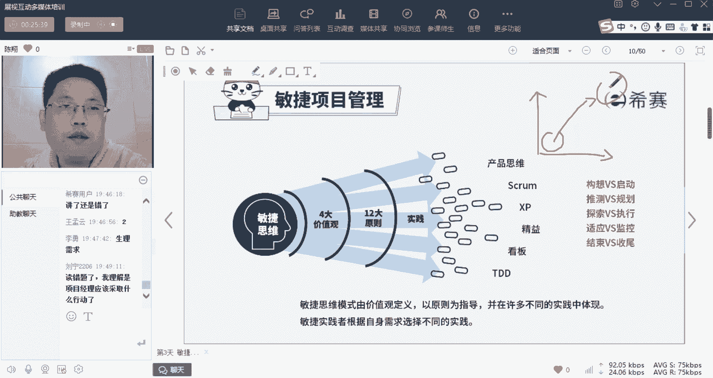
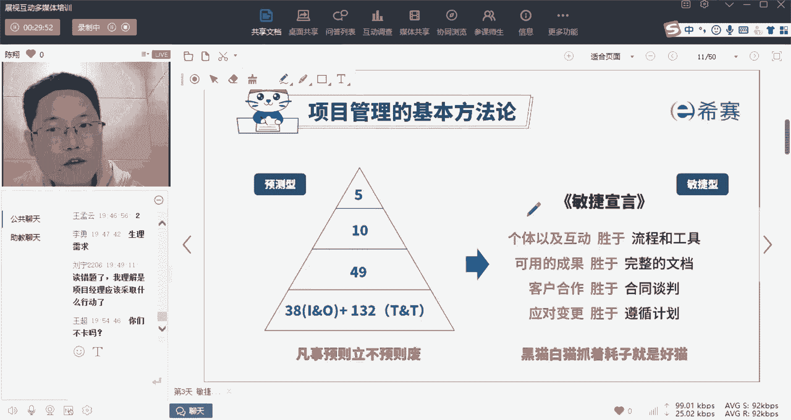
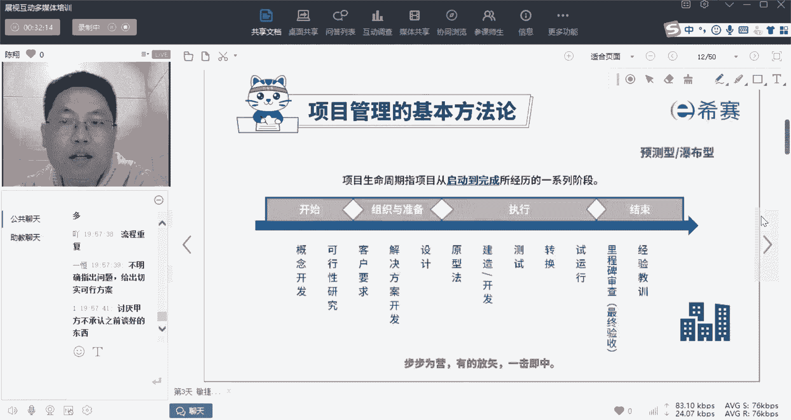
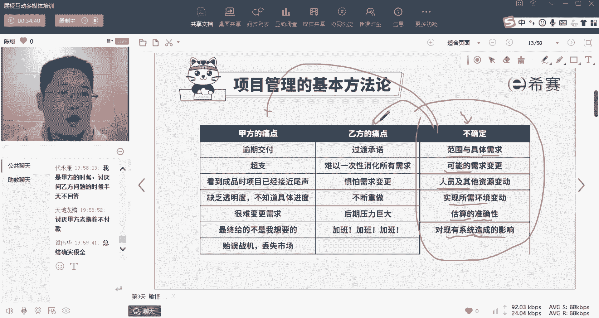
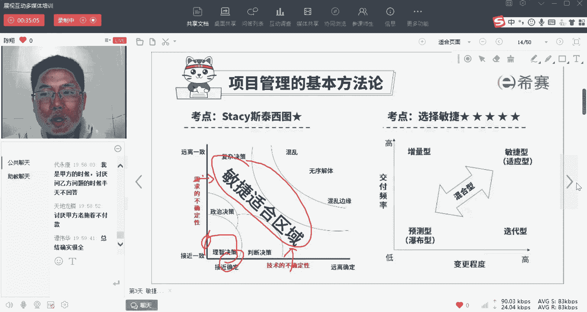
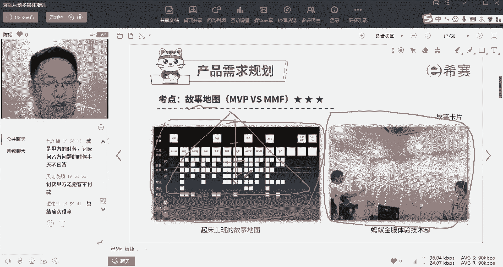
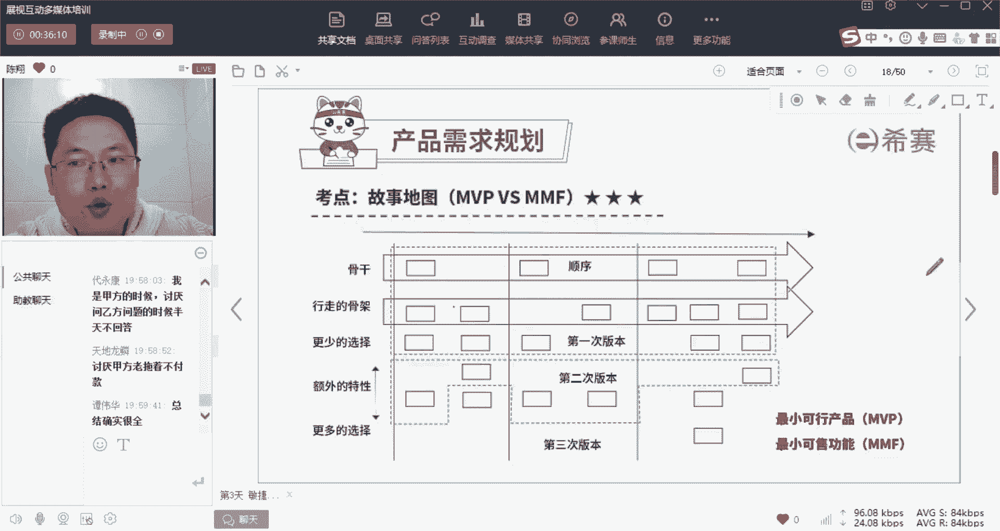
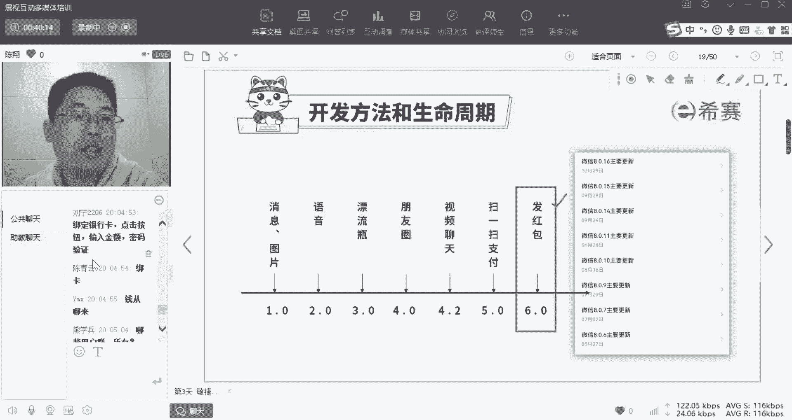
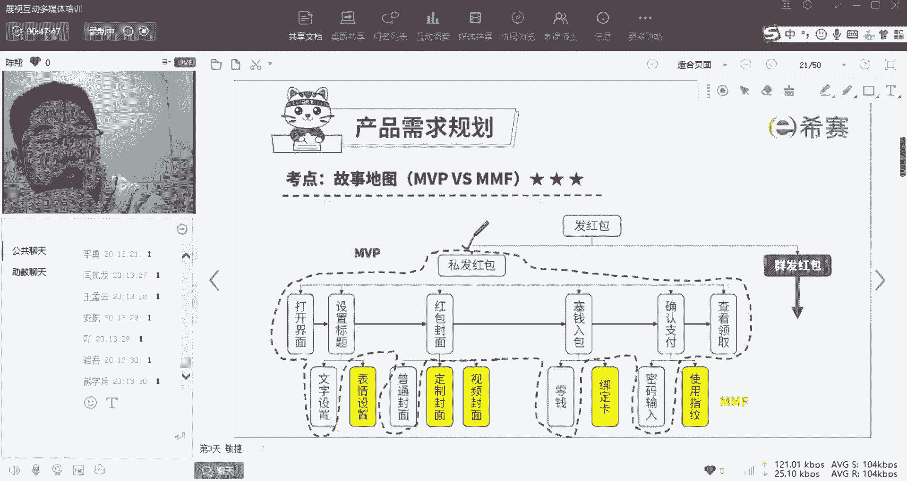

# 【24年PMP考试】零基础也能看懂的pmp项目管理视频教程！ - P18：1.12 敏捷项目管理--SCRUM实践框架（上） - 冬x溪 - BV1tu411g7UH

今天的任务呢非常的严峻对吧，因为呃不了，不管是我们的工作中也好，还是我们在课程当中，大家对于敏捷这件事呢，就都是感觉一团浆糊啊，听起来很费力，我们今天的任务比较艰巨。

就是希望能够至少给大家建立起一个基本的，清晰地对他理解的框架啊，那么如果呢呃你完全没有敏捷的视角和经验啊，那么我推荐你呢可以自己去读一本书，这本书呢叫猎豹行动啊，副标题是硝烟中的敏捷转型之旅。

那么从它的副标题你就能看出来了，这本书的内容呢写的是唉，以故事化的形式来给你传递理论化的知识啊，呃比较好读，他写的就是一家公司在由预测型生命周期，往敏捷型生命周期转型的过程当中，发生的一些事。

面临的一些问题以及采用的一些解决方案啊，那么我们用一个基于故事原型的啊，这个东西来理解这些理论知识呢，会更好吸收一些啊，而且呢这个东西有免费的，就在腾讯读书的这个APP上啊。

你直接搜就能得到他的免费电子版了啊，有兴趣的可以去读一下，好，那么我们今天呢啊，先把这里面可能会涉及到的一些理论知识，我们先讲一下啊，包括swarm框架，包括啊他这里面的三种特别重要的身份。

那么这些内容你现在没学。

你肯定读不懂，我们先来看里面的知识啊，昨天呢我们讲过了对吧，呃我们的生命周期呢分为四种类型，其中最重要的是预测型，第六版和往第七版转型的敏捷型，那么到底什么是敏捷啊。

那么什么是敏捷呢，我们还是看到这张图啊，首先他们俩之间的区别是啥呀，就是做预测性生命周期的话，讲究凡事得有计划，然后强计划强管控啊，不欢迎变更，而敏捷呢反过来啊，我们瞄准最终的目标和价值。

只要是能帮我实现最终目标的，唉，不管是否在我计划计划范围之内，不管是否唉以前知道还是不知道，我都可以做啊，那么这里面呢啊带来了四句话，这四句话我先初步的给你解读一下，待会儿你结合着实际案例。

你再来体会他们啊，他说的是原来我们在预测型生命周期中，我们讲究四个强管控，一个流程和工具，就是你干事情的流程要标准，要完善，工具要确定啊，然后呢做任何事情你得先有计划啊，而且这个计划最好能够形成完整的。

清晰的细致的文档啊，那么文档形成之后，你应该跟甲方之间完成合同谈判，把这些东西白纸黑字的用书面的签字的定下来，以防改变啊，然后在过程中严格的使用工具遵循啊，这个文档啊，按照合同办事。

遵循之前已定好的计划，是不是这四句话呢都带着强管控啊，但是我们现在敏捷讲究什么呢，注意这个地方它叫做什么呢，叫做剩余，意思是现在我们更希望是这样，而并没有反对他们啊，注意只是都是要做的。

只是没有做的原来那么极端了，我们可以通过个体以及互动，来代替一些流程和工具，我们更关注可交付的成果，而不是完整的文档，我们更欢迎客户的合作，而不是谈判，更适应对应对的这个变更的应对，而不是强遵循计划。

为什么这样子呢，一个一个我稍微给你解释一下，首先遵循流程和工具啊，但是流程和工具不是万能的啊，因为如果是死板的流程工具，它不适应诶灵活变换的这些东西，最典型就是什么呢，就是打仗，我们经常在说打仗的时候。

有一句话叫做把决策权交给在一线，听得见炮火的人，是不是这句话谁说的，大家有听过这句话吗，为什么是这句话，因为你可能一个月之前制定的A关于这一天的，在现场的一些战略行动计划，但是到了现场之后。

发现环境跟你想象的完全不一样，如果还是按照你原来一个月之前计划的，那些事来做，是不是很可能就死在那了，所以呢讲究灵活应变，讲究什么呢，相信我们一线的战士，相信一线战士有这个能力。

就现场的环境灵活地做出真正确的行为流程，使用正确的工具对吧，所以我们在这儿更相信人，而不是相信死板的流程和工具，这叫以人为本啊，那么第二个可用的成果而不是完整的文档啊，这个东西是什么呢。

千言万语不如是吧，一张啊一个结果，你把文档写得再漂亮，再完美，没有做出来之前都是空白，都是空的，是不是，所以呢如果做一件事，我们不需要那么多文档的话，诶我们直接写成成就，直接做成果就行了啊。

那么更遵从谈判，而不是啊跟跟尊重合作，而不是谈判，这是啥意思呢，所谓的谈判是原来老的思想，就是说我跟甲方之间为了防止他扯皮，我把这个白纸黑字的东西写清楚，但是你注意就算合同约定了。

如果你没有帮甲方创造价值，甲方一样会跟你扯皮对吧，我们更关注于什么呢，帮助甲方成功，然后从甲方那儿的成果里面获得一杯羹啊，以及欢迎变更啊，只要能够帮助甲方成功的所有的变化，我们都欢迎好，这也四句话。

到现在你们听起来还是云里雾里，没关系，我们就接下来展开一个实践案例，让你们来理解一下为什么是这四句话。

OK我们先从还是从预测性分析周期开始，那么在这我们昨天讲到了预测形成周期呢，讲究一个线性瀑布关系，一个步骤一个步骤的来走，那么在这我们问一下，在座肯定有做预测型的对吧，你在做预测型项目的时候。

如果你是甲方，你讨厌乙方什么，如果你是乙方，你讨厌甲方什么，我们再来开一次吐槽大会啊，你的句式应该这样写啊，我是甲方诶，我讨厌乙方，怎怎怎样，或者呢其实如果你是领导，你有下属，那么其实领导就是甲方。

下属就是乙方哎，你作为领导，你布置数据的任务，你的下属怎样会让你不爽，如果你是乙方，你最讨厌甲方什么好，王超说了，讨厌变更对，我是乙方，我特别讨厌甲方，三天变一次，三天变一次啊，朝令夕改啊。

需求变更频繁都是对吧，讨厌甲甲方需求一天一个样啊，造梦师说讨厌甲方，钱少话多啊，钱少事多啰嗦，反复无常啊，其实你发现没有啊，我是乙方，经常改方案，浪费沟通时间，所以你发现没有啊。

所有在做这个预测型项目生命周期的时候，是不是都会怎么样都会犯相同类似的一些问题，那么这些个问题是真的是甲方啊，某一个甲方人的问题吗，其实呢你们现在面临的这些问题啊。

啊我们汇总了一下，你看一下，是不是所有的甲乙双方，都会有这样的一个痛点啊，甲方的痛点是他担心乙方逾期交付，担心乙方超支，担心自己看到成品的时候已经接近尾声，而自己对这个产品并不满意，要大幅度修改。

担心什么呢，哎乙方做事情缺乏透明度，自己完全把握不准，现在乙方做到什么进度了，唉担心诶，如果我我也没办法对吧，我应了市场的变化，我得变我需求，而乙方一定不肯变，很难变我的需求。

并且担心最终给我的不是我要的啊，担心诶超逾期了，超支的话贻误战机，导致我丢失市场，而乙方呢完全就反过来，是不是一条一条对着乙方呢，就害怕过度承诺对吧，唉如果答应的太多了，结果做出来没做这么好，唉怎么办。

下不了台，担心一次性难以消化所有需求，一下子甲方提的需求太大了的话啊，我完全分析不清楚，特别怕怕什么呢，变化需求啊，特别怕甲方让我们什么呀，啰嗦重复，让我们不断的重做啊。

更怕什么呢啊因为经常满足不了要求，导致东西往后积压，导致最后后期压力大，然后就是啊，这是所有做乙方一定会遇见的问题是吧，加班加班加班，所以你会发现甲乙双方的这个痛点，其实是对撞的啊。

那么既然最重要的就说明什么呢，其实既不是甲方的问题，也不是乙方的问题，而是这个生命周期类型就错了啊，因为呢在我们昨天讲了，在乌卡时代，我们有很多的不确定性，包括有些项目。

它本身的范围和具体需求就不确定啊，有可能啊变更需求是一定会出现的诶，包括还有什么呢，在做的过程中，人员是不是可能会变化，环境会变化，以及呢我们说了渐进明细性的特点，你不可能在一开始就做出各种方面的清晰。

规划和准确估算对吧，而且你现在这个东西要重新架构，到老的这个架构上，是不是可能会造成什么影响，如果太复杂的话，也会摸不清楚，所以你会发现处于这样的不确定环境下，这两个特点几乎是不可能不发生的对吧。

那么怎么办呢，就是我们昨天说的诶，如果你的项目是诶要做什么也很清楚，怎么做也很清楚，你可以用预测性，但是如果但凡有一方面不清楚啊，需求实在说不清楚，以及怎么做也分不很清楚的时候，你应该要用敏捷型。

所以我们今天就是说，来通过一个案例来看一下啊。

敏捷型到底怎么做，那么首先介绍几个基本的啊，一个工具，一个东西叫故事地图，故事地图是啥呢，它就是我们当面临一个非常模糊的需求的时候，首先你得尽可能的把它给捋清楚了，这个时候呢。

我们会在这种场景下开一个故事梳理会啊，就是甲方乙方哎，技术人员，开发人员，测试人员，大家都一块坐下来，有时候还特别会邀请什么呢，邀请真正的用户啊，带着用户的视角，咱们一群人坐在一个房子里面。

用头脑风暴互相激发，唉，你想要的这个产品，到底该具备怎样的特性和功能，诶没想到一条就用一个便利贴把它贴下来，然后想着想着想出几百几千条了，然后呢再用逻辑思维能力啊，把他们唉总结起来，形成一张思维导图啊。

从上到往下是由大到小的。

那么再来选择你该做什么好，这个东西讲起来太虚了。

我们直接来一个案例啊，比如说啊现在我们是不是讲敏捷，说微信是一个典型的敏捷，假如今天我们微信啊遇见了这样一些事，我们在某一个时期的时候，微信和淘宝，微信和支付宝是不是在抢一个市场，叫做在线支付市场。

有没有这个印象，在那一段时间唉，我们才刚习惯钱包里没钱，还记得吗，我问一个问题，现在钱包里出门，钱包里带钱的，打个一看看，不带钱，打个二看看啊，还有这么多人出门，钱包带钱呢对吧。

反正我现在出门只拿钥匙和手机啊，我是钱包都不带了对吧，那么这件事情发生转变才几年，大家还有印象吗，我回忆一下，可能也就个45年时间吧对吧，也就个45年时间，那么这件事情是怎么发生的呢。

就是因为在那一段时间，支付宝和微信强势的抢占在线支付市场，那么当时在线支付市场是怎么抢占的呢，啊微信做了一个很牛逼的功能，就是在某一年，我们是不是在那一年集体的在线发红包，过年的时候对吧，哎过年拜年。

原来都是红真挣钱，红包出去，结果在某一年，是不是大家都在微信上发红包了啊，对不对，那么我们现在假设我们就处于这个时间点，你我们就是呃微信的一个开发团队，我们接了一个任务，要做出这个发红包的功能。

现在呢距离快过年已经只有两个月时间了啊，那么我们这个时候该怎么办对吧，我们这个时候该怎么办好，那么我们首先是不是要分清楚，A微信发红包这个功能，我到底要做些怎样的细节设计呀，那么大家回忆一下啊。

看多少人能回忆出来，你回忆一下你手机里面的发红包的功能，具备哪几个步骤，能想得清楚吗，注意啊，我们现在是处于还没有微信发红包，这个功能的时候，那么你现在要设计这个功能，你是不是要想一下诶。

要实现这个功能，我要走哪几个步骤好，有红包样式，有金额范围，有单发和群发，还有没有不同的，我们这个时候其实就是在进行头脑风暴了对吧，凭借我们对于发红包电视的理解诶，我要做哪些功能，充值红包按钮啊。

给谁发绑卡，钱从哪儿来，输入金额密码验证好，怎么接收，怎么发出去好啊，用户识别非常好，OK所以你看见没有，我们啊最大金额，我们到现在就凭我们十几个人，几十个人就已经头脑风暴，出了很多的细节功能了。

对不对，那么你们说的每一个单词，我们都可以把它叫做一个用户故事，什么意思呢，就是诶我作为用户，我来使用的过程当中发生了怎样的故事，比如说你讲的A我绑卡，是不是就是我作为用户绑了一张卡。

我发生了一个小故事，那么在敏捷生命周期里面，我们把一个功能需求又叫做一个用户故事，这是他特有的一个专有名词。

那么我们用专业用户故事来讲，我总结一下你们刚才提到的东西，诶，大家看一下，是不是刚好差不多是这么个流程对吧，我们说发红包可以分为司法和群法，这是两个完全不同的点对吧，那么司法又包括打开诶。

我确定要给谁发了之后打开我发红包的界面，然后里面有几个功能，包括设置标题，包括A选择红包封面，包括塞钱入红包，包括确认支付，包括查看他有没有领取设计标题，这我们现在具备的，是不是可以有设计文字标题啊。

有设计表情的哎，红包封面呢，应该是我印象中是去年还是前年，出了一个新的东西，叫视频封面对吧，然后有定制封面，最开始是普通封面，赛前录包呢包括零钱，包括绑卡，那么支付确认之后，包括密码输入。

现在包括指纹输入，对不对好，那么这个功能呢大概是私发红包展开的，而群发红包是不是又有一些呃，这个什么拼手气的呀，还是固定人每个多少钱的呀，是不是又有更多的功能，我今天就不展开了，好那么你这样一规划。

你发现这么多的事儿，如果真的要全部做完，那么需要至少诶四个月的时间，而我刚才是不是描绘现在的情况，现在我们去过年这个关键时间点只有两个月了，那怎么办，而且我还面临着什么跟支付宝的竞争压力。

支付宝有个人偷听我们讲话，他那边也在做这个功能，我不知道他什么时候会推出，但是我要求尽快我们要拿出东西来抢占市场啊，而且要在什么呀，两个月以后的过年的这个特别重要的时间点，至少要让我们的客户先体验上哈。

加加班，哈哈啊，李咏就是这有点悲催啊，但凡一开始就想到加班的，这明显就是已经通过来的啊，那么这个时候怎么办，全部做完得四个月，我们现在两个月之内一定要上线，对很多人啊还是有经验的对吧。

那么这个时候我们是不是就面临着注意，我刚才说的没有，如果我们刚才把这些事情全部圈好了，一个一个都定好了，然后再去做规划啊，然后再定诶，你这个项目什么时候做完，比如说我做这个东西的规划，我就要做两个月。

两个月规划做完之后我再确定一下啊，我这个时间得有六个月，那么我给我自己设定一个六个月的合同，签一个六个月的工作包，这个里面所有东西六个月之后做完之后，那这叫什么生命周期，大家想一下啊。

如果我花一个月的时间去把这些东西，一个一个功能全部规划好，做好计划，定好基准，然后签个合同，这叫什么生命周期迭代吗，对不对，这就是预测型生命周期，但是刚才讲了，如果你在这个项目上用预测。

是不是就一定会错过诶，关键节点也竞争不过别人对吧，瀑布和预测对吧，那么我们最适合选择什么，是不是就选择增量加迭代，其实最好就是敏捷了啊，那么在这个时候，那么我们带大家来看一下啊，大家看一下这个表里面。

你如果让你来选，你认为第一版最紧急的做哪几个，或者反过来说，你认为哪些功能可以先不做，你认为第一版发版的时候，我们先做哪几个好基础的，那你就这些故事里面你认为哪个是基础的，哪些个是基础的对吧。

你肯定要有打开，你打都不打开啊，你确定不了给谁发，然后标题肯定是要有的，你发红包出去，你至少告诉别人我这个红包是为什么发的啊，你恭喜发财也好，对不对啊，那么但是呢文字是一定要有的，表情可以先没有。

对吧啊对吧，然后封面肯定是要有的对吧，你可以先做一个固定的封面，不让我们能够自己设置或者是发视频啊，故死一个封面对吧，钱入红包肯定是要有的对吧，没，否则钱从哪儿来哎，可以先用零钱网卡先不做啊。

那么确认支付肯定是要有的，否则诶你没有一道安全手续，你怎么绕，忽然就出去了对吧，那么我们可能先不没有指纹这么先进的东西，我们那个时候指纹识别还没这么好诶，先密码输入，然后查看余额肯定是有的，对不对。

那么这样子是不是就得到了一个，我们叫做最小可行产品，好最小可行产品啥意思呢，就是其他的东西叫锦上添花，没有那些可能没有那么美对吧，但是呢唉这些东西必须得有这些东西，但凡缺一个你的整个发红包。

这个功能你就无法实现对吧，这个东西呢我们叫做MVP，中文叫做最小可行产品，这个能理解吗啊就是这些功能少一个，你这个功能整体就运作不了，那么其他的呢我们是不是叫做锦上添花，哎我们在接下来一个一个慢慢做。

每做一个诶，它会好一点啊，但是怎么样不影响唉，所以这种东西呢我们叫做最小可售单元，我们叫MM5F，最小可测功能就是它是最小颗粒度，就是这个东西如果你只做一半哎，他也哎用不了，你得把它做完，它能用。

但是呢它又不影响核心啊，它是一个锦上添花的东西，所以你区分一下MVP和mm y f啊，这两个概念好，但是你发现没有，对最小颗粒度MMYF最小可视功能啊，好那么到这儿我们把这个怎么样编用户故事啊。

大家理清楚没有，我们到这儿啊再探一下，因为如果是你做过敏捷的，你肯定知道我在说什么，你没做过敏捷的，我讲到现在啊，我讲到现在，我们对对于我讲到现在的这些东西能理解吗，能理解，打个一啊，不能理解，打个二。

我们再可以再聊一下，你讨论一下，因为这个东西对于没接触过的人物。

