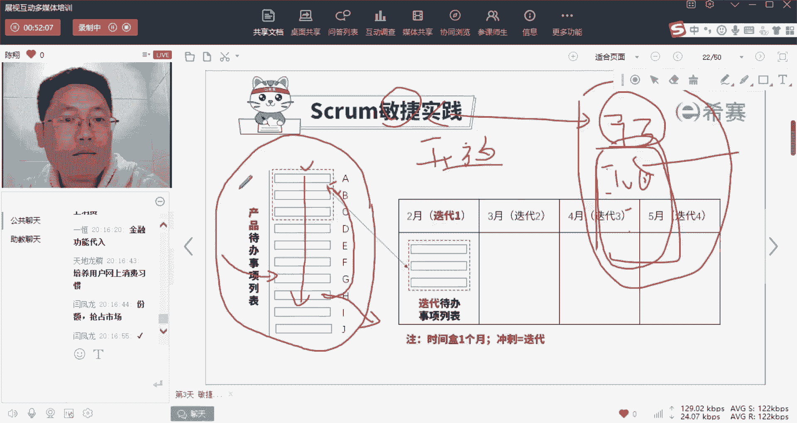

# 【24年PMP考试】零基础也能看懂的pmp项目管理视频教程！ - P19：1.13 敏捷项目管理--SCRUM实践框架（下） - 冬x溪 - BV1tu411g7UH

那我们来看一下啊，好这个东西梳理完了，是不是哎我得做什么工作。

任务的列项都列得差不多了，那我是不是可以把它们列成一张单子，这张单子是不是就叫做工作清单啊，就是你们列的工作清单，在咱们这儿呢叫做产品待办事项列表啊。

注意这个上面是不是就是ABCD，我把这个东西标成A，这个是这个是B，这个是C，这个是E，这个是F啊，我就不去打它中文名字了是吧。

把这些东西的都抽出来，一条一条的从上往下的来列，其实就是工工作清单对吧，那么我们把这个整体的包含的东西，叫做产品待办事项列表，注意这张表呢哎它有几个特点。

第一个呢就是这个颗粒度它是可以不断细分的，注意到这没有，我在这儿是不是把群发红包，这个功能完全没有分解，因为我一开始就确定了，我们今天最要紧的就是私发，所以我甚至连去分析群发有哪些，这件事我都还没做。

我只知道这件事很大是吧，这个工作量很大啊。

它又不紧急，所以呢我根本都没去分析它，所以在这个时间点上，它可能就列在这，而它的大小其实将来是可以再细分的对吧，等我再分完之后，我这一张这一条工作项，是不是可能会变成十几条工作项。

所以大家发现没有这张产品代办事项列表，它是不是可以变的。

发现没有，而且再注意一下，刚才我们是不是说绑卡这件事，然后你们分析完之后，自己觉得发现哦，这张这张单子，好像我做完这些就能实现发红包这个功能了，但是我们是不是忘记了，我们为什么要做发红包的这个功能。

真的是为了让客户发红包吗，我们是不是希望客户能够通过发红包，发现手机里没钱，为了发红包，我得往里充钱，为了充钱我得绑卡，是不是卡就绑上来了，卡绑上来了之后，你是不是才养成了在网上刷钱的这个习惯。

是不是这才真正的抢占了在线支付市场，所以经过领导这样一番啊批评以后，我们才发现五，原来我们做这个功能最核心的目标，是要把绑卡这件事儿给他纳入进来，对吧对吧，金融功能的代入才是我们最重要的一个。

所以那么开始被我们排在很后面的诶。

绑卡这个功能突然之间就变得极其重要了，那它的优先次序是不是该往上排，所以大家注意我们这张工作清单，它有两个最核心的特点，第一个它是排了优先级次序的，从上往下诶，越往上的越紧啊，越越重要，越紧急越优先做。

第二个这张表是开放的，有多开放呢，你随时可以往里面加内容，随时可以删内容，随时可以调整这里面的哎这个顺序排序，所以这是不是，就代表着我们敏捷这个东西有多开放，而我们说预测型生命周期，你会注意什么。

预测型生命周期，如果我们说一开始你输入了100个工作项，这100工作项全部把它定死，签在了合同里面，那么这100个工作项是不是完全就固定了啊，而且如果你做好了工作计划，哪件事先做，哪件事后做。

那么它的先后顺序是不是也就固定了，所以敏捷和预测最大的区别是什么，就体现在这张表上啊，同样我们会去在事先分析，你整个这个项目要做什么，但是在预测里面，所有东西一旦分析完了都固化了。

而在敏捷里面分析完之后，所有东西都是灵活的，都是开放的，那它的好处和影响在哪儿，我问大家。

当我们这样分析完一个你的这个项目以后，你还会关心整个项目，最终能够把所有功能都交付是在哪一天吗，听清楚我的问题了，如果我们刚才这样梳理完之后，你还会关心所有项目的最后一项功能，它是在哪一天交付吗。

是不是就不关心了，是不是你更关心诶核心功能什么时候出来诶，怎样能更快地完成更多的一个增量，是不是他完全打破了我们的一个视野，把原来预测型关心最终的那一天的，这个视野完全挪到了诶。

我怎样能尽快地交付更多的价值，这就是敏捷的核心好，我讲到这儿啊，大家听明白了没，有敏捷和预测的区别，做过敏捷的人啊，应该都听得懂了，是不是你作为领导，你就会天天问我诶，核心功能交了没有，交完了话。

第第一个最重要的这个增量交了没有，次要的增量交了没有，甚至做着最后哎如果有一些不痛不痒的增量，就算我没做出来，你也不会太关心了对吧，因为你知道那个东西不重要，所以敏捷的核心就是说就一句话。

这就是这个最快的交付，最核心的价值，永远确保自己在做最有价值的事情就对了，而不去关心完全的一个整体全貌啊，必须要在什么时候完成好。

如果这个没问题，那我们就再讲一下我们的敏捷具体该怎么做啊，那么我们不是刚才讲了吗，你估了一下，大概这个项目呢四个月能做完，而那领导又逼着你赶紧拿出能用的东西来，赶紧上市，不要让支付宝给抢了啊。

那么呢我们就会把这四个月呢，我们分成四个时间窗，啥叫时间窗呢，很简单啊，时间和时间窗，比如说我们按一个月一个月的来完成一次迭代，注意啊，这个迭代呢我们就是冲刺，它其实是一个时间段概念。

那么我们现在站在2月1号这天啊，假如你发现我们现在呢有十几20项工作要做，那么我已经把这十几20项，按照优先级次序排好了，从上往下，那么现在的选择是不是哎我又问你了，2月这一个月你估摸着你能做几项工作。

注意是做完几项，因为对我们来讲，只有完成了才有用，没完成的半成品，永远只是消耗资金储备的库存而已啊，做完才有用，记住这句话，所以我就会问你，2月份你能做完几个功能啊，你估了一下。

告诉我说你能做完三个功能，OK那我就跟你第一个计划，我就给你定一个计划说，那么在这张表上，现在最优先的三项功能就是你2月份的目标了，我们把它又重新列张单子，这个叫做迭代代办事项列表。

也就是说在2月份这一次迭代的时候。

你一定要完成这三项好，那我们接着这个目标了，我们就去做，那么你会发现2月份假如你选了四项工作，我假设你选了四项啊，那么结果2月2月28号这天我们来验收，发现呢有三个诶，你做完通过我的验收了。

你把它交出去，这就变成了有效增量了，而结果有呢第四项啊工作没做成啊，或者说没通过我的验收，那么这个时候这项工作怎么办，这项工作怎么办，回到原来的表里面好，我再问大家，你站在3月1号这一天的时候。

你是不是又要往你的表里面啊，选3月这个月做几项工作，那么这一项工作他的排位在第几位，我们2月份挑了四项工作做，做成了三项唉，做黄了一项，是不是要重新做，那么3月1号这一天，你挑选的时候。

这项工作排在第几位，都说第一位有没有不同的答案。

好正确答案是什么，是不是到了3月1号你会发现诶，整张单子前三项已经做完了，还剩下后面十多项，注意这个时候正确答案是重新排对2317，这位朋友啊说对了，重新排，为什么，因为我们是不是有一条标准。

叫做永远在做这个时间点下面最有价值的事情，2月1号的时候，这项工作它是最有价值的，不等于3月1号它是最有价值的，此时它有没有价值，谁也说不准，从排才知道，如果他仍然是最有价值的。

他仍然会被选入我们3月份诶做的事情里面，如果没有，不是的话，它就会降序诶，比如说哎我经过了一个月这个东西诶，往上升了一个优先级了，对不对，所以呢我们刚才是不是讲了整个这张表，它是开放的，它可以增可以减。

可以插队诶，可以上期遗留啊，对吧等等等等，对，永远在做在这个时间点上啊。

在选择的这个时间点上最有价值的事情好，那我们再来看一下啊，怎么来选的，我们来描绘一下swarm这个框架的全体全貌啊，首先就是是不是有客户哎，客户想要什么，我们有一个角色叫做产品经理，产品经理把客户。

你脑子里面乱七八糟的这个想法和需求，梳理出来，成为一个一个代办的事项，而且给他从上往下的进行优先级排序，那么这个是我们刚才在书里做的这个事情，好到了每一次迭代的时候，比如说2月1号这天。

团队成员要开一个迭代规划会议，这个会议上呢会讨论诶，我们2月这一个月能做多少事，那么把它挑到这个库里来，形成这一次冲刺，这一次迭代，这一个月能做的冲刺待办事项，那么我们每天团队成员呢就聚焦于这四项的。

这个工作为什么要这样做，是不是就排除唉，我们被其他重要优先级不高的工作打扰的，这个这个这个问题，是不是我们这个月只做这思想很明确，我们只做这四个最优先级价值高的其他东西，不要来打扰我啊。

那么这30天之内就反复的去磨这四件事儿啊，那么在这里面呢，就明天早上起来沟通这个以后再讲好，那么等到这个2月28号这个月结束了，哎我们做完了四个这个东西，但是注意只是做完，也就是叫做已完成对吧。

已完成的用户故事，但是做完了不等于做达标了对吧，你还得经过评审和验收啊，那我们在评审和验收会议上哎，由接收方也就是甲方来评价你做完的事件，事情合格的只有三件诶，我收了啊，我拿走，我付钱。

那么剩下这一项是不是打回啊，那么在接下来这个时候就到了什么呀，到了23月1号这天了，哎3月1号我们又重新把这个流程再走一遍，这个时候你会发现我们的待办事项列表，已经给跟一个月之前不一样了，对吧。

诶下面空了一点，为什么，因为前面做掉的东西已经拿走了，哎所有东西优先级往上升了，那么这个里面呢可能有临时加进来的，有这个过程拿掉了的，有优先级改变了的啊，此时我们再在这张表上再挑选它，诶。

这个时间点更重要的东西，又列为这个月的待办事项，又在这个月去做几项诶，这个月做了三项，做完了三个东西都通过验收了，好，那么到了4月1号，我又在这张表上再来挑东西做，一直这样循环迭代。

直到我们把这个项目所有的东西做空，是不是直到我们把这个项目上所有东西做空，或者做到什么呢，做到甲方认为剩下这些东西不重要，咱就不做了，那么这样子，是不是就永远在尽快尽早地产出有价值的产品。

好这个东西呢就是我们说的scrum工作工作框架好。

我们回到这张图再来看一下，OK到目前为止啊，我讲的内容听懂了的，打个一有问题的，我们再来讨论，好smile，baby说没太懂，哪儿没懂，你能问得出来吗，哦经常就是说学生说我也没听，知道我哪不懂。

就是不懂，你就把刚才那个故事啊，那你自己再再顺捋捋一遍啊，朦朦胧胧好，没关系啊，那么我们先把今天内容走完好吧，先把这些内容内容走完，你再不懂，我们再单聊好，再单聊好，OK啊，有游客说。

感觉我们一个系统做完了那部分才交给客户啊，才给客户交付的这个东西说的什么呢，比如说我们刚才讲的这个MVP，假如这个MVP呢要六项工作才做完，那么这是三项，3月份又能做三项，那么可能你整个两个月做完了。

你的这个MVP的这个功能才会交付出去，给客户用对吧，那么我刚才说的这三个增量啊，我说他拿走不代表是真的，他就拿走去用了啊，代表他签收了啊，你就能够放到这个成品库里面去了，等这三项功能再出来。

三两个人在一整合才形成一个能够上线的版本，这个东西属于这个软件行业的东西。

就不再展开了，呃软件行业东西越讲越专业的话。

可能很多非软件行业同学就有点跟不上了。

迭代是对剩余事项重新排序吗，呃好我们来说一个啊。

刚才说了，我们这个项目是以每个月为一次迭代啊。

就是每个月交一次啊，甲方来收一次东西，收一次租，并不是说一定是在3月1号，4月1号，5月1号这个天我们才对它排序，这个表格里面的排序是永远在动态的，随时在排序的啊。

比如说3月15号这天发生了什么一件事情，导致这个东西的优先级上升了，他当天就往上浮了啊，3月17号这天又导致一个这个东西啊，优先级次去下下跌，下跌了，那么他当天就下跌下跌。

那么我们是说到了4月1号这一天，我们来看这一天的这张表，唉，谁最优先，我直接就选，所以重新排序这件事情永远在发生啊，只有到了每个迭代开始的这一天的时候，我们才会来选择优先级，对跟股票行情一样。

你就理解为你一个月换一次自己手上的股票啊，那么股票行，这个行情高位的涨涨跌是他自己的事，到了4月1号这天你要换算上股票了。

