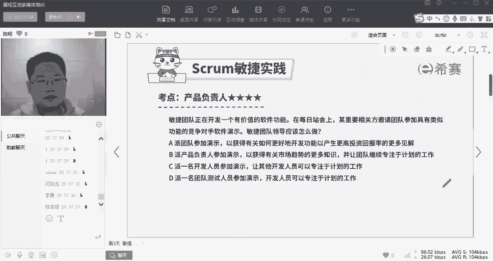

# 【24年PMP考试】零基础也能看懂的pmp项目管理视频教程！ - P20：1.14 敏捷项目管理--SCRUM产品负责人 - 冬x溪 - BV1tu411g7UH

呃花了一个小时的时间啊，来给大家讲基础知识，好肥羊问的这个问题就是马上要讲到了啊，那么刚才给你讲的是基础知识，接下来我们就要接触到内容和考分了啊，这个地方地方呢我们刚才画的这张图里面啊，它有好多种角色。

有好多种啊，这个弓箭我们一般把它叫做3355什么的，三个角色，三个弓箭，五个世界五大价值观考分呢都包含在这个里面，整个这张表呢包含了我们整个考试，可能有25%以上，也就是1/4以上的分值啊。

就是有这么重要啊，那么整个敏捷里面大部分都在考他们，今天呢我们把第一个三给大家讲一下，就是产品负责人，敏捷教练和项目团队，他们分别是谁。

以及在刚才这个过程中，他们做什么啊作用，那么首先我提一嘴，我们的题目里面呢可能会用到这么一些描述，包括敏捷项目经理，敏捷项目管理师，敏捷管理人士，敏捷管理专业人士，敏捷从业人员，敏捷开发团队，敏捷团队。

你注意他们在讲的有可能啊，表达的是这三个人里面的任何一个人，你得根据题干中描述的这个工作内容，来判断这道题到底说的是谁啊。

我们一个一个先来展开，先说产品负责人啊，我们平时的英文名称叫PO啊，那么在这呢我再强调一句。

这三个人是什么决策和身份呢，如果你是一个这个预测型组织里面的，项目经理的话，你注意，在敏捷里面已经没有项目经理这个身份了，项目经理这个人呢被拆成三块，他的工作职责呢拆成三块以后，分别由产品负责人。

敏捷教练和团队啊给分担了，也就没有他了。

他被分尸了啊，那么我们来看一下每个人分了他什么东西啊，首先我们说PO啊，产品经理，产品经理主要干嘛呢，他干五件事，第一他是我们团队内部向外部对接的窗口，这个窗口主要是向客户打开的啊对吧。

那么客户想要什么，我们通过做什么事情能做出来，由产品经理来翻译，比如说啊我老婆跟我讲，他说哎我们结婚结婚快十周年了，你要给我一个永生难忘的十周年结婚纪念日，这是他的一个需求。

但是这个需求我做哪几项工作能做出来。

我完全懵逼，这个时候我就找到我老婆的闺蜜对吧，我找到我老婆闺蜜，我问她说哎，我老婆提了这个需求，你觉得我做哪些事，我我我能达成这个目标，然后闺蜜她闺蜜给我列了一张单子，这张单子上包括了十几条事件啊。

那么这个人就是产品经理，他负责翻译诶，客户的需求和团队的工作之间对搭一个桥梁，这是一个第二个诶翻译的工作项目出来之后，是不是刚才我们建立这个红包的这样啊，这个思维导图。

那么这里面的工作哪些优先级更高一点，哪些低一点，怎样排序呢，应该由产品经理诶，跟他商量好之后再排出顺序了啊，这也是对表内的事件进行排序，然后呢啊就不归他管了，团队成员来商量哎，我们这个月能做几项。

按照顺序来取好，团队成员做完之后，是不是他会告诉你，A团队成员告诉你诶，我们已经完成了这四项工作，但是完成是团队成员觉得自己做完了，到底能不能拿出去给别人看呢，就好像说哎。

我觉得我的几个工作项目都准备好了，但是到底符不符合我老婆的心意呢，我要给她惊喜，我又不能直接给他看，那么我还是把这个闺蜜，把她我老婆这个闺蜜找过来问他，诶，你觉得我这几个做的。

能不能满足我老婆这个客户的意义啊，诶他搂了一眼说呃，我觉得你老婆应该会对你这四个工作满意了，那么这个叫做产品定义，经理定义的已完成的工作啊，那么这个东西我才敢拉到产品评审会议上，就是让我老婆去看，哎。

我老婆结果一看，发现闺蜜还不是完全了解她，其中有三个他很满意，唉，有一个他不满意就给我打回了是吧，所以产品经理呢在这儿要帮助团队自检，来定义这些东西到底做不做完，能不能呈现出去，另外呢在他到底是什么呢。

跟团队是一伙的，哎，在这个评审会议上啊，就是甲方的验收会议上，他要帮助团队说服这个甲方的接收这些内容啊，这是四个了，最后呢第五个是吧，我们刚才讲了这张表呢是一直在变化的啊，那么在过程中。

甲方可以随时随地随意地提出新的需求，那么这些需求是不是也应该由产品经理来负责，对接啊，所以呢产品经理主要是做这五件事情。

对于产品经理的工作，我们听明白了，打个一啊，有问题我们来讨论对吧，你会发现产品经理最重要的一个角色，就是跟客户对接，摸清楚他要什么啊，而我们该怎么能做出来啊，先做什么后做什么，做到什么样子算是合格。

总之就是啊客户的代言人啊，我们俗称什么二狗子啊。

好如果没问题啊，我们来检验一下。

好我们看一下啊，这道题，第一个选对的是熊学兵啊，熊学兵，OK选B啊。

选B，这道题读懂了没有，敏捷团队正在开发一个有价值的软件功能，某重要相关方这个说的是谁，是不是甲方就是甲方啊，甲方邀请团队去参加一个有类似功能的，竞品的软件演示，啥意思呀，就是唉我们要做这个软件。

对方也在做这个软件啊，比如说微信和米聊，米聊和微信，结果呢我说不太清楚，我跟你讲诶，你去看看竞品他们做成什么样，我觉得他那个功能特别好，我也要做一个，是不是这句话代表什么意思。

代表着诶我想要的功能是什么，那么这个东西应该由谁去了解呀，啊由谁去了解，当然是由甲方肚子里的蛔虫啊，摸清楚他的需求的那个人，是不是应该是派产品负责人去参加对方，竞品的一个演示，已获得整个市场上。

现在对于这个产品有怎样的一些趋势和功能诶，并且呢不打扰团队，为什么呀，因为我们团队他要坐在办公室里面，加班加点的来开发我们这个软件，所以呢这道题应该是由产品负责人去，它对应的是什么呀，是产品经理。

是去收集了解甲方所有需求的这个人，而很多人选错了，选A是派团队参加演示，以获得有关如何更好的开发功能，以及提高生产回报率的更多见解，后半句是对的，但是什么呢，派团队参加错了啊，一般在讲团队的时候。

我们讲的是团队成员啊，我们在整个团队里面谁负责，什么是有专职分工的，这个得分清楚啊，所以呢这道题是选啊，B而C和D呢说派开发人员好，派测试人员也好，这些都是具体干活的人，他们专心干活就行了。

专注于计划的实现啊，所以这道题选B，OK那么我这样解释啊，大家能接受吗，还有什么问题没有，所以读懂题干啊，就就没问题啊，刚才由诸位啊。

有诸位选了A的，那么再看第二道。

好这道题看懂了没有，这道题我给你翻译一下，就是甲方找你定制了一项啊一个产品，那么关于这个产品好不好，谁说了算，甲方花钱找你定制一个产品对吧，那么这个产品要做成什么样，谁说了算，对你不能跟甲方说。

你说的不对，你不知道你自己要什么，我更清楚，按我说的来，所以这道题我给你翻译一下，我产品负责人认为，某个用户故事对于迭代至关重要，但是一名团队的主题专家却不同意，该冲突影响到团队事迹。

敏捷教练应该怎么办，这相当于是不是说诶，关于这张列表上哪个用户故事，就哪个功能更重要，现在产品负责人和团队里面，做事的人发生了冲突，但是你要想清楚呀，关于哪个功能更重要，它不是主角，他只是传话筒。

他是二狗子，他的意见实际上是金主爸爸的意见，对不对，所以关于这张表上的优先级排序哪个项更重要，是谁说了算，是甲方说了算，那么相当于是说诶，产品经理说的话就等于给甲方传话了对吧。

所以这道题啊就是我们作为这个敏捷教练，你还不知道他是谁，你就理解为他是一个中间协调者对吧，那你当然应该询问你们团队的这个，主题专家的意见，但是要告诉他啊，这个东西毕竟是甲方付钱的，甲方说了算。

那么也就是说产品负责负责人，负责定义这个产品代办事项列表的优先级，所以这道题选D选D啊，那很多人选了，A说在回顾会议中陈述该问题，并要求团队确定应该保留或者修改，注意用户故事保留还是修改。

只有甲方有权利，而甲方是通过他的嘴巴，产品负责人说出来啊，所以团队没有权利说任何一个用户故事做，还是不做，B询问他的意见，但是解说主题专家做决定，这个完全跟D就相反了啊，C与主题专家和产品负责人开会啊。

以减轻分歧，这个没什么好减轻的，这是原则性问题，甲方有权定义优先级，好啊，戴永康说会不会是产品负责人自己的问题啊，那么这就涉及到职业道德的问题了啊，这就涉及到职业道德的问题了。

产品负责人应该是甲方的传声筒啊。

所以这道题选D啊，所以它对应的是刚才我们说的第二个功能对吧。

产品负责人啊负责进行这张整个表的排序，OK我这样解释完了的话，大家能接受吗。

好再来看一个啊，OK啊，这里我稍微解释一下啊，scroll master就是敏捷教练啊，敏捷教练，SM啊，我们常叫做敏捷教练，这道题这道题啊，大家看到了啊，然后，这道题大家看到了大部分的人呢选错了。

没关系，我就是问了你错的啊，那么这道题我们先讲完什么是敏捷教练。

