# 【OPPM报告】一页纸搞定项目管理你还不知道？只需12步，收藏起来好好学！ - P3：3、12个步骤具体说明 - 清晖Drina - BV1LS411A7fX

我们再具体来展开一下啊，第一步填标题对吧，填标题呢有些技巧要给项目呢起个好名字对吧，什么叫好名字呢，举个例子啊，年初的时候，去年年初的时候，电影流浪地球计划是不是个好名字，这个项目是个好名字。

我觉得还挺好的吧，流浪地球就好，我觉得这个这个项目的名字特别好对吧，在那个在那个环境当中，假设的环境当中对吧，意味着我们又要去同命，对不对，完了之后呢，我们还把地球带上对吧，又说明又把地球带上。

还体现出这个事情的难度和重要性对吧，跟每个人都相关，对不对，我就这个名字浏览记句话挺好对吧，你不能起个名字，那这个东西就比较负面了对吧，虽然很直观，只要起个好名字，这个好名字呢。

一方面呢容易获得别人的这个什么留下印象，第二个呢能够帮助叫什么，这干系人快速的想起你这个项目，你想起你这个项目的目标，你想起他这个项目有所需要去承担的责任，就这个意思哎对简单易记，其他目标没错啊。

就是说叫信达雅对吧，那我们最高境界信达雅对吧，跟翻译那个是有点像的啊，好啊，那么往往我们在起这个项目目标的时候呢，尽量不要用自己的这些所谓叫什么这个艺术感，或者叫什么，自己的这个专业角度去定义这个东西。

因为你这个项目的目标，项目的名称呢是起给所有人听的，不是标榜你自己的这个水平的right，这是最容易犯的一个错误，所以呢你往往会用一些词来去什么，这个让别人感受到这个项目对他重要。

比如你会创造什么什么对吧，完成什么什么实现什么什么，实施什么什么对吧，哎你有这样的词的话呢，大家看到你这个东西要实施完之后，会不会对我造成影响，对我好像可能在某方面可能对我有帮助。

这个事我得支持你一下对吧，那这样的话这个目标他就起到这个作用了，对不对，其实很好对吧，而不是说起一个什么莫名其妙的一个名字，跟大家都不知道啥意思，而且都看不清楚这个项目要做啥，那这个就很失败了啊。

所以呢这是我们的check第一个点啊，就起个好名字OK吧，然后完了之后呢。

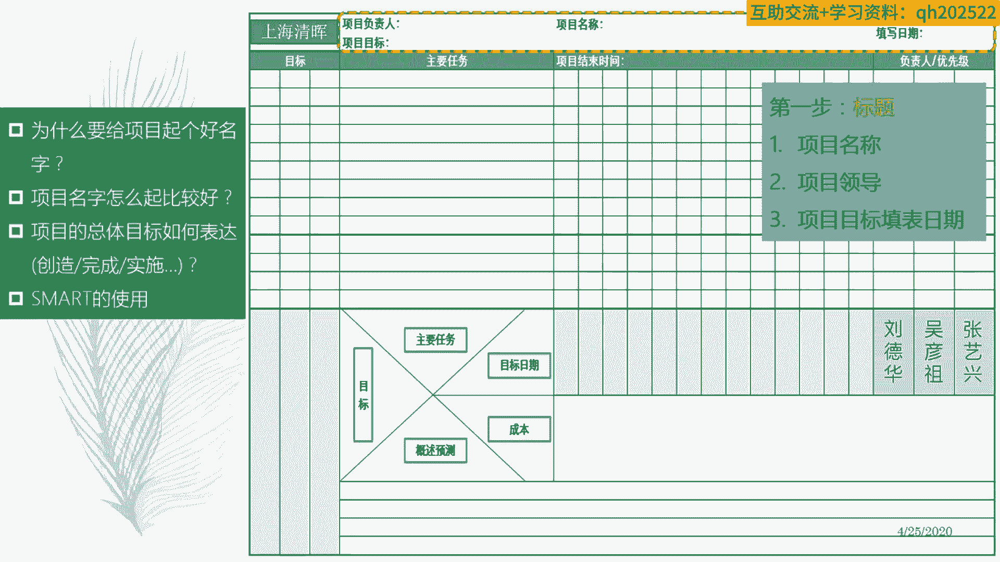

再把这个叫什么东西啊，第二步就是把这些责任人定清楚对吧，那么定这些责任人的时候呢，往往第一个不要太多，因为你这个不是做项目的团队成员的一个列表，你找的都是什么accountable对吧。

负责人有影响力的人啊，他公司名义上他能够给你增加资，提供资源给你支持的人对吧，跟项目这个在项目里面能拿主意的人对吧，这些人对吧，就负责人你也三个四个就足够了对吧，那么血气定负责人的情况下呢。

第一个就是说能够让这个任务在早期的时候呢，有些关键骨干成员能参与进来，去把这个项目标给怎么说呢，打磨的比较清晰，或者可行一点，或者比较稳一点，第二个呢让这些人呢能够在叫什么东西啊。

第二个呢能够让这些人啊，能够让这些人能够有一种什么使命感对吧，这个叫什么最早的项目团队成员，那你责无旁贷啊。

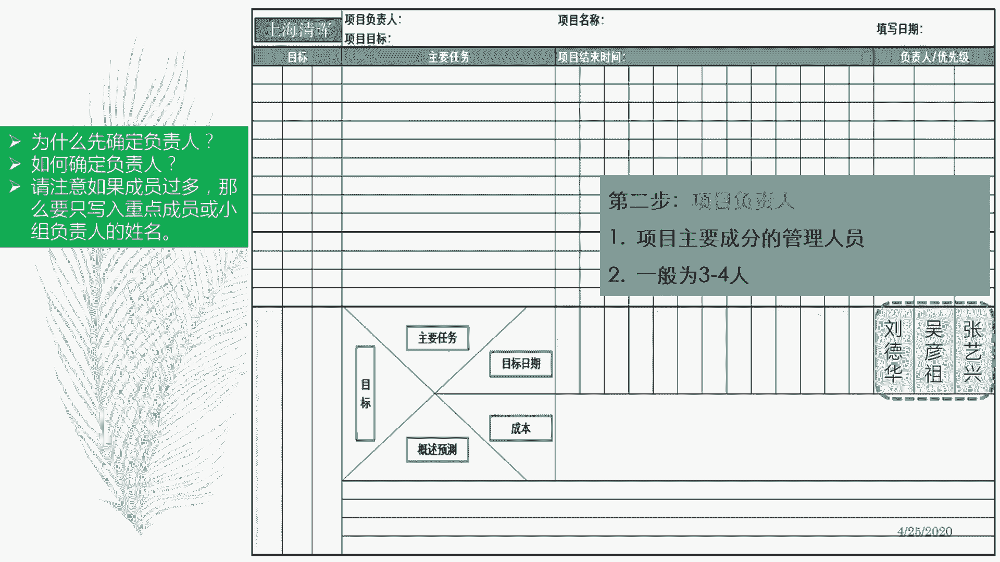

对不对，就这个意思啊，那么我们说这个定义目标的时候啊，定义目标的时候，他就要跟我们的什么这个责任人紧密相关啊，你要为了完成这个目标，你需要哪些人参与进来，你提供什么样的资源对吧。

这个时候呢你其实清楚资源张三李四王五，但是你一定不能写张三李四王五的名字，你一定要把张三李四王五这些人的上级找到，把他们作为什么这个责任人，因为他们跟目标直接相关，他们是对对目标某一部分负责的人。

执行人只能对他自己的什么这个duty负责，他的工作结果和质量啊，这这些成果负责经理呢，他会对这个叫什么这个成就负责，这个东西到底能不能达到预期的效果目的，对吧啊，这是我们所谓叫什么这个定义。

这个这个目标和责任的关系啊，所以呢在写这个的时候呢，你也要花时间想清楚你这个目标跟哪些人相关，那些人在这个里边的话，他是不是能够为你实现这个目标，起到一个推波助澜的作用哈。

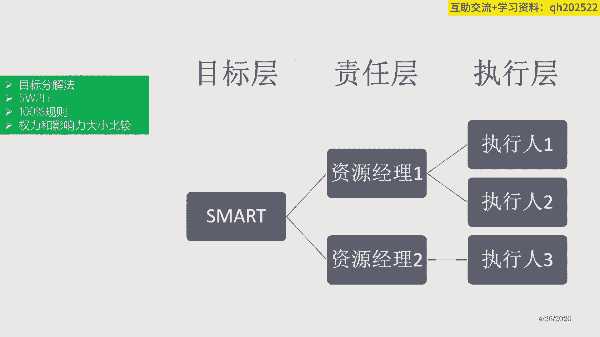

好OK这是我们所谓叫什么这个目标分解啊，那么再接下来呢就开始顺时针去思考了啊，一个方式从目标到主要任务到目标日期，再去到什么这个沟通频次，再到我的成本，再到我的预测对吧，从左往右顺嗯，是顺时针么。

顺时针对转过来啊，从不要开始转啊，这种绕一圈的方式去填啊。

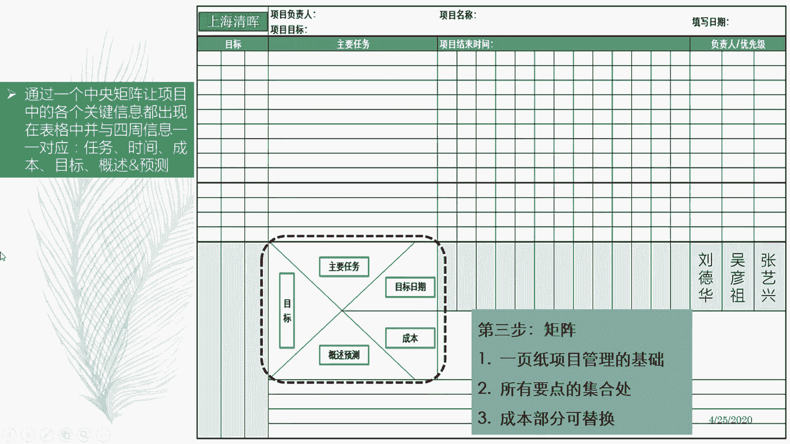

就这个意思好，那么目标定下来之后呢，就开始做目标分解对吧，原则就是说目标呢尽可能具体，不要太含糊，也不要高大上，不要用形容词的词汇，越是某一个成果性的东西越好啊，在这个地方呢，我要再跟大家说一件事情啊。

这些也是之前发现，大家练习时经常犯的一些错误，项目的目标啊，一般来说呢项目的目标，一般来说我们指的主要是，主要指的是可交付成果和可交付成果，一旦出现了之后，他能够为我们的业主，为我们的客户。

为我们的用户，为我们消费者能带来什么东西，好我们管这个叫项目的目标啊，注意它是以这个叫什么成果生命周期为导向的，或者产品生命周期为导向的，就是你要带来什么东西，有的只我们指这个目标啊，有的同学说。

那我这个什么这个成本不能超多少，进度不能超多少，这个东西是不是我项目的目标，注意啊，这个叫项目管理目标，你别搞错了啊，这在项目管理面，这是考核项目经理的对吧，是考项目经理的。

意思是说在这个时间轴里面对吧，这不有时间轴吗，这个时间轴列出来之后，这就是你的目标啦，它很清晰很smart对吧，又清晰又具体又可度量对吧，那么下面有成本的这个条子也是一样的。

所以这两点东西呢是考你项目经理的，第三个呢就是叫什么东西啊，这个看你项目经理的performance了，就是意识水平，这种就是看你下面的这些文字部分了，哎你能不能够去发现风险对吧。

能不能确保我们项目那个计划，能顺利推行下去啊，这个分开啊，所以我们在这里面一般不会要求，大家在这里面去填出个叫什么，项目管理的目标是什么，因为在右边的话，已经会把这个项目管理面。

具体通过某种具体形式展现出来了，你不用再去写了，这个很奇怪对吧，因为你要写项目管理目标的话，你会发现你要去写一堆项目管理的任务，去支撑这个项目管理的目标，这就很奇怪了对吧，所以呢你这边谈的是项目啊。

你只要把项目的成果，预预期达到这个效果写出来就行了，展开就OK了，可能拆分成几个部分，然后呢这些部分呢又跟一些任务活动相关对吧，你看这些这个叫什么，我们发现做这个事情，大家取集思广益。

我们先通过风暴写了一大堆任务，这些事情感觉都要做的，咱们再看看这些任务里面是不是同一个层次，对吧，把这个叫呢这个颗粒度拉到同一个层次，拉完了之后呢，进行一个什么，这个汇总大概就七个任务。

这七个任务分别对我们实现这三个目标，他们是什么样的关系对吧，做一个什么目标和任务的。

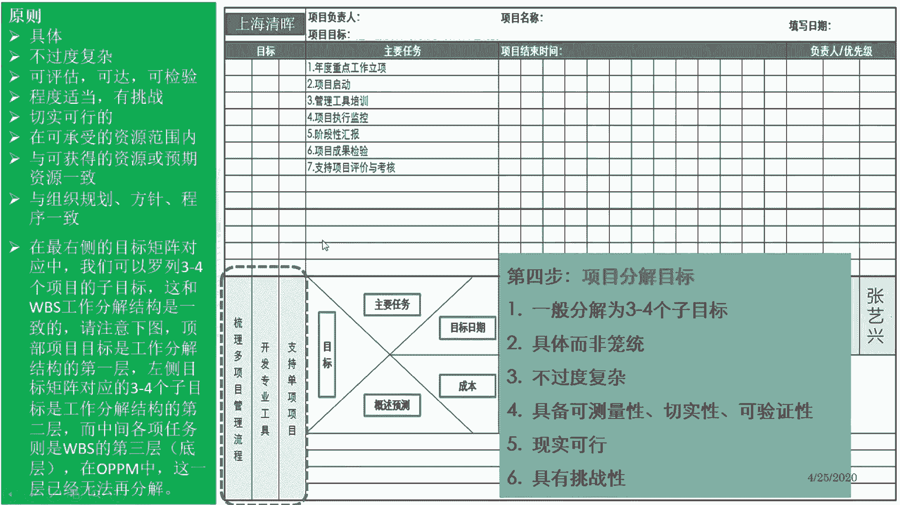

这样一个什么这个关联，目标和任务这样一个关联，那么这种关联的结果是说，第一个确保我们的叫什么目标都有任务去实现，第二个呢确保叫什么，没有任何这个项目，这个这个挂空的这个任务，就是是一种没有任务支撑的。

或者想把这个任务支撑的不够，唉，通过这样一种关系来做一个什么关键性的，所谓叫什么，这个这个充要充分必要分析，那通过这样的方式呢，你可以让你的这个叫什么东西啊，这个发起人也好，干选也好，角色也好。

能够觉得你这个里面的这个主要的是score部分，是对实现这三个目标是有这个叫法支撑关系的，靠谱，就这个意思啊，就这个意思。

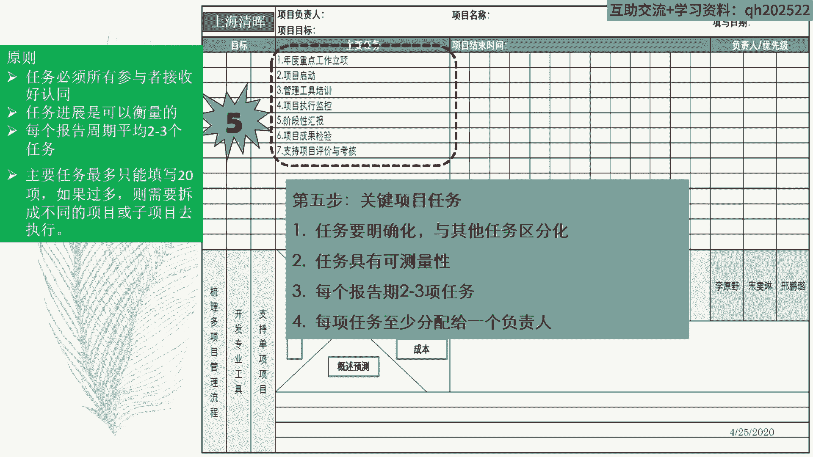

然后再下一步呢就是对，就是把目标跟答案一致，那么具体的表达方法呢，我们可以用圈来表示这个相关性，大家记得吧，我们学的那个叫么质量管理的工具，里面有个表格的矩阵图，用用这个叫法圈来表示相关性对吧。

用圆圈来表示这个强相关，对不对，用这个叫什么三角形来表示什么，这个叫嘛这个弱相关对吧，用什么时候来表示不相关，那这段我们简单一点，就简单说用圈来表示有关系就行了，所以这个东西呢跟实现这个目标是有关系的。

有这个支撑呼应作用的，它需要它来完成，它的完成呢又支撑了它的实现，就这个意思啊，但是你别事无巨细啊，咱们这边是主要任务啊，关键任务就是那些重要干系人，在他们的经验概念意识里面，他们能够他们比较关注的点。

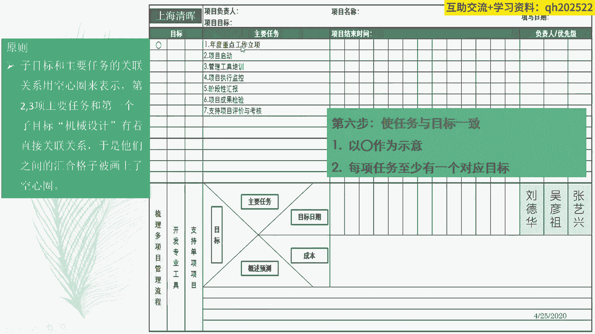

他们能听得懂的任务，就这个意思，OK好，然后呢再把这些任务展开啊，任务结束时间分别是这么多，把任务展开，一个一个一个一个一个一，一个一个一个这样的方式展开对吧，按照某种特定的这个叫什么来频次啊。

从1月到12月，这个一年的这个比如项目，你按照月度的方式去沟通，那你就把这个课尺度呢，把这这个这个这个刻度尺呢，就把它变成一个monthly的方式，就是就是阅读的方式对吧。

然后呢意味就是说这个圈呢代表这个任务呢，可能要干一个月，那可能干一个月，那这个任务呢可能干两个月，这个任务呢可能干六个月，但是呢而且中间当中学没有断点，他是叫什么，这个中间有间隔的。

那么这些这个东西呢又是什么，这个需要一个月或者在某个时间点去做的，就这个意思啊，他通过这样的方式把进度计划排出来了啊，以及汇报点啊，这是我们的什么这个排目标日期啊，排目标日期，那有同学说。

那我这个里边他不是说要满满打满算的，干一个月，他可能觉得干两个礼拜怎么办，没关系，这个这样嘛，这个这就是一些细节问题，你就不需要把这个作为估算的依据了啊，你不要把这个东西作为估算算。

你不是说一个月就是一个月的工作量，你别这么去估算，就代表这位有在这个月里面有需要有工作，需要开展表示出来就行了，就这个意思啊。

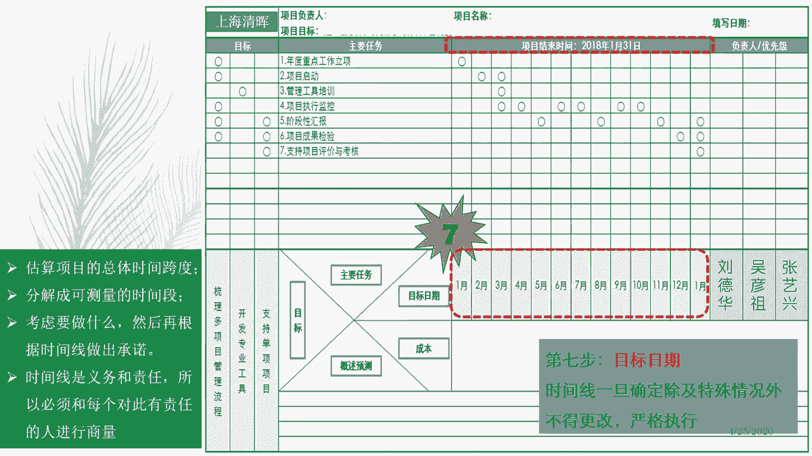

好然后这个叫什么，这个这样的话这个这样的时间确定下来啊，这个叫什么，这个这个做一个粗略的一个什么，这个时间的考量，如果说觉得这个时间刻度，如果说太小或者太粗的话呢，你可以再调整一下啊。

这个时候就倒过来去影响你的叫什么，这个沟通时间啊，沟通时间也可以啊，我们还可以灵活一点的方式啊，这个当然就讲的就是用的比较熟练的时候了，你可以把这个刻度呢把这个东西呢，所以我等你分个层。

比如说你按照wiki wiki的方式分个层，按照monster后就分个层，这个时候呢就对，你上面这个刻度就足够细了对吧，然后你关注是两个沟通频次对吧，跟项目组的是wk的方式，跟叫什么东西啊。

跟跟上级汇报是monthly的方式对吧，这是可以灵活了，但这个这个基本模板你要去理解啊。

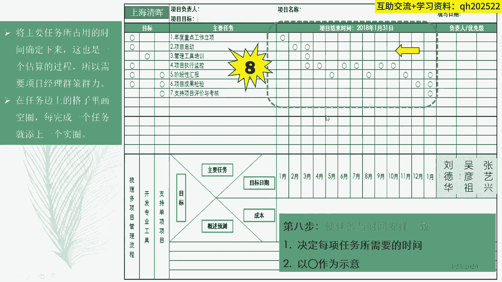

第九步呢就是开始设置accountable，就是就是就是负责关系，这三个人都是责任人对吧，你看每一个任务呢通过这样矩阵图的方式，相关性的方式把它给关联起来，刘德华呢他负责那几个任务。

这个这个这个吴彦祖父亲这些任务，这个这个这个张艺兴要负责的这个任务，这个这个如果在一个任务上呢，这三个人都会参与进来，负责的话呢，这个时候需要对他们设置一个，所谓叫任务的优先级关系。

所以对此什么起主要作用啊，就这个意思啊，谁对此起主要作用啊，起主要作用就这个意思啊，这是我们所谓叫任务分配到人啊。

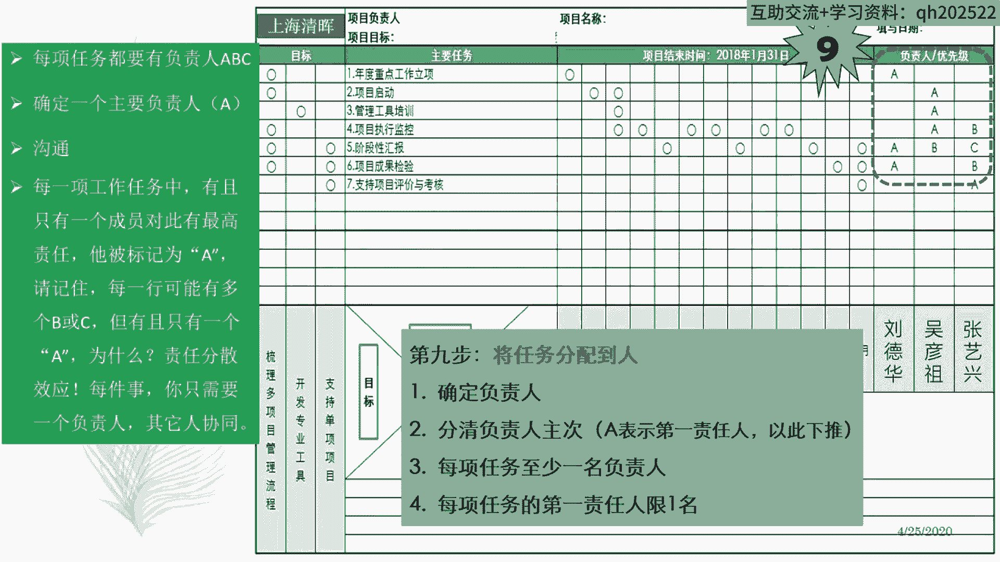

第十步呢，就是基于上面我们做出来的计划去分析一下，可能会在哪个时间点或者哪个情况下，可能会出现哪些什么问题或者是风险，那这个时候呢，就属于是你要做非一致性的评估了，哎这也是看你下面你的水平了对吧。

那么这些风险问题呢也应该有责任人，所以呢这个地方呢你会发现这个责任，既要管理这些任务，也要管理这个任务相关的一些问题和风险对吧，你要把这个责任风险责任人也要确定下来对吧。

以防止出现风险偏瘫症这种情况对吧，这是第十步哎。

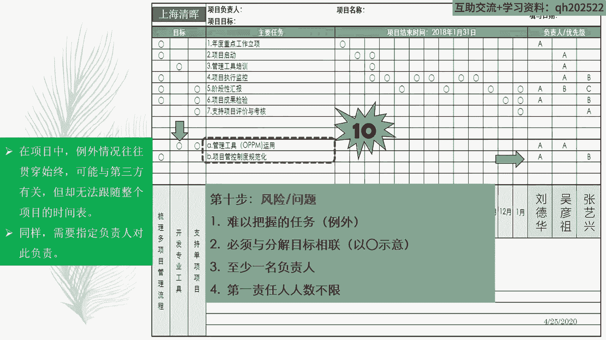

那么执行任务和风险问题都有人责任去管了，接下来的话呢你就就把成本作为一个单独项，把它列出来就行了对吧，然后用颜色表示它的整个什么状态就OK了。

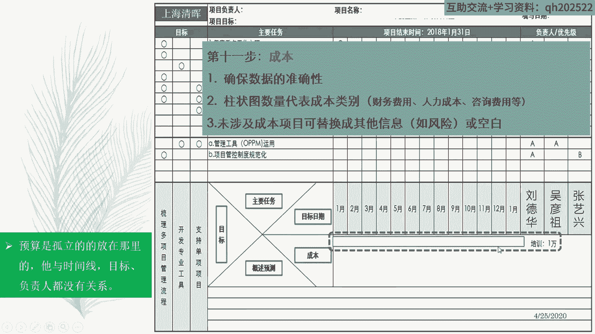

好，然后呢，在我们来表示整个项目的进度的这个状态，和整个项目的风险问题状态时，一般用红黄绿三色来表示，刚才也讲过了对吧，用黑色来表示完成，用白圈来表示未开展，或者是已经规划过它的未开展。

用红黄绿呢表示这个风险的这或者问题的状态，用红黄绿呢表示整个叫什么东西啊，这个整个成本的一个状态，比如说预算这么多，成本已经花了这么多，花超了没有没抄。

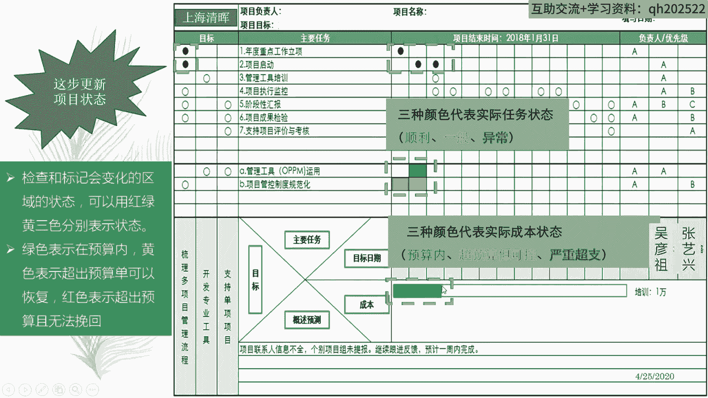

那是绿色，就这个意思都明白了吧，好，然后最后一步呢就是基于整个项目上面的计划，你做一些下一个阶段工作进展的一个什么预期，比如说大家看好啊，比如说当前这个项目进行到哪一步啦。

当前这个项目已经进入到什么3月份了对吧，那么前面两个月呢进度执行完成了这两个工作，但是从这个进度完成的结果来看的话呢，就说这个这个东西很正常对吧，这个问题管理的这个这个情况呢。

从问题发生到问题好转了对吧，哎意味着下个阶段呢，我们可以把工作重点从问题往里稍微挪一挪，到具体的执行工作的什么进度，追进度之上了对吧，这是你的判断，这是你的分析，哎，这是你见见到你项目经理。

做项目治理的能力了对吧，这是我们所谓的什么这个代数和预测啊，概述和预测，基于上面的数据事实，做下面的什么这个工作的一个什么一个分析啊，下面工作的一个安排对吧。

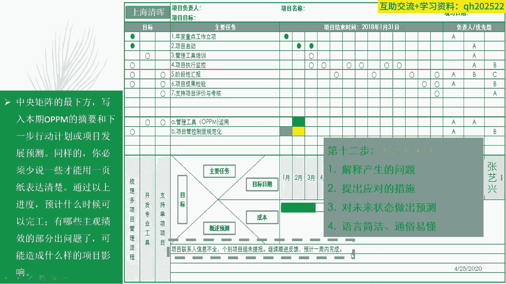

这是非常有理有据，结构化了啊，就这个意思，OK一共12个步骤。

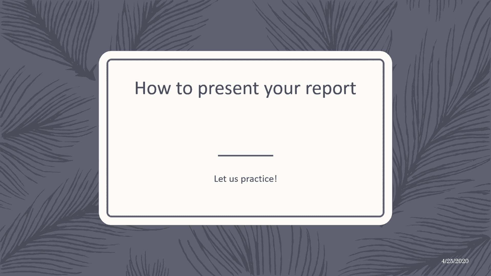

简单吧，特别的简单。