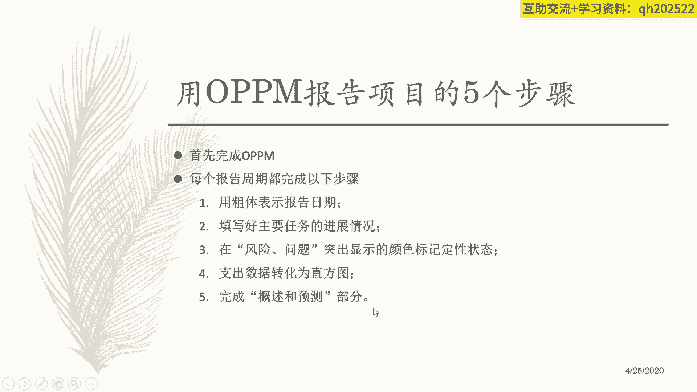

# 【OPPM报告】一页纸搞定项目管理你还不知道？只需12步，收藏起来好好学！ - P4：4、每个报告周期必须完成的5步 - 清晖Drina - BV1LS411A7fX

当你把这个opp p n报告填完了之后呢，每到一个报告周期，每到一个报告周期，你都应该去更新一下这个填写的日期，然后呢，报告项目截止到当前这个位置的时候，的一个总体状态是什么。

包括执行情况和你的什么问题，风险的情况，以及你基于当前的情况，你下一步可能哪几个重点工作项是什么。

OK吧，那么完成这个东西，然后呢，每个报告周期都简单的用五个步骤，在这个原来基础上去更新，就是当前的这个进展，用粗题表示报告日期，填好主要任务进展情况对吧，黑圈和黑黑黑黑圈，黑圈白圈圈啊，黑圈空圈对吧。

黑圈空圈在风险问题突出什么什么东西对吧，然后指望这个数据的是转化成直方图，就是成本的情况对吧。

