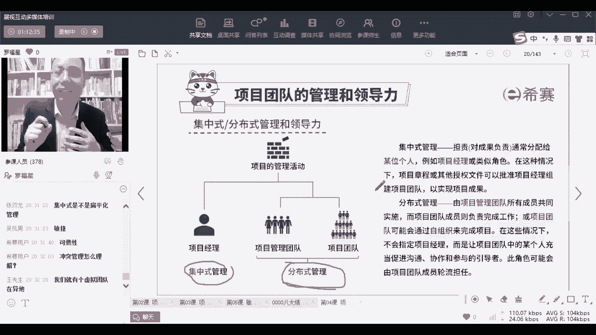

# 【PMBOK第七版】PMP认证考试全套精讲课程，免费学习（配套文档资料） - P61：PMP第七版8大绩效域之02团队绩效域-上 - PMP-B站课堂 - BV1fHW2emEdD

好我们接下来看到第二个叫项目的团队绩效率，团队绩效与说的就是我们自己团队，你看干系人呢就既包括了甲门，还包括了客户，还包括客户的领导对吧，还包括各种神仙，包括最终的用户嗯，哪哪怕打个比方。

你就是如果说你做的是一个对于这种社会公正，这样一个产品，那么就是罗老师，我会用你这个产品，那我也是你这个项目的干系人，所以干系人是一个很宽泛很大的一个概念，但是除了那个很大的那个概念以外呢。

我们还需要去了解一下是关于团队，关于团队，那团队这个概念的话，我们来认识一下，首先团队绩效率，他说所有涉及到负责去生产这个项目，可交付成果的，实现这个商业成果的这个人群，其实也就是咱们的兄弟姐妹对吧。

你们这个团队的兄弟姐妹们，你们这个团队兄弟姐妹，我在08：30的时候休息啊，马上还有几分钟，所以你们这团队兄弟姐妹，你看一下，我们就做这个绩效率的话，关键是要做一个有责任的团队，我们要去共享共享责任。

让大家都能够承担一定的责任，如果你完全不承担责任的话，你可能会对觉得这个事情跟你无关，你就不上心对吧，你要承担责任啊，第二个是要打造一个高绩效团队，什么样才叫高绩效团队，等会我们可以看一看。

别人所理解的高绩效是什么意思，你所理解的高绩效是什么意思，OK来了解一下关于高绩效，还有就是施展各种领导力，领导力这个东西啊，它不仅仅只是领导才有哦，每一个人都可以去施展你的领想领导力。

那领导力简单来讲是什么意思呢，简单来讲就是想办法让别人去来完成某些事情，来去推动这个项目的能力，就你能够让你能够去激发别人来去干活，或命令别人干活，或是引领别人干活或带领别人干活的能力，他都叫领导力。

OK那么每一个人都可以去展现你的领导力，所以咱们现在咱们现在有376位同学，咱们这376位同学，正在上听直播课的同学，你们也可以展现你们的领导力，有一些问题我不能够去回答，你可以帮我去回答一下。

来去施展你的领导力和影响力好不好，那整个关于领导的这个绩效预中，有这样几个内容来了解一下，首先一个呢是项目经理，项目经理是组织任命的，其实也就是说公司会任命你，作为这个项目的项目经理，哎对吧。

哎就是组织任命的，然后呢，你要负责去动用资源，带领团队管理这个项目，能够让这个项目成功，这是你要干的事情，所以这个项目成还是败，跟你有很大的关系，兄弟姐妹这个项目成功还是失败，跟你有很大的关系。

所以你一定要去想办法让这个项目能够达成好，这里还有一个叫项目管理团队，请注意哦，不是每一个项目都有项目管理团队，不是每一个项目都有个项目管理团队，有一些大的项目才有就某一些比较大的项目。

它才会有项目管理团队，就是你一个人管大就管不过来，假如说你们这里都有50个人，你们公司你们这个团队有50个人的时候，你能管50个人，你能够跟一号员工去聊，2号三号四号五号，7号十号，你根本就管不过。

管不过来，你一天到晚就天天在跟别人开会去了，那你怎么管呢，哎你可以分一个小组长对吧，那个小组长管第一小组，第二个小组长管第二小组，第三个小组长管第三小组啊，第七小组你就管这七个组长就可以了，兄弟姐妹。

那么这七个小组长也是领导团队，对不对，所以有一些大一些的项目，他可能会有这种管理团队，你稍微了解一下啊，还有一个呢就是团队成员，那么项目团队成员其实就是我们一起去干活，把这事儿给干成的人群。

就是你们的团队，比方说你们会有一些人专门负责做需求调研，专门会有一些人负责做架构，有一些人负责做开发啊，有一些人负责做测试，有一些人负责去做实施对吧，哎你们这个团队，所以你们这个执行团队就是这几个名词。

简单的了解一下咳，今天大概率只能讲两个啊，今天大概只能讲两个，大家需要这样的速度吗，这样速度会慢一点，但是我觉得可能会让你理解起来稍微好一点，嗯你们可以你们可以选啊，可以选，那么管理项目团队的话呢。

首先这里面把这个管理和领导，两个词给区分了一下，管理和领导这两个词给区分一下，管理更多的是管事，把这事儿给管好，这个事情分配给张三，分配给李四，分配给王五对吧，把这事情给管好呃。

后面要肯定会要给大家加1+1点课啊，可能会需要去给你们加一点课才行，OK那这是这是管事情为主，所以您看管理活动，它是聚焦于实现项目目标的各种手段，我们去规划，其实就是做计划了，然后去协调去测量一些事情。

去监督一些事情，就是关于事情为主的，那还有一个呢是领导领导力的活动，领导力活动更多的是关注人，你能够去激发人，影响人，倾听人啊，为什么倾听人也是一种领导力呢，呃我们觉得说激励激励团的成员。

或者说是引领团的成员，他是一种领导力，就是比方说你看过那种偶像剧里面说，同志们给我冲啊对吧，兄弟们给我上这种给我上，他是一种领导力，当然也有人说兄弟们跟我上对吧，这种攻我上也是一种领导力。

但是为什么倾听他也是一种领导力，你有没有想过为什么这种倾听的能力，他也是一种领导力呢，因为如果说你作为一个领导，你能够去善于倾听的员工，亲密你的团队成员，那么他会更好的去信任你，他会更愿意去跟着你混。

对不对，你想是不是这样子，如果你都不能够去倾听他，他会觉得你是高高在上的，有可能，但有可能他会仰慕你，他会跟随你，但是也有可能说，如果你的水平和能力也就这个水平，他你还高高在上，他可能就不怎么怎么你。

他肯定会跟你对抗，有可可能会对抗，而不是跟随，所以有的时候，我们需要有各种不同的手段和方式，你要想办法让对方能够去接受你跟随，你能够你给的一些指令，他是愿意去接受，并且愿意去实施，愿意去落实。

愿意去做这个事情的，OK所以你看你可以去影响他们，你可以去激励他们，你可以去倾听他们，你可以去促使他们去完成一些事，所以管理更多的是以管事为主而引，而领导呢更多的是领导人，你要想尽办法去领导人。

OK对王先生还给了一个多倾听，能够发现文问题，对这也是一个很好的一个，那么事实上关于领导力呢有两大类，就是这种呢有点抽象啊，但是我们稍微理解一下，有一种叫集中式管理，有一种叫分布式管理。

什么叫集中式管理呢，我们大家都在一起，我们都在一个办公室，都听我的这种方式，就是一种集中管理，就集权的方式，你可以把它理解为是集权的方式对吧，就听那个张张老师一个人的。

或啊听那个杜总一个人的类似这样一种方式，这就这就是一种集权式的管理，那分布式管理呢有两种分布式管理，有一种是说把权力分散给大家，也就是说咱们自己整个这个团队，我们都是当家做主，并没有说非得要去听谁的。

我们每个人都是往前冲，大家都拧成一股绳，虽然有一个领导在前面引领，但是更多的是我们会自己自觉的去做，并且会相互引领，相互领导，对这是一种被授权的团队，一种被授权的团队，你们可以去干一些事情。

这个那叫自组织团队，叫自组织团队，那还有一种分散分布式的管理是什么呢，就是地理位置是分布的，那地理位置是分布的，其实会是一种什么情况，他可能会是一种虚拟团队的方式，就是咱们不在一起，你在北京，他在武汉。

他在南京，他在上海，你们组成一个团队，你们自己去那个啥对吧，没有办法，那种很集中的一种方式，你稍微了解一下这些文字呢，我不去给你念，我给你介绍过以后，你自己再看它，我相信你能够看得明白好不好。

你大概能够去知道，有一些时候有一些事情，我们以传统的方式去管理项目，一定是一个集中式管理的方式来做事情，但是现在新的时代呢，会更流行这种分布式管理啊，西餐用户同学问的很好的一个问题，冲突管理怎么办。

冲突管理怎么样去理解呢，就是当团队产生冲突的时候，你有什么方式去处理冲突，解决冲突，你去处理冲突，解决冲突的方式和方法，它就叫冲突管理，明白了吗，而具体该如何去做这个冲突管理。

