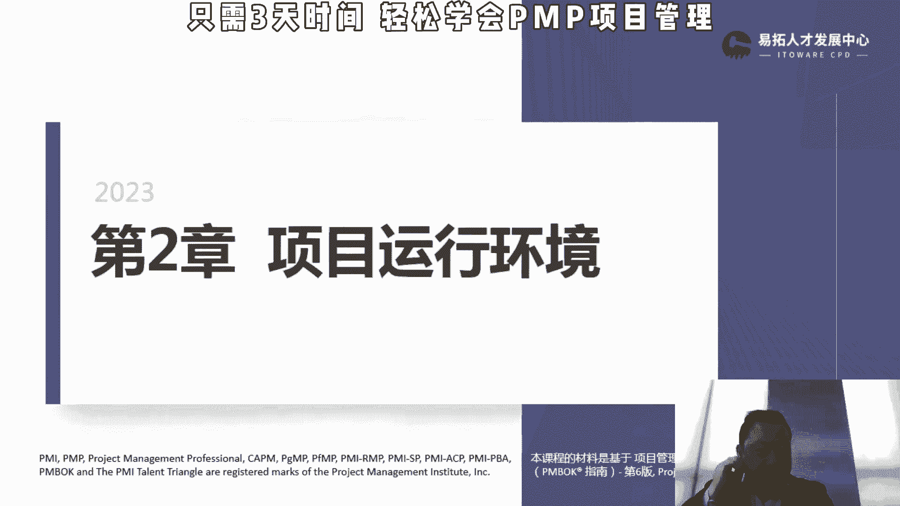
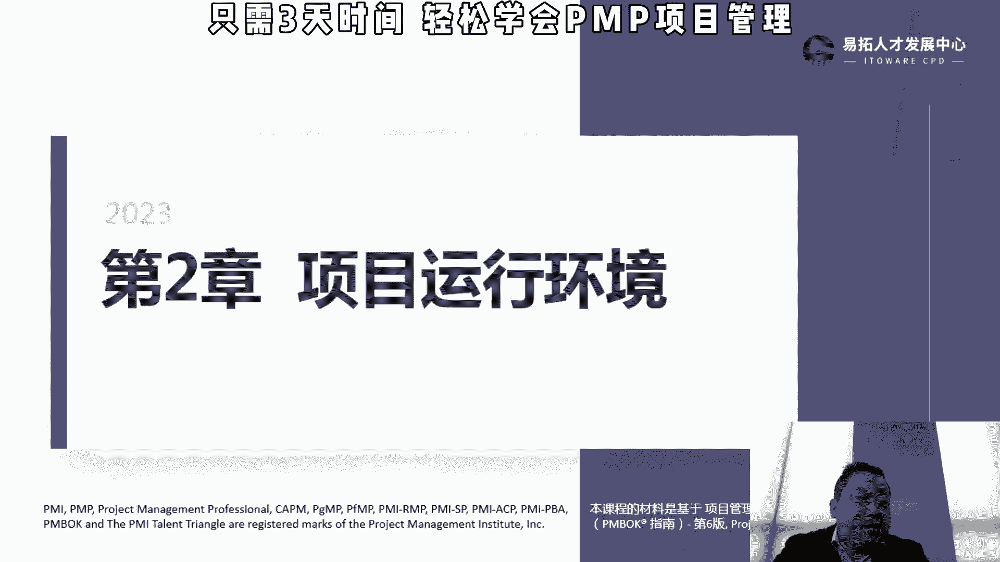
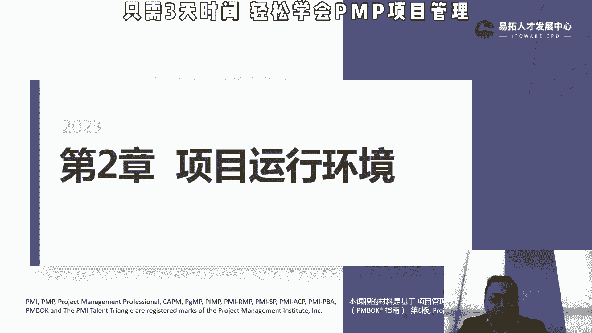

# 【PMP 项目管理】 项目管理精品课试听   PMP入门教程 学习视频 - P1 - PMP小雪球 - BV1Uh4y1g7cC

第一章引论讲了一些很多概念性的东西。

然后呢第二章我们讲那个项目的运行环境，这一章呢其实知识点不多。

唉我们就快速的过项目运行的环境，主要是两大块，第一块叫事业环境因素，第二块叫组织过程，资产，事业环境因素呢，它强调是说我们相对项目团队是控制不了的，我们只能去遵守，比如说内部的组织文化结构和治理。

对于项目来说，项目刚才讲的是一个执行者，他实际上是要受到公司的组织结构的，一些影响吧，我们后面会讲那个项目的这个组织类型，大家会看到，其实在不同的这个组织架构下面，项目经理的权限影响力，能做的事情。

可调配的资源都是不一样的，所以对他来说他是不能控制的，设施和资源的分布，地理分布啊，我我我我有一个专家在在美国，那别的地方找不到专家，我只能用它对吧，基础设施资源可用性，员工能力，员工能力。

我们可以影响，但是我们没办法控制，我们可以通过培训，通过各种各样的手段来提高，但是在去影响他，但是我们控制不了，包含给你分配什么样的人，这个人是什么样的一些水平，其实有的时候项目经理没有那么大权限。

更多的是说在组织里面，按照组织的要求给你，所以这些是假的，是内部的，那外部的市场条件，然后呢社会和文化影响和问有问题，法律的限制对吧，我想那个p图p的那个东西，然后财务考虑的因素，比如说呃举个例子。

关税这个东西我们做项目的是控制不了我，我就要从国外进口一个设备的关系就是那么高，这个东西是我们控制不了的，包括我们做对日开发的汇率，现在这个汇率跌成这个样子啊，那我们也控制不了对吧，对于我们项目来说。

我是控制不了的，那物理环境，政府或者行业的标准，那有一些词，比如说那个gb国标多少多少，这些东西学术研究这些也是控制不了，这里有一个商业数据库，呃，对不会考哈，简单给大家解释一下。

就是比如说这个市面上大概什么样的一个东西，大概它的一个成本范围内在多少，比如说我买一台电脑，可能一般的可能便宜点的两三千，贵点的两三万，你要说买个pc电脑，你说我花10万块钱买个pc电脑。

其实不符合这个一般的商业逻辑，所以会在一些商业数据库里面，会有一些关于这些产品的大致的这种价格分布，或者说这样的东西作为参考的，但是我们不能改的，所以这部分呢是说我们不可控，我们需要遵守的。

然后会提高或限制，但不要觉得是不可控，就一定会是限制哈，然后会也有可能会提高，那个项目管理的这种灵活性，并且对项目产生积极和或消极的影响，刚才我讲那个汇率对吧，那汇率现在那个低人民币汇率高。

那我们做外包的来说就不合适，就感觉是限制很大，日元现在是五点几以前，日元七八的时候都有，那个时候大家就觉得这是积极的影响了对吧，你要从五变成七，对我外貌的来说就是一个积极的影响。

所以他只是强调他是它是一个中性词哈，这个不可控，所以他是可能会提高或限制，那提高的话会产生积极的影响，限制可能会产生消极的，组织过程资产是说这个最大的是说可以裁剪，做积累，我再读一遍哈。

执行组织特有的并使用的计划过程，政策程序和测试库，会影响对具体项目的管理，在整个项目期间，项目成员可对组织过程资产，进行必要的更新和增补，我们公司有一套项目管理的流程，然后我要做一个项目。

我觉得有一部分我觉得没有必要被裁剪掉，这个就是组织过程的一个资产，我可以裁剪，那刚才讲的事业环境因素，你是不可以裁剪，那组织过程资产我们强调要多积累，我们公司做了各种各样的类型的项目，然后我有一个项目。

跟之前的某一个类型比较相近，我直接去参考之前的那个项目就可以了，会能够保证我们组织过程资产更加丰富，后面我们在这个项目的管理和指导，项目工作里面，我们会讲这个知识管理，知识管理其实是组织过程。

资产里面很重要的一部分，那它包含了弓箭，弓箭，我们可以认为是说，我们讲的这个工具和一些模板，实践和知识经验，历史经验，教学历史信息，完成的进度计划，风险数据和正值数据，就是过往的这种进度计划。

有什么过往的项目有什么风险，当时他的那个正值，我们后面我会讲s p i c p i会有什么影响，都可以作为现在项目这种参考，所以呢它是强调要多积累，积累的越多，我们参考值越多，那我们就可以裁剪。

根据自己的实际需要进行出一点，两个最重要的变化就是所以资源环境因素，内部外部都有，但是呢只需不够需要遵守的，然后只是过程资产的，所以说可以裁剪，所以将来大家去区分到底是事业环境因素，还组织过程资产的话。

主要看可不可扣扣这个裁剪，放在上面会更好会更好吧，那刚才讲的是那个项目运行环境里面，就是组织的结构，对这个项目成员的这个项目影响很大，那项目经理的权限恶化影响很大，所以呢这一块的话会对经常考的。

嗯所以组织结构，组织结构呢，首先从大的方面会分集中式或者叫职能性项。