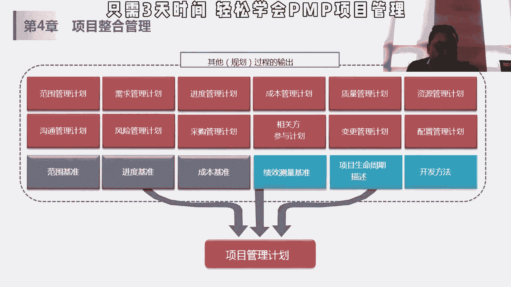
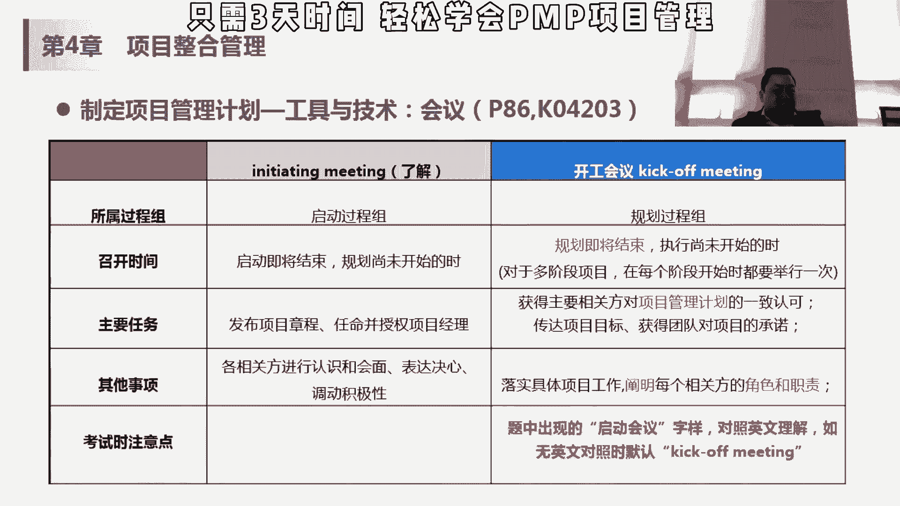

# 【PMP 项目管理】12 项目管理精品课试听 中文教程 PMP入门教程 学习视频 - P1 - PMP小雪球 - BV1zV4y117KX

变成一个相关的解法，但本身这18本书都是从其他项目的规划过程，中产生的，这个能理解他不是做具体计划的，他只是把其他的这些计划进行汇总的，其他这些计划我们会在第四章到第13章里面，一个一个给大家讲讲。

那这份项目管理计划要求做什么呢，应该足够强大，能适应这种变化的环境，算敏捷型啊，这些东西每一写的是项目，第二个要求，基准的话，确定基准前可多次变更，无需遵守正式流程，确定基准后要实施整体变更控制流程。

这个这个点大家要记一下哈，什么时候要实时变更控制流程，就是我在计划阶段，我的计划还没有完全定，这个时候其实我是可以变的，我在范围的这个，或者是进入这个计划，在做的过程中没有bassline。

这时候客户说哎我这个想记录提前一点，这个想进入比例一点呃，或者中间想压缩，这时候你可以不用走电动连锁，你直接按照这个对象就把它做到bci里面，但是一旦你做出来的肥ci，就说我已经有了这个进度。

基准范围基准和成本基准的时候，客户在提出改革加一个东西，对皮肤变得越疼，我要这个东西，原计划两个完成的，我我希望你能够在一周之内把它打下来，都变成这个数，哎我我需要加点什么东西啊，其他成本都变成这存。

所以这一点一定要记住这个左边的流程，一个点是基本确定前后，鉴定明细有项目收尾之前，该计划需要通过不断更新来建立明记，并且更新需要得到控制和批准，更新的话，我们走这个整体变更控制流程来进行。

对控制和批准渐进明细，什么意思呢，就是说刚才讲了，我在装房子的时候，我不需要再决定抓房子的时候，我就把我们家将来放那个呃，我们家的那个什么，每天比如说我我要先做这个地板，然后或者说我做这个瓦工。

再做木工，然后再做家具的这些东西，我不用刚开始在我第一天的时候，就把所有东西都排得整整齐齐的，我说我三个月之后的第二天，我我要怎么样怎么样，因为一旦变化的话，其实你后面整体项目都很都都可能会受。

严重的对吧，而且你也没必要在开始的时候做那么细，你做得越细，越说明你要花更多的时间来做这个事情，刚开始的时候，我把大的这个我们讲里程碑做得好就可以了，我在3月，今年3月18号。

我在4月底之前我要完成瓦工，5月底之前完成幕后，然后什么是之前我要把家具买好，到时候具体买什么家具，哪天进什么家具，到那个快到了那个时点请进行确认就可以了，所以它是两个叫渐进明细，那我们做项目的时候。

也通常会在合同里跟客户约定，所以说哎这个项目要做六个月，你三个月的时候你要交付什么，都第二个月你要交付什么东西，第一四个月这个分工程对吧，我第二个月我要交个蓝图，第四个月我要上线。

然后d后面的话我要开始运维，但是具体的在配置阶段我做什么计划，什么东西的话，我在蓝图阶段来说是不用去关心的，在开始前一段时间把它做的气势就可以了，其实这个计划是需要的，但是没有必要在一开始的时候就做的。

特别是到那个阶段去做就ok了，所以说它是需要不断的更新来鉴定人气的，这个大家能有这几个例子，这就是我们做这个偏僻嘛，考试我们现在只知道两个月之后要考的就行了，然后我不需要知道，我说我今天要刷多少题。

不要什么招了对吧，我达到什么水平，那我听完这个课之后，我对大家的要求是，把这个每个章节后面的题刷完，唉然后你这些可以排啊，老师如果给我四张四张，其实每章的题目不一样，大家可以看啊，有的可能就十几道题。

就是我们第四章一共90多道题，那我怎么去排除这个计划，这时候我不用考虑，我说两个月之后就做模拟题，又该怎么刷这个啊，这就是这样的，就是鉴定明确，就是到那个时候你去做这个名字就ok了，所以要足够强大。

要基准化，要建立明细，这是我们管理项目管理计划要做到的，那他是要做作为其他这个项目的规划过程，组织规划过程的输出来统合成项目管理工。

你看所以输入嘛项目章程肯定是对吧，因为章程，所以我要做这样的一些计划，我有项目的目标，项目的这个还leo的一些范围成本基准，然后呢它的输入其他过程的输出，其他规划过程的所有的子计划和基准。

都要作为这个输出管理工具，它也要做这个数据相关的收集，头脑风暴，咱们讲过了热点消毒，讲过了访谈，这里面有个核对单，核对答案就是check list，checklist呢说白了呢相对来说嗯不是那么难。

但是会比较有效，就是刚才讲的我要装修，我要从头到尾装修的话，我要做哪些事情啊，我要去谈呃，谈这个包工队，我要去购哪些东西是需要我购买的，你可能列个清单做了一下，勾一下，这是对你来说。

就是我们作为提醒嘛就不会漏，但如果你你也想，今天我想a后天想b，这个有的时候说白了就是容易被遗漏，那以前我们做项目的时候，以前做这种设计阶段，要求这个，客户有哪些要求，我们设计书写到什么程度。

然后呢包含你做这些项目比较完了嘛，这个每一段写在哪个具体位置，这个贴图要多大对吧，他就越细致，你可能遗漏的东西就越多，所以我们当时就做了一个类似设计啊，或者编码的一个cp list。

每个人做完之后对照这个check list，一个个都确认完了，这个算基本合格啊，立马因为太细致太琐碎而遗漏，客户check的时候，他可能check的很仔细，所以这个会有核对答案。

那我们做做项目管理计划的时候也是这样的，管理计划刚才讲了三个计划，就是加三个基准，加三个，其他这个很容易遗漏，那如果有checklist的话，其实对整体是有帮助的，然后还有一个会议。

这个会议呢也比较重要，就是开工会议，我们叫kick off meeting，它是规划过程组的，几乎可以说规划过程组的最后一个，动作，规划即将结束，执行尚未开始，这个时候呢。

要获得相关方对项目管理计划的一致认可，传达项目目标，获得团队对项目的承诺，落实具体工作，阐明每个新官方的角色和职责，一般叫kimmeting，通常呃我之前做项目，就是把项目计划都做完了之后。

我们会开黑猫mini，这时候呢一般来说会有项目发起人差异，那也会有下个团队来参与项目，发起人参与的是确定我整个这个计划，包含了我的范围，成本啊，进度是在整个这个项目章程或者项目，这个目标范围内的。

你不能做一套东西，老板没批或者超过老板预算肯定不行，所以说在提高meeting的时候呃，一般老板和高层去参加和确定电动，然后呢，因为这个时候你的执行团队可能刚刚进来。

刚要进来，马上要进入执行了吧。