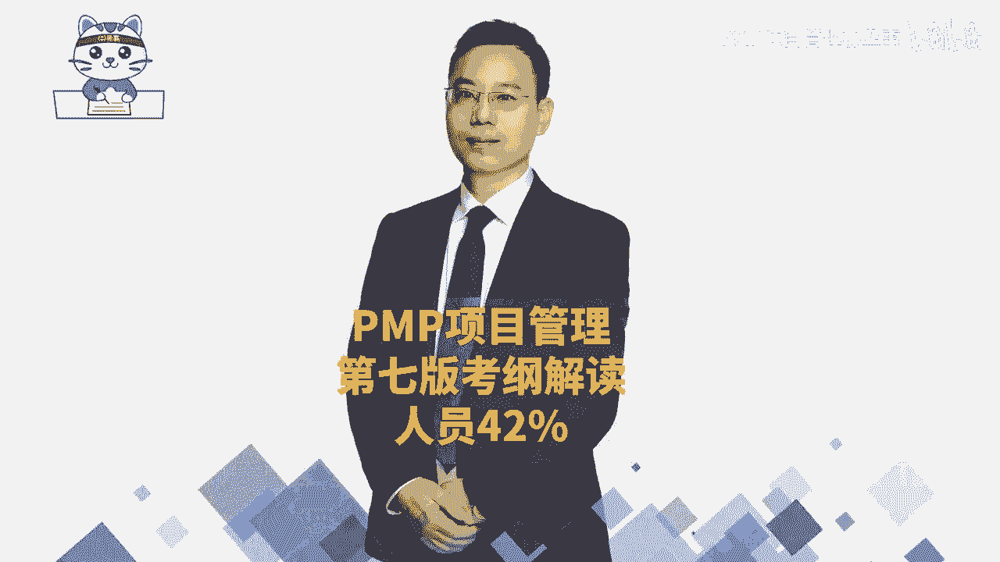
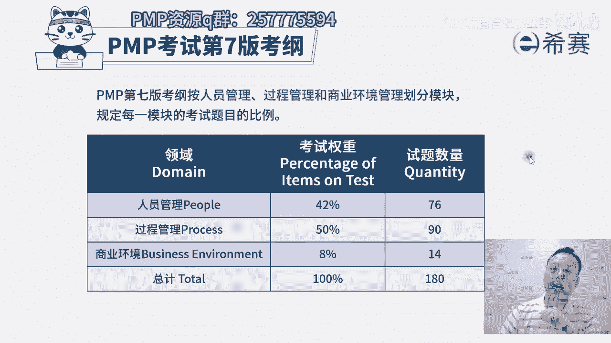
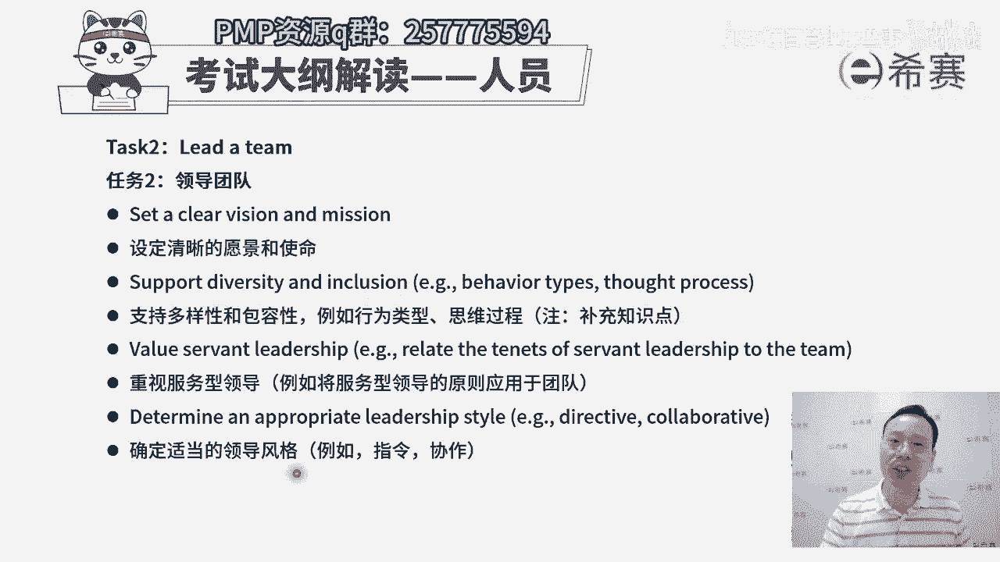
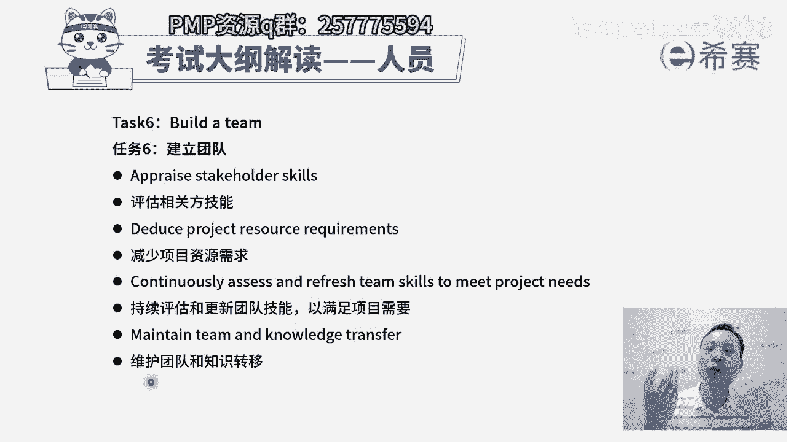
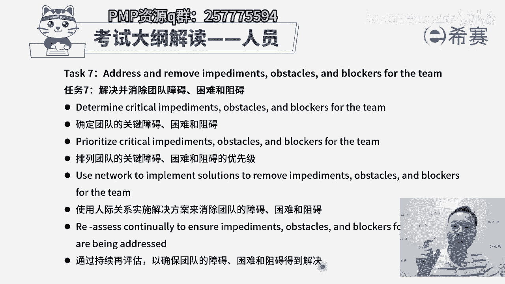
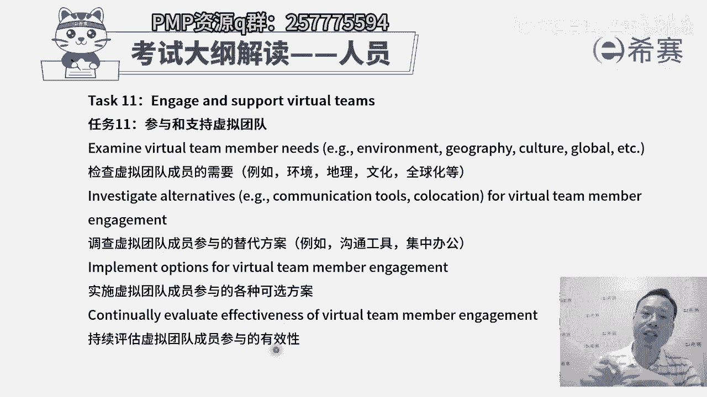
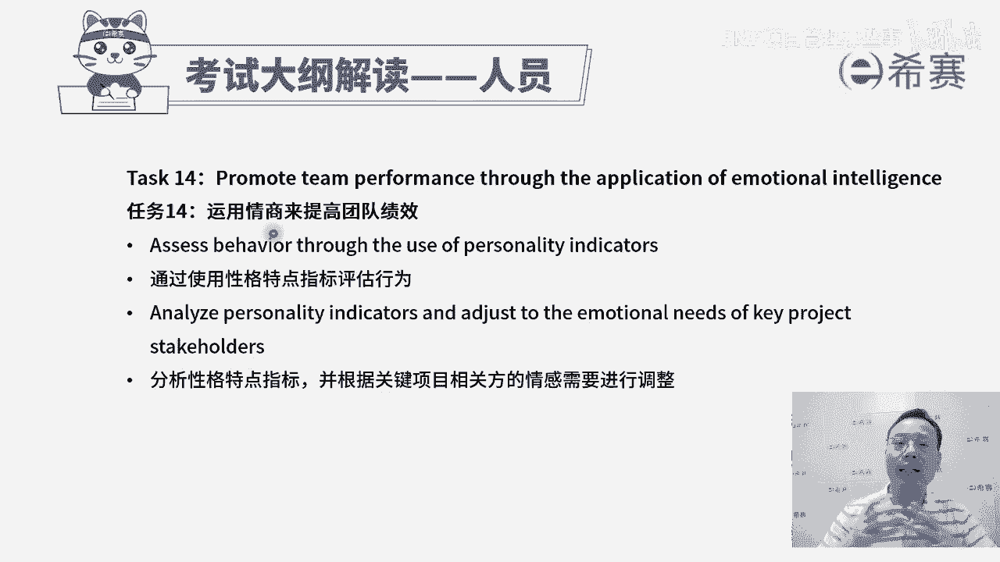
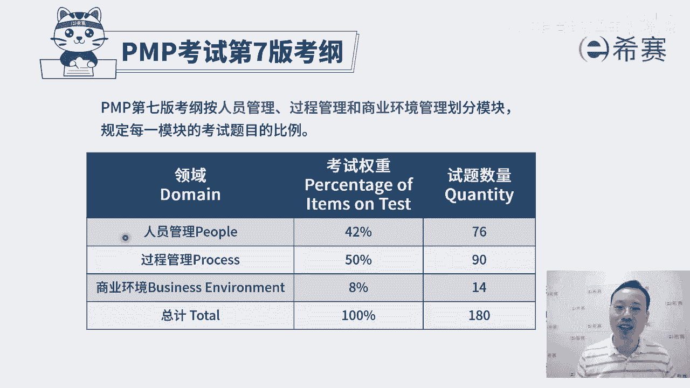

# 【PMP指南】PMP第七版考纲三大板块之人员42%大咖讲解，新手如何了解PMP详细教程 - P1 - PMP项目管理那些事 - BV1wAe4exEXz

大家好，我们一起来看到的是PMP考试第七版考纲中，关于人员的这个板块，那整个第七版考试呢，它目前是按照人员的这个板块占比，占到42%，有76道题目，然后过程呢占到一半，有90道题目。

然后还有商业环境占到8%，有14道题目，我们来看一下整个关于人员这个板块呢，它的这些考纲一共有14条task。

整个考纲，他其实讲到的是关于人际关系与团队技能，就是我们的软技能，包括沟通能力啊，倾听的能力啊，冲突处理的能力啊，情商啊，影响力，领导力，谈判的能力，然后观察交谈，政治意识，团队建设等等这些。

那我们重点会是按照这样一个项目经理呀，团队呀，跟干系人呐。

还有沟通这几个维度来去考虑，我们一起来看到，首先第一个任务task叫管理冲突，我们经常会讲到说有人的地方就有江湖，就有是非，那有冲突是在所难免的，我们得要了解一下到底是为什么会有这样冲突。

冲突的来源有哪一些，以及目前冲突的严重程度是什么样子，然后呢，再去分析一下可能导致的这一个背景是什么，再来去找到一些可能的解决方案，可以去评估一下解决方案，推荐解决方案，然后去协调解决方案。

这个呢我们在冲突管理这一段，已经是有学过了啊，这是冲突管理，这是我们需要去了解的，那人员的第二个内容叫领导，团队，其实也就是有领导力，所谓领导力我们前面也讲过，说兄弟们给我上。

兄弟们跟我上都是一种领导力，就是能够去引领别人，来去完成工作内容的这样一种能力，那你要去引领别人，首先你自己要有一个清晰的目标，所以是设定清晰的愿景和使命，这样才能够去激发大家。

然后第二个呢支持多样性和包容性，也就是说大家可能是各不相同的，其实可能每一个人，他的这样一种行为习惯和行为处事，那那个唐僧他要带领着像猪八戒这样的人，孙悟空这样的人，和沙和尚这样的人是完全不一样的人。

那你要去领导不一样的人，包括他们这种行为呀，想法呀，习惯呐，能力啊各不相同，第三个要重视服务型领导，也就是这个是我们在后面讲，敏捷项目管理的时候，会展开来讲的一种叫仆人式领导，或叫服务型领导。

也就是领导，你不是那个高高在上的，来去发号司令的这样一个角色，你更多的是能够去为团队提供支持和帮助，让团队更有效的去做某些事情，把这事情往前推进啊，会更加重视服务型领导，其实在敏捷中会重点强调好。

最后一个要确定适当的领导风格，嗯就是其实你在不同的场景下，你管理不同的群体，你这种领导风格一定是要有所调整，你去管蓝领工人和管这些白领阶层，你管那种文化工作者和管这些程序员，他的管理方式一定是不相同的。

你需要去有效的调动大家的积极性，来去参与一些事情。

来去解决事情，所以这是你要有这样一个领导力，能够去领导团队，并且呢在整个过程中，你需要去懂得一些关于激励因素啊，激励模型，因为其实我们在前面已经是学过了很多，激励模型啊，就是这些激励模型它不相同的时候。

他的这种操作方式是不一样的，你能否去激发激励鼓励大家来做某些事情，并且呢我们大家一起去共事的时候，你也要善于去利用这样一种所谓叫做团队章程，或者呢叫社会契约，就团队章程。

社会契约它就是我们经常会讲到一个词，没有规矩不成方圆，那这个呢就是我们的团队规矩，咱把规矩列好，不管说是共同共事的规矩，沟通的规矩，产生冲突的规矩，汇报的这个制度规矩，奖励的这样一个制度规矩。

惩罚的制度规矩，我们提前把这东西列好，并且有效去落实，这是去激发激励和影响团队，然后再有一条叫分析团队成员和相关方的影响，哎我们需要去了解大家的这个，比方说他的权利呀，他的利益啊，他的这些个影响力啊。

他会看重什么东西啊，你对他有越多的了解，那么你才能够越有效的去打动他，去引领他，去影响他区分各种方案，以领导各种团队成员和相关方案，其实也就是说我们的这种领导方式，针对不同的人。

你的这种管理风格和领导策略方式是不一样的，以及针对同一个人，他在不同阶段的时候，他在作为一个新手阶段的时候，作为一个正在学习的阶段的时候，已经是比较熟练阶，段时候已经是可以独当一面的时候。

我们都是会有一些不同的方式和方法，来去领导他们，引领他们好，这是关于领导团队，其实也是你的领导力好，第三个任务呢叫支持团队绩效，其实也就是说你要有一些好的方式和方法，能够去让团队成员成长起来。

并且它到底有没有成长，你需要有一套这种度量的指标，来去测量它是不是真的成长了，所以第一句话叫，根据关键绩效指标KPI来评估团队成员的绩效，看每一个人他的这样一个行为模型啊，能力模型啊。

各方面是不是达到一个我所期待的，这个状态和水平好，然后是支持并认可团队成员的成长和发展，也就是说团队成员他如果在这一岗位上，他还不足的话，他需要去弥补某些技能才能够去完成，胜任的话。

我们需要去帮他来找到这些东西来支持他，让他去成长，并且呢他如果真的有成长，我们也要对他表示认可，还有就是他为这个团队做出的贡献，我们也要去认可他啊，去支持他，确定适当的反馈方法。

因为他可能在做事情的过程中，我们其实需要很多的这种正向反馈对吧，我们自己需要一些正向反馈，那同样的我们的团队成员，他也需要一些正向反馈，他做的不好的时候，我要告诉他诶你可以怎么弄，就变得更好。

他做的好的时候，我们说诶这样做非常好，你继续加油，可以做的更好，类似这样一个方式，我们需要有一些反馈的机制，需要给到他反馈，其实这也是在给他指路指路指路啊，给他导航，那还有一条呢是核实绩效的改进。

就是他如果说目前的这个表现情况，有点差强人意，有什么样的一些方式和方法能够去优化改进，提升，让大家更有的动力以及能力更强，能够更好的去往前冲，这都是你作为项目经理，你所需要去关心的。

这是关于支持团队绩效，然后第四个任务呢叫授权团队成员和相关方，你要知道你在什么情况下，你才舍得授权，一定是他做的还不错，所以我们有一个基本认识，就是当我们想办法让他提升起来，并且让他做的还不错的时候。

我们才会去授权他去做一些事情，对吧好，您看，首先是围绕团队优势进行组织，什么叫围绕团队优势，经营者组织其实就是这个团队，他如果在某一方面很强，那么在这个维度上，我们是可以授权让他去做这个事情。

他如果说是在这方面很弱，那这个事情上呢，他其实还是要受管控，受控制的对吧好，还有第二个呢支持团队任务的责任，什么叫支持团队任务，责任就是他们是自我组织，自我管理，这个呢我们在敏捷中会看的更加仔细一点啊。

大家是自我认自我认领任务，自我组织，自我管理，你不要去微观管理，你要避免微观管理，你要管大条，管大内容，我只管给你一个，就是我给你定一个目标，然后我要一个结果，你只要做到了都是OK的。

过程中我可以适当的去考察，但是我不会盯的那么细，那么细好，这是支持团队的这个任务责任，还有一个呢是评估任务责任的这个证据，其实也就是你要有依据，你说他表现的好，你有依据，你说谁表现的还不太够。

你也要有依据，你要有数据说话，我们前面学过一个叫政治分析对吧，拿正直来去看待这个人的这样一个完成情况，也是可以的一种方式啊，还有就是说确定并赋予不同等级的，这个决策权限，他的水平是这么高。

那么你就可以给他多一些这种权限，让他去自主自主裁量，他的水平是这么高，那么我给他自由裁量权就少一些，他如果水平在这里，什么也不要自己做决定，什么东西都听我的，我告诉你，这里我指哪，你打哪就可以了对吧。

我按按我的要求来进行就可以，所以不同的水平，不同人员，你的这种授权方式是不一样的，以及同一个人他在不同的阶段的时候，你的授权方式也是不一样的，然后看到第五个任务，确保团队成员得到充分的培训。

以及确保相关方得到充分的培训，相关方也叫干系人，首先就是你要去知道团队成员，他并不一定说一定，都能够满足我们这个工作的需要和要求，他如果不满足怎么办呢，我们需要去把那个能力给拉上来，拉起来怎么拉。

有一种最快的方式就是培训，那我们先要去了解他需要一些什么培训，他需要一些什么样的技能和能力好，如果说发现或明白了以后，接下来就是根据这些要求，我们来去定一个培训方案，比方说很多企业他会去找席散来去啊。

做这样一个团队这个成长的培训方案，那我们也就是罗老师也会经常去一些企业，给他们做一些项目管理培训呢，产品管理培训哪啊，这些就我们还有些很多老师，去给他们做各种技能培训，那你有这样一个培训的需求。

并且是基于这个需求来定一个培训方案，然后接下来就是去找到对应的资源，这个找到对应的资源，它不一定是项目经理自己亲自找，甚至说不一定是项目经理亲自来给大家培训，可以亲自做，也可以是寻求其他的帮助。

找PMO啊，那找公司的人力资源部啊，呃找这样一些个团队来去获取资源，可以是公司内部的这样一些内训师，也可以是外部的这样一些培训师，也不一定是非得是内训师，也可以是公司内部的一些其他的工作人员。

他不一定是专门的工类型师，他就是普通的工作人员，但他在这一方面做的非常好，他也可以给大家提供培训，这都是可以的啊，当然也可以去从外部找人都是可以的，并且呢我们培训，其实你不能够是光是靠这一个培训。

因为有的时候如果没有考核呀，很多人他就不认不认真，所以呢这还有一个叫度量培训的结果，我们需要有一些考核，需要有些考察，来看大家的这个进展情况，看到底做的怎么样啊，这是第五条。

要去确保团队成员他得到充分的培训，DANA这个充分这个词，你不要去非得叫钻牛角尖说啊，我怎么样才叫充分，他的意思就是说，我们要想办法让他能够达到这个工作岗位，所需要具备的技能和能力，尽量让他达到。

是这个意思啊，然后呢再有一个叫建设团队，那建设团队其实我们让他去达到，这也是建设团队的方式之一，但是建设团队中还包含了什么呢，就是人和人之间，那么这里你看，首先第一个要评估相关方的这些技能。

或者说团队这些技能，第二个减少项目资源需求，嗯也就是说如果说我们的技能水平越行的话，那我可能就不需要那么多人来去做，对不对，我水平不太行的时候，我觉得需要更多的人来去完成，那么我们团队成员开水平。

我们要去评估一下，如果达到某种状态或水平的时候呢，可以适当的去减少一些对应的资源，把这个资源释放出去，可以去做一些其他的事情，并且呢要持续评估和更新团队技能，刚开始小五进来的时候呢，他是一个初级工程师。

现在呢他已经成长为一个中级工程师，他已经可以去负责好多好多事情了，他就不需要专门有一个师傅去带着他呀，还需要嗯他一天只能做一点东西呀，他可以甚至两个小时就可以完成某些事情对吧，那么我们要不断去评估。

这样的话呢，对他的这一工作任务的分配也会有一些调整，还有就是维护团队和知识转移，这个什么意思，就我们后面会其实专门也会讲到，就是他在做这个事情的过程中，一定会有一些经验和教训，那么好的经验要传承下来。

要分享出去，坏的教训也要留下来同步出去，这样的话，避免下一个人在这个类似的事情上栽跟头，以及说能够让下一个人在类似的事情上，可以做的更好一些，这些都是能够让我们团队变得更牛的，一种方式啊。

这是关于建立团队，这些都是能够让我们团队变得更牛的。

一种方式啊，这是关于建立团队，然后建立完团队呢，其实团队他在真正做事情的过程中啊，会遇到大量的这样一些困难挑战障碍，那我们还需要去帮团队去成长，那你怎么样去帮团来成长呢。

你首先得要了解团队都有什么一些困难障碍，所以是确定团队的这些关键障碍，困难和阻碍好确定好，然后发现哇这么多这么多这么多的情况下，我们的资源永远都是有限的，你的精力也是有限的，怎么办呢，我们对这些个困难。

障碍和阻碍来进行一个优先级排序，我们优先处理最前面的，然后再然后对吧，有这样一个先和后的这个关系，好，排完序，以后接下来他说使用人际关系来去，实施解决方案，哎，以消除这样一个障碍，因为很多时候。

比方说你说你发现这个流程推不动，那可能需要我来去给那个刘总打一个电话嗯，那可能你会发现这笔资金，他客户一直是不能够及时的去支付，那可能需要有商务出马来去，跟客户有一些互动和交流啊。

或者呢可能需要有采购部来去出马，来去做某些事情，所以他会说通过各种各样的方式来帮助团队，去消除障碍，比方说有些人他经常三天两头被拉过去去开会，但是这些会议呢跟他的工作本身没有什么关系。

那这个时候项目经理就要出马来，去跟那个召开会议的人去沟通说啊，那下次呢可以能不能够就不要去找谁来开会，但是也能够达到他的目的，所以这是通过各种人际关系技能来去帮团的，去消除障碍。

这也就是服务型领导所需要去干的活，我们在敏捷中会展开来讲好最后一句，通过持续的再评估，以确保团队的障碍，困难阻碍得到解决，因为这些困难障碍，他不是说今天出现了就不会再出现了，可能会后面突然又冒出来。

会讲到昨天干了什么，今天要干什么，以及干这个事情的过程中遇到了什么困难，挑战和障碍啊，这在敏捷中会更多的展开来讲，而你作为一个仆人式领导，作为一个服务务型领导。

你需要能够去帮团的去消除障碍，困难和阻碍好，第八个任务，谈判项目协议，那所谓谈判项目协议，其实在生活中，项目经理通常不太具备这个能力，也不太需要去有这个职责来去做这个谈判，但是呢我们需要稍微了解一下。

其实在签合同的时候，甲乙双方之间一定是有一些协商的，OK这个协商谈判，就是谈判以后已达成双方的共识，双赢共赢才是一个好的局面，对吧，首先第一个分析谈判的边界，已达成协议，就是你负责做什么东西。

我负责做什么东西啊，我们各自哪些是范围以内，哪些是范围以外，然后什么时候要交付什么东西，要你以及你要去交付多少钱，第二个评估优先事项，并确定最终目标，也就是要做的事情有很多的情况下，最核心的是什么。

最重要的是什么，以价值为导向，这也是在敏捷中会强调以价值为导向的方式，然后并且把整个要做的事情给框定下来，第三个验证项目协议的目标是否可以得到满足，这也是在最后做验收咯，就是我们整个项目完成以后。

在验收的时候，那需要去考虑按什么来验收啊，按合同来验收，所以是按照这个协议来去验收，看协议的目标有没有达成，按合同里面的要求是不是有达成，还有一个是参与协议的这个谈判，就是协议中可能会有很多内容。

这种具体条款我们需要去做一些协商，还有说确定谈判的策略，什么谈判策略，其实有一个最为有意思的，就是大家去买东西的时候砍价，你砍价的时候，如果价格砍不下来，你说那那算了，那我就不要了，我就走了好。

当你走的时候哎过来过来过来，这也是一种策略对吧，就是我去放弃它，当了真正的在一个商业上的，这样看这个谈判策略呢，我们在这个行业，在这个偏僻考试呢，不去涉及，不去涉猎，它是一个专门的一个学科，一个学问啊。

那么这就是关于那个谈判项目的协议，这样一个任务来，看到第九个任务叫与相关方合作，那我们怎么样去跟相关方合作，那首先第一个就是我们去做事情，一定是需要去满足相关方的需求，那你先要去了解了解它的这一个需求。

所以第一条他说去评估利益相关方的，这个参与和需求，也就是说他可能有什么一些呃功能上的要求，性能上的要求，沟通上的要求，汇报上的要求等等啊，我们去了解了解，并且呢他可能什么时候会去参与建一个项目。

支持这个项目或者拒绝这个项目啊什么的，或者说是有一些阻碍之类的，我们了解的越清晰，越具体，就越可以有针对性的来去帮助，来去解决，来去化解好，第二个优化相关判断，需求期望和项目目标之间的一致性。

其实也就是说他的需求，如果跟项目目标之间有一定的偏差的时候，你需要去引导他，需要去达成某一种共识，是这样一个逻辑啊，最后一句，建立信任并影响相关方，以实现项目的目标，其实也就是说。

我们要如何来去做这样一个相关方的参与呢，是要去争取它，让他更好的去支持这个事情，让他们的抵制变得更少一点点，抵制变少，知识越多，那这个项目就更容易去达成，所以他怎么样才能够去支持你。

你需要跟他有一种信任的氛围和环境，所以你要去构建信任，这也是你项目经理的一个技能，这是第九条叫与相关办的合作，那id看到第十个任务叫建立共识，这个建立共识更多的讲的是什么呢，其实是沟通中去解决误会。

我们在前面讲过说，人与人之间有人的地方就有江湖，就有是非就有冲突对吧，那除了有这种大的冲突以外，可能还会有一些小的误解，如果说有误会有误解的情况下，我们说其实很多时候是源于什么信息的不对称。

当有一些信息不对称的时候，可能会有很多的误解产生，我们都要先分析一下误解它的原因是什么啊，用一些根本原因分析，用那个因果图，鱼骨图无外法等等这种方式来去分析，然后第二个是调查所有必要的各方已达成共识。

也就是说如果双方之间有误解，我们一定是让大家一起过来，那么这其实也是冲突中的一种处理方式啊，来去达成某种共识，支持各方协议的结果，如果说大家一起达成了共识，那么这个共识的结果呢，我们都要去支持你。

不要说开会的时候啥也不做声，开完会以后在BBBBB这种方式是最讨厌，最让人头疼的对吧，那么既然开会已经定下来了，定下来的东西大家都去遵守好，后面还有个说调查潜在的误解，其实也就是说这个关于误解这个事情。

还要持续持续去考虑，因为有可能后面还会导致什么样的一个情形，又有些新的误解呢，我们是需要去做一些操作和处理，OK持续来去发现并且去处理这些误解，这是任务时叫建立共识，好任务，第11个。

参与和支持虚拟团队诶，这个终于讲到一个新的东西叫虚拟团队了，虚拟团队他特指的是说我们大家在工作，但是呢不是在一起，我们可以通过电话的方式，网络的方式，邮件的方式来去沟通交流联络。

那么这种虚拟团队我们都知道，首先第一个他的可能是地理位置对吧，方案分散在全球啊，地理位置啊什么之类的，但是呢它有它的好处，就是它能够用更短的，更小的代价来获得更优质的资源，而它的弊端就是沟通有障碍。

那么关于参与和支持虚拟团队，我们来认识一下，首先第一个检查虚拟团队成员他的一个需要，而他可能会在哪些地方呢，我们怎么样才能够去做到一种联络和互动啊，还需要有网络呀，而需要有一些什么电子看板呢。

还需要有这样一些个在线沟通的，这样一些系统啊，第二个调查虚拟团队成员，他参与的这样一个替代方案，就有什么好的工具和方法能够去帮他，或如果是他达不到的时候，我们还可以怎么办呢。

哎我们能否用就是公司的一些其他人员，集中办公的方式来去解决某一些事情，第三个，实时虚拟团队成员参与的各种可选的方案，其实也就是说如果虚拟团队成员一起来去讨论，得到某一些方案以后呢。

也是可以去落实和执行的好，最后一个持续评估虚拟团队成员，他参与的这个有效性啊，如果说他状态不太好不太行，那你也是需要去跟他有一些交流和互动，想办法把他这个状态给拉起来对吧，其实很多时候就是沟通不畅快。

真的是会影响心情，影响心情以后整个状态就会变得down一点，但是也要让它持续小赢，持续能够做成一点东西，让我们配合极其默契，即便不在一起，依然是能够心有灵犀一点通，这就是参与和支持虚拟团队。

接下来看到第12个任务，定义团队的基本规则，嘿这就是我们说没有规矩不成方圆，我们把这个规矩给定下来，就人和人之间一定要有一些基本的规矩，你看与团队以及与外部层相关方一起来去沟通，一些组织的原则。

也就是说我们去行为处事，有一些什么基本的一些条款，这个PRINCIPES是需要去共同遵守的，包括说汇报的时候怎么怎么汇报，然后打电话的时候怎么样弄，开会的时候怎么样去弄，然后写一些代码的时候。

要有些什么样的一些备注啊，头文件呐，然后check in啊，check out呀，这些东西都要一些基本的规矩，OK好建立一个促进遵守基本规则的环境，规矩是定好了，但是你知道有时候有一些好的环境。

它能够激发人的这种善意，一些恶的环境，它会激化人的这种恶意，对吧，那我们能否去创建一个比较好的环境，让大家都愿意去遵守规则，那些破坏规则的人士得到惩罚，而遵守规则呢会得到奖励，得到认可。

那这样的话就是一个比较棒的一个状态，最后一句，要管理和纠正违反基本规则的行为，也就是说如果有谁去违反规则，他是需要需要受到处罚，受到惩罚，如果是在遵守规则，我们可以表示认可。

甚至可以在一定程度上表示奖励，这是关于第12条定义团队的基本规则，第13条，指导相关方，那么其实相关方他在参与这个事情的时候，他有他的一些想法和意识，但是某一些时候，某一些事情我们也需要他来配合和支持。

那如果说他不太会的话，怎么办呢，我们也要去引导他，要去指导他，要去mentor，所以不仅仅是要去指导团队成员，还要去指导相关方，那么指导相关方呢，我们同样要去分配合适的这个指导时间。

并且呢你要去逮住机会来去给他提供这些指导，因为有的时候也要是一种比较巧妙的状态，你去帮助别人，也要是让别人觉得很舒服的状态，所以他给了一个叫识别，并就指导机会来采取行动。

也就是说你要找到机会来去给别人提供指导，这是关于指导相关方，最后一条关于人员的建议，考纲呢叫运用情商来提高团队绩效，那情商这个词它跟智商类似，就说你去运用情绪的这种商术能力。

首先第一个说通过使用性格特点指标，来评估行为，那性格特点指标其实有很多啊，比方说九型人格呀，然后DISSK模型哪呃MBTI呀，这种方式都是可以去对人来进行评估的，我们对这个人进行评估。

而是说能够通过这样一种方式呢而知道哦，可能他更适合做什么什么事情，或他的习惯是怎么怎么样的，这样呢我们就能够更有效的去用好这个人，好下面一个分析性格特点的指标，并且呢根据关键的项目。

相关方的这个情感需要来进行调整，其实也就是说你能够让他好好的去做事情，并且能让他心甘情愿的去做某些事，情，还能够让他变得做的很愉快对吧，哎这是一个非常棒的一个事情，其实这一条就是运用情商的人能力。

我们能够让别人舒服，也让自己舒服，那刚刚呢我就是花了一些时间。

对于考纲中人员这个板块来进行解读，其实不管说是这种领导力啊，沟通能力啊，冲突解决能力啊，情商的运用的能力呀，还有会议的能力啊等等，所有跟人打交道这东西，包括谈判呐，这些东都是还是很重要的东西。

不只是考试中重要，生活中尤其重要，希望每一位小伙伴在这个板块中。

