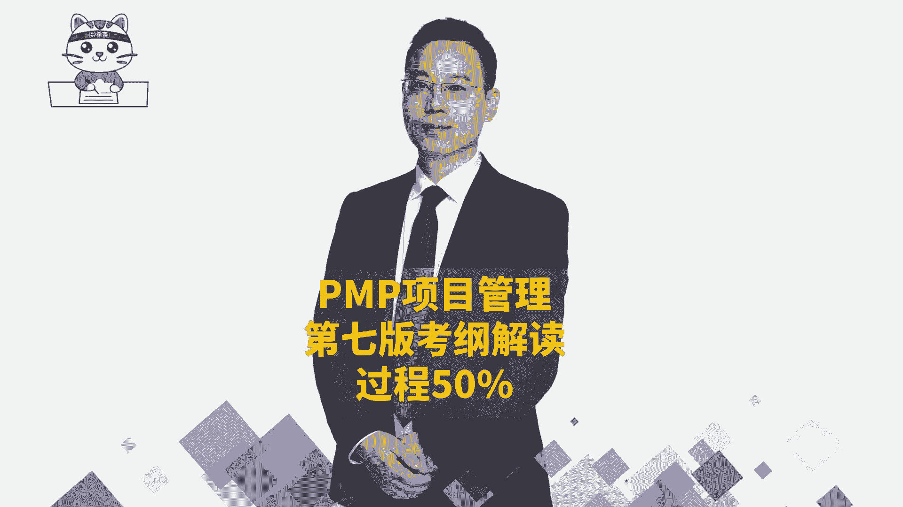
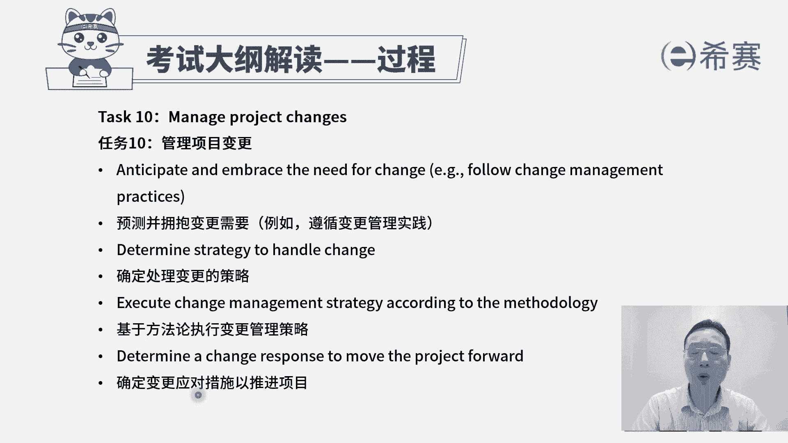
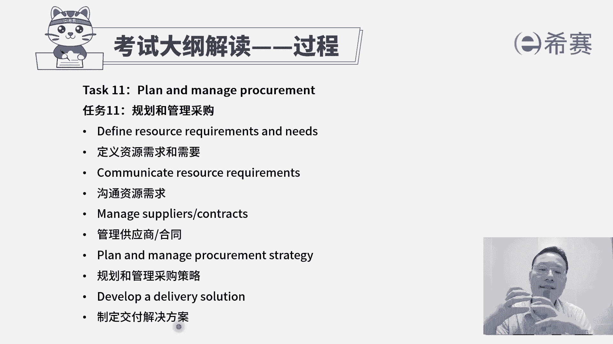
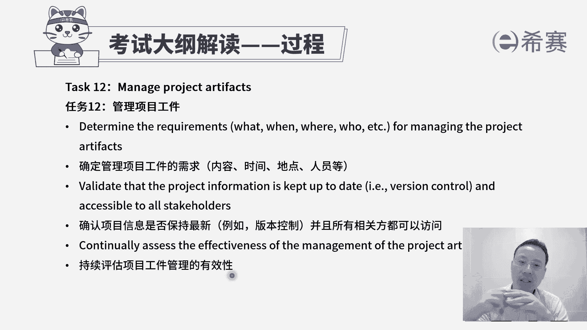
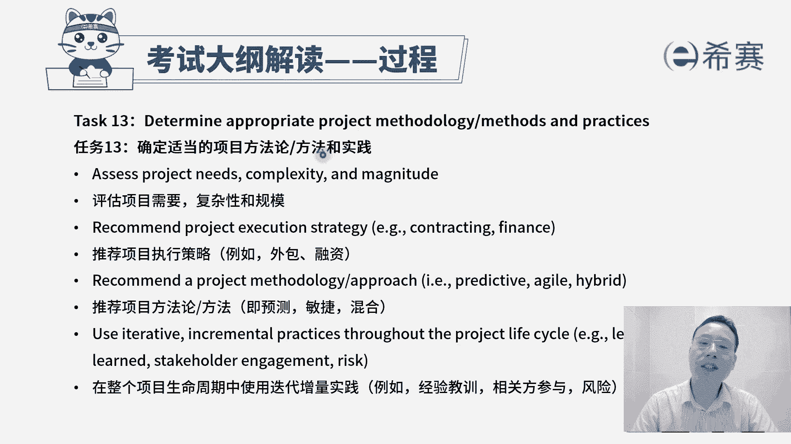
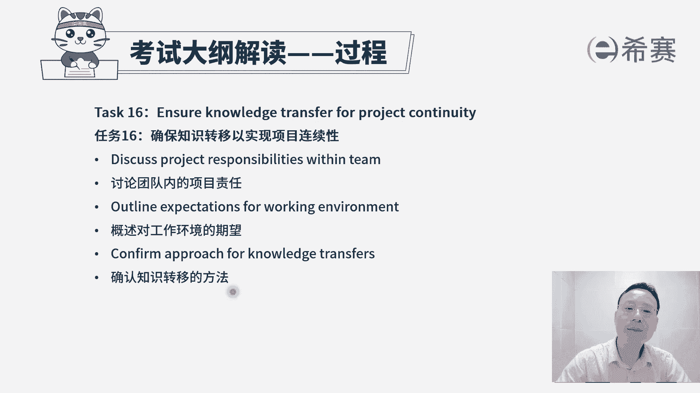
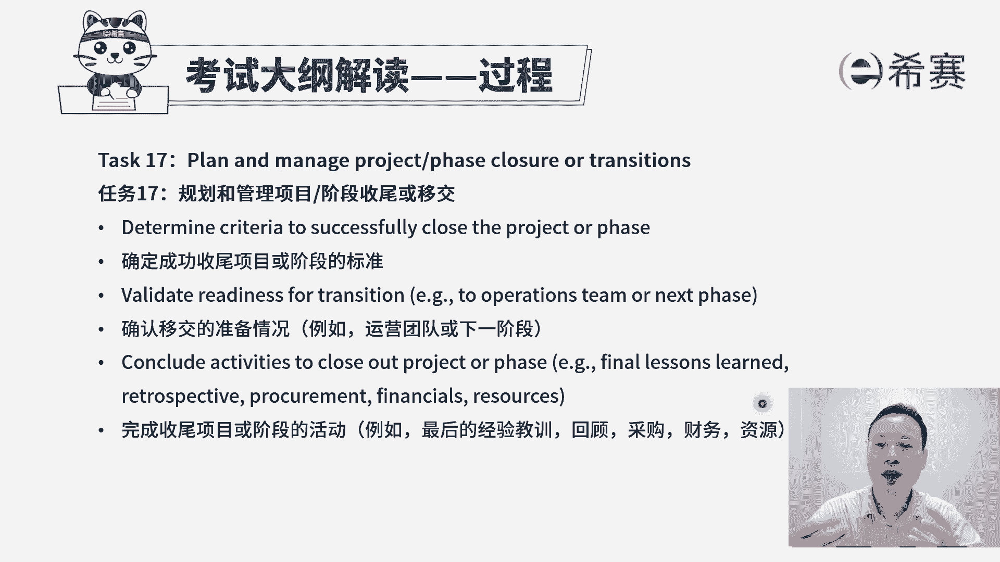

# 【PMP新版视频】24年第七版教学视频免费观看，报考指南+考纲讲解+第七版教材精讲！ - P11：考纲之过程板块B - 渡河的蝉 - BV1CP411x7Y2

我们再来看到任务时呢，管理项目变更唉，我们前面有一个过程叫实时整理编控制。

那你看首先第一个预测并拥抱变更的需要，其实也就是说如果你明确的知道变更，他几乎是在所难免的，那如果用预测型项目管理方式呢，它会有一个叫实施整体变更控制，我们主要需要去遵循这个编控制的，这样一个过程。

那如果在敏捷中，我们后面会讲到敏捷中拥抱变化，他也有一套方式来去拥抱，那如何去拥抱，我们在民众会再展开来讲，首先要有这个思路好，第二个说确定处理变更的策略，在预测中就一定是实时指令变控制的这个策略。

而在敏捷中是一种拥抱变化的，这种策略是不一样的，但它都是有对应的策略，第三个基于方法论来去执行变更管理策略，也许你有了这个变更的策略以后，要去落实，去执行最后一个确定变更应对措施，以推进项目。

我们就是有效的去管控，避免这个项目的范围蔓延，避免这个项目做到一种失控的这个状态，从而能够有效的把所有的东西都管控在里面。

OK这是第十条任务，叫管理项目的变更，再来看第11条，规划和管理采购，其实并不是每一件事情，我们都能够去亲力亲为的去做，有一些时候，有一些事情也许是找别人做会更划算更合适，那我们首先了解一下。

他说定义资源的需求和需要，我们需要做一些什么东西，然后第二个是沟通资源的需求，我们可能从哪里去获取到，如果有可能说并不会从自己去完成的话呢，我们就可以从外面去采购，所以第三句，管理供应商或者是管理合同。

也就是我们通过这种采购的方式，甲乙双方之间我们需要什么资源，我们提供什么样的资金，他最后的就能够帮我们把这个东西给完成好，这里还有第四条规划和管理采购策略，也就是说我们已经是知道。

我们有需要这样一些资源，我们也知道有对应的一些供应商，然后呢，我们也知道要该怎么样去跟它有效的去合作，能够让我得到我想要的东西，他得到他想要的东西好，并且呢去落实去执行，去执行，就是去发布招标广告呀。

然后去开阵营投标人会议呀，然后去开标评标呀，然后签合同啊，对吧好，后面一个叫制定交付解决方案，其实也就是签完合同以后呢，对方他应该是要能够去给我们去落实这些东西，那么他要去制定一个具体的这个交互方案。

也就是投标的过程，投标中他要去提供的这个好的解决方案，这都是跟采购有关，一般很多时候采购的是这样一个，甲方的角度来考量这个事情。

接下来看到的是第12个任务，叫管理项目弓箭，这弓箭这个词它其实你把它简单理解，其实就是组成部分，组成部件，就像我们的积木块，积木块里面有很多的组成部件，那么对应的我们在项目管理中，也有很多的这些文件呢。

这些东西它都是你的一些所谓的叫弓箭啊，简单的来理解，那么他第一句说要去确定管理项目工件的需求，内容，时间地点人员等等，也就是说我们如果是要去产生什么东西的话，一定是需要有一些人在对应的时间。

提出什么样的要求来去做什么事情，从而能够去产生若干的弓箭，我们先要搞搞清楚这些需求情况啊，第二个确认项目信息是否是保持最新，并且呢所有相关方都可以访问它，其实讲的就是一个重点，就是版本的控制。

也就是目前我们所去交付给大家的这些个弓箭，就是这些文件啊，这些东西它都是最新的，但相对应的这些有权限的人是可以访问得到的，好下一条持续评估项目工件管理的有效性，也就是说我们目前这些弓箭。

它都是处在一个良好的状态里面，然后都是最新的版本，其实我们在十大知识领域中呢，没有特别专门去强调所管理项目工建，但是呢默认会有一个叫整理这些个经验教训，整理这些组织过程资产，那包括说整理这些项目文件。

那这些文件呢其实也就属于我们的这些工件，我们需要去有效地管控好这些东西，而真正在落实项目的过程中，这些文件它是一个非常重要的支撑，这些工具都是一个很重要的一个支撑，然后再接下来看到第13条。

确定适当的项目方法论方法和实践，其实我们前面已经大概简单认识了一下，有预测性项目管理方法呀，敏捷型项目管理方法呀，其实即便说是敏捷也好，它里面还会有spring的方法呀，有什么看板的方法呀，有金翼啊。

有水晶啊，有那个TVB啊等等这些东西，那么这里面说是要去确定一个适当的，这个方法管理，首先第一个评估项目的需要复杂性和规模，如果项目它的规模特别特别大，那么你用敏捷的方式来搞，那就不太合适。

敏捷它更适合用这种小某规模的短时间的，如果周期很长，你还是要一定是用预测的方式，在预测中你分小阶段的时候，可以在内部用敏捷，但是大方向应该是大方向是比较清晰且一致的，所以公司的这些项目本身的这一特质。

它的这些复杂性和规模情况，我们可能会采取的这一方法是不一样的，第二个推荐项目执行的这样一个策略啊，有些东西你是自己亲自开发比较合适，还是说从外面去找一些资源来去帮你去完成，比较合适。

还是说你需要去通过一些融资的方式来去，自己做，以及你所推荐的这些方法论，是用预测的方法来去做，还是用敏捷的方法，还是混合混合，它是指预测加上迭代预测，加上增量预测，加上敏捷等多种方式。

也可说是先预测再敏捷，也可以是先敏捷再预测，也是边敏捷并预测，这都是一种混合，那到底是基于这个项目本身，它的这个具体情况和特质，我们来看如何做比较好好再来呢，在整个项目生命周期中。

使用迭代增量实践来做事情，那这个特质就是说如果某一些项目，它本身特质就是适合用这种敏捷，用迭代的这种方式来做的话呢，我们可以考虑用敏捷迭代，这个是等会后面再敏捷中会展开来讲，并且事实上像这里给人说。

经验教训是持续的，可以去增加的，然后一些相关方的参与，也是我们可能会过程中又识别一些新的相关方，都把它累积下来，风险也是会识别新的风险，然后去阶段性的去处理一些对应的风险。

然后处理完的东西也会做一些新的文档的整理，那么也是一种增量，但事实上呢，我们除了有这些过程性的文件的增量以外，我们对于整个要做的工作内容，它是可以去增量的迭代开发的。

所以我们在后面敏捷中会展开讲这一部分，这是确定适当的项目方法论，方法和实践，也是要基于这个项目本身的这一特性。

来去选择合适的方法和实践，第14个任务，建立项目治理的结构，那么关于治理呢，我们在最开始有讲过，我们说韩信点兵多多益善，那刘邦去管韩信，管张良，管萧何的大领导，管这些领导们，它属于治理。

然后领导管下面人员，他属于管理，那你大概知道这个意图，整个公司的大领导，董事会，他来去给公司定好一套规则和机制，这属于治理，所以这里有一条说确定适当的项目治理啊，用什么样的方式去做治理。

这个呢其实不是项目经理干的事情啊，项目经理都还够不够格，但是你一定要稍微聊一些，有这么一个思路好，这里还有一条定义上报的路径和阈值，也就是说某一些事情应该如何去处理，我们这种规则啊。

路径问题升级的这个原则，或者是过程流程，这些东西呢都会是你这里面提前定好的，那我们要有这个意识，就是这套规则是怎么样的，是提前治理定好的，然后再来看看第15个问题，管理项目问题。

我们经常会把问题和风险区分来，但是事实上你在后面你会发现，在敏捷项目管理中呢，有的时候把问题和风险就混到一起来，不应严格去区分，但在预测型项目管理中，我们有的社保问题和风险是区分，怎么区分呢。

风险是还没有发生，但是将有概率的，而问题呢是已经发生的，所以我们来看一下，首先第一句话，认识到风险何时成为问题，何时成为问题啊，他已经真的发生了，或者板上钉钉肯定要发生了。

那么这个时候都可以当这是一种问题，当然这句话其实重点不是说，我要知道什么时候成为问题，我知道的是说如果出现了问题，我们得怎么办，那出现了问题肯定是要去找应对的措施，对不对，所以呢如果出现问题。

我们可能要去收集更多的信息，然后分析影响，然后再找寻解决方案，然后再去处理解决这个问题，一般是这个逻辑好到第二句，采用最佳行动解决问题，以实现项目成功，也就是说出现问题以后，我们要去分析分析原因。

采取采取一些措施，然后去落实去处理掉这样一个问题好，那并且呢问题本身我们一定要去跟踪啊，比方说发现了问题啊，要写到这个问题日志里面来，然后去安排给谁，谁作为责任人，然后后面的每个步骤环节对吧。

这都是关于问题，后面一条与相关方就解决问题的方法，来进行合作，那么其实也就是说，我们如果要去解决某些问题呀，也许不只是说靠我们自己的力量就可以，可能还需要靠更多的力量，那么我们有可能是跟别人一起。

还有就是可能在做项目的过程中，相关的他自己也会遇到很多的一些问题和挑战，那我们是需要去主动地帮助他来解决，因为我们是拿了别人钱替别人去干活，所以要去解决好他的这些问题，所以这是最后一句。

说与相关方就问题解决的方法来进行合作啊，其实关于管理项目问题，我们接下来看到第16条，一共有17条啊，倒数第二条了，说确保知识转移，以实现项目的连续性，首先我们在做项目的过程中，一定会有一些经验和教训。

那么有经验的话呢，就可以让下一次做得更好，如果说是一些教训呢，哎就可以避让，下次可以就避免了这些事情，所以经验和教训那都是好的属性啊，他都是能够让我们对未来做事情的时候，可以少走一些弯路的这些东西。

那这个题标题说的是确保知识转移，也就是我们这些经验和教训能够得到传承，我们这些组织过程资产它能够得到有效的传承，第一句讨论团队类的项目责任，其实也就是说谁会负责什么事情，谁会负责什么事情。

你负责这个事情，那么出了问题，你也比较容易去有着更深的认识和了解诶，能够去总结一些经验和教训好，第二个概述对项目工作环境的这一个提问，这个点怎么讲呢，其实也就是说你负责这个事情。

你要搞搞清楚这个事情是什么样的情况下，这个事情就可以有效的去开展，可以顺利去开展，其实也就是一种标准启动的标准好，并且你在做这个事情的过程中，如果真的有一些经验和教训，有这些知识的产生。

包括隐性的知识和显性知识，那我们需要去说，有一个方法来去管理好这些知识，包括知识管理工具和信息管理工具，把隐性知识变成显性知识，把显性知识把它编撰成册，得到这个经验教训能力测。

这也是确认知识转移的这一方法，我们来看到整个过程中的最后一条。

叫规划和管理项目的收尾或移交，规划和管理阶段的收尾或移交，其实也就是结束项目或阶段啊，结束项目或阶段呢，我们是在向整合管理中的最后一个内容讲到的，那么首先第一个说确认成功收尾项目，或者说阶段的标准。

那个标准是什么呀，通常我们是在最最开始的时候，制定项目章程的时候就定好了，这个标准也是以终为始的这种方式好，第二句，确认移交的准备情况，其实你既然要去做这样一个结束项目或阶段，要去做收尾，要去做移交。

一定要提前准备好很多东西，包括这些可交付成果以及支撑性的文档，各方面的，像以前我罗老师，以前是在软件这个行业中去工作的时候呢，那我们既要去交付这个沉默给对方，同时还会设设到九需求规格说明书啊。

该要设计说明书啊，详细设计说明书啊，数据库设计说明书啊，还有什么用户手册呀啊等等这一大堆东西，111写写一大摞，那么这些东西要提前准备好好，最后一个完成收尾项目或阶段的活动，包括说总结最后的经验和教训。

自己内部去复盘回顾和房型，然后还有什么采购的结尾呀，财务的收尾呀，而资源要去释放掉，那么这些采购财务财务就是要打款咯，然后资源给释放掉，其实也就是项目最后做完了以后，团团成员就解散了。

大家就各干各的事情去了，可以做下一个项目的，那我们刚花了一些时间来去给大家解读了一下，关于整个考纲中的地二个板块叫过程，而过程呢考试呢占比占到了一半，有90道题目它是非常重要的。

基本上你认认真学过了五大公主，十大知识领域49个过程，你对这个过程的这些内容呢，就会相对比较清楚的认识和了解，而我们后面还会讲敏捷的ram框架，我们还会讲敏捷阶段框架，那这些时间他都是能够对我们的过程。

有更深的认识和补充。

