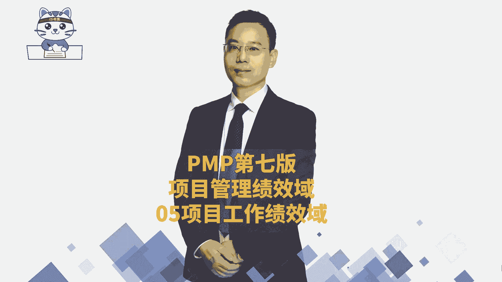
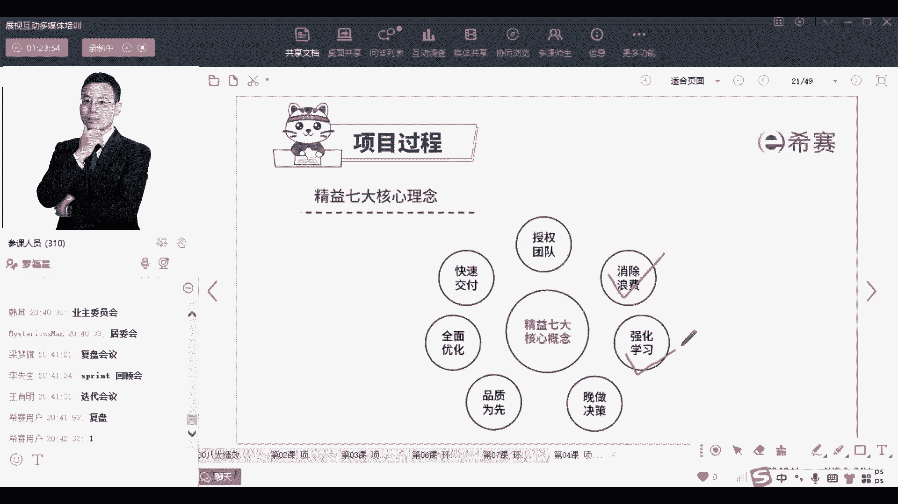

# 【PMP新版视频】24年第七版教学视频免费观看，报考指南+考纲讲解+第七版教材精讲！ - P38：PMP第七版8大绩效域之05项目工作绩效域-上 - 渡河的蝉 - BV1CP411x7Y2

我们来分享的是这个呢叫项目的工作绩效与，通常情况下，项目工作绩效与它其实会重点讲到的是什么呢，他重点讲到的就是说我们要有效率且有效，我们去做东西，更关注的是这样一个成果啊，更关键的是结果。

所以项目的工作迹象与它涉及到的是说，做这个事情的过程中，咱们需要去有一些好的环境，能够有好的沟通，有好的一些食物的管理，通过各方面来去做这个事情，来产生一些好的结果，这是工作，其实呢它有点相当于我们在。

如果有同学已经是学过了880的话，它相当于是执行过程组，通过这样一个执行，来产生结果的这样一个绩效率，你看项目的工作绩效与，涉及到的是与建立一些项目过程管理实务资源，营造学习氛围相关的。

这些活动能有效率有效果的来去做事情，有好的环境和氛围，然后能够有合适的这种沟通，来去参与有效的管理实务资源采购，但他把这个执行呢又分到两大，就是分到几大块，一块是工作绩效与，还有一块呢是交付。

等我那个交付他也是执行，他把这个把执行又分成两大块，我们先来认识一下，在这里面的话，认识这几个词，首先这两个词呢是招式采购管理中会讲的，采购管理中有一个叫招标文件。

也就是如果说某一些东西我不想要自己亲自做，我想要请人来帮我做，那我可以发一个招标文件的方式，来请人帮我完成，我只要掏钱就可以了啊，这是招标文件，那如果说真的有人想要过来去来去中，我这个标的话。

他一定会去写一个那个投标文件对吧，他写投标文件的时候，有可能他会对这东西认知有偏差，他对这个认知有一些误解，那如果他对这个东西认知有偏差，有误解怎么办呢，哎咱们还专门来去招开会议，来帮他去澄清一些事情。

那这个会议呢就叫投标人会议，投标人会议室在他去写这个建议书之前，你可以把它理解为说在投标之前，在投标之前跟这些潜在的卖方，其实也是潜在这种要去投标的，这些这些人一起来开会，而这个开会呀，目的就是。

让大家对于这个项目有清晰且一致的理解，但对于这个项目上的一些需求，是清晰且一致的理解，这样的话呢呃我们就避免了那种不良的竞争啊，或者那种就是那种不不不正当的，不正确的这种东西啊，改的是这么一个逻辑好。

这两个文件呢就是在采购中认识的，然后再有两个文件呢是在项目整合中认识的，叫隐性知识和显性知识呃，首先我们在做项目的时候，我们前面看过一个词叫组织组织过程资产对吧，我们说组织过程资产。

它会指的是说咱们去做项目的时候，有一些经验，有一些教训，这些东西可以留下来以后，让我们下一次可以做得更好，那么同时在做这个东西的时候呢，我们会有一个叫隐性资产，隐性知识，它就是那种你难以说清楚的。

可能一下子短时间内马上就把它讲清楚的东西，有点困难的那些东西，比方说一个人的经验，一个人的洞察力，一个人的信念，坚定的信念，这都是你一时半会儿，很难一下就能够去传递给别人的，但是这种东西啊。

我们可以通过这种叫知识管理工具，就是人和人之间开会呀，开研讨会议呀，开那种茶话会啊，开个会议的方式来去讲诶，这是可以的，另外还有一种知识呢叫显性知识，显性知识就是能够看得见摸得着的。

比方说咱们现在正在看的这些文件对吧，你看了一些书籍，你看了一些视频，那这些呢都是一种具体的显性知识，用文字呀，数字呀，图片啊，图表啊，符号等这些东西来去编撰成册的这些知识，叫显性知识。

那显性知识很多时候我们可能会更加希望的是，能够把它编撰到一个更有逻辑，就像有同学说啊，现在听的这东西有点散对吧，因为他目前这个，我们其实只是在做一个偏概要性的介绍，就偏概要性的介绍没有特别去展开。

展开的话，在后面后面会去展开的嗯，那稍微了解了一下这样一个，隐性知识和显性知识，那组织过程资产更多的对，更多的是显性知识，因为那些隐性知识他也没有办法把它留下来，你要想办法那种隐性知识变成显性知识。

才能够留下来，一般是这样的一个情况啊，那整个在做项目过程中，你看项目经理和团队，我们需要定期的去开展各种什么什么工作啊，那开展工作呢他这边给了一个叫任务委员会，就是关于委员会这个词来先认识一下。

因为你们在最后真正去参加考试的时候呀，会遇到大量关于委员会这个词，其实也就是某一个群体，他们是受委托的，他既然能够受委托，他就是代表了大家，它能够代表大家，他其实一定是有一定的声望和地位。

或者至少是能够被被挑选出来的，所以这个群体就是某某某某委员会，一定是有一定的身份和地位的，这些个领导的群体，他们能够去代表大家的，是这样的一个意思，那某某任务委员会，比方说假如啊咱们是一个餐厅。

那我们会专门有一个叫试菜委员会，那这个市场委员会呢他就会装去品尝各种菜肴，看各个各个厨师们做的菜怎么样，对吧啊，这是大佬们，一一群大佬们在一起来组成的这样一个团体，小团体啊。

比方说我们会有一个叫变更控制委员会，就是关于一些变更产生了以后，那是否呃可以同意吗，不同意呢，由这个变更控制的这些委员会这些人来去做，即使发展改革委员会，那发展改革委员会他会来去指导了呃。

那个某某某某地区的什么什么发展，对不对，类似这样的一种方式，工会和委员会肯定不是一个概念，工会他什么工会是工人代表大会吧，应该是也不叫工人代表大会，他他是什么意思，就是更多的是为工人谋福利的。

更多的是为工人去谋福利的委员会，它不一定是上市公司啊，你没有，你们想公司也可以设定一个什么什么委员会啊，就是你只要知道就是委员会这个词，你可以去自己去搜一下这个词的意思啊，就是一小撮人能够代表大家。

你既然能够代表大家，你就一定是有一定的权限的，你要不然的话他不会找一个那种平头老百姓，一个啥也不会的人来去代表大家，对不对，一定是找那种还比较比较靠谱的，但在这方面稍微有所研究的人才能够去代表啊。

对稽查委员会，伙食委员会有这个认识，那我们在做项目的时候呢，这里还给了一个，我们通过一定的方式和方法，来去把这个项目能够去优化，你怎么样去优化它，就有一种叫精益生产的方法，精益生产的方法。

我们在敏捷管理的最后面，会专门去讲一讲关于精益的方法，他们会有一个很好的工具叫价值流图，我们会通过价值流图的方式来来去来去看，怎么样能够优化优化这个过程，另外还有一个呢叫回顾会议。

OK回顾会议也是在敏捷项目管理中，敏捷项目管理中，在思考实践里面会有一个迭代回顾会议，以及在明确的阶段框架里面也会有一个回顾，会议好，这里还有一个叫经验教训，那么经验教训呢我们在预测型项目管理中。

在每一段我们去整理知识，我们去做这些隐性知识，显性知识也会去整理一些经验和教训，就是这一个还有第三个，他说是我们去优化优化项目的过程中，还有一个就下一笔资金花到哪里去，这个词让你觉得很陌生。

这个可能会觉得很陌生，他讲的是怎么回事呢，他讲的，也就是说咱们现在这个项目还值不值得做，值得做，我继续往里面砸钱，不值得做，咱们来给叫停，打完叫停你以后，我本来要砸金币的钱，我来去砸下一个项目。

就是就这个逻辑你可以理解吗，他用的一个词很怪异，用的一句一句很怪异的话，它其实表示说我们要去确定，我们继续花的钱是花在什么地方，是值得的，给的是这个意思，如果这个项目值得，我就继续砸钱，如果不值得。

我就砸别的项目，就这个意思好，那我们来看一下啊，首先是精益，精益呢我们稍微捋一下，就是金翼呢，它会有很多有个大核心的这些精英的理念，他们会有一个非常重要信息，我们先选一个吧，先认识一个叫消除浪费。

什么意思呢，就是打个比方，在座的各位，你们有没有去去带带男朋友，女朋友或者是小朋友去一些游乐场啊，尤其一些大型的游乐场去游玩，那你会发现其实游玩的时候呀，基本上就是排队的时间居多，就排队的时间居多。

那这种排队他对你来讲其实不创造价值，没有什么价值可言对吧，那敏捷中它要消除浪费，有一种很好的方式，就是尽量把这个排队的时间减少减少，减少少到足够少，就越少越好的，这个逻辑就是他要去做一个叫消除浪费。

那么还有几个词呢，我相信一定有人会想要去问询，所以我稍微也一起来带过，一起来说一下，还有一个词呢叫强化学习，其实也就是学习型组织，能够鼓励团队去不断的去学习和精进，当你能够不断去学习并精进的时候。

你的团队变得更牛的时候，那么做什么事情其实都会更快，效果也会更好，这就是今天有人会问我说啊，我带这个团队到底怎么办才行，带的好累啊，你带他们带得很累，很有可能是因为他们真的太菜了，但他们真的太菜的时候。

你带起来，你让谁来带都带不动啊，所以有的时候你需要去你作为一个领导者，你在一定程度上，你是需要去给团队去做一些培训，来帮他们成长的，OK你能够让他们去养成一种学习的态度。

说到这里来跟大家分享一个很有意思的，就是我认识我听说啊我我认识了一个人，但是我跟没跟他去交流过，我跟他一起共同去参与过几次公益活动，但是没有去具体交流过他们，做他们去招人的时候做一个什么要求呢。

要求大家去读一本书，读完那本书来以后再过来面试，然后你去讲一讲那本书里面的内容哦，这个很神奇呵，我说以后我自己做公司的时候，我也可以这样去要求，就是想要想要想要过来面试工作的话，我提个要求。

先看完这本书再再过来，说明你知道你能赖赖的下性子。

