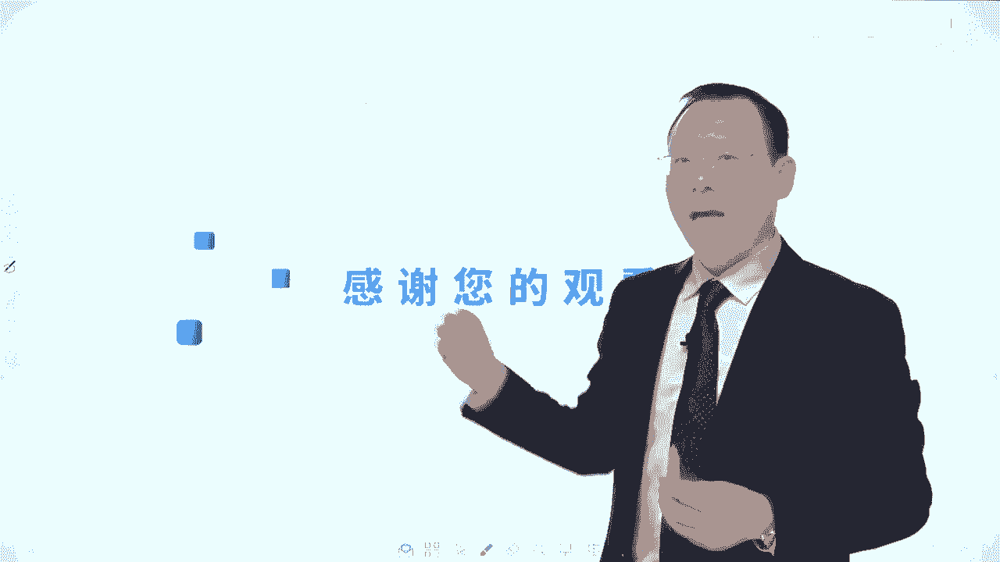
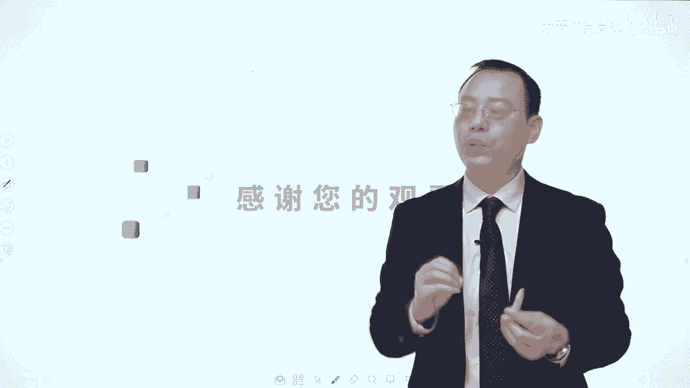
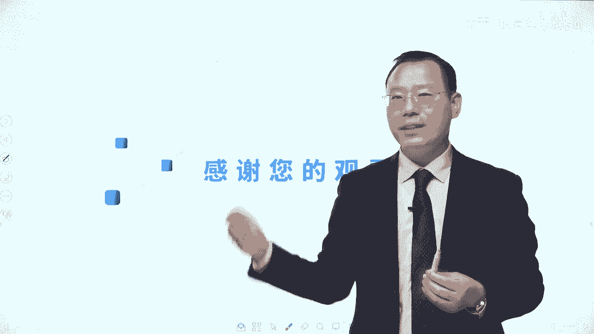

# 【PMP第七版教材】敏捷项目管理知识全面解读精讲教程（考点精讲，案例试题，建议收藏）！ - P40：45Scrum五大价值观及Scrum实践回顾 - 希赛项目管理 - BV1eV4y1y7oz

大家好，接下来我们继续分享的是scrm，敏捷实践中的最后一个内容叫五大价值观，它这五大价值观呢跟我们说敏捷宣言，它的类似的价值观不是一个意思，它其实也是说我们在做敏捷的时候。

所需要去遵循或者秉承的一些行为，处事的一些规则或原则，我们一起来看一下，首先这五大价值观中第一条叫承诺，commitment，承诺说的是什么，做的是我们团队成员，他能够主动地站出来认领任务。

能够对这些个要做的事情来去主动承诺，对目标作出承诺，并且团队成员他是对谁做承诺，他是对这个事情，对目标本身做承诺，而不是对于敏捷教练做承诺，也不是说对于po来做承诺。

所以这个人群他是把事情放在重要的位置，他是要价值驱动的这种方式来去完成事情，去交付价值，那你要去主动积极的去完成事情，主动去挑大梁，去认领重要的事情，这是第一条叫承诺，第二条呢叫专注，fox专注。

说的是全身心都要用到你所承诺的事情上面去，那关于专注呢，罗老师在这里给大家去又做了几个简单的补充，你稍微留意一下啊，首先第一个这个专注的是团队成员，他应该是全职的团队成员，他不会是要接到多个项目上来。

它是只做这一个项目上的事情，所以他要把他的时间精力集中在本项目上，其次第二个呢就是专注，是说我们团队成员要专注在本项目上的事情，你可能会有一些其他的事情来去打扰你，干扰到你。

那这个时候呢敏捷教练你要帮团队去清除障碍，能够让团队成员可以专注在本项目上的事情，第三个是我们在这一轮迭代中，在前面有一个迭代规划会议，能够去列出本轮迭代要做的事情，这相当于说是一个迭代计划。

那做好了这个迭代规划会议，做好了这个迭代办事项列表以后呢，就尽量去落实去完成它，如果没有很特殊的情况，我们不要去随意的去更改一些内容，尽量去完成本轮迭代，非必要不更换唉，这是关于专注来做一个简单的引申。

然后还有一个呢就是开放开放的这种价值观，openness，他讲的是说团队内所有的信息要对所有人开放，其实讲的是什么叫透明沟通，关于透明沟通，我们前面已经讲过几次，再提一次也不要紧，因为你多听几遍。

你就深深的记在你心里面啊，式来去同步信息，做透明沟通，第二个呢我们可能会通过看板呢，信息发射源的这种方式，把一些重要的信息都放在这样一个地方，用可视化的方式让大家都可以看到，包括要做的事情。

以及包括遇到一些风险挑战，包括这一个呃迭代燃尽图，燃极图都是可以的，那放了一个公共区间，用这个信息发射源，让所有人都可以看到，第三个呢是通过集中办公的方式，能够方便大家经常面对面的沟通。

以及包括渗透式的沟通，当然还有就是我们在整个做事情的过程中，前面会有迭代规划会议，后面会有迭代评审会议，后面还会有迭代回顾会议，大家都参加，这样的话也都能够让这个信息更好的去透明，当信息比较透明以后呢。

我们就没有那么多那些个冲突，矛盾就会减少一些，这是关于这个开放，我们要把这些相关的信息能够同步给大家，既能够让对方知道，并且还能够让对方理解，应该是到这种程度，然后第四个词呢叫尊重respect。

那说的是，每一个人都有它自己独特的价值和经验，我们要去尊重对方，我们在前面讲过说敏捷团队中的成员，我们其实会更提倡的是什么，是t型人才，t型还是一专，在这一方面很专业，多人在各方面都略懂一些。

那一专多能的这些个人才，我们不要说你看不起他，他看不起他，有个什么鄙视链，这种方式就不利于团队友好的协作，共同去共事，而是要相互尊重，彼此尊重，当然也包括说是领导，要对员工是尊重的。

员工对客户也是尊重的，各方面都是相互尊重的，那这样的话呢，才能够更有效地把事情往前顺利的推进，最后一个词叫勇气，courage，勇气说的是我们要去勇于承诺，要有这份勇气，敢于担当，勇于承诺。

勇于去履行这个承诺，还有呢就是如果有一些东西是不合适的，我们也要去勇敢的say no，也是好的，这是他的这样的五大价值观考试呢，其实很少会直接去考这样一个五大价值观，他就是做一个补充，让我们知道哦。

原来我们用敏捷的方式来行为，处事的时候，还有这么一些东西是需要去注意的，需要去留意的，我们还是来看一个题目啊，有一个这样的题目很有意思，说在迭代规划会议中呢，敏捷团队估算出一个功能特性。

所需要的时间为两周，这个特性这个词稍微解释一下，你可以把它简单的以为就是功能啊，就是功能，它其实是feature，feature呢说的是一个大的功能，就是可能会包含若干的功能的，这个叫特性，ok好。

那么他说一个功能特性所需要的时间为两周，但是新来的敏捷教练要求，必须在一周之内去完成，明明是两周，非得要一周完成，这不是强人所难吗，那团内成员向敏捷教练解释说，一周内完成是不可能的。

并且呢没有理由给出一周的这个交付期限，那敏捷教练，他的做法是不符合以下的哪一个价值观呢，很显然他没有去尊重事实本身，他也没有去尊重团团的成员，对不对，所以呢答案应该是这一条，没有很友好的去做一个尊重。

当然了，整个关于敏捷的这五大价值观其实很少会考，他应该是说融入到我们的血液中，融入到我们这样一个理解中，然后有助于我们更好的去理解各种题目，应该是这样的一个情形好。

这是关于scrame框架的这样一个五大价值观，那么到此为止的话呢，我们的整个思维框架中的33355，其实基本就已经说完了，我们来简单回顾一下我们都说了些什么东西啊，就整个敏捷的实况。

那首先是有一个重要的角色叫产品负责人，他能够从客户那边去获取一些需求信息，把这个需求信息整理成用户故事的方式，来得到一个产品待办事项列表，然后呢，他会对这些待办事项，列表中的这些待办事项来进行排序。

按照价值进行排序，当然也可以参考一些风险啊，成本啊等等因素来进行排序，但列完的东西里面除了包含功能性的需求，也可以包含一些非功能性的需求好，然后接下来我们在每一轮迭代中，就整个这是一轮迭代。

那么在每一轮迭代中呢，可能他会跟大家去讲一讲这件事情，然后跟团队一起来去讨论，然后把那些靠前面的那些东西拎出来去做，那么这个把它拎出来去做，这一次会议呢叫迭代规划会议，我们会在迭代规划会议上来去讲一讲。

唉这一轮目标是什么，就是我们这里迭代的目标是什么，我们要去完成哪一些待办事项，然后这些代办事项呢，我们可能还会把它再拆解成任务，拆分成细分成具体的任务，然后大家去认领任务，团队成员主动来认领任务。

这个主动认领就包括我们刚才说的是，你要去勇于承诺，你要去有勇气去承诺，对吧好，然后认领完任务以后呢，就开始去做事情，当然我们在认领完任务以后得到了这个结果，就是一个叫迭代代办事项列表。

叫spring backlog，那这个迭代待办事项列表中就会列出来，本轮迭代要做的事情，理论上来讲，团队成员在这一轮迭代中，就要专注的把这个里面的东西尽量去完成，这个完成是指你要去开发完，还要去测试。

通过这样的话呢才能够方便别人去验收，也通过那做的过程中，就是我们每一个人每一天都会讲，我昨天干了什么，我今天要干什么，我干这个事情遇到什么问题，障碍风险挑战，把它提出来，掏出问题，而不是去解决问题。

好做完这些事情，可能慢慢的我们就差不多，该做的事情做的差不多了啊，这个时候呢可以去做这个迭代评审了，迭代评审呢会有一个重要的会议，叫迭代评审会议，在迭代评审会议中呢，那通常情况下。

那大老板就是这个产品负责人，他要跟大家去讲讲整体的情况是什么样的，然后呢团队成员他也要去讲一讲，我们这轮迭代做的怎么样，然后呢他再去给大家去演示一下结果，然后p o再来去负责做那个，同意或不同意做验收。

当然如果有客户在客户来做验收，然后呢，做得好的东西，就得到一个潜在的可发布产品质量，那做的不太好的东西呢，又打回去回到这个产品待办事项列表中，再一次去讨论它的这个重要性好，然后呢我们还会去考虑一下。

现在的外部的局势是什么，市场的环境是什么，我们下一轮可以怎么样去做一些改进，重点会放在什么地方，所以是对后续它这个趋势发展会做一些分析，好做完这个事情以后呢，我们得到了一个叫潜在的可发布的产品增量。

那这个潜在的可发布产品质量，就是已经真正的验收，通过了，真正的已经完成的东西，它就可以去加到我们上一个版本中来，这样的话呢，上一个版本的东西它就会变得更丰富了，就可以给别人直接去使用了。

而做完这些事情以后呢，团队自己还会再召开一个叫迭代回顾会议，这个迭代回顾会以它的焦点是指向未来，我们在下一轮迭代中，我们可以怎么样去优化和改进做得更好，所以他会讨论我们在这一轮迭代中，哪些地方做得好。

继续发扬，哪些地方做得不好，下一轮怎么样去改进，给出一个具体的改进建议和计划，好搞完这些东西以后呢，我们就又回到下一轮，又开始做这个迭代规划会议，然后又开始下一轮，而在这个过程中，有一个角色非常的重要。

它会能够去确保整个迭代能够有序的去进行，然而并且呢大家遇到困难和挑战，都可以去向他寻求知识和帮助，他就叫敏捷教练，敏捷教练呢它一方面是能够去做一个促进者，做一个催化剂，能够把这些东西往前去推进。

引导大家提醒大家啊来去建议大家做一些事情，同时呢它是一个资源库或是一个资源池，你需要什么东西，你来找我呀，我来去帮助你呀，同时呢他还是一个老母鸡这样的角色，那团队如果说是受到一些干扰啊。

受到一些各种问题啊，它能够帮大家去清除障碍啊，所以这是敏捷教练要干的事情，所以我们基本上到目前为止，你再去看这张图，你是不是会对他更加清晰和认知和了解了，你会发现整个srt这种敏捷实践。

它是一个非常完整的这种敏捷项目管理的实践，他是会重点落在这一个敏捷项目管理上面，它是有管理的因素，它不是说像那种像我们后面还会学到一个词，叫啊极限编程xp，那xp它会更多的是做敏捷的实践。

去做敏捷开发的另一个维度，这是不一样的，好了，那么整个关于敏捷的实况实践呢，我们就分享到这里，感谢您收看，如果对于这样一个内容还有什么一些疑问啊。

问题呀都可以是在我们的课堂上，或者是在我们的学员群里面来去互动呃。

当然如果说是对某道试题不太懂的话呢，也可以在直接在西夏的平台上面。

来去提问题留言，这样的话呢，我们的助教老师都会给大家去做解答。

那我们整个关于敏捷的实况时间框架呢，就到这里。