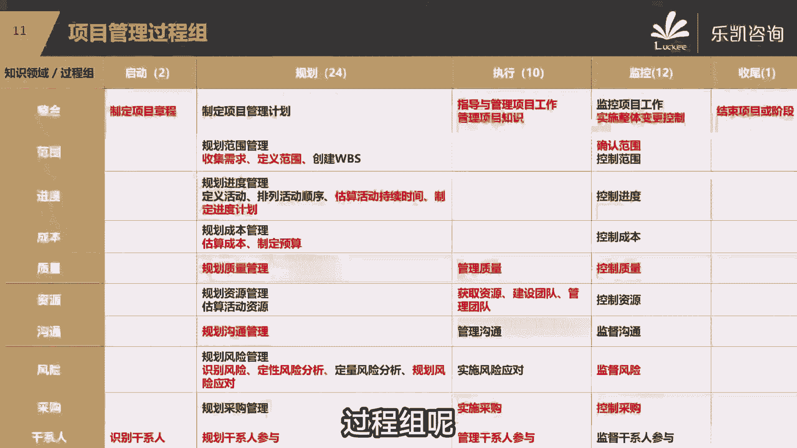
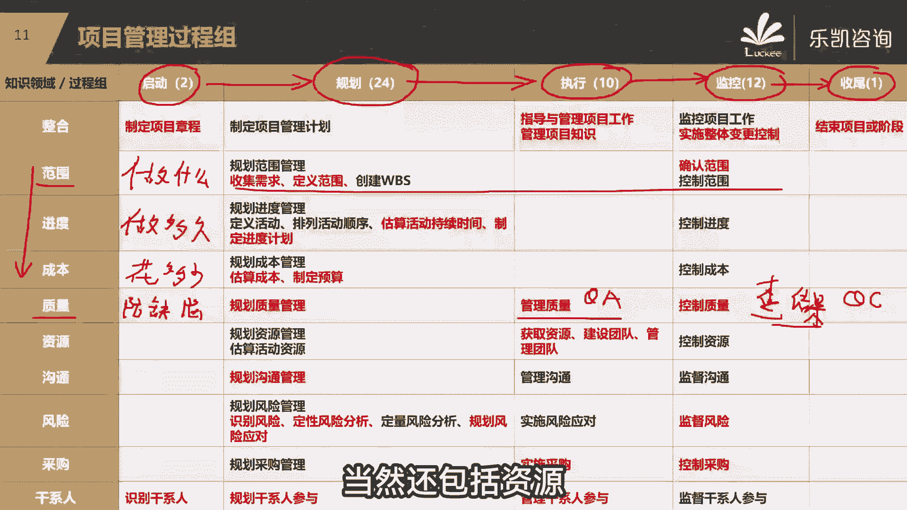
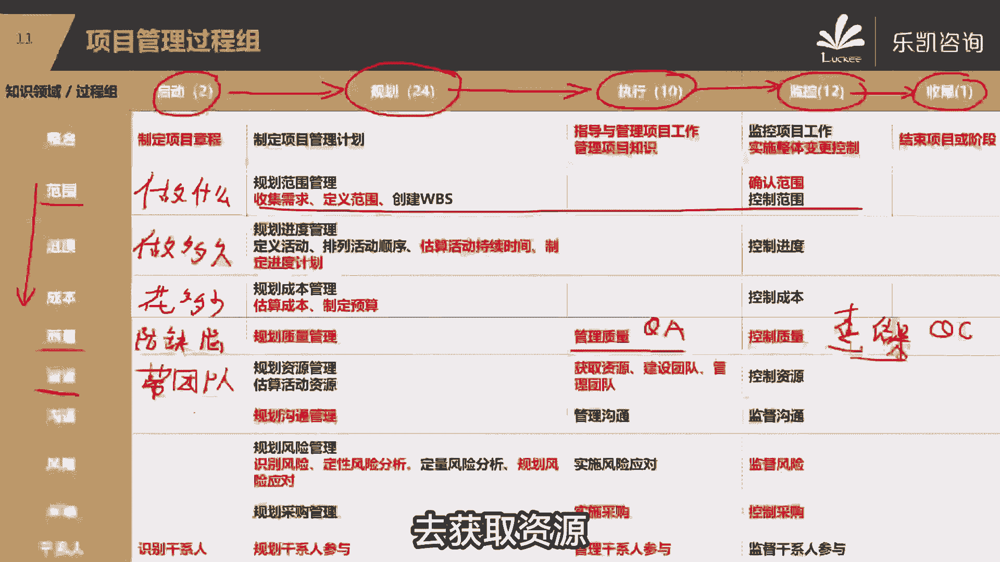
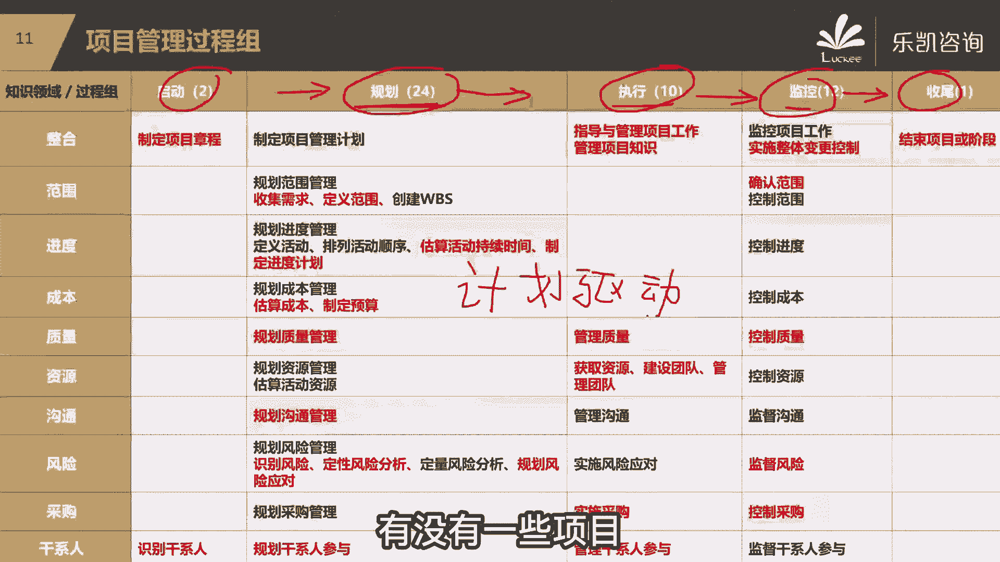

# 【PMP考试零障碍】2024年度精品课程免费观看，全面掌握项目管理技能！ - P2：02.PMP核心部分-项目管理过程组简介 - 乐凯PMP项目管理 - BV1pi4y167Fj

接下来我们看一下我们在最后的这几个月，我们PP培训会涉及到哪些内容，整个PP培训我们分为了这几部分，第一部分呢实际上比较简单，是项目管理的一些概论，一些定义，那么第二部分呢我们着重讲项目管理的过程组。

第三部分我们会涉及到敏捷的内容，那么第四部分会涉及到原则和绩效率，那么这几部分分别对应了不同的书，比如说第一部分我们引用的是PMBOK第六版，那么第二部分呢是即将推出的过程组的那本书。

那么第三部分会涉及到敏捷，实践指南以及RAME指南，那么第四部分会涉及到pk的第七版，那么大家先了解一下这四个部分，当然不需要看那么多书，我们乐凯提供了一个讲义，已经把这几部分都混合在一起了。

在这四个部分里面比较重要的，或者说对大家今后的工作有帮助的，大家要着重注意第二部分和第三部分，这也是我们偏僻培训的一个重要的内容，好吧，那同学说不是已经到第七版了吗，你要注意啊。

第七版他并没有取代第六版，明白吗，第七版和第六版是共存的，是共存的好吧，比较重要的是第二部分和第三部分，这也是我们培训的一个核心的内容，那么接下来我给大家介绍一下这两部分，他分别在讲什么，好吧好。

那么第二部分，我们主要讲的是预测的项目是怎么管的，我们会讲到五大过程中，那么我会说一个项目我们要去管理，会经历哪几个过程组呢。

比如说首先我们要启动这个项目，启动了这个项目，接下来干什么呢，而我们启动了立项了之后，我们要做很多的计划，要做计划，做完了计划之后，接下来我们要根据计划去执行，那么在这里我想问大家一个问题。

在执行的时候我们会得到一些实际的情况，那么计划是计划，我们真正做的是实际，那么实际跟计划去比较，我们就会发现什么问题，这个我们做过项目的同学应该有这个感觉，对我们定了一个计划，按这个计划去执行。

结果当我们真正做了之后，我把实际的情况跟计划去比较，你就会发现有什么问题，可能会发现我们的进度慢了，可能会发现我们的成本超了对了，也就是我们有同学说的会出现偏差，这样一个过程实际上是什么。

也就是说我们要不断的去监控，我们有没有偏离计划，那么如果有偏离了，我们可能要纠偏，甚至有可能有同学说我们会遇到一些变化对吧，那么说到这里，我想问一下大家，既然有同学说到变化。

我们有一句俗话叫计划赶不上变化对吧，那么遇到变化应该怎么办呢，好我们在里面讲的时候会说，如果遇到变化，我们要根据变化可能要去调整我们的计划，要按照新的计划去执行，去监控，一直到什么时候。

一直到整个项目做完，我们要收尾，把这个项目收掉，这是我们第二部分的过程中，不中奖的内容，也叫五大过程组，那么五大过程组里面涉及的这些过程呢，我们从另外一个维度来说。

也可以把它从另外一个维度分成十大市领域，十大知识领域，他会说什么，他会说到，比如说范围范围这些过程他会讲什么呢，我们这个项目要做什么啊，我这个项目究竟要做什么啊，那么做什么明确了之后。

接下来我就可以大致的去估一估，那么做这些东西要做多久呢，这也就是我们很多项目经理会遇到，我们要干什么，要排工期，因为你做的东西知道了，接下来就要排工期，我就知道这个项目要做多久，那么进度就出来了。

工期排好了，安排了人员之后，下来我就能估出来这个项目大概要花多少，花多少什么花多少成本，那么这就是我们在项目中比较核心的，或者说比较重要的叫范围，进度成本简称也叫范进程好，我问一下大家。

不管是第一次学的，还是有项目管理经验的，大家知道为什么我们一般在做项目的时候，会说范进成这样一个顺序吗，先说范围再说进度，再说成本，为什么，因为从我刚刚的描述，大家应该会体会到，你只有知道了做什么。

你才能够估出来，要做多久才能够算出来，要花多少，也就是说范围它决定了进度，而通过进度又可以进一步估出成本好，那么范进程接下来是什么，接下来pp里面还讲了，要关注质量，那么质量很明显，要防缺陷。

质量重不重要，当然重要，质量做的不好，会给我们公司带来很多负面的影响，说到质量大家要注意，有一个地方可能跟大家想的不一样，因为说到这点呢，大家永远会想到那些比较常见的，比如说什么手段呢测试。

那那就要注意，我们的质量是真的通过检查和测试得到的吗，好那么PMP里面有一个非常重要的观点，我们在讲质量的时候会说，质量永远不是靠检查和测试得到的，检查和测试它是在干什么呢，他是在查结果。

我们有同学这个可能做过一些项目，了解到这个东西叫控制质量，查结果叫QC，而质量更重要的是什么，是要重视过程，也就是我们说的QA管理质量，这个是我们在讲质量的时候会着重去强调的，会着重强调的。

你只要有一个好的过程，而且你按照这个过程中索过程的流程，政策和程序，那么你做出来的质量就不会有太大的问题，那么比较典型的一个例子，大家应该会发现啊，包括我以前去企业里面去讲，也会说到这个例子。

你会发现肯德基麦当劳在全国有这么多家门店，为什么他们每一家店做出来的东西，味道都差不多，质量都差不多，为什么，因为他有标准化的流程，是这个道理吧，那么我们在后续讲质量的时候，会着重的去强调。

大家一定要重视过程，有一个好的过程才有一个好的结果，当然还包括资源。

那么我们项目管理里面，资源还包括人力资源和食物资源，当然资源这一块我们着重会强调什么呢，跟人有关的，也就是人力资源的管理，也就是我们怎么去带团队，而我们怎么去获取一些资源，怎么去把他们建设成一个团队。

如果团队出现一些冲突，我们怎么去管理团队是吧，那么随着我们现在团队的年轻化，我们很多项目经理会发现团队不好管呢，管人永远是很难的，这里面就涉及到很多的技巧，涉及到很多的一些工具，大家可以去深入的去了解。

而大致我们应该用什么手段去获取资源。

怎么样去建设团队，当然还包括沟通，沟通就是指在整个做项目的过程中，我们怎么去传信息，我们怎么去开会，怎么去写报告，包括风险，那么我们做项目都会有很多的风险，那么风险它是什么，它是很多的不确定的事情。

他是不确定的，我们俗话说有钱难买，早知道你要管风险，那怎么办，我们要有风险的一条一条管理的路子，去好好的去管理它，另外还有采购，我们在做项目的时候，有一些东西我们是不生产的。

那么我们可能要去找供应商去采购，这里面在整个采购过程中就会涉及到招投标，那么这里面就会给我们介绍，我们作为甲方怎么去写招标文件，怎么去目标，怎么去选定供应商，怎么去管理供应商，那么最后还有干系人。

那么什么叫干系人呢，干系人就是跟我们项目有关的任何人，那么我们为什么要去管理干系人，因为项目是给人做的，最后也是给别人去用的，所以人是非常重要的，那么什么样的项目是一个比较好的项目，你搞定了所有的人。

这就是一个好的项目，明白吧，从另外一个维度来说，它又分为了这几个知识领域去讲，当然还有一个叫整合知识领域，就是把这些东西要整合在一起去管理好，我问大家一个问题啊，我们刚刚介绍了其他的几个方面。

那么为什么最终要把它整合在一起去管理呢，因为很简单，它们相互之间是有影响的，是有制约的，比如说你范围要做得多，必然就会影响进度，影响成本，你进度要做得快，那么你的范围就不能够多。

你的投入的成本可能就比较高，你要投入大量的人力是吧，所以说这几方面之间他一一定是相互制约，相互影响的，我们需要去干什么，我们需要去平衡管理是吧，所以他最终还需要整合，这是我们第二部分比较重要的啊。

过程组的这一块，当然我们在正式讲课的时候，是按照启动规划，执行，监控收尾，这样的一个顺序来给大家做一个讲解好吧，那么你会发现第二部分它的核心是什么呢，它的核心是我们做项目首先要有计划。

然后根据计划去执行，去监控，最终把这个项目做完，所以第二部分的管理过程组好，刚刚武警同学说，怎么好像跟我之前学的一门课程叫系统集成，项目管理师里面的差不多啊，不是差不多，基本上一模一样，为什么呢。

这里我可以说一下，因为你学的软考，我们中国的软考，软考里面的五大过程组是哪来的，是照抄的PPT的，明白吗，所以五大过程组这一块，实际上就是你们当时那门课程里面的，五大过程组一模一样的。

因为他把PMP的这一块翻过去了，好吧，那么你会发现第二部分比较重要的是，我们要有计划，按照计划去驱动，所以我们把第二部分叫计划驱动型的项目管理，计划驱动型的，我问一下大家，我们在平时做项目。

或者我们在平时看别人做项目的时候，有没有一些项目是没有办法做出计划的。

也就是说如果叫我们一些事情是可以预测的，是可以做计划的，有没有项目是没有办法做计划的呢，也有的比如说什么项目创新的项目，这个项目从来没搞过，这个市场上没有，我们是第一家，那么这个东西怎么用计划去驱动啊。

谁也没做过呀，所以第三部分会讲另外一种管理的方式。