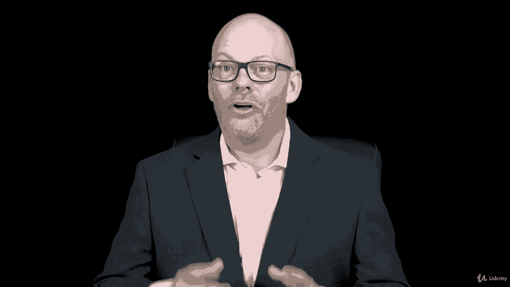

# 【Udemy】项目管理师应试 PMP Exam Prep Seminar-PMBOK Guide 6  286集【英语】 - P113：21. Section Wrap Implementing Project Integration ManagementProject integration - servemeee - BV1J4411M7R6

Good job finishing this section on project integration management， a lot of material to know。

 but a very important topic for your exam。 This is chapter 4 in the Pimba Guide6 edition project integration management we talked about how this knowledge area。

 Project integration management is the only knowledge area to have a process in all five of our process groups。

 so that's why it's so big because we're addressing each one of those processes as we move through the material。

In this section， we looked at creating the charter， really important process here。

 talked about benefit measurements method。 So future value and present value and some of that business。

 you'll need to know for your exam。 We looked at creating an assumptions log。

 creating the whole project management plan。The deliverables that we create。Work performance data。

 we talked about the issue log， managing project knowledge。

 a new knowledge area and the different types of knowledge。

 you want to recognize those characteristics。 We looked at monitoring and controlling the project work。

Mapping out integrated change control configuration management。

 really important topic there about features and functions。

 and then we talked about closing the project or phase。All right， good job， a lot of information。

 you did it， you knocked out in the first knowledge area as we continue to move through these knowledge areas and the remaining chapters into Pembook now we're getting into the very essential information that you must know in order to pass the P&P and I have confidence that you can do it。

All right， keep pressing forward， I'll see you in the next lecture。

