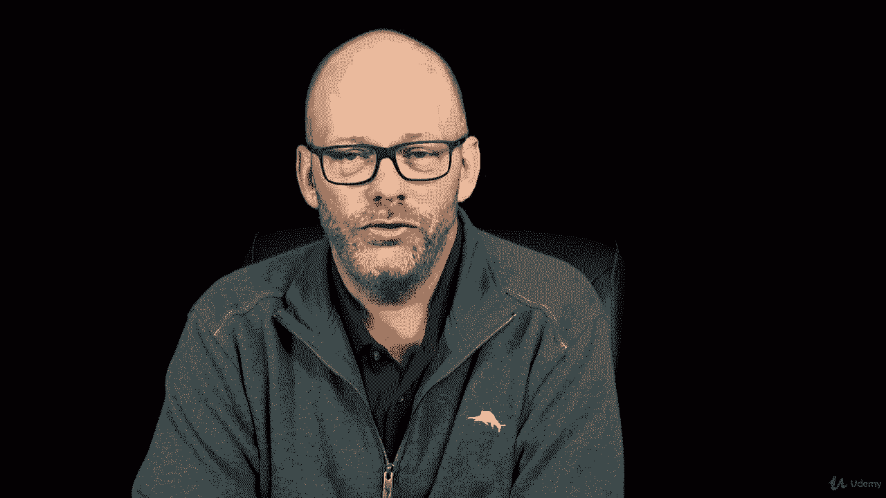

# 【Udemy】项目管理师应试 PMP Exam Prep Seminar-PMBOK Guide 6  286集【英语】 - P115：2. Planning Project Scope Management - servemeee - BV1J4411M7R6

Welcome back now let's talk about the first process in our scope management knowledge area。

And this is planning project scope management。Planning project scope management will create two subsidiary plans obviously we get the scope management plan。

 but it will also create the requirements management plan Let's take a look at the EOs for this process。

Our inputs will be the charter。The project management plan because we're looking at these other plans and remember this is iterative。

 so the quality management plan， the life cycle description， the development approach。

 those are all part of our project management plan and that will affect our scope management planning。

And then of course， EEF and OPA。Tools and techniques here in Plan scope management。

 expert judgment will do data data analysis， so alternatives assessment or alternatives analysis and meetings our outputs。

 as I mentioned， the scope management plan and the requirements management plan。

To go about creating the scope management plan， we're going to work with our experts。

 including our project team。And we're going to define exactly how the scope。

How will you define the scope so the scope management plan doesn't create the scope statement it says how do you define the scope in order to create the scope statement so it defines how the scope will be defined how the scope will be developed。

 how will you monitor control and validate the project scope so it's a plan that defines how will you do this knowledge area。

The charter is a key input because it has the high level requirements。

 any historical information we can use so similar projects we can adapt to our current project treated like a template。

And then enterprise environmental factors are needed because you may have rules and requirements on how you define。

 develop， monitor， control， and validate scope， so you need to adhere to the governance within your organization。

 part of our EEF。The project management plan input， we know that planning is iterative。

 so don't let that throw you that we need the quality management plan that it's an iterative process so on day one you don't have a quality management plan。

 but as you work through the project those other plans will affect your scope planning。

The project Lifecycle description， we're defining the phases of the project in a predictive or an adaptive。

 we're defining our rules for the product backlog and how does that work and how long are our iterations and so on。

The development approach is just that are using a waterfall approach， or using iterative， adaptive。

 agile， Scrum， XP， some hybrid， so what's your approach here because that will affect how you create the scope management plan。

Let's take a look at the details of the scope management plan， it's not the project scope。

 as you already know， it describes how will you create the scope。

It also defines how are we going to create the work breakdown structure and the WBX dictionary。

 and then how will you maintain the baseline？The scope baseline is almost always。

Require if change happens to that， you have to go through a change control。

 that's what I'm trying to say that the scope baseline always requires formal change control because the scope baseline is the scope statement。

 the WBS and the WBS dictionary。It also describes the formal acceptance of the deliverables。

 so scope validation is a process we'll see coming up in this section。

The requirements management plan describes how will you plan。

 track and report your progress on requirements。Any and all configuration management。

 So how will you do configuration management identification， configuration status。

 configuration audits， and then maintaining configuration。

 remember configuration management is all about the features and functions。

 so it's particularly interested in the product scope So changes to scope will affect configuration management。

 we saw that in chapter 4 when we talked about integrated change control。

What's the process to prioritize requirements， what are the metrics that you'll use and then what about a requirements traceability matrix we've not seen this yet it's coming up I'll give you a hint。

 it's a table that's all it is a list of requirements and where they are in the different phases all the way to completion so an RTM is a requirements traceability。

 you're tracing it through all the phases of the project until it's done we'll see one coming up something to look forward to。

