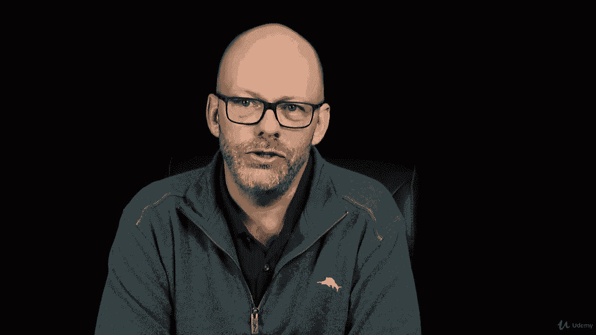
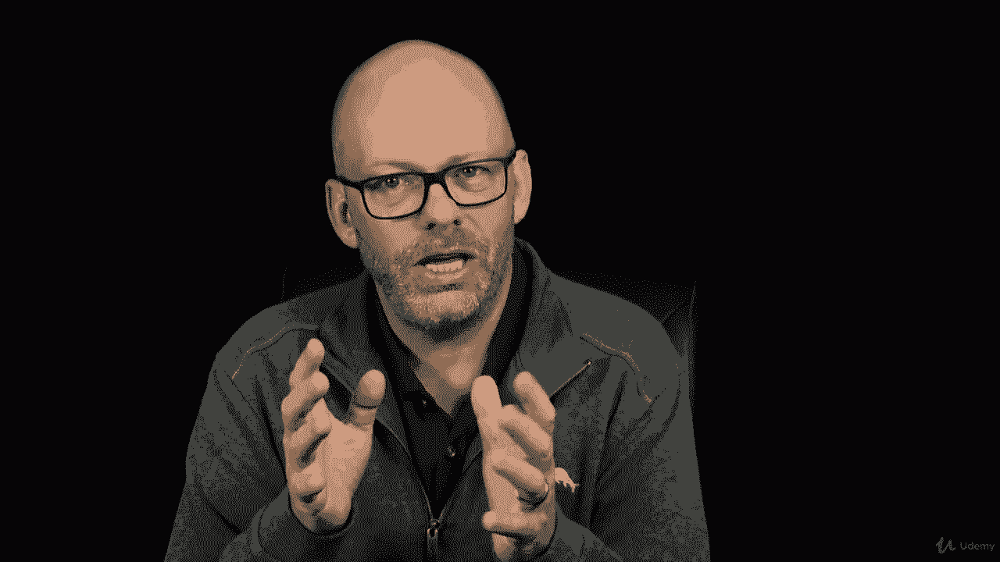

# 【Udemy】项目管理师应试 PMP Exam Prep Seminar-PMBOK Guide 6  286集【英语】 - P116：3. Project Scope Vs. Product Scope - servemeee - BV1J4411M7R6

In project management there are two scopes that we need to focus on as the project manager we have the product scope and the project scope let's take a look at these and how they affect our planning and management of the project。

So product scope is all about the features and functions。

 The project scope is all about the work that you'll complete in order to create the product scope。

So the product scope is a way to describe the things and the characteristics and the usability that the customer will receive as a result of our project。

The project scope， though， is all of the required work。

And only the required work in order to satisfy the project objectives。

 so it's about creating the product， but it's also about maintaining the project objectives。

Remember that project objectives can be your key performance indicators， time， cost scope， quality。

 managing risk， resources， and so on。The product scope is only the features and functions。

So if we think of this， it's really a symbiotic relationship here。

 The customers come to us and they describe their requirements。 They describe the product scope。

 and we capture those requirements and document of them have a good grasp on what those requirements are。

 The product scope then will help us create the project scope。

 As we execute the project we're creating the project scope， which。

 in turn creates the project scope。 So the project scope and the project scope are symbiotic。

 They help each other exist。😊，There is a concern， though。

 that we need to look at with the scope in the project life cycles。

When that product scope and project scope are created will be different in a predictive life cycle versus an adaptive life cycle。

Recall that at a predictive life cycle， we plan everything up front。

 we want to know exactly what it is we're going to create。

 so the project scope is defined at the beginning。Well， in an adaptive life cycle。

 the project scope is really developed through these iterations in an adaptive environment。

 we typically have a product backlog that's prioritized before we go into each iteration or a sprint。

 I'll say it into a sprint， so we have an adaptive which is different than predictive。

 predictive I predict the scope， adaptive， I adapt by project scope to the changing product backlog。

A predictive we generally become change resistant that we want to nail down everything up front and then once we have that approved。

 and once we have a baseline， I become very adverse to change and adaptive just by its nature becomes to expect change that we know requirements are going to change and the product backlog will be reorganized so we come to expect change so there's a difference in the scope in the scope management in predictive and in adaptive。

Product scope， let's talk a little bit more about what are the characters and features of product scope but really talking about what the customer receives as a result of our project work and the product backlog as I mentioned。

 that's the adaptive product scope。The requirements， we'll do requirements gathering here。

 We'll talk about that a little bit more coming up。

 but requirements are where we get the product scope from at the end of a phase or at the end of a project before we actually close it out。

 We need scope validation。 Well validate scope is confirmation that what we've created is the product scope that what we promised to create and what we actually did create should be the same thing。

Scope and project completion are activities that。We do at the end of a phase and at the end of the project we talked about this in project integration management Well the scope's important because the project scope will be measured against the project plan。

 did you do what you intended do you have cost variances schedule variances what are the outcomes of your issues and risk the project scope will be measured against those requirements。

Requirements， just to be clear， they're a condition or a capability that has to exist in what we create in the final product in the service or the result。

Throughout the Pimbaok， we know that we can tailor the processes。

 while scope managements no different， we can tailor scope management。

So we need to think about when we tailor how much knowledge and requirements management do we need。

 so knowledge management requirements management， we can tailor based on the size of the project。

 the type of requirements if we've done this project before and just how big the project scope is。

Validation and control that we want to do scope validation is it a formal sign off do we do it at the end of each phase or only at the end of the project so that's the tailoring and then scope control。

 how much control do we require for changes for integrated change control for the change control board。

 you know so that kind of business we can adapt and tailor based on how big our project is。

The development approach， of course， that's being tailored here， we doing predictive or agile。

The stability of requirements that really affects how effectively we can manage the project or manage scope。

 If it's high level requirements， it's kind of a lot of things open to interpretation。

 So the more detail we have， the more control and the more exactness we can have when we create the scope and we actually execute the work to create the scope。

And then the governance， what are the rules and requirements you have to have as it comes to scope management？

All right， good job， keep moving forward。