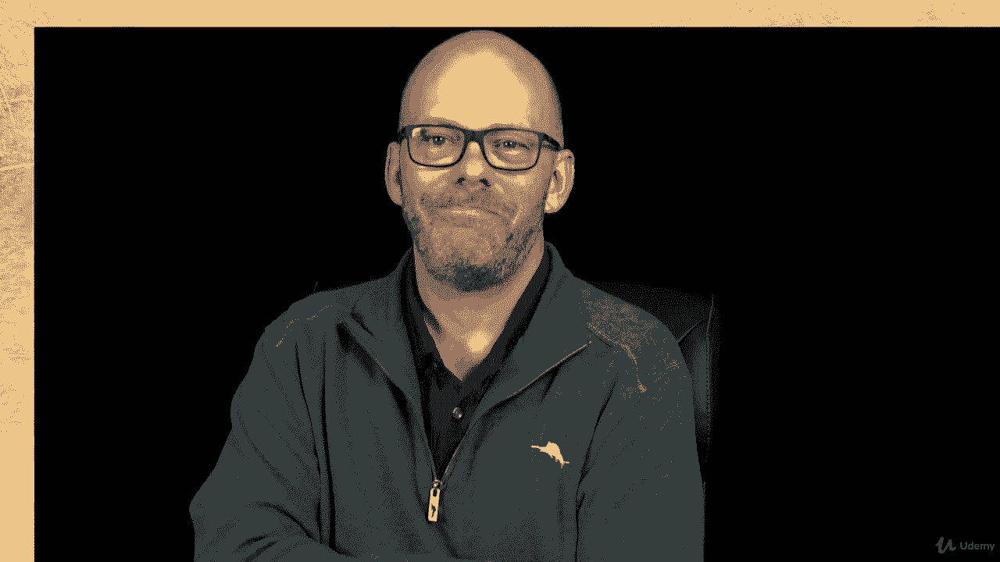

# 【Udemy】项目管理师应试 PMP Exam Prep Seminar-PMBOK Guide 6  286集【英语】 - P118：5. Considerations for Adaptive Environments - servemeee - BV1J4411M7R6

You will likely see a few questions on adaptive environments。

 especially in regard to scope management。 So let's take a look at the idea of adaptive environments and how does scope management take place there。

 Well we know already in an adaptive environment， The scope is not fully defined at the start。

 that the scope is defined and elaborated through the adaptive environment。

Emerging requirements happen in an adaptive environment， so what happens。

 remember we have this product backlog and then we prioritize that backlog。

 the product owner really does that， prioritizes the backlog before each iteration of the project。

So the requirements can change and shift and new requirements can come into that product backlog throughout the project。

A concept that we need to know when we compare a predictive life cycle to an adaptive life cycle is this inverted triangle。

You know that the triple constraints of project management are sometimes called the Iron Triangle。

 it's this idea that scope， time and cost are the three constraints that we have to balance。

In predictive we always， not always， but we often have the mindset that scope。

 once it's defined is defined， so the scope is what we are going to create and once the scope is created I'm very adverse to change because change will affect my time and cost。

Well， in an agile， we have this inverted model where time and cost are fixed。

 You only have so much money and so much time and scope is what varies。

 whereas in triple constraints， time and cost can vary in a predictive。

 Now with all of this you know there's some flux here。 there's a little bit of reasoning here。

 So the agile triangle of constraints。 is's just a pyramid upside down。 that time。

 you only have so much time and so much money and that's fixed。

 So your scope then is allowed to increase or decrease based on how much time and money you have as the project's in motion。

 So it's determining what's a variable and what's actually fixed。

 So that's the inverted triangle model。A concept that we see in adaptive environments is to groom the backlog。

 not groom your back。But groom the backlog。 So grooming the backlog is where we have a product owner。

This is a person that's usually representative of the stakeholders and they're the ones responsible for prioritizing the list of backlog items and that's called a refinement so you have this long list of requirements。

 sometimes called user stories and these user stories or requirements are prioritized for most important all the way down to least important well the project team or the development team will say we can do this much work in the next two to four weeks so that becomes our backlog for this iteration for this sprint。

 for this time period。And then while they're working on those requirements。

 the product owner can add new requirements， reprioritize， shift things up and down。

 so that's the idea of grooming the backlog， usually the project team and the project manager。

 they're involved in that process， they're involved in that conversation of grooming the backlog。

There is a concept called the Scrum artifact， it's things that Scrum creates。

 and it's called one of them is the product backlog。

 so the product backlog is a source for all your requirements。

 everything has to go through the product backlog in Scrum or in agile。

The product owner will sort and prioritize these backlog items。The development team。

 they always work on what's the most important items that are prioritized in this backlog。

 so from most important to least important。Some other facts here about the product backlog。

 you always prioritize it before the next iteration， before the next sprint。

Back a refinement is by the product owner and the development team that they work in harmony on what's most important and what's feasible to get done in this iteration in this sprint。

The team will determine， okay， how much can we actually get done。

 What's our capacity and capability based on these items in the product backlog So sometimes I might only be able to do this much as the project team because those are very complex and they're very big they require a lot of effort and that other times those are very easy so I can knock out a whole bunch more in the next sprint or iteration So the product backlog really determines what are the things that are important So the priority of requirements how much can the team take on at any given time and then before the next iteration。

 what's important can change。

All right， good job， some insight here into adaptive environments and scope management。

 keep moving forward。