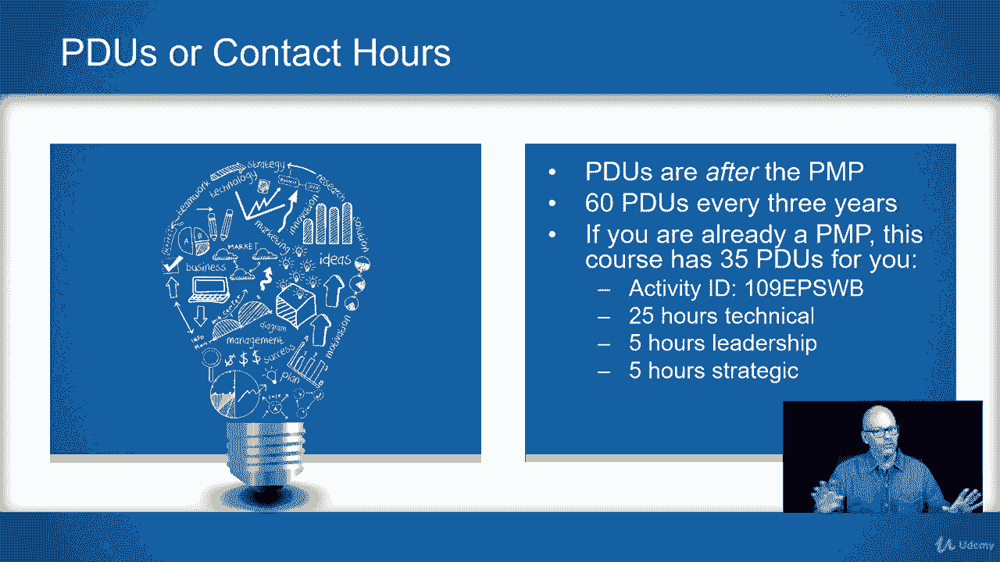

# 【Udemy】项目管理师应试 PMP Exam Prep Seminar-PMBOK Guide 6  286集【英语】 - P11：3. PDUs Or Contact Hours - servemeee - BV1J4411M7R6

我想做一个演讲，真正解决这个想法，这些PDUS接触时间，你从这门课程中得到了什么，因为社区里对接触时间或PTO的使用有很多困惑，或者我得去拿PTO，这样我就有资格参加P和P。

我们需要非常清楚接触时间和Pdu之间的区别，所以我已经提到过几次了，但我只想确定一次，尽管如此，这门课既有联系时间，也有PDUSE，让我们先看看接触时间，所有的权利，所以如果你还不是PP。

你想要并赚取联系时间，你没有得到任何Puse，如果你不是PP，所以联系时间是在PP是像这门课这样的教育时间之前，所以这门课值得35个小时的联系时间，你可以用来申请PP，所以联系时间是你想要的。

也是你在这门课程中获得的，如果你是一个p p，然后你就可以赚到pduse了，所以一旦你成为P NP，然后你想要pduse，你只能从教育中计算pduse，还有一些其他的事情我们以后再谈。

但只是从P NP之后，所以你不能选这门课，赚取你的P NP，然后声称这个课程供PTO使用，这是在你是一个前进的p np之后，所以PDUS在追PP，你每三年需要60个PTO，所以你有三年的时间。

你知道一年二十个，一对夫妇一个月，如果你已经是PNP了，这并不难做到，我知道你们中的一些人，你修这门课是为了复习，这门课有三个五，在PM的网站上，这是ccs采购经理人组织，如果你是PP，你会登录的。

你不这样做，如果你还不是pp，如果你是个pp，您将登录，然后您可以搜索指示COM LLC，或者PMI注册的教育提供商编号4082，您将查找活动ID，是1点9分，所以一零九EW B。

然后是三个五个小时的接触，三个五个PDUS分布在两个五个PDUS用于技术，5个领导职位，5个战略职位，所以你必须有你的pduse的分发，你会说这门课属于哪一类，所以你得25分，领导力5分，战略类5个。

如果你是个PP，你们这些人民党候选人，可能这个班上绝大多数的人，这是联系时间，只要三五直线上升。

联络时间好的，希望能解开这个谜，联系时间使用PTO，现在你知道了，你可以告诉其他人，所以他们也很清楚，所有的权利。

