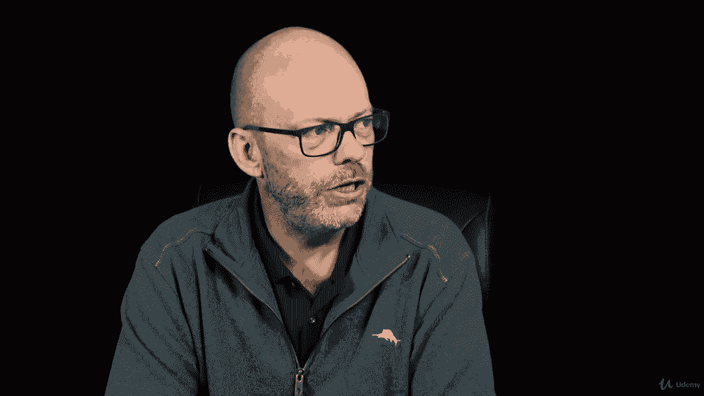
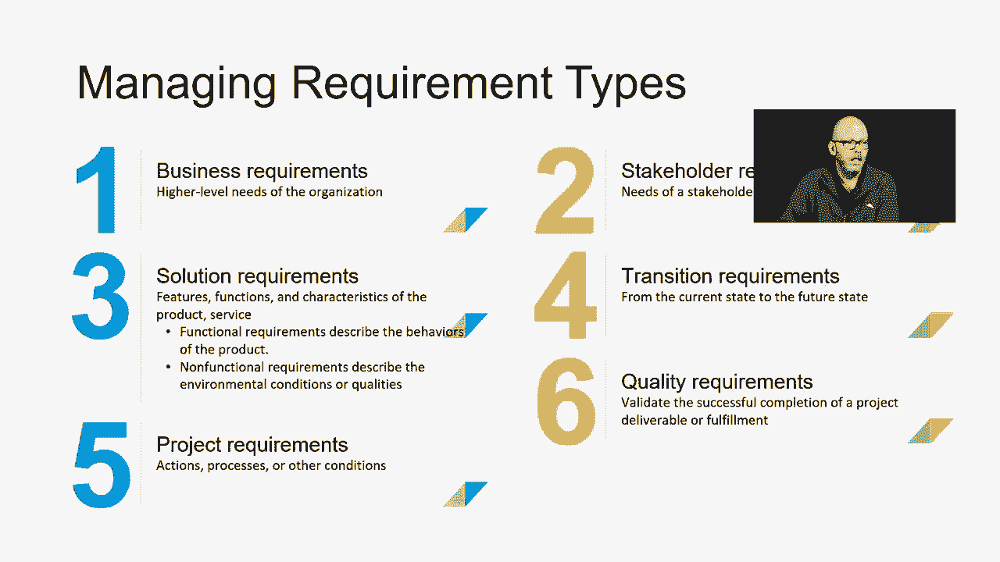

# 【Udemy】项目管理师应试 PMP Exam Prep Seminar-PMBOK Guide 6  286集【英语】 - P120：7. Managing the Project Requirements - servemeee - BV1J4411M7R6

嗯。Often when we think of requirements， we think of what are the things that the customer receives as a result of this project？

So there are six different requirement types to look at。 let's take a look here。 First off。

 we have business requirements。 These are the high level needs of the organization。

 our business case and business value describes our business requirements。

 Then we have number two stakeholder requirements the needs the stakeholder or stakeholder groups probably where most of us think of。

Then we have solution requirements so the product， so what are the features and functions of the thing we're going to create and then within those we have functional and non functional requirements。

 a functional requirement describes the behaviors of the product。

Non functional are all about the environmental conditions。

 so a functional requirement would be the click sound and the torque it takes to click that mouse button。

The nonfunctional requirements would be the security and the safety in the ability to transmit a certain amount of signal using a certain electrical pulse。

 so it's more about the environmental conditions， we think about the qualities， the safety。

 the convenience， the ease of use that hurt my hand if I use it too much。Number four。

 transition requirements， how do we get from current state to the desired future state。

 so operational transfer？Number five， any actions， processes or other conditions in my project or project requirements？

Number six， what are the quality requirements， so what's the quality management plan。

 the quality assurance， how do we ensure that what we're giving the customer is correct so quality control So these are requirement types when it comes to managing requirement types we also have to think about a requirements traceability matrix So that's what we're going to look at on this slide and on the next piece here。

But managing the requirements is first based on the collection of requirements。

 the documentation of requirements， so the actual requirements。

 documentation and the characteristics of those， and then we create this requirements traceability matrix。

This is a document which defines the project， its characteristics， what's the ID。

 if think you're using a work breakdown structure in a numbering system called the code of accounts。

 which we'll see coming up you could enter that associated ID and we could get into okay what is the assumptions。

 what are the requirements and then what's the status and then the details of that like this would be all the different phases in this particular project。

And this was just made in Microsoft Excel， and so you could enter that and then as you move to each new phase。

 these items over on the right。Those would be the phases that as you moved into it。

 you would just put an X or a check mark or you write a little note all the way through until it's been delivered to the customer。

 so this is a requirements traceability matrix， it's a table that allows you to trace your requirements through the project。

So it's just that so it tracks a whole bunch of different characteristics like we just saw in the example。

 the name， what's the business and project objectives。

 the work breakdown structure entry you could have extra data about coding like that numbering system。

 the code of accounts cost and schedule and then what's its status you come up with some scheme for status I typically just do like a rag rating red amber greens you can just look at it you want to see a lot of green not red。

But you could also things like active canceled deferred， added， approved assigned or completed。

Or whatever legend do you want to come up with。And then you can add comments and notes。

 so it's just's a way of tracking where requirement is in each phase of the project as it moves through the phases。

All right， that's it， great job， keep moving forward。

