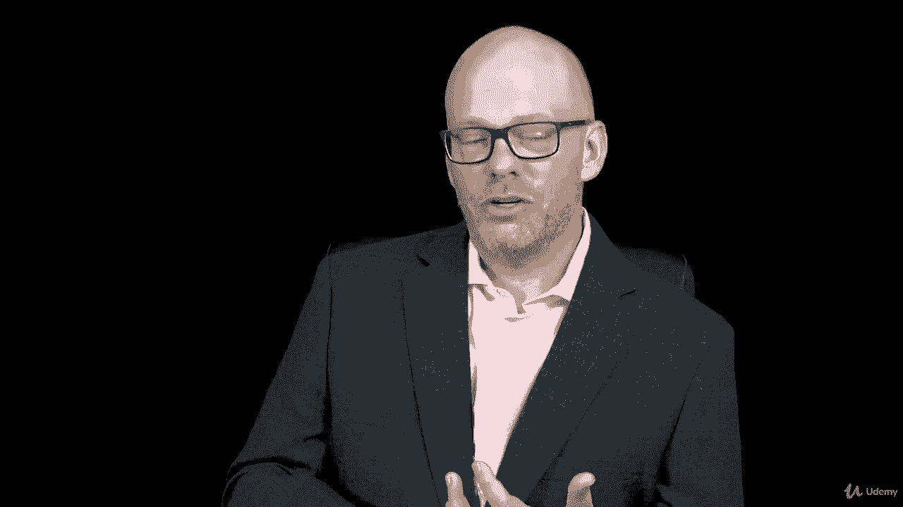
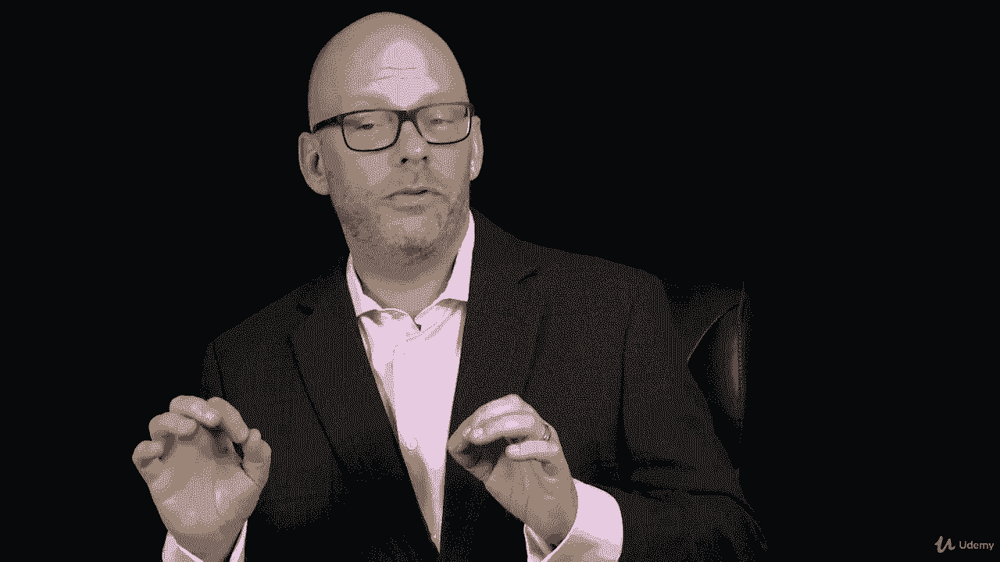

# 【Udemy】项目管理师应试 PMP Exam Prep Seminar-PMBOK Guide 6  286集【英语】 - P126：15. Section Wrap Managing the Project Scope - servemeee - BV1J4411M7R6

あ。Great job。 You did it。 You finished this section on managing the project scope。 I knew you would。

 if you're not a quitter。 you're somebody if you're going to start something。

 you're going to finish it。 So that's great， So keep moving forward In this section。

 we talked about planning the project scope， creating that scope management plan We looked at project scope versus project scope。

 We talked about some trends and emerging practices and scope management。

 How does scope management work in an agile environment， creating the scope management plan。

 managing project requirements。 We looked at the scope statement。

 creating the work breakdown structure， which you did an assignment on and the WBS dictionary。😊。

And we talked about validating the project scope。

Another process we looked at was controlling the project scope and remember how that's tied into project integration management that those two are related。

Okay， good job。 You finished Section 11， which was chapter 5 in the Pimbaok for managing the project scope。

Good job。 Keep moving forward。 I'll see you in the next section， where we're going to talk about。😊。

Schedule management。

