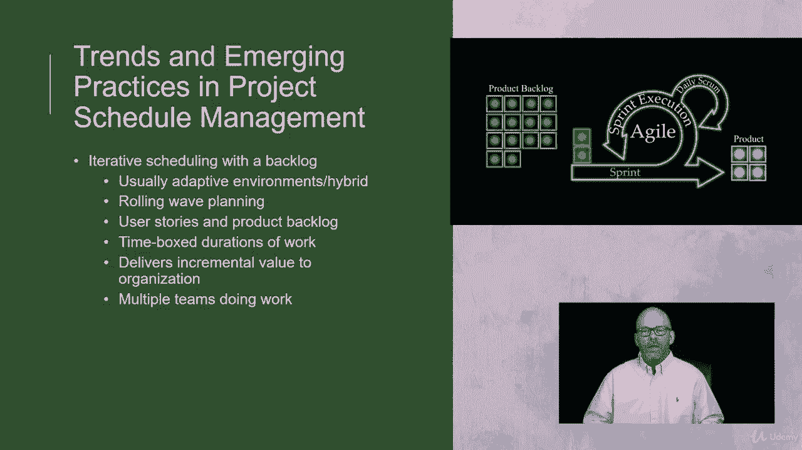
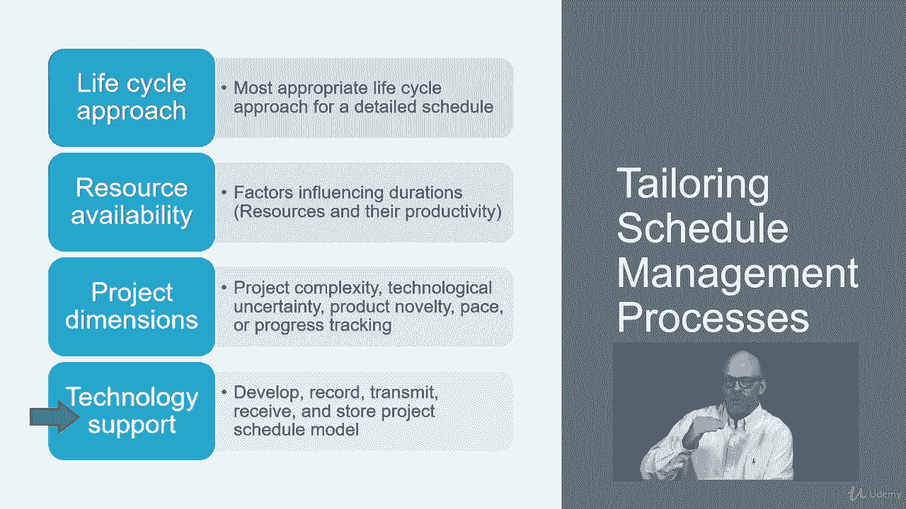
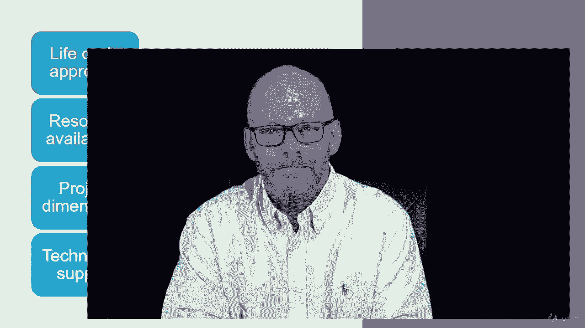

# 【Udemy】项目管理师应试 PMP Exam Prep Seminar-PMBOK Guide 6  286集【英语】 - P128：2. Trends and Emerging Practices in Project Schedule Management - servemeee - BV1J4411M7R6

。Let's talk about some trends and emerging practices that you should be aware of for your exam。

In light of project schedule management。We want to think about the different sizes of projects and how those different sizes of projects can have a different approach to scheduling。

In smaller projects， we can create a single process out of the idea of defining the activities。

 sequencing the activities， doing duration， estimating for the activities and creating the schedule model so rather than making those distinct processes。

 those all kind of meld together in a smaller project it's kind of hard to do in a larger project。

We also have to consider the time， the level of effort for knowledge management， for risk processes。

 and any value added activities。So those are things that are in addition to our schedule model。

 so you may have some interruptions in the execution as far as cranking out the work because your team has to come and participate in risk identification and risk planning and any other project management activities where I need the team to serve as a subject matter expert。

Some other trends we either talk about in emerging practices is this idea of iterative scheduling with a backlog。

 typically we see this in an adaptive environment。The idea is we have a product backlog and then we select the activities that we can do for this iteration。

 for this time box duration， typically two to four weeks。

 and then at the end of that we have incremental deliverables so we add value incrementally。

It's ideal for adaptive， we could do it in a hybrid or maybe a predictive。

 but typically adaptive or hybrid predictive is usually we plan out exactly when activities will take place and when requirements are created。

This is an example of rolling wave planning that we plan and we do and we plan and we do。

 so it makes these waves of planning and executing。Multiple teams could be doing the work。

 we just have to be careful that we don't step over each other so interconnected activities where these two activities are dependent on one another。

 we have to be aware of and plan accordingly or separate those from the two teams so it doesn't get as cumbersome in our planning and in the execution。

So this is an example of a sprint and an agile environment。

 and we'll look at that in a little bit more detail coming up。

Another trend is to use a sign board or a Kban system Kban is a way to show the work in progress or we call the W so you can see these little posty notes。

 these little sticky notes if you will， they show the different user stories。

 the different requirements in each phase of the work that they'll move through so as you complete a user story you move it to the next column all the way over till it reaches to done or published or whatever the last phase of your project may be。

Lean manufacturing is where we have a backlog of assignments and then as team members become available。

 it goes to the next available team member， so the assignments are just published to the next person。

 so it's not as much planning where we're going to choose who does what。

This makes the assumption that the person that receives the assignment is capable of doing the work。

 so we want to be aware of that in lean manufacturing。

Of course we can tailor our schedule management processes like all of the processes in the Pimbaok guide。

 so some things that we can schedule in regard to or tailor in regard to schedule management。

 the lifecycle approach so we choose the most appropriate life cycle for our project the resource availability so what factors can we tailor or adjust when it comes to people and when it comes to materials or resources so it's just using some planning here to take advantage of when people are available or resources are available and what activities do we have that can fit with those resources。

The project dimensions， the project dimensions is just a way of describing the characteristicss and the logistics。

 the complexity， any uncertainty， and there's a term I like called product novelty。

 you know what's the characteristics of the thing that you're creating。

How quickly can you do execution and then how would you track that so all of those logistics about the project dimension。

And then the technology support， how will you support your schedule to develop it， to record it。

 to share it， and then make sure that we have a store a storage location for the project model that we don't want multiple versions of our network diagram。

 the project model， we want to be able to capture that and store in one place and then if it's updated。

 we baseline it， we version it， and so we always make certain we're of the last version。

 but we need a system and approach to how we control that versioning and changes to the schedule model。

All right， good job。 Keep moving forward。

