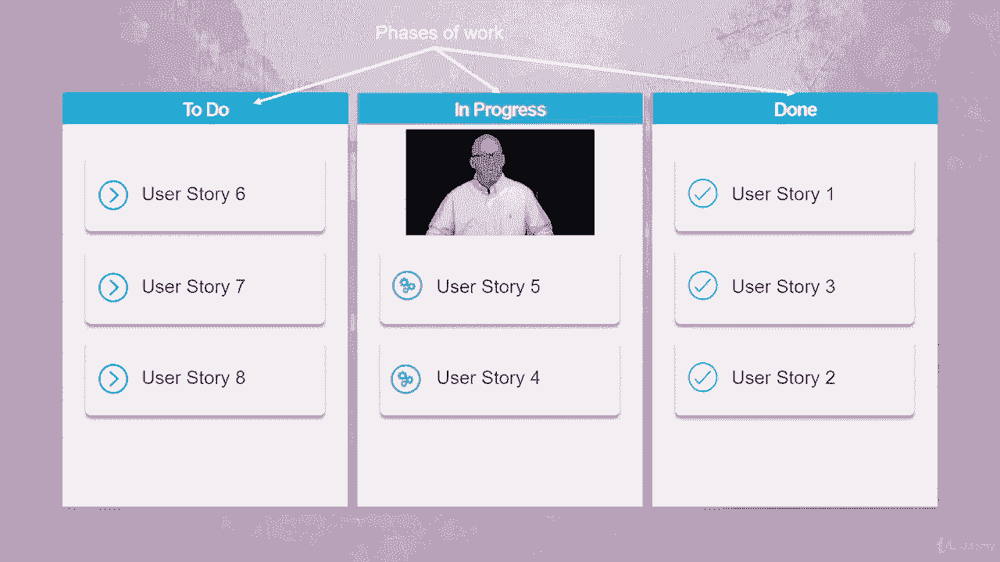

# 【Udemy】项目管理师应试 PMP Exam Prep Seminar-PMBOK Guide 6  286集【英语】 - P129：3. Considerations for Adaptive Environments - servemeee - BV1J4411M7R6

In the last lecture we talked a little bit about adaptive environments。

 we talked about the idea of a product backlog and how that feeds activities into the iteration or into the next available or for the next available resource Let's take a little bit more in depth look now when it comes to scheduling an adaptive environments we know that an adaptive environment uses short iterations of work and an agile we call those a sprint so these sprints or short iterations or typically between two weeks in four weeks。

This helps with quick feedback though in our review cycles it's part of the plan when it comes to adaptive that we create the product and then we have the review the retrospective of what worked or what didn't work we want to do this quickly and accurately and on a regular schedule because we don't want to hold up the next iteration of the project so we need to schedule that have a cadence down of when do we do these retrospectives exactly。

We have a prioritized backlog of requirements， that's the product backlog we've talked about grooming the backlog and the product owner and how those requirements are fed into the iteration。

User stories are what we call the product backlog， those items in the backlog and remember the user story we talk about the role and the benefit and the motivation and what is the user story。

 what does it create， what does it satisfy。And of course in an adaptive environment。

 change is welcome， but change goes into the product backlog and it's prioritized by the product owner and the project team。

The project manager role in an adaptive environment takes on this idea of servant leadership。

 where it's different than a predictive where we are directing and telling the team what to do and really kind of in charge。

 the servant leader is still in charge of the project， but it's not this almost autocratic role。

 it's really the project team， they are facilitator。

 they make certain that the team has the items that they need。

A phrase that we use in agile or adaptive is this idea of carrying food and water for the team。

 we aren't literally carrying food and water， but it's a way of ensuring that the team has what they need in order to do the work in order to get the work done。

Now in the Pimbaok guide the project manager has the same role in an agile or adaptive as we do in predictive。

 so some of you may be a scrub master， a certified scrub master or some other adaptive certification and that's fine that's great just know there's a small difference in the Pimbaok guide than what you may have learned in your certified scrub master course or in another adaptive certification。

 so we want to think about the project manager has the same role。

So a scrum master is analogous to a project manager in the PibaC。In an adaptive environment。

 we have this idea of what's to do， we have the W， what's in progress and what's done。

 so this is the idea just to be clear of a conban board It's conban means sign board because it is it's like a poster or a whiteboard that everybody can see it's very easy to see what's to do what's in progress and what's done so a conban board。

Another term we want to be familiar of is the theory of constraints。

 the theory of constraints is based on a book called The Goal。

 it's a pretty interesting book after your exam， you should pick that book up and read it。

The theory of constraints is where we examine the most limiting factor in our processes。

 and then we want to improve that constraint。 So it's no longer the most limiting factor。 So。

 for example， if our most limiting factor is time。 what can we do to address time。

 So that it becomes more flexible it being the constraint。

 And then that allows us then to look at now what's the most limiting factor。

 And maybe that's the budget or money。 So then we examine all the attributes there for the budget。

 And why is it the most limiting。 And then we attack that and work on that and manage it more closely。

 So now it's not the most limiting。 Well， now it's resources and so on。

 So it's a scientific approach to improvement。 This is the concept behind lean manufacturing。

 and to some extent our lean in an agile environment。 So or lean in an adaptive environment。

 I should say。So theory of constraints， you attack the most restrictive constraint。

Let's have a big picture here of an agile environment。

 so we have the product backlog we've talked about that， it's a prioritized list of requirements。

 the product owner owns the product backlog。The team determines how many user stories it can take on based on what's in the product backlogs。

 remember the requirements are prioritized， so the team gives points to those user stories。

 they only have so many points to spend in the current iteration。

That then identifies the task that we'll do in the current sprint， the current iteration。

So then we go into the time box duration， this sprint， you know typically it's two to four。

 it could be one to four， can really be whatever you decide， but two to four is pretty typical。

 but one to four is not unrealistic once we're in the sprint there's no new work during that sprint so any changes that are wanted have to go into the product backlog they don't touch the current work。

Every 24 hours， the project manager or the scrubrum master。

 they work with the project team through a 15 minute daily scrub meeting。

 sometimes called a stand up meeting because we all stand and you only talk if you are part of the team and the project manager。

Then we go into the end of the sprint and we have some deliverables。

 We have increments that we can deliver。 And then that gives us an opportunity to do a sprint review So what worked in this sprint。

 what did we create and then the sprint retrospective with the project team with what did work and what didn't work The sprint review is an opportunity to think about okay what didn't we get done。

 how can we improve upon it and the product owner may be involved in that。

 the sprint retrospective is just the team。 So what worked or what didn't。

 how can we improve upon our sprints So that's the big picture there with agile or an adaptive environment in this product backlog。

All right， good job， I'll see you in the next lecture。

