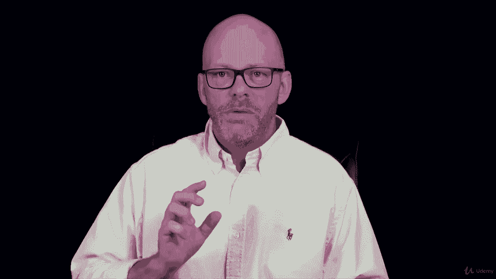

# 【Udemy】项目管理师应试 PMP Exam Prep Seminar-PMBOK Guide 6  286集【英语】 - P135：9. Sequencing Project Activities - servemeee - BV1J4411M7R6

Now that we've created our activity list and we know what our milestones are。

 we can begin putting these activities in the order in which they should happen。

 so now we're sequencing project activities there's a couple different ways you can do this。

Computer driven is probably the most common you're going to use Microsoft project or Primavera or whatever PMMIS that you choose。

 your project management information system。Your manual process though。

 probably not a lot of people doing this， but you could where you write out the activities on little post it notes or sticky notes and you put them up on the wall and move them around you might do that for smaller projects but larger projects that gets pretty cumbersome when you consider you might have thousands of activities to manage。

A blended approach， I sometimes like to do this when I have even a large project。

 but I'll take just a chunk of the more complex work。

 and then I can move it around and visualize it before I take that and put it into Microsoft project。

Because it's easier to me to put them up on the whiteboard and the whole team and everybody can see the flow where in projects sometimes it can be tricky even if you put it on an overhead to be moving tasks around much easier just to move post it notes or stick it notes around so however you do it's fine just know for your exam sequencing project activities。

 computer or manual or a blended approach they don't really care which one you like to do。

Our EOs here for sequencing the project activities， our inputs， the project management plan。

 in particular our schedule management plan and the scope baseline。

 some project documents that need activity attributes。

 obviously the activity list that's what we're sequencing， the As log and the milestone list。

 and of course， EEF and OPA。Tools and techniques， precedence diagramming method。

 we're going to be looking at that in detail， but it's predecessors and successors。

 dependency determination， understanding what this activity is dependent upon。

 what is upstream in our schedule model。Leads and lags， and then your PMMIS。

Outputs will be the project schedule， the project schedule network diagram， technically。

 our project document updates， the activity attributes may be updated， the activity list。

 your milestone log or milestone list rather and assumption log that those are all inputs。

E O's for sequencing activities。All right， dependency determination。

 I just quickly mentioned that a moment ago， let's nail this dam。

Some activities have to be done in a particular order。

Other activities you can do in whatever order that you wish activities that must follow a particular order like you have to install the hard drive before you can put the operating system on。

 you have to have the operating system installed before you can install software。 that's hard logic。

 It just has to work that way you have to have the foundation poured before you can start framing。

Those are mandatory dependencies， must happen， ABC must happen in this particular order。

 so that's hard logic。A discretionary dependency is soft logic。

 We could paint the walls and then put the carpet in。But if we really wanted to。

 we could put the carpet in first， then paint the walls so it's not。

Always best practices or you might have a good reason to change the order。

 but that's soft logic where it would still work you arent just you the common sense。

 it's not always ABC right you can mix things up but some things are ABC。

 you have to have a foundation to build on before you can build。

 you have to have the computer before you can use it， that's hard logic。

We also have external dependencies。 You have an external constraint in construction。

 you need that inspector to come sign off on the work and you can't move forward if you're waiting on the inspector。

 so an external constraint。 you're waiting on a vendor。

 The vendor needs to deliver the materials to the job site So it's external。

 I'm waiting on the vendor to get there to give me the materials。

 It could also be I'm waiting on another project to create there deliverable。

 which will be a component in my project， So it's external a great example of external constraints are vendors and inspectors So we have very little control。

Some， but very little of when it actually happens。An internal dependency is a type of hard logic。

 so internal to the project you have a project team member that they are taking a vacation。

 so it's an internal dependency or you are saying it has to be done in this order or management is said I want this resource on that activity。

 so that's a type of hard logic you must do it。A precede diagramming method。

 which we're going to look at in detail in this section， is a way of describing the flow of the work。

In this example， look at the blue squares in the upper left here， A to B。

 That's your most common in the precedence diagraming method。

 This is what's called a finish to start Activity A must finish so activity B can start。

Activity A is called a predecessor， and activity B is called a successor because A precedes B。

 B succeeds A， so A to B， finish to start A has to finish so B can start so you have to finish。

 priming the walls in order to paint the walls。 This is the most common relationship you'll see in a network diagram or in any project。

 finish to start very easy to visualize in C。 It's it's the most common one。

Then we have a start to start activity A must start so that activity B can start。

 so this start to start as a way of letting two activities happen at the same time。Typically。

 A will start just a little bit before B。 so if you have two activities like we have to start the developing the training。

so the material， they helped us the manuals， so we have to start doing that， well what activity be。

 what could the activity be that could start once training starts？So once people go to training。

 they're in class， we're going to push out the software to their desk。

So once they log in in the classroom， then they get the software installed on their laptop。

 so start to start， we want those activities to happen at the same time or about the same time。

The reverse of that is you have to finish an activity for another activity to finish so you have to finish installing all of the network cable for the electrician to punch down that network cable in your patch panel so you have a network。

 they have to finish pulling all that wire， your network cable so that computers can be connected so as soon as he makes one network drop and it's installed。

 you can plug in that computer， you can plug in that network drop so finish to finish。

 you want two activities to finish about the same time。

 he'll finish all of the network drops before you finish installing or connecting all the computers So it's like you kind of chase each other in the task So start to start and finish to finish are very similar。

The most unusual， the one that you probably won't even see on your exam because even the pinmbook tells us it's reserved for scheduling experts is a start in order to finish this is where you have a cyclic production like in manufacturing So an example of a start to finish is we have a manufacturing project and we are creating bottles。

 plastic bottles， water bottles for customers and we print their logo on it or the little phrase or whatever they want。

 but each bottle is unique for the customers so they're going to print 10000 bottles with their logo on it。

 and then we have a different customer different logos。

 so this isn't just creating plain water bottles each run is a project。

We have an order for 10000 water bottles。 We only have so much space in our manufacturing environment for about 3000 bottles at a time。

 so we keep on hand 3000 bottles。 As we begin to use those 3000 bottles as they're actually being consumed and printed。

 we immediately want to go and get 3000 more bottles to kind of backfill our inventory。

 And so it's this constant， these are being produced and this is the backfill and inventory。

 So this is a just in time inventory or just in time scheduling。

 that we only backfill as we use material。 So how it relates to a start to finish。

 you have to start producing these unique bottles in order to finish the inventory activity。

 So it's the consumption is a and the replenishment is B。 So I start using。

00 bottles and then I can begin to backfill those bottles， so I always have 3000 on hand。

 no matter how many I'm creating is that I always backfill so start in order to finish one of the most unusual ones pretty rare I really doubt you see it on your exam at all。

You will see for certain finish to start because it is the most common。

 you might see start to start and finish to finish。All right， great job， keep moving forward。

 we're making great progress。