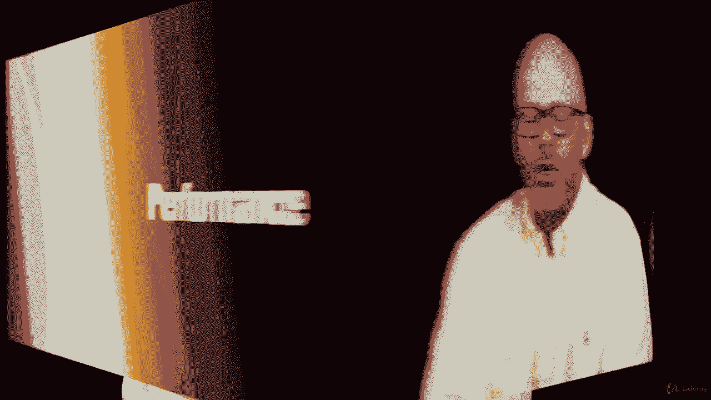

# 【Udemy】项目管理师应试 PMP Exam Prep Seminar-PMBOK Guide 6  286集【英语】 - P151：26. Measuring Project Performance - servemeee - BV1J4411M7R6

Of course， we'll measure project performance。

Often as a project manager we have a real good idea if our project's going well or not before your exam we'll need to have some insight into some techniques to measure project performance so things like earn value management。

 which we're going to look at in the next section。Schedule variances is one of our EVM tools。

 Schedule performance index just shows how healthy your schedule is。

 and then we have what's called a TCPI， the two complete performance index。

 the likelihood to finish the project and meet your budget so you'll learn all of those formulas。

 a little teaser for you in the next section。Correcttive actions is something that we've talked about already in the course when it comes to our schedule。

 we want to see well what corrective actions can we do to make certain that activities are happening as scheduled。

 make certain there's as little delay as possible doing some root cause analysis when it comes to schedule variances。

 and then what measurements do we have to take to recover when we do have a delay。

A burn down chart we often see in an agile environment。

 a burn down chart is a way to identify basically how much more work do we have to do and so the closer you get to the bottom。

The closer you are to being done。So across the bottom we have iteration days。

 so however many days are in your iteration you would put across the bottom。

And then on the Y axis we have work to be done， so there are in this example。

 400 tasks to be done pretty aggressive， just for an example here。

So our burn down shows our target of when we should be done with those activities。V。

Dash line is our forecast based on what we're experiencing now and then you can see the little actual line that we're drifting away from what was planned。

 so it's a way to identify trends and where we likely to end up based on what's happening in the project so you're burning down you're getting closer to the bottom but then you can begin to see is it shifting and now it's going to take longer than what we planned so let's respond to and control those changes。

All right， good job， You're almost done， Keep moving forward。

🎼I should say done with this section all right， I'll see you in the next lecture。

