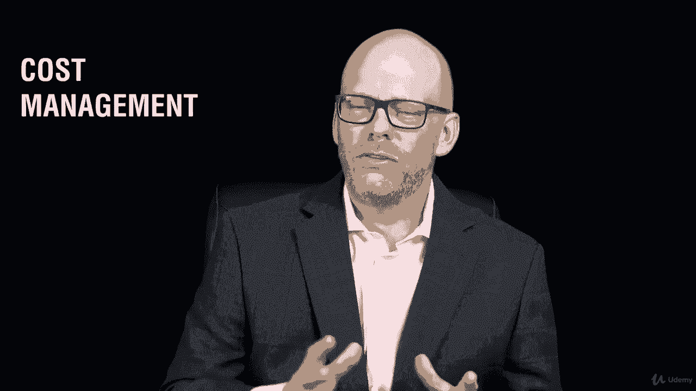
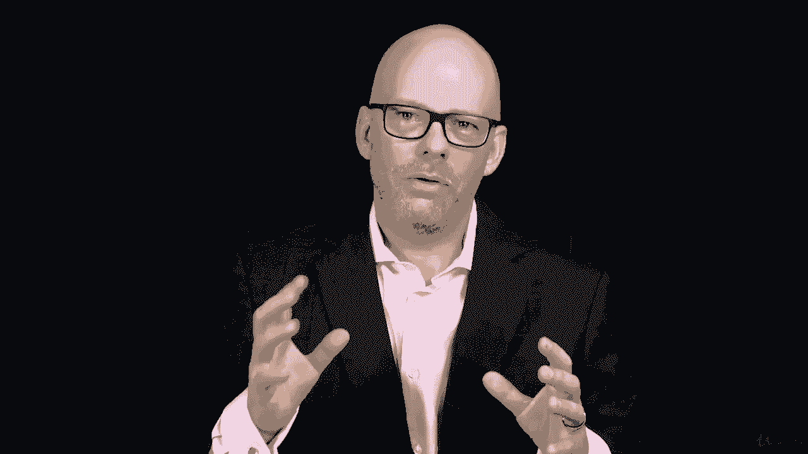
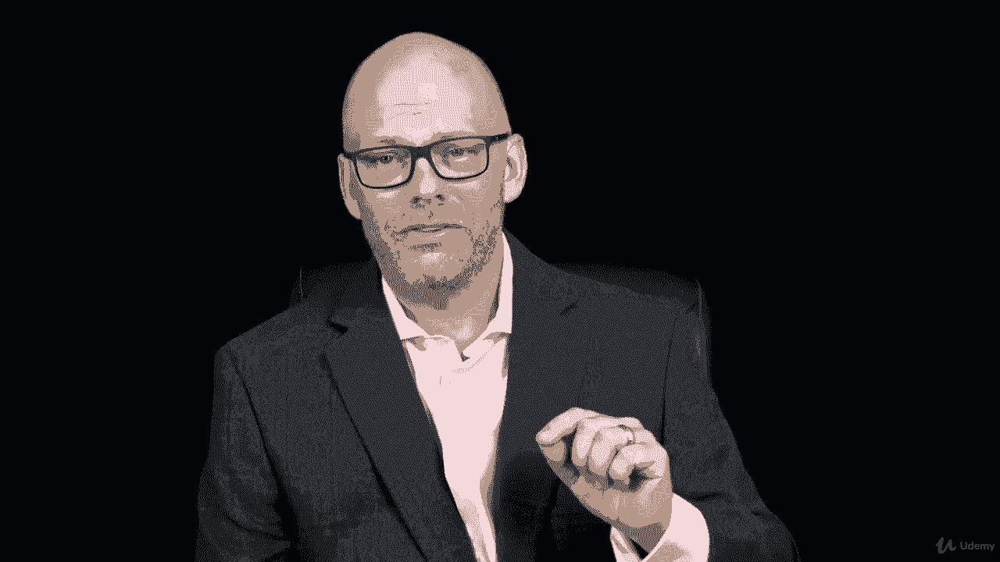
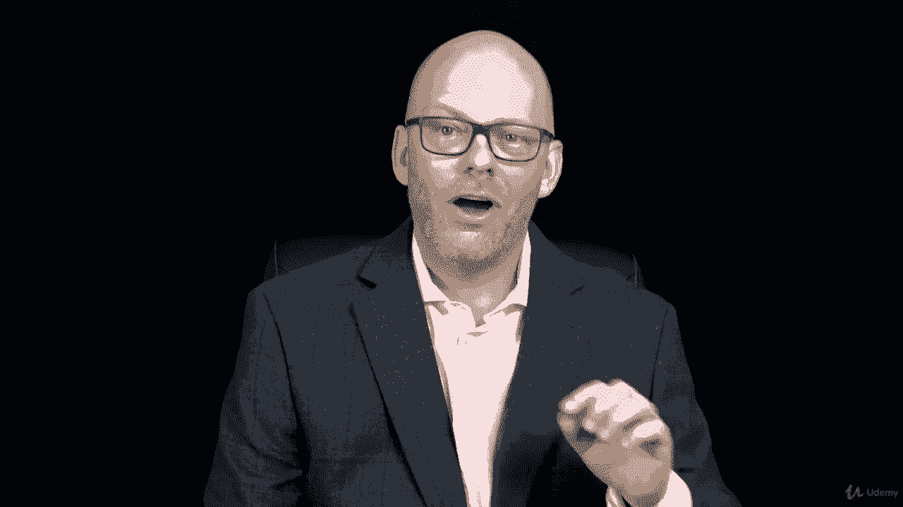

# 【Udemy】项目管理师应试 PMP Exam Prep Seminar-PMBOK Guide 6  286集【英语】 - P154：1. Section Overview Project Cost Management - servemeee - BV1J4411M7R6

。

🎼Welcome to this section on project cost management。

 A lot of important things to talk about in cost management。

 There's a lot of formulas and some maths。 You want to pay attention to that business in this section。

 We're going to begin by looking at what is cost management。

 Some trends and emerging practices and cost management。 How do we plan the cost in your environment。

 So really important to create a cost management plan。 We'll look at estimating the project cost。

 And how does that relate to determining the project budget。 So we estim we budget。

 So we'll talk about that。 There's some things there that we need to know。

 The good news is some of this estimating business。

 you've already learned from the previous section on schedule management。 So it's analogous。😊。

Anaous estimating is creating an analogy between projects， between activities。

 it's a way of taking similar project work and saying， okay， that project took six months。

Ours is very similar， maybe just a little larger， so I'm going to say it takes nine months。

So it creates an analogy between similar project work to what we're going to talk about here。

 so estimating project cost， developing the budget very important。

 we need to create a cost baseline that will measure our cost performance against so we'll talk about the idea of a cost baseline and how does that help us。

Implementing cost control。 and then probably the most important topic from this section is to calculate earned value management。

 So we're going to walk through all of the earned value management formulas that you must know for your PMP but of confidence that you can do it。

 And then I have an assignment for you where you're going to practice some earned value management。

And then we'll talk about cost control。 so important to control cost in our project。 Allright。

 let's get going。 I'll see you in the next lecture。

