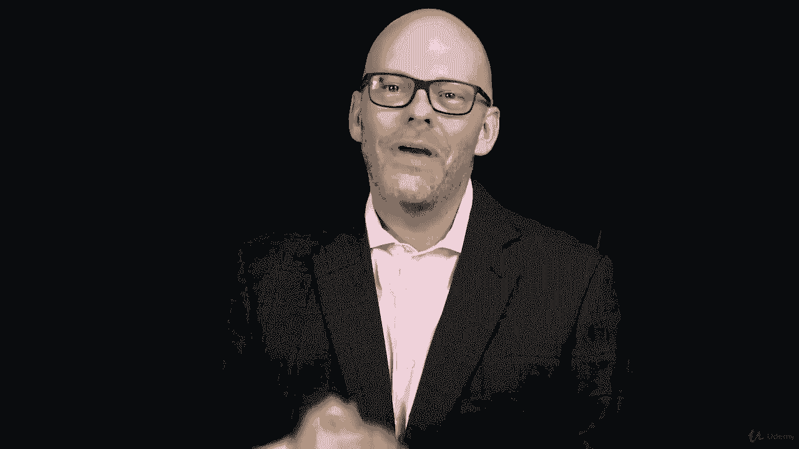

# 【Udemy】项目管理师应试 PMP Exam Prep Seminar-PMBOK Guide 6  286集【英语】 - P167：16. Section Wrap Project Cost Management - servemeee - BV1J4411M7R6

🎼。Great job finishing this section on cost management I know there's a lot of terms and a lot of formulas。

 just a lot of work to do here in this section， but you're making great progress。

 you're sticking with it you're working towards the goal that you set out to do and that is fantastic。

Remember， the big picture here is to pass the exam， not to memorize formulas。

 not to get bogged down the minutia， but to know enough to apply on the exam and to pass the test。

 Well， how much is enough， I think this is part of your comfort level， your threshold here。

 your tolerance level。Enough is when you're comfortable with it and you have a clear understanding of the material。

When you go into pass your exam， you're going to have butterflies in your stomach。

 you're going to be a little nervous， you're going to have some anxiety。To combat that。

 to think about in the future how we can combat that nervousness and that anxiety is doing the work here by really understanding all of this information。

That will mean when we go to take the test， there's no reason to feel that anxiety or that nervousness。

 So by doing the work now， which you are doing and stick to it。

 You're helping yourself in the future， just by knowing it。

 it's going to help you put you at ease because your confidence level is going to go up。

So stick with it。 Don't get discouraged。 This is a lot of information。

 I have confidence that you can do this。 I have confidence that you can earn the PMP。

Great job You did it。 You finished this section on cost management cost managements a really important topic that we need to know as project managers because people are always interested in number one。

 how much is this going to cost and the number two when can it be done So cost managements always important We started our conversation by talking about creating the cost management plan recall that this is a subsidiary plan in the overall project management plan。

Then we look at estimating the project cost， estimating the activity cost。

 talking about labor materials and other things that we may need to purchase， vendor services。

 things like that， so estimating the cost and then creating the project budget。

Once we have the project budget developed， then we can create this cost baseline。

 Remember the cost baseline shows what was planned and then what was actual and the difference between the two is a variance。

We also looked at measuring project performance One of the most interesting parts of this section is earned value management where we looked at earned value management and cost variances。

 schedule variances the different indexes that doing some forecasting we need to know all of that in order to pass the exam you're going to have questions on that for your exam of course so I hope you do that assignment and I hope that you create some scenarios to practice。

 this is something that you can do on your own just to create some different scenarios to practice earned value management。

Okay， good job finishing this section on project cost management， keep moving forward。

