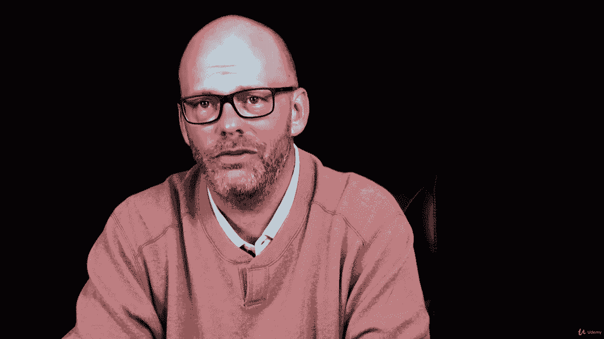
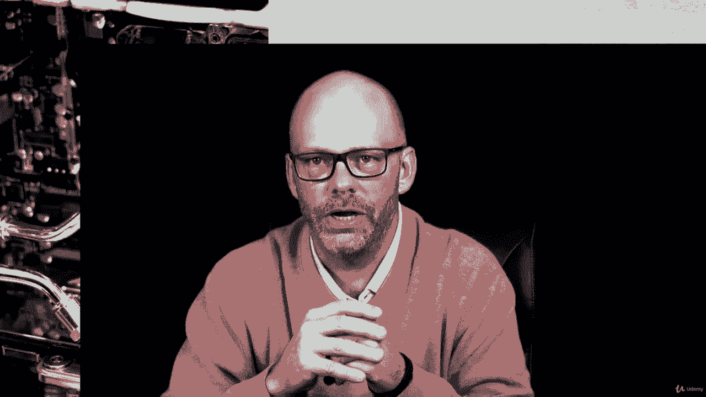
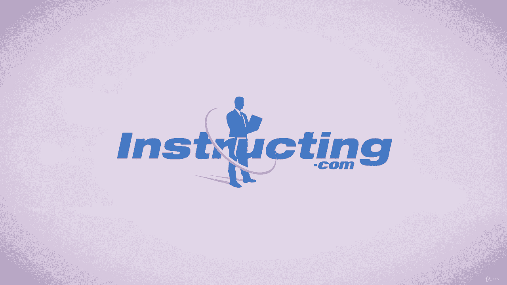

# 【Udemy】项目管理师应试 PMP Exam Prep Seminar-PMBOK Guide 6  286集【英语】 - P169：2. Looking at the Big Quality Picture - servemeee - BV1J4411M7R6

You know how important it is to obtain quality in a project。 But what exactly is quality。

 One of my favorite definitions of quality is that quality is the totality of an entity that bears on its ability to satisfy stated or implied needs。

 So if we break that down， quality is the totality of an entity。 It's everything about a product。

 a service， a condition or result。 So it's the totality of an entity that bears on its ability that affects its ability to。

Deliver， stated and implied needs。 It's the implied needs that often trips people implied needs。

 We're talking about some of those nonfunctional requirements。

 So this just shows us how important it is in scope management to have a clear definition of what constitutes quality。

 We want to stay away from those subjective terms like good， fast， reliable。

 What does it mean to be good。 What does it mean to be reliable， What is fast。

 So we want to nail that down。 So we have metrics to aim for in our project。

The big quality picture is where we're looking at the whole picture of quality。

 that it's the totality of what we're creating， that it's the needed abilities to reach those goals。

 the goals being business value and stated and implied needs。Some terminology。

 you need to know for your exam about quality。 We need measurable terms。 So those subjective terms。

 we get away from those。 our goal is to really understand the requirements and to have clear requirements。

 and that helps us deliver requirements。 if we know exactly what we have to deliver。

 then we can achieve quality by delivering exactly those things。

Of course we want to beware of gold plating。Sometimes there's a mindset that I'm going to go above and beyond what was requested。

 That is not quality。 Quality is meeting exactly what was required of me。

 So even if I have time and money to create additional things， that's gold plating。

 I give the customer exactly what was requested。 So for your exam。

 think very clearly about quality and requirements are linked in order to achieve quality。

 we deliver the requirements。No gold plating。 Now， I know out in the real world。

 you might go to that stakeholder and say， we have time and money， and I understand what you want。

 and we can do X， Y， Z。Nothing wrong with that at all。 But for your exam。

 you might be painted into some corners where you have to choose。

 Do I go ahead and do something and spend the money or do I deliver exactly what was requested。

 You want to deliver exactly what was requested。 Our goal in quality is to have customer satisfaction by delivering the exact requirements。

 Our requirements help me to have a conformance to requirements， Our quality。

 quality conforms to requirements。And we need to have a fitness for use， that it's usable。

 that it's fit， that we can walk away from that project， knowing we gave the customer a good product。

 a quality project that we delivered exactly what they asked for。Prevention is also part of quality。

 we want to do the work correctly the first time。So quality is planned into a project。

 it's not inspected into a project。We have a management responsibility。 Now。

 management responsibility means that。Above the project are managers， those functional managers。

 that middle management。If they say zero defects， that's fine， we can have zero defects。

 but we have to have the tools and the time and the money to achieve zero defects。

 so there's still a management responsibility。There's a theme you should be familiar with when it comes to quality and it's based on W。

 Edwards Dimmings Plan do check Act or sometimes called the Dimming cycle。So we plan， we do。

 we check and we act upon those results and its iterations， so PDCA， plan do check at。

In this section， we're going to talk about three quality management processes。

 so we have quality management planning， we have manage quality and we have control quality。

All right， let's hop in now and look at these three processes。

