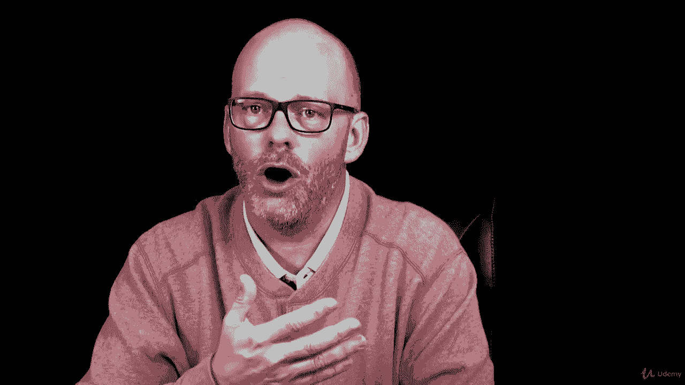

# 【Udemy】项目管理师应试 PMP Exam Prep Seminar-PMBOK Guide 6  286集【英语】 - P170：3. Key Concepts for Project Quality Management - servemeee - BV1J4411M7R6

。So far we've been talking about quality in regards to the product。

 the service or the result that we create， we also need to have quality in our approach and how we create that product or the end result of our project so the quality management approach is this mindset of taking a top down approach to quality that we don't just do the right work we do the work correctly。

 we do the work rightly right so we're doing things properly and with precision and with accuracy。

 a couple of terms we're going to look at in a moment。

We want to be aware of overworking the project team if you overwork the project team。

 if you're forcing lots of overtime or you're forcing a lot of weekends。

 that's overworking the team and the team's going to get worn down they're going to get well unhappy about all that overtime or extra hours and they might rush through the work and they might have poor performance and so that can cause quality to suffer that's a key fact you should know for your exam。

We also want to beware of speeding through inspections。

 if we have quality control inspections scheduled， like at the end of a phase。

 we shouldn't rush through those just to stay on schedule。

 We need to make certain that what we've created is of quality and then act accordingly。

 if you rush through those inspections， you might have some poor quality and escaped defects that the customer sees。

 which we don't want。There are three terms when it comes to quality management that you should be familiar with。

 we have prevention， inspection and attribute sampling。

Prevention is this idea of quality control that we keep mistakes out of the customer' hands that we want to ensure that the work that we do is done properly。

 and then we inspect it and if there's a mistake， we do corrective action。

 we might have to do defect repair。Inspection is how we do quality control that we inspect the work and we keep mistakes out of the customer' hands。

 Let me back up to prevention for a moment。 I kind of misspoke there。 I won't be very clear。

 Prevention is keeping errors out of the process。 And I set out of the customer' hands。

 Prevention is keeping errors out of the process that we want to do the work correctly。

 We don't want to allow mistakes into the project at all。

 So this is that idea that quality is planned in。Your organization might have some six sigma or some other quality assurance program。

 You don't need to know about six Sigma for your exam， but it's a Q A program。

 The goal is to do the work properly to reduce defects by doing the work correctly。 So prevention。

 we don't want errors to come into the process。 Intion is quality control that we go out and inspect the work and we prove that it's of quality。

 And if we find a mistake， we fix it before the customer sees it。

Attribute sampling is where we look at the attributes of what we're creating and each attribute of what we're creating。

 we can look at it and test it and we can say that the results either conforms to requirements or it does not conform it's binary。

 it's good and it can go on or it's bad and we need to fix the problem。

 so attribute sampling is where we go out and we look at the attributes of what we've created。

Some other quality management terms here， variable sampling。

 variable sampling is where the results of what we inspect are rated on a continuous scale that will see the measure of conformity。

 so how close are we to perfect， and there might be a window there that it's acceptable or outside of that window that it's rejected and you have to do the work over。

And that's called a tolerance is that window that what's acceptable versus what requires rework。

And then control limits， these are the boundaries of the common variation。

 so we're looking for a stable process in order to have control limits and with control limits。

 as we'll see coming up later in this section， we can create control charts。

 so control limits we set a specification for what's the max or the lowest that we could have in our tolerance in our errors and defects。

 so we'll look at that coming up in a little bit more detail。

Let's talk about accuracy and precision and how it relates to quality。

Precision is a measure of exactness。Accuracy is an assessment of correctness。

Precise measurements aren't necessarily accurate measurements。

 and accurate measurements aren't necessarily precise measurements。

So let's put this into a way we can all relate。 Let's say that you and I and my brother Sam。

 we're going to go out and shoot this bow and arrow， which looks very complicated。

 but we're going to go out and shoot this bow and arrow and you go first and you shoot five arrows and all of yours hit in that yellow area right by the bull's eye。

 all clustered up together and right where you want them to go in the bull's eye。

Then I go in mine all custer up， but they're in the upper right hand corner in that black area on the bull's eye。

 so not where we want to go， they're kind of drifting up into the right。And then my brother， Sam。

 poor guy， he takes it。 He's missing the target。 He's all over the target， not very good at all。

 So how does that relate to accuracy and precision。Well， precision is a measure of exactness。

 it describes the clustering， so mine were precise， they were all clustered together。

 they were very precise， but they weren't for what we were aiming for。Yours were accurate。

 right where you wanted them to go in a yellow area in the bull'seye。And yours were precise。

 The precision was where you wanted them to go。 So they were bunched up together and they were on target。

Now， my brother Sam， his were not precise。 They were all over the place。

 and they weren't really accurate because he didn't hit the bull's eye。

 So precision and accuracy are linked， but just because you're precise doesn't mean that you are accurate。

 So we need to make a distinguish there between what's precise and what's accurate。

 Our goal is to be both。 We want precise and we want accuracy。 We want to be accurate。

In quality project management， there's a concept called Kaiszen Technologies and I love Kaiszen Kazen Technologies tells us that with small。

 continuous improvements， we can make big changes over time。When I was training to run a marathon。

 I know， can you believe it， I did Kas and Tech that I could barely run a block， let alone 26。

2 miles， so I started out， I would jog to a mailbox and then I would walk to the next mailbox and then run to the next mailbox and then walk again。

And then a week would go by and then I would run for two mailboxes and then walk for a mailbox and then three and so on。

So over time， I did a little bit and a little bit and a little bit。

 And it was easier to accept that concept of running a mile or 10 miles or 26。2 miles。

 So Kaiszen are these small improvements。 The idea is that it's easier for organization to take on small improvements。

 small changes in processes than to have big sweeping changes all at once。 Just like if you said。

 go run a marathon。 There's no way I would have been able to do that。

 I would have been beyond my imagination。 But by doing these small steps。

 I was able to chip away at it and eventually got to the point that I could run a marathon。😊。

We won't talk about how fast or slow I was。Marginal analysis is where we do a study on what would it take to improve this product or service。

 And then how will those costs allow us to sell more， how will it have a return on investment。

 So can we improve upon。This clicker and make it more efficient。 make it better for the user。

 But what would it cost to make it better。 Is this something the user even wants a better clicker。

 right， So how much would it cost and would this allow us to sell more or would it reduce the cost of manufacturing this。

 So marginal analysis is the study of can we spend a little bit more But what's the Roi。

 And then part of marginal analysis as well， is what would it cost just to create one more unit。

 Sometimes you get that wet Christmas time or a different times in the year when you want to order a big batch of your cards to send out to friends and family like you move or a holiday or what have you。

So they say all right， if you print 10 cards， it's going to cost you $12。 if you print 20 cards。

 though， it will be $15， so the marginal analysis is。

 well can I print a few more and now I have double the amount of cards or nearly double the amount of cards for just a few dollars more but do you really need those extra cards so marginal analysis is this also the study of that concept of what would it cost to create one more unit。

In your organization， as I mentioned， you might have a quality policy like a quality assurance program。

 so you might know these by different names， like I mentioned six Sigma。

 but also total quality management usually have that in manufacturing and then ISO programs ISO is Greek for Uni and it's for the it means that we do the same process every time to get the exact same result。

If a quality policy doesn't exist， it's up to the project manager to create one。

 So how will you achieve quality in your project， So remember， we want quality planned in。

 we want to do the work correctly the first time it's always more cost effective to do the work correct the first time than to have to fix the problem later。

Standards and regulations， we've seen this a couple of times already standardss are optional。

 regulations are not， regulations are requirements， so you have to adhere to regulations。

 even if it takes longer or it means you have to spend more money， regulations are requirements。

All right， great job， keep moving forward。🎼Yeah。

