# 【Udemy】项目管理师应试 PMP Exam Prep Seminar-PMBOK Guide 6  286集【英语】 - P17：10. Section Summary Get the Most from the Course - servemeee - BV1J4411M7R6

完成关于如何从这门课程中获得最大收益的这一节做得很好，我知道我们在这一节讨论了很多信息。

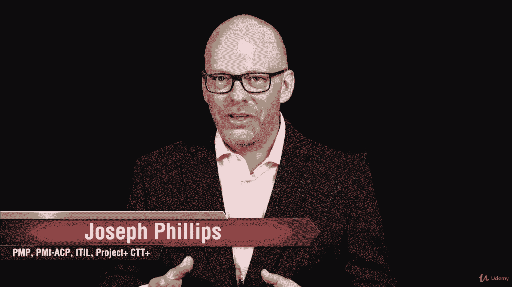

所以我认为再次接触这些头条新闻是很重要的，我们谈到了常见问题。

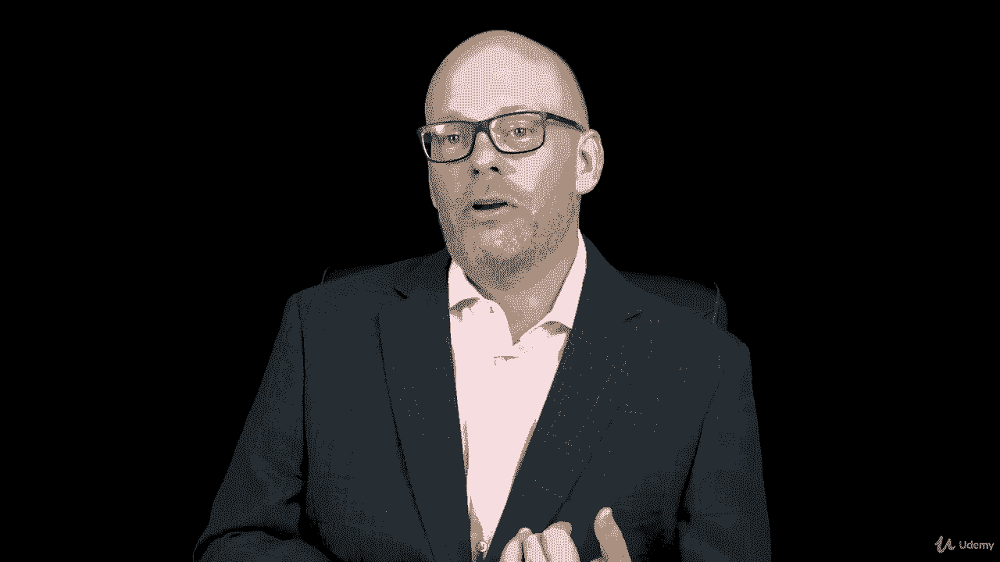

我经常遇到的一些常见问题，但我们谈论的一件大事是，在课程结束时，你如何获得结业证书。

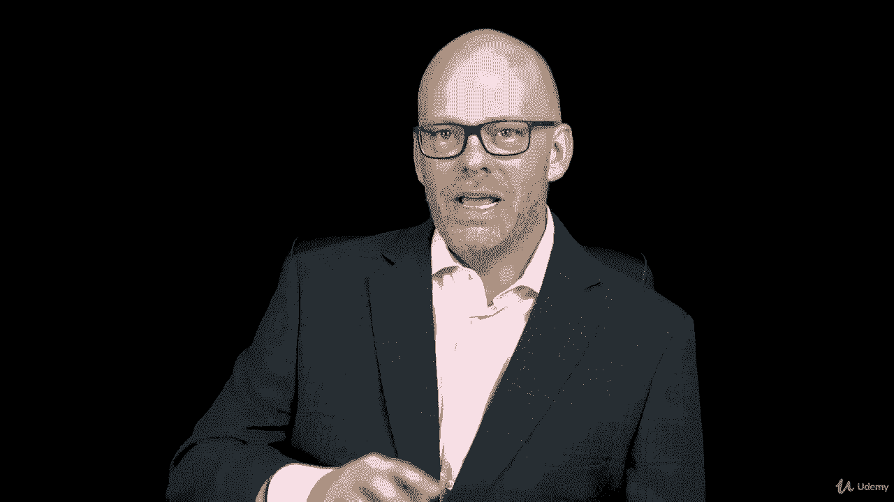

你得到了结业证书，这是你要填写的表格，我的公司指示COM。

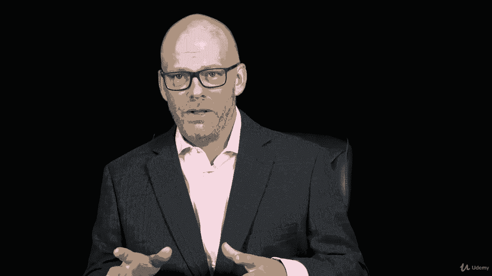

我们是PMI注册的教育提供商。

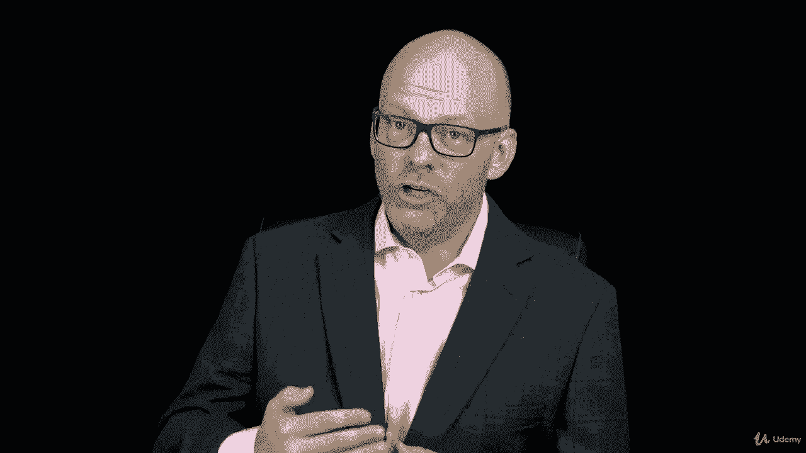

所以你将证明完成课程，这里的系统跟踪您的完成情况。

如果你被审计了，你要把证书交给采购经理。

我们还查看了pduse或联系时间，现在你在成为P和P联系人之前就知道区别了。

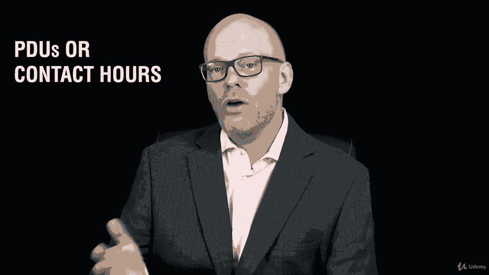

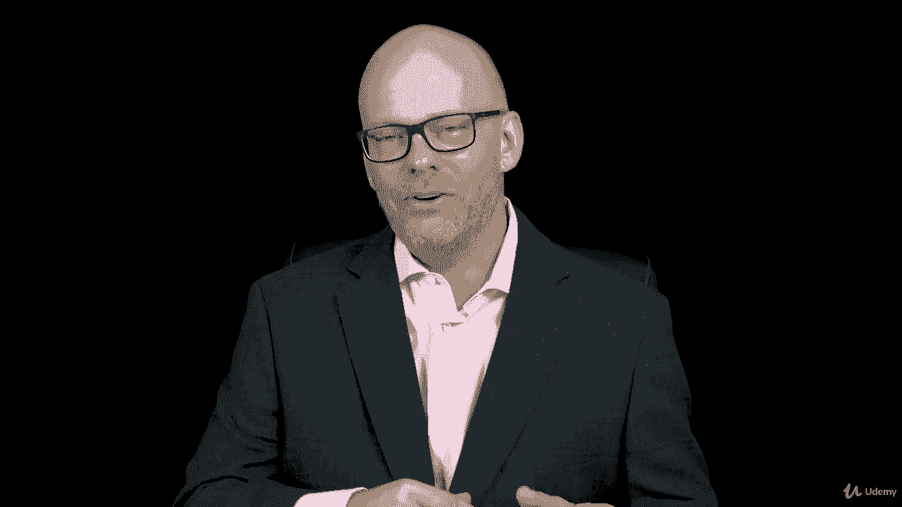

你想要，PTO，使用专业发展单位。

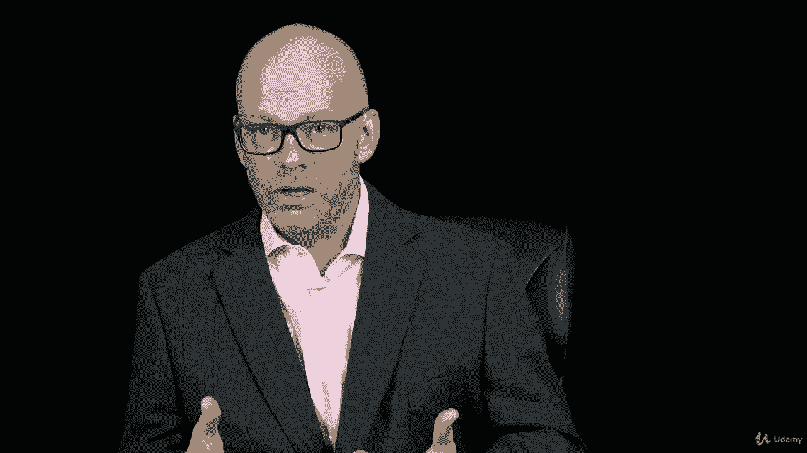

如果你现在是个pp，你修这门课是为了复习，你会得到三个五个PTO，因为你是个混蛋，如果你不是pp。

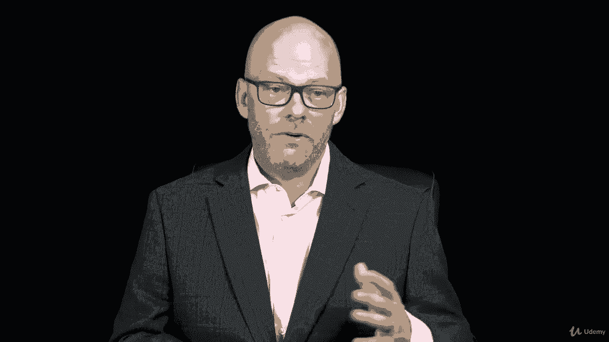

你得到那些联系时间，这就是你想要的，你考试需要什么。

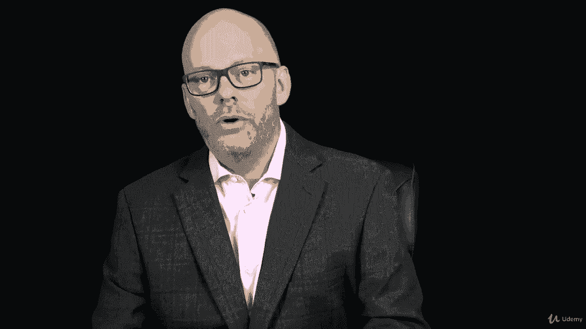

我们谈到了创建一个学习策略，你如何制定一个策略来最好地学习这些材料。

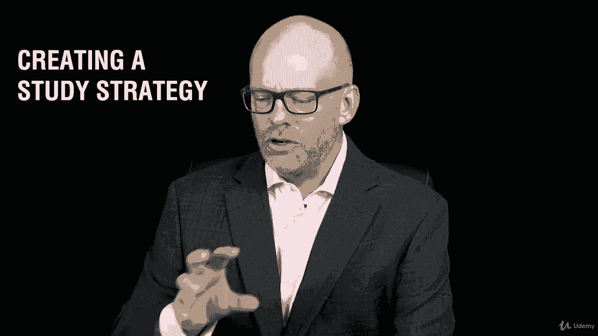

为了通过考试。

这就是你的目标，正确的是通过PP，我知道我的目标是你通过PP。

我们看了PIN机器人指南的所有内容，非常高水平的六版，为我们接下来的课程定下了基调，所以我们绘制了PinboGuide，第六版。

我们做了一个任务，我们下载了一些资源进行了一点练习，然后在整个课程中，你会看到其他下载资源的机会。

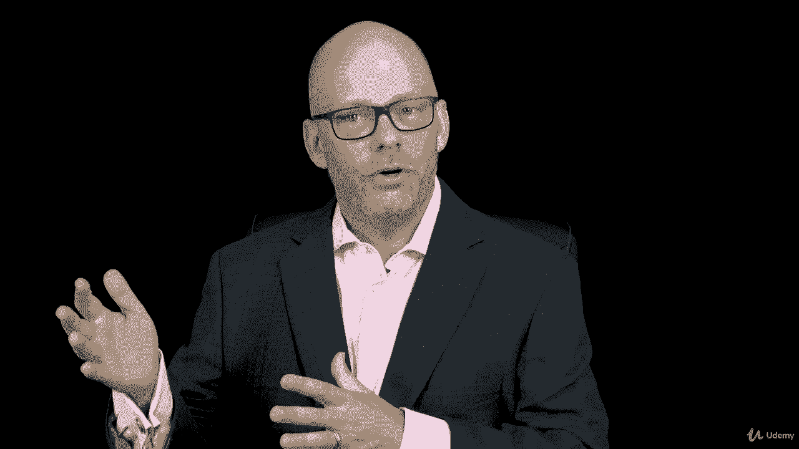

我们谈过维护你的PP，你如何继续你的教育和维护你的PP与PDUSE。

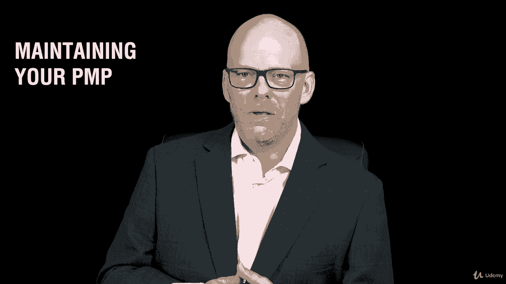

然后我给你上了一堂教练课，你可以在整个课程中寻找更多的。

好吧，干得好，完成了这一节，如何从这门课程中获得最大的收获。

我希望你继续前进，有信心你能做到这一点。

