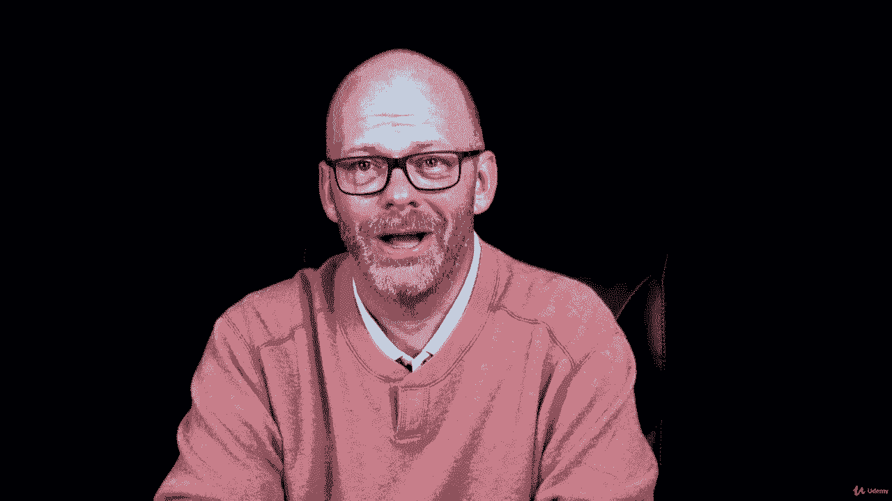

# 【Udemy】项目管理师应试 PMP Exam Prep Seminar-PMBOK Guide 6  286集【英语】 - P183：16. Controlling Quality in a Project - servemeee - BV1J4411M7R6

🎼嗯。Our last process for quality project management is to control quality。

 so controlling quality in a project is all about inspection that we are monitoring and measuring the results of what we have executed。

 so execution， monitoring and controlling or controlling quality。When we have a problem。

 we need to do some root cause analysis， so root cause analysis follows quality control if we identify a problem。

 we need RCA root cause analysis， this helps us determine the cause， it doesn't solve it。

 but allows us to see what causal factors are contributing to the problem to the effect。

And then we apply corrective action。 QC happens throughout the life of the project as part of monitoring and controlling。

 it goes to the whole project all the way up to scope validation When the customer signs off。

 they accept what we've created。 we do Q C first， then validation。

Controlling quality is for the product， of course， but also the project， those different processes。

 the 49 processes。We're measuring performance， scheduling and cost and how does quality exist or does it exist and is it at our expected level and if we have management of the project。

 we should be of quality that quality is planned into the project。

 and this includes the execution of our project management processes。

Some themes for controlling quality。 We need statistical quality controls。

 we have sampling and probability， so sampling we go out and we test things at random。

 and then from that we can begin to identify trends and find some probability。

The goal of quality control is to keep mistakes away from the customer。

Now attribute sampling and variable sampling， so two similar types of sampling here。

Attribute sampling is， is just very simple。 Is it in conformance or out of conformance。

 Does it conform or does it not conform， It's that binary one。 Vaable sampling is what we say。

 it doesn't conform， but it's just a 16th of an inch off， and that's within our range of variance。

 or it doesn't conform， and it's a quarter of an inch off and that's too much。

 So how far is it to still be considered of quality。 So what's that range of variance。

 that allowable tolerance range when it comes to the results of measuring our products。

Some other themes with controlling quality， we need to study special causes and we'll talk about that in a control factor。

 why are we having this anomaly in the project， why is this one area dipping out of control？

Random causes will help us then determine variances and allow us to check a tolerance range。

 helps us also to observe our control limits， so we're talking about our upper specs and lower specs。

 and then within that we have a control limit， upper and lower control limits。

 and we'll see that in a control chart coming up。First， though。

 let's look at our Es for control quality。 Our inputs， we need the project management plan。

 specifically the quality management plan， project documents。

 these will be the lessons learned register， quality metrics， test and evaluation documents。

 approve change request， deliverables， work performance data and EEF and OPA。

Tools and techniques here we have data gathering， so checklists， check sheets。

 statistical sampling and questionnaires。Data analysis will do performance reviews。

 root cause analysis， inspection。We'll have testing or product evaluations。

We' use multi criteria decision analysis。 Then we have data representation。

 so cause and effect diagrams， control charts， histograms， scatter diagrams， and， of course。

 meetings。Our outputs， quality control measurements。Verified deliverables。

 work performance information， change request， project management plan updates。

 specifically you'll update the quality management plan。

 and then we'll have updates to some project documents， the issue log。

 the lessons learned register and test and evaluation documents。

So those are the EOs for control quality。All right， keep moving forward。

