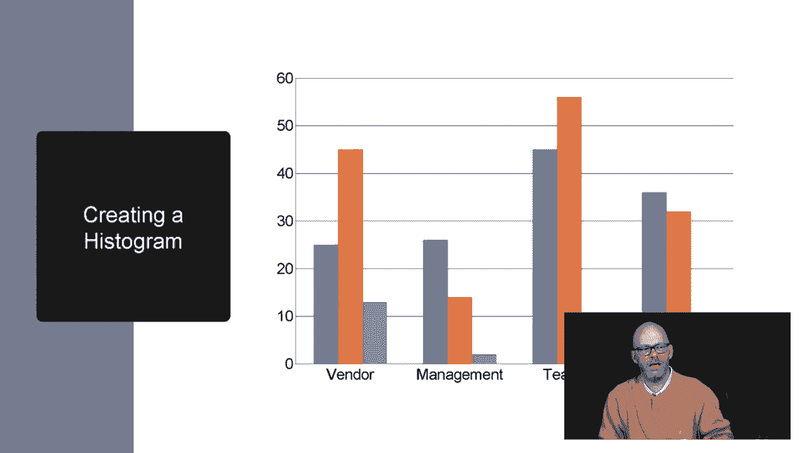

# 【Udemy】项目管理师应试 PMP Exam Prep Seminar-PMBOK Guide 6  286集【英语】 - P187：20. Creating Pareto, Histograms, Scatter and Run Charts - servemeee - BV1J4411M7R6

There are still some more charts you should be familiar with for your exam。

 So let's take a look at those Now。 The first 1 I want to show you is a prereto diagram。

 Prereto was an Italian macroeconomist who was outpic peas in his garden。

 And he noticed that 80% of his crop came from just 20% of his peas。

80% of his harvest came from 20% of his pea plants。 So he's the guy who developed that 8020 rule。

 If you've ever worked on help desk， you know the 8020 rule。

80% of your calls will come from 20% of the users。 All right。

 or 80% of your income will come from 20% of your businesses。 So Peretto diagram。

 A prereto diagram is a bar chart。 It's a histogram that shows categories of defects from largest to smallest。

 So in this example， this is the total number of failures for a tractor or for a scanner rather。

And you can see the biggest number of failure we have are the skills people don't understand our software。

 so we've got a problem with our software， the skills that's too difficult to use。

 and then we have the tractor， that device that will move the light back and forth and then the actual lights burning out and we have a USB problem and so on。

 So it's the largest category of failures down to the smallest failure。

The little bar chart the little connected dots you see across the top。

That's the total each dot represents the upstream number of failures and the current failure。

So if we look at the light， the little dot above the light， that's a total of about 380 failures。

 And that accounts for the light， the tractor and the skills。

 So the closer we get to 100% on the right。 The more defects we're including in this analysis。

 Usually， we focus on the big problems first， as those are resolved or they begin to diminish。

 Then we rearrange this order。 and then we attack the next big problems。 rearrange it。

 and the next big problems and so on。 So that's a peretto diagram。

 A Peretto diagram is really a bar chart。 Another name for a bar chart is a histogram。

 This is a histogram to show how vendors management and different teams are performing or whatever your're tracking here。

 numberumb of change request where they're coming from or issues or what have you。

 But it's just a bar chart。 So a histogram。😊。

Just a bar chart， Nothing to get too excited about。

A scatter diagram shows the relationship between two variables， so these dots represent the sampling。

 so this first one， the taller an individual is， the bigger their shoe size。

 so you can see those two have a pretty positive correlation that they're tracking together pretty closely。

Then we have soup sales， the colder it is outside， the more soup we're selling。

 So that also has a correlation here。 And then shoe size and annual income doesn't really look to be correlated。

 It doesn't just because you have big feet doesn't mean you make more。So there some correlation here。

 you have a positive correlation。 that is one quantity increases。

 so does the other A negative correlation as one quantity increases， the other decreases。

 So the warmer it gets the less soup you sell。 Who wants soup in the summer。😊。

And then no correlation like the shoe size and your income。

 those don't necessarily correlate with one another。Then we have a run chart。

 a run chart is similar to a control chart， The difference is the little dots you see。

 the closer those dots are together that shows the time it took to accumulate that pool that you're measuring so earlier we said each one of those was a000 so you can see those dots at the top that are very close together that means we have a short amount of time to do those 1000 instances。

 the farther away the two dots are then it took longer to accumulate 1000 so there may not be a correlation between the two。

This also shows us a trend when you have five or more。Data points all going up or all going down。

 it means you have a trend。If you have two or more at the same value， you only count one of them。

 especially if they're close together。So this is an example of a run chart that you're running across the calendars。

 it's like a control chart， but it's across the calendar and we have a trend in this instance。

All right， so those are some charts you should be familiar with。

 a lot of charts when it comes to quality control。Our control quality。

 as we'll call it for your exam。All right， great job， keep moving forward。

 I'll see you in the next lecture。

