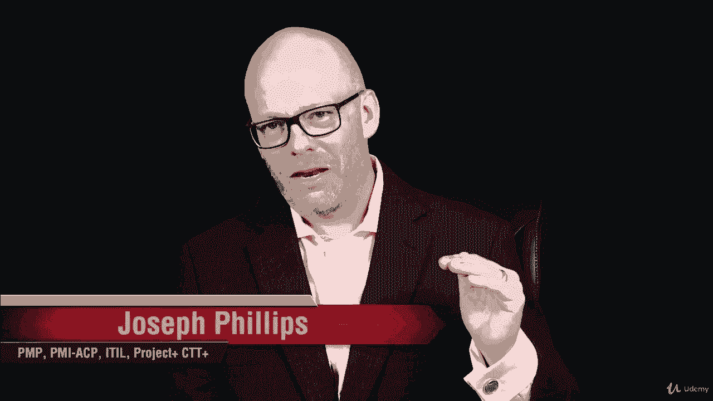
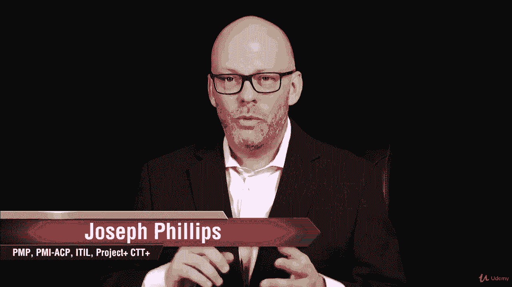
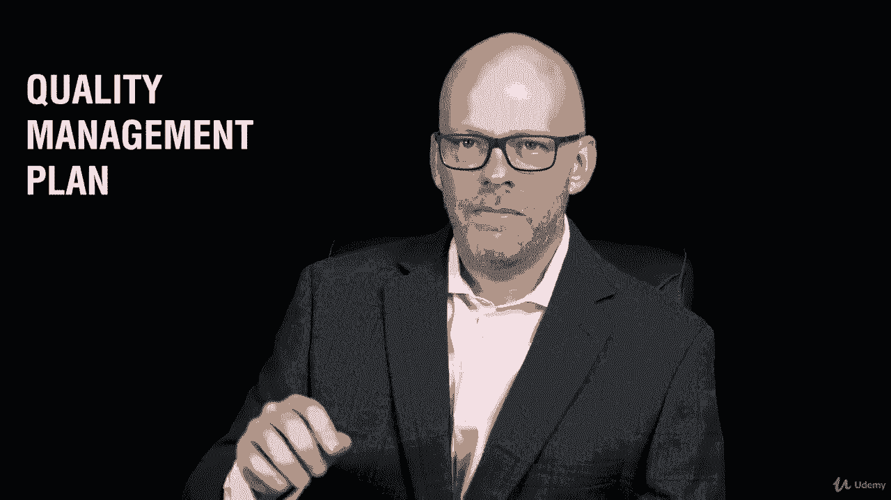
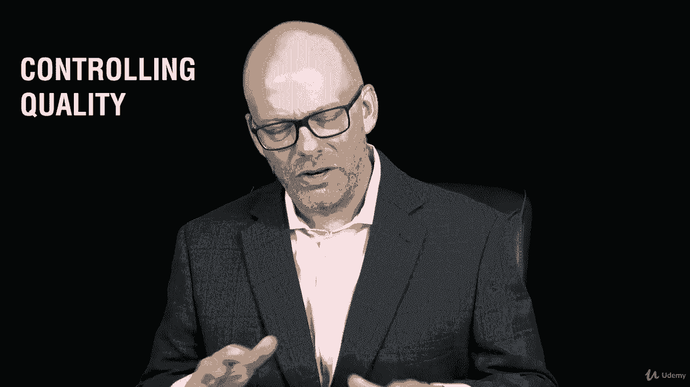
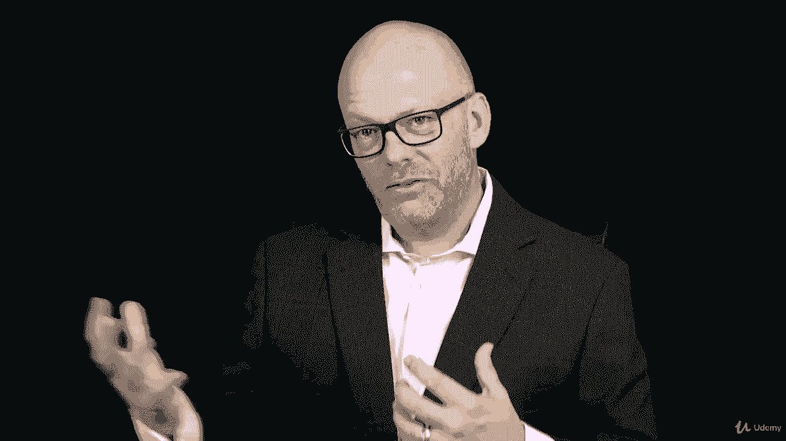
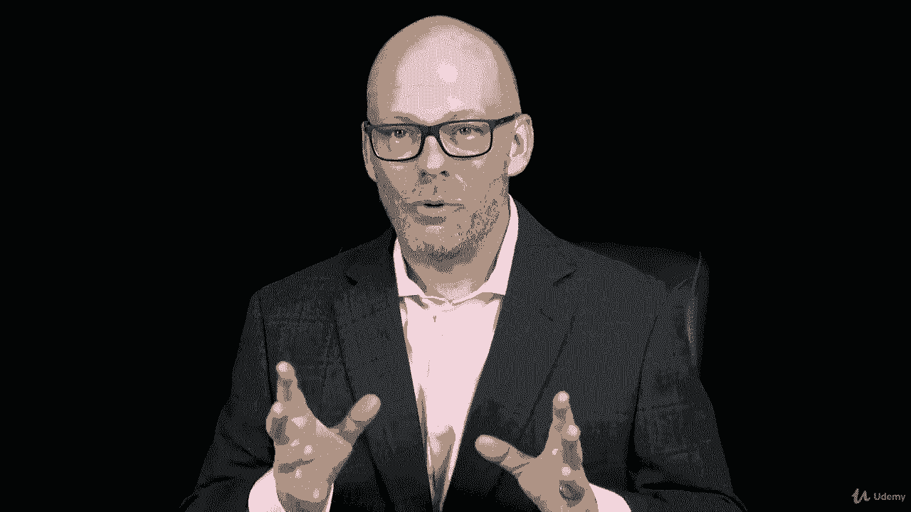
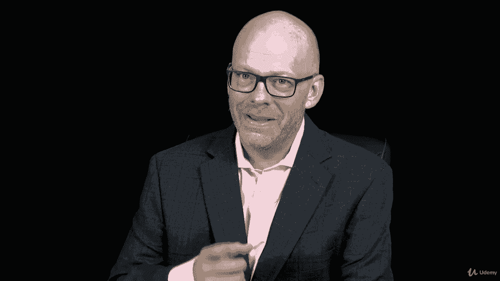
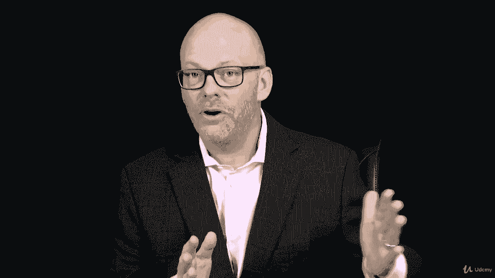

# 【Udemy】项目管理师应试 PMP Exam Prep Seminar-PMBOK Guide 6  286集【英语】 - P190：25. Section Wrap Project Quality Management - servemeee - BV1J4411M7R6

。

Great job finishing this section on project quality management。

 which correlates to chapterpt 8 in the Pimbaok on quality We talked about three processes in quality management we talked about planning quality。

 assuring quality and then controlling quality so those were our three big themes， if you will。

 or three processes there about managing quality We also looked at creating the quality management plan and then doing the process management quality I know we talked about assuring quality but really were managing quality。

 we want quality built in not inspected in。

And then we looked at controlling quality and what does that mean。

 what activities do you do with controlling quality， and you know the most important one， of course。

 is inspection， that quality control or to control quality we inspect the work that we want to keep mistakes out of the customer's hands。

And then we talked about creating some different charts， the Paretto chart， the control chart。

 the fishbone diagrams， so those different charts you want to be able to recognize for your PMP exam。

And then you did an assignment about controlling quality。

 and then you and I had a frank talk about you meeting your quality goals。

Alright， good job， I'm really happy that you're moving forward in the course。

 you're covering a lot of material。 Look how far you've come in the course already。

 you have covered more than what's left so you are making great progress， but keep it up， keep going。

 I have confidence that you can do this。😊。

