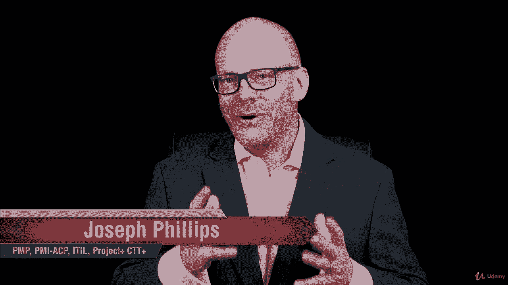
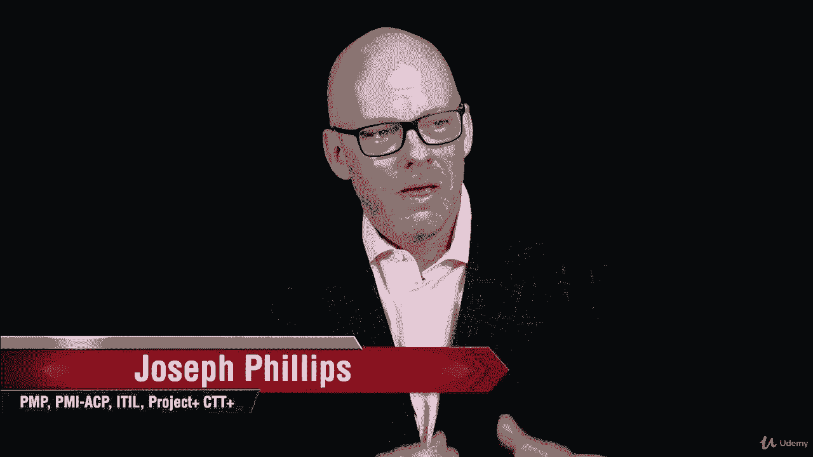
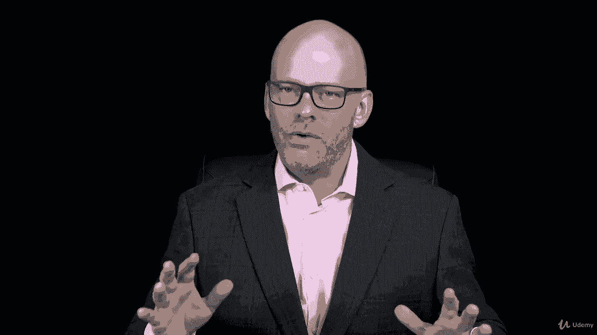
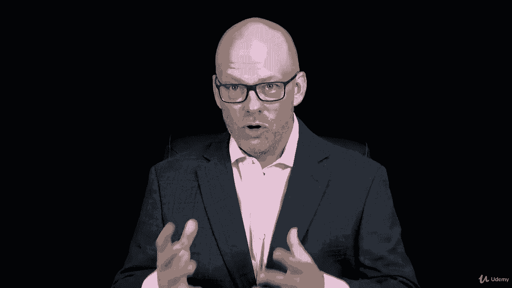
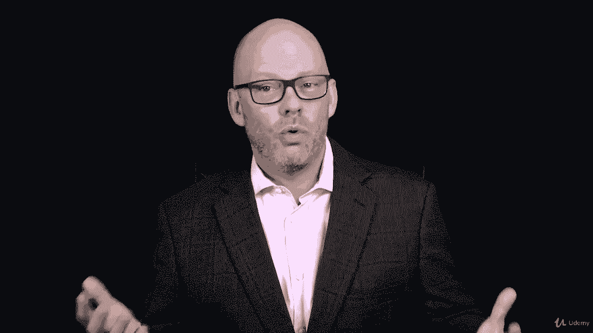
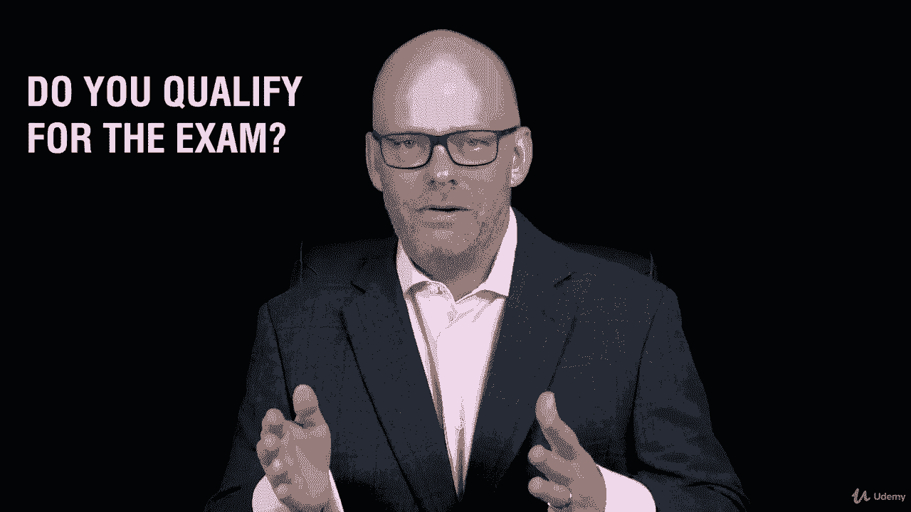
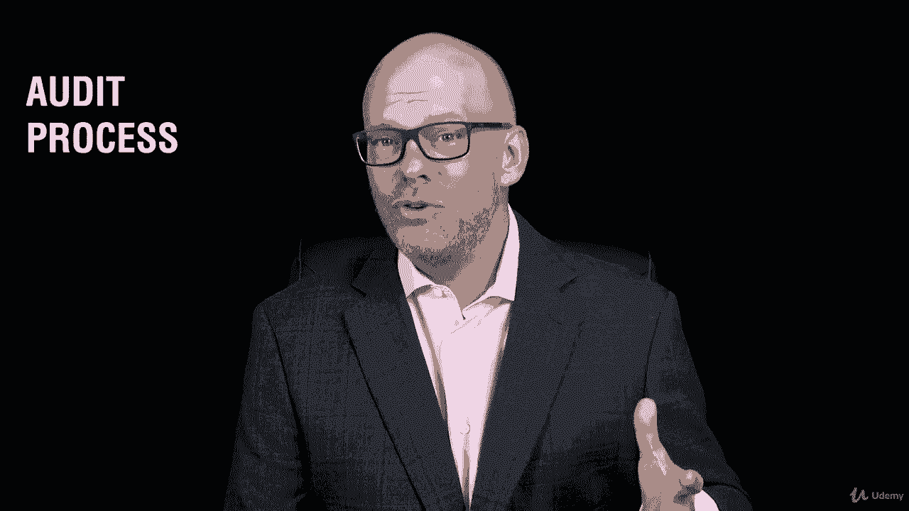
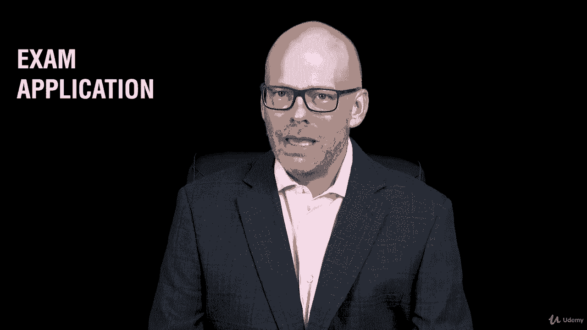
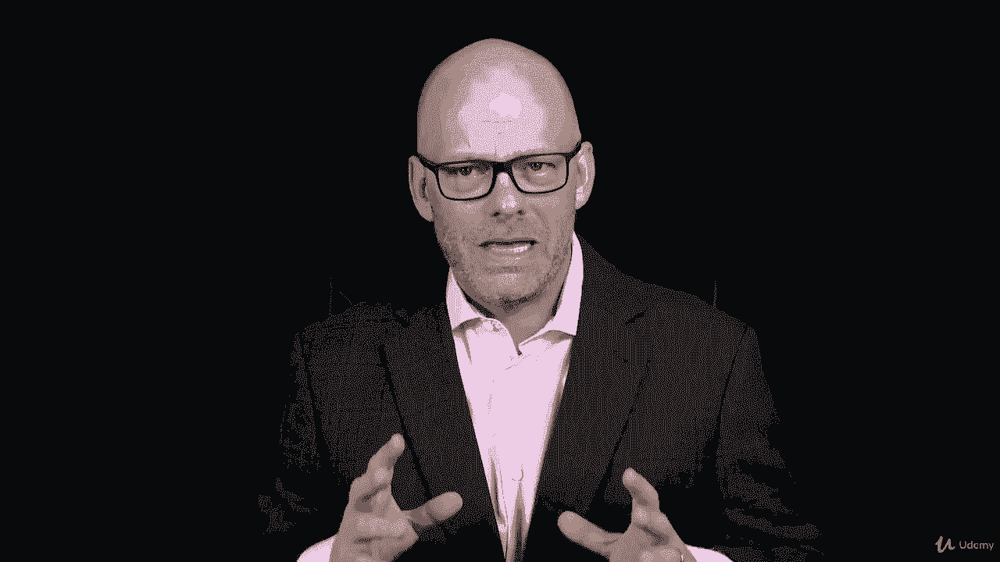
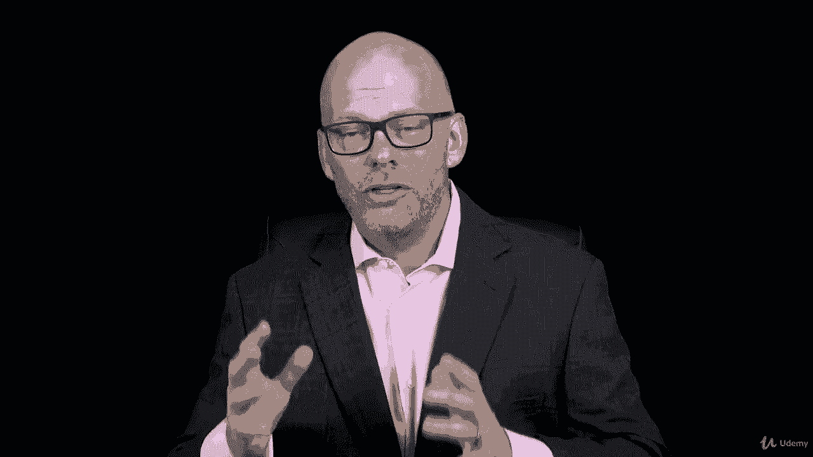

# 【Udemy】项目管理师应试 PMP Exam Prep Seminar-PMBOK Guide 6  286集【英语】 - P1：1. Welcome to the PMP Exam Prep Seminar - servemeee - BV1J4411M7R6

欢迎来到你赢得PMP之旅的第一部分。

我们有很多信息要谈，在本节中。

我们将讨论整个PMP考试准备课程，所以我要向你展示我们要涵盖的一切。

在本课程中，所以这是一个很好的基础。

对你面前的工作有一个很好的概述，而且是的，这是工作，你会有很多活动，很多作业，你要参加很多练习考试。

当你准备通过PMP考试时，我们要谈谈p np考试。

考试的机制是什么，走进测试中心是什么感觉。

并真正体验通过PMP的快乐。

在我们真正通过PP之前，让我们来谈谈。

你如何支付考试费用，1。你在哪儿报名？你有资格参加考试吗？

这是个问题，我从很多人那里得到，我应该做PP吗，或者CPM更合适。

所以我们要先谈谈这个，在你的经历和教育中，你有什么。

有资格获得P和P。

我们还将研究审计过程，你有可能作为PNP候选人被审计。

采购经理人指数将审核一小部分申请人。

这是一个随机审计，但我们会更多地讨论这个。

在本节中，我们还要看一下考试申请表。

你如何完成考试申请，当你填写这份申请时，你必须做一些非常具体的事情。

所以我们会看看，然后我有一个任务给你。

你实际上要出去的地方，开始完成您的PMP考试申请。

所以我们也会在那里呆一段时间，好的，这就是第一部分为您准备的内容，让我们跳进去出发吧。

