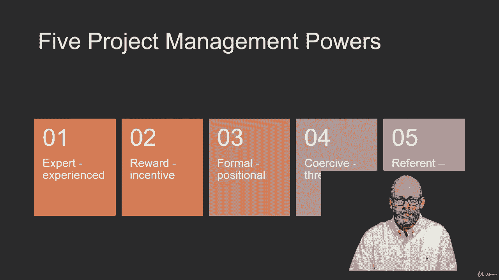
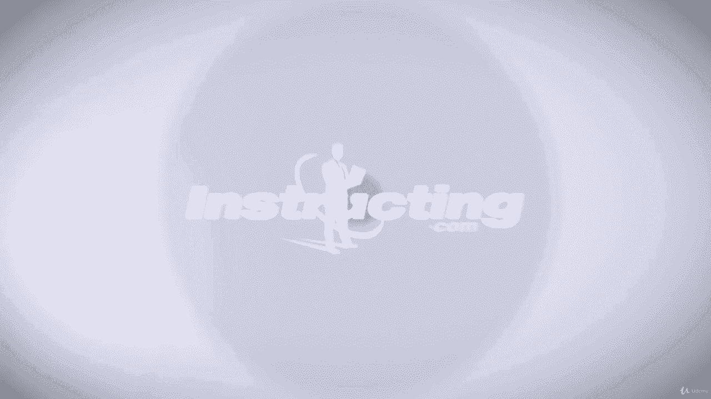

# 【Udemy】项目管理师应试 PMP Exam Prep Seminar-PMBOK Guide 6  286集【英语】 - P208：18. Managing the Project Team - servemeee - BV1J4411M7R6

🎼。Now that our project's in motion and people are outdo activities and they're coming to status meetings and they're reporting on deliverables that they have created。

 we're managing the project team as a project manager this means you're tracking team member performance。

 you're giving feedback to individuals， you're managing changes in the team as new people come on the team where people leave your team and you're influencing team behavior you're also working to resolve conflict。

Let's look at the Es for managing the team。The inputs， your project management plan。

 your resource management plan， the project documents like the Iue log， Leson learned registerister。

 your team assignments， and the team Charter。Your work performance reports， member of data。

 information， and now reports the assessment of the team， and then EEF and OPA。

 and we'll talk about OPA in a moment。Some tools and techniques here for managing your team。

 your interpersonal and team skills。Conflict management， decision making。

 emotional intelligence and leadership， and your PMIS。The outputs of managing the team。

Things like a change request could happen from managing your team Upates to your plan。

 updatesates to the resource management plan， the schedule baseline and the cost baseline Project document updates like your issue log and lessons learned。

 and you may have updates to E E F。I mentioned that we have some particulars here with OPA that we want to utilize when it comes to managing the team。

 so things like certificates of appreciation， very easy， very low budget。

 but it's a way to show some recognition and to manage the team。

Putting people's names and newsletters or on a project website is good remember those bonus structures and corporate apparel that that's part of managing the team that you continue to do team development even as part of managing the team you want people to get work done。

Conflict management is natural， people are going to conflict with one another。

 so when you have a team issue that's a disruption of the work。

 you have people that aren't getting along or working well together。

 so it may not be your position as the project manager to resolve this conflict。

You may have to promote it or escalate it to a different manager for your exam， though。

 you'll want to know that openness resolves conflict。 Our goal is to focus on issues。

 not personalities。 We want to focus what's happening here in the present。

 not what's happened in the past。Managing conflict also includes。

The understanding of how important is this conflict。

 Sometimes people are out in petty conflicts that have nothing to do with the goals of the project。

 So while we don't necessarily ignore those， they're kind of petty， they're pretty small。

What about a time pressure for conflict resolution do we need a quick resolution or do we do we need to draw this out and really get to the root cause and really understand why people aren't getting along together so what's the time pressure？

What about the position of the people involved， the senior employee versus a new junior employee？

What about motivation to resolve the conflict， short term or long term gets back to that idea of time pressure？

Well， we need to know some terms when it comes to solving conflicts and solving problems。

The first one is the preferred approach to conflict resolution and that's to have a collaborative problem solving approach a collaborative problem solving approach means that you and I work together we don't really care who's right or wrong。

 We just want the best outcome for the project and it's more open and friendly and we understand each other's position。

Forcing or directing means the people or the person with the power。

 the authority will make the decision we're going to do it this way because I'm the senior engineer。

So， that's forcing。Compromising or reconciling it sounds good。

 but it's really a lose lose compromising means that both people have to give up something so an example would be a stakeholder wants you to add things to the project but they don't want to pay for it and you don't want to add things to the project at all unless they pay for it and give you more time。

So while you're adverse to change， you agreed to take it on but there's a penalty。

 there's a fee and a time factor for that change request。

 so both people had to give up something and neither party got 100% of what they wanted。

 so it's considered a lose， lose。Withdraw or avoiding is where one person leaves the argument or they avoid the argument。

 a lot of times you see withdrawal is where someone will say fine， just do whatever you want。

 I don't care。 and they leave the argument So that's considered a yield lose smoothing or accommodating is where we downplay the differences often when there's a petty。

 short conflict that we really don't need to spend a lot of time on so you could smooth it out。

 come on guys， we know this isn't important。 This isn't what we're here to do let's just go about getting our work done and not worry about these types of problems so you kind of downplay the issue。

Interpersonal skills that we have to have， leadership， obviously talking about aligning， motivating。

 directing， inspiring， influencing， though， we're talking about being persuasive and almost like a sales to influence of why we want work done a certain way or to sell people on getting their activities done on time。

This includes active and effective listening。Active listening means I'm involved in the conversation。

 I'm picking up on nonverbal clues， and I paraphrase what you've said and repeat it to confirm understanding。

Effective listening is where I really understand the motivation behind the question or the conversation that often there's an underlying reason or intent in what's being communicated。

I'm aware of the project team and how they interact with one another。

 and that might be creating some issues or there may already be issues on a team。

I also want to maintain trust， so if someone tells me something in confidence。

 I keep it in confidence。So I maintain trust while managing the teamt。

When it comes to managing the team， I need to have effective decision making。

 so I want to always focus on project goals， that's the whole point of project management to get stuff done。

I want to follow a logical， methodical decision making process。

I want to look at my environmental factors， what are the policies。

 the rules and the governance that I have to operate within as the project manager。

I analyze the information， data， information， so that allows me to make good decisions。

I want to consider the personal qualities and develop those qualities of project team members when I make decisions。

I want to make decisions that keep people involved and stimulate team creativity like brainstorming and mind mapping and that fists ofify voting that we saw earlier。

When I make decisions I have to consider risk， will my decision introduce new risk to the project？

And as a project manager， I have to be approachable。

 I have to have an attitude and an openness that people can approach me with questions or concerns that we can address。

There are some management styles that you should be familiar with， autocratic。

 the PM makes all the decisions。Democratic， the project team is involved with the decisions。

 They may often vote on the decision。 Laez fairair is a project manager is hands off。

 The team makes all the decisions。 It sounds nice， it sounds like self LED teams。

 but sometimes we need the project manager to make a decision。

 And if the project manager has this Laezfa attitude。 they aren't available。

 And then it seems like there are delays or the project manager's head is in the sand。

 something we obviously don't want。And then exceptional， exceptional always sounds great。 Really。

 it's called exceptional because you're doing management by exception。

 It's where you reward the top 10% and punish the bottom 10%。

 and everybody in the middle is kind of in the slush there。

 So exceptional is you're an exception to everyone else。 Good or bad。

 You ever have a manager that always seems like it's somebody's turn to be in trouble。

 That's management by exception。😊，There are five project management powers you need to know。

You're an expert means you're experienced in that discipline or technology。

 or you've been doing project management for so long， you're considered an expert PM。

Reward is where the team believes you have the power to reward them for their work。

Formal is you are only a positional that you are a new project manager in a company。

 so there's no real relationship， there's just the relationship of the position。

 a project manager and the position of the project team。

Coercive is where the project team feels threatened that you could punish them or give them a bad assessment。

And then refer it is where the team has worked with you before。

 so they have a relationship with you already， or the project manager says。

 we're going to do it this way because Jane， the CEO put me in charge and that's how we're going to do it so you refer to someone else's authority。

Okay， those are some powers and some characteristics of managing the team that you'll want to know for your exam。

