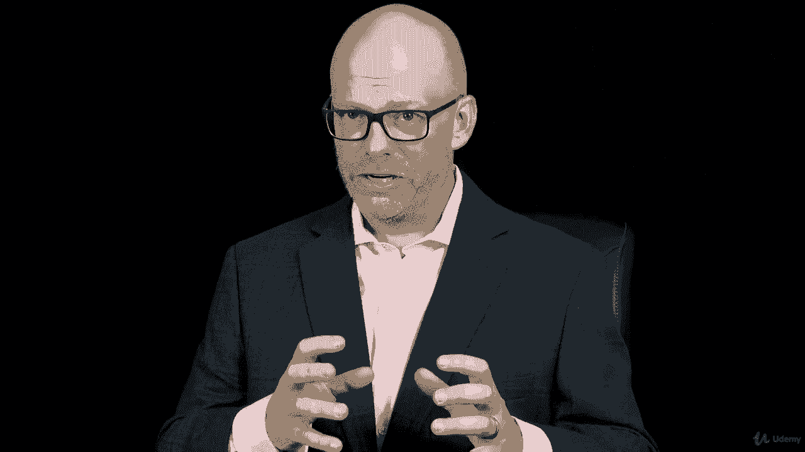

# 【Udemy】项目管理师应试 PMP Exam Prep Seminar-PMBOK Guide 6  286集【英语】 - P210：22. Section Wrap Project Resource Management - servemeee - BV1J4411M7R6

🎼，You're making some great progress here in your effort to pass the PMP exam。

I'm really happy that you're investing the time and you're all the way into chapter9 in the Pimbaok Guide on resource management。

Resource management can be one of those tricky areas in project management because you're dealing with people I mean how many times have you heard a project manager say or you've said things would be so much easier if it weren't for all these people well people are needed in order to do the project work。

People are needed because they are allowing the project to happen。

 they're funding the project or they've requested the project。

 so people are the stakeholders as well。Resource management also deals with the physical resources。

 so the different equipment and tools and facilities that you need。

 so it's really important for your exam to know that resource management deals with people。

 but also materials。But I think you're doing a great job。

 I'm really impressed that you've stuck with the course and you're moving through this material You can do this。

 I have confidence if you keep on schedule， you keep dedicated to the material。

 you don't allow yourself to get worn out that you can pass this exam。

I have confidence in you that you can get this done， so stay with it， stay dedicated。

 stay motivated and knock it out， keep moving forward， I have confidence in you。

Great job finishing this section on project resource management Project resource management includes both physical resources and human resources in this section we talked about planning for resources so we talked about creating a resource management plan and then within that we talked about how do we negotiate how do we acquire resources。

 if they physical resources， how does that relate to a procurement， something we'll see coming up。

talkedalked about acquiring and negotiating and then doing team development that we want to develop our team to make them more cohesive so that they can rely on one another as they complete their project activities。

We looked at relying on general management skills versus some interpersonal and team skills。

 having some emotional intelligence when it comes to dealing with people。

Talked about completing assessments and then managing the project team and controlling resources。

 so a lot of information， some really important topics that I want you to pay attention to as you study to pass your PMP。

All right， good job， keep moving forward。