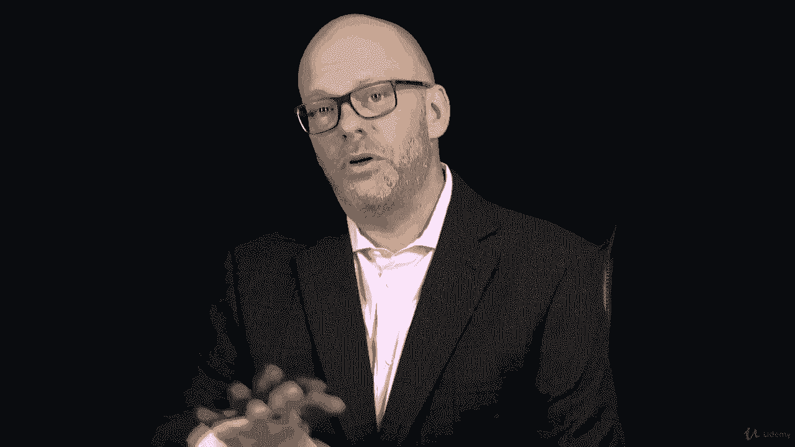
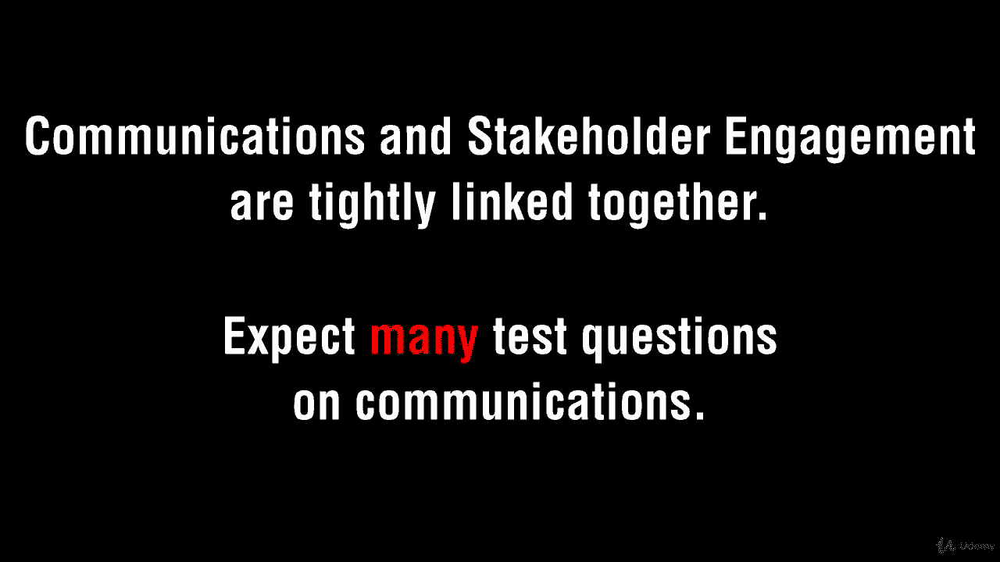
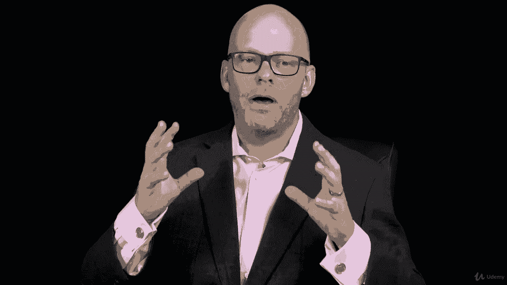

# 【Udemy】项目管理师应试 PMP Exam Prep Seminar-PMBOK Guide 6  286集【英语】 - P211：1. Section Overview Project Communications Management - servemeee - BV1J4411M7R6

Welcome to this section on Project Communations。We have an awful lot to talk about here when it comes to communication because 90% of a project manager's time is spent communicating。

 so it's no wonder that this is a really important topic for your PM&P exam in this section we're going to discuss the project communications management overview and creating a project communications plan and so this is tied a lot to what we'll see coming up in stakeholder management because we're communicating with stakeholders。

Thank you very much we'll look at some trends for project communications management and then also what are some concerns that we need to have if we're in an adaptive or agile environment。

 so how does communication affect the project management approach there？

We're going to look at some different communication technologies and methods， again。

 we'll talk about interpersonal and team styles assessment。

Data representation， creating some successful communication。

 What does that mean to be successful And then this communications management plan。

 I'll have a case study for you on communication， and then we'll come back and talk about monitoring communications。

😊。

Al right， a lot of information to talk about here， some really just some key concepts that you probably already do as a project manager。

 most good PMs that I meet are good communicators。 Al right。

 let's hop in here and knock this section out。

