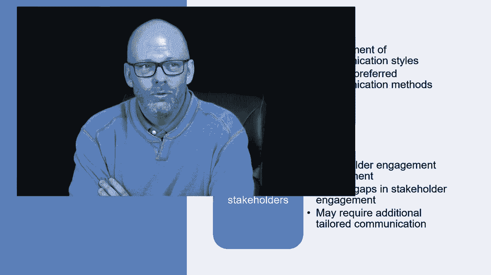
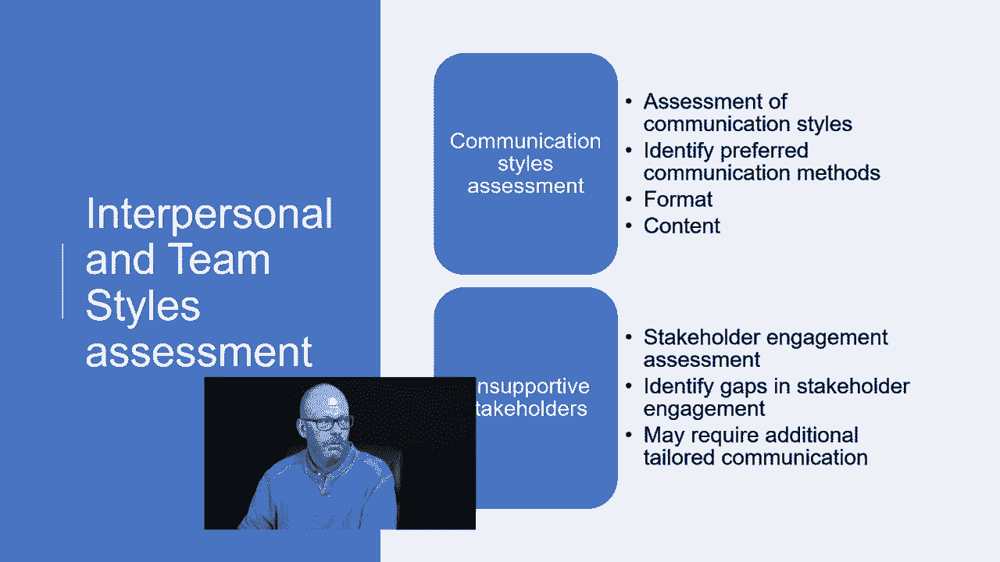

# 【Udemy】项目管理师应试 PMP Exam Prep Seminar-PMBOK Guide 6  286集【英语】 - P217：8. Interpersonal and Team Styles assessment - servemeee - BV1J4411M7R6

In the Pimbaok Guide6 edition there are a couple of concepts you need to know about when it comes to an interpersonal and team styles assessment it's just a way of assessing the communications。

 what's the most appropriate communications and then thinking about your stakeholders and how you'll communicate with stakeholders that are opposed to your project or they are in favor of your project so let's look at this first off communication styles assessment basically just doing an assessment of what's the best communication style written verbal oral a text message。

 what have you for different scenarios in your project so we identify what's the preferred communication method with our stakeholders so what's the preferred format and then what's expected like on a status report。

 what are the things you have to report on like your KPIs or a rag rating red ambergr。

 something like that for your project。

Now with unsupportive stakeholders we can also do a Sts assessment so this gets into a little bit what we see in chapter 13 of the Pimbaok about some stakeholder engagement assessment so what we're looking at here is how engaged our stakeholders what's their current level of engagement and what do we want their desired level of engagement to be so that's accomplished through good communication。

We can identify gaps in stakeholder engagement， so current and desired and then in order to get to that desired。

 we may have to have some additional tailoring when it comes to communication so you may have some stakeholders that they want very specific information or more frequent information so we could tailor our approach for those unsupportive stakeholders because the goal is to get people to be supportive of our project。

Some other things here to know about interpersonal and team style assessments。

 political awareness can be assessed。 This helps the project manager to understand where the powers are in the organization and to plan communications in light of those powers。

 I want to consider the project environment。Becausesiness project generally liked。

 are people very apprehensive about the project， what's the political landscape and who are the different players that are touched by your project。

 so I think about the political environment and the project environment and how that affects how I communicate that may require more formal communication and some of that informal and being very concise and very direct with the messaging。

The political awareness though it really can affect the management and the communication。

 so we want to be aware of the power relationships among the stakeholders。

 the willingness that people have to operate within the structure you think about do you understand the political capital。

 do you understand all the moving parts， often we don't as project managers。

 often our focus is over here on getting the thing done but other people's focus is all over here on the politics and some of those personal agendas。

 so I need to know who wields the power and who can influence the project。

And I want to have the ability to communicate with all stakeholders just because someone has a lot of authority or a lot of politics going on doesn't mean I ignore them。

 that I still have to communicate with them but how I communicate I want to be more concise and more direct and aware of how the politics may have an effect on me and on the project。

 so I'm nicely trying to say how you communicate to someone that has a lot of political power and they not be in favor of your project。

 you want to think that out and plan accordingly， and maybe you need some help with that type of communication。

Also I want to think about the cultural awareness so you think about the culture where people and groups and organizations come from if we don't understand each other's culture。

 you may have some misunderstandings that you didn't intend to offend someone but it still happened so educating yourself and being cautious and what we say and really thinking about what we're communicating but also really learning about the cultures that are involved in the project important that we want to respect one another。

 both the project manager and the stakeholder are generally on the same side thats I mean sometimes but generally we're on the same side of the equation that we want this thing to be successful so you want to use caution and be aware of other culture and be a good communicator an effective communicator and respect one another and I know all of you were there I mean no one sets out to purposely offend someone just because so I want to use caution though that I don't allow that to happen on。

Accident or by not understanding the older other countries。The other cultures。

 maybe other countries may be there， but you could have cultures even within one country， right。

You might even have cultural differences in your stakeholder community。

 so you have stakeholders communicating with one another， so again as a project manager。

 cultural awareness， having some cultural sensitivity。

 and then I plan for those cultural differences， so I have to educate myself and acknowledge these differences and be respectful of the different differences in the project。

All right， good job， keep moving forward。