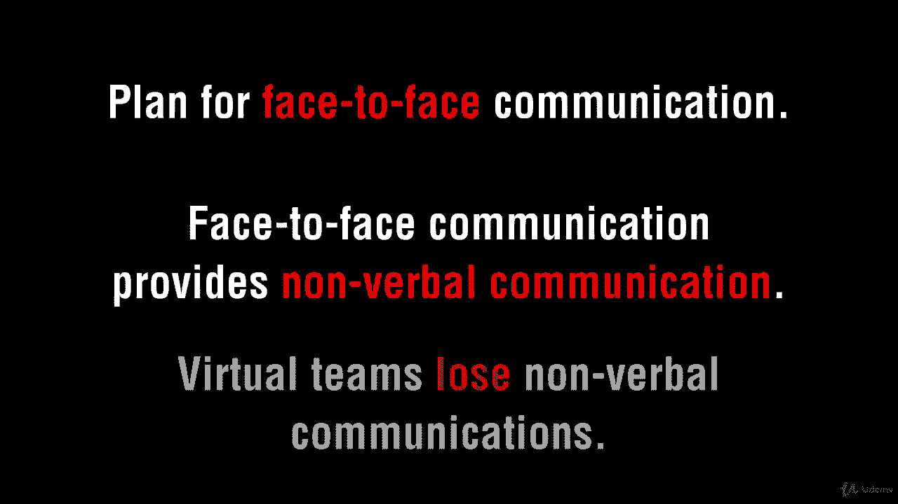

# 【Udemy】项目管理师应试 PMP Exam Prep Seminar-PMBOK Guide 6  286集【英语】 - P220：11. Creating the Communications Plan - servemeee - BV1J4411M7R6

Now let's talk about creating the communications plan communication is required by stakeholders so we want to know what's to be communicated。

 what format should that message be in， what's the expectations of the message。

 how much detail or depth are you required to provide how will information flow through the project。

 how do people give you information and then how will you give information to others。

Thank you very much what's the modality and how will you secure that email or a piece of paper or access to your website？

What methods are you allowed to use， so maybe you can't use a text message。

 maybe you have to do email or keep everything inside of your PMIS。

 your project management information system。What's your schedule of communication， so status reports。

 status meetings， are you on a regular cadence when you communicate？

Also in creating the communications management plan， how do you escalate issues。

 so what's the timeframe and when should you escalate。

 how will you retrieve information so your knowledge management。

How will the plan be updated will you baseline the communications management plan so you have to have formal change control to update the plan that's up to you that's up to your enterprise environmental factors。

How will communication flow and would a flow chart be appropriate。

 especially in a very large project where the public's involved or government officials are involved。

 so that may not go through you， it may go through a different department or a spokesperson for your company。

What are your communication constraints and should you have a project glossary to explain the different terminology。

 so all considerations for creating your communications plan。

